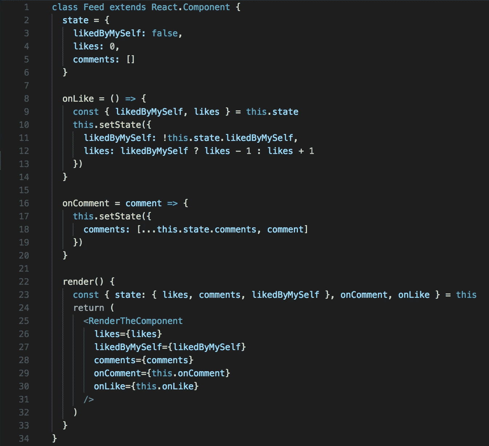
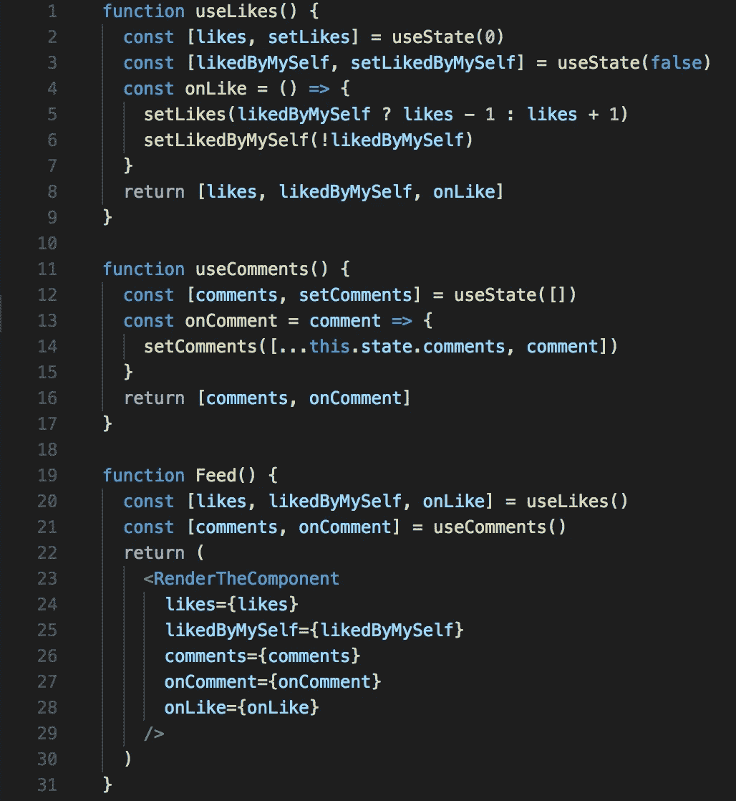
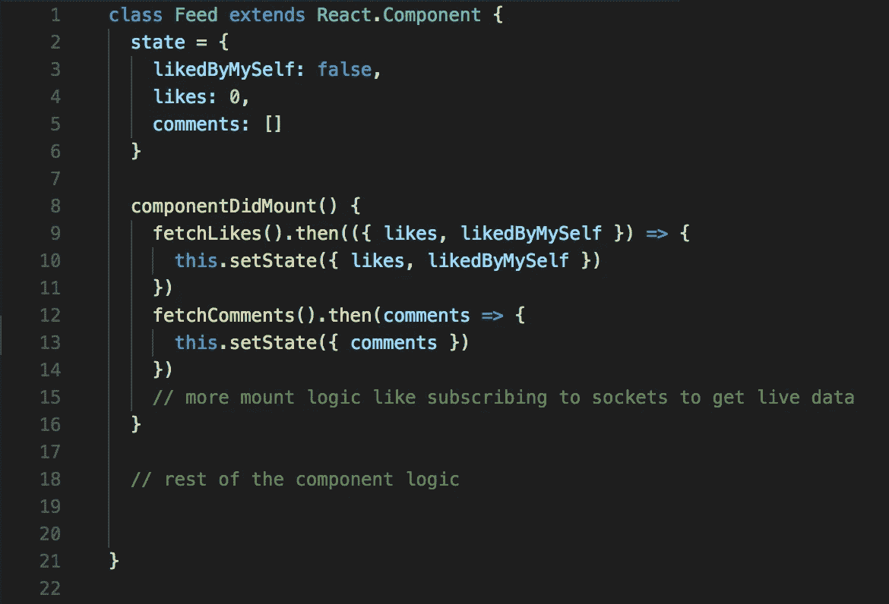
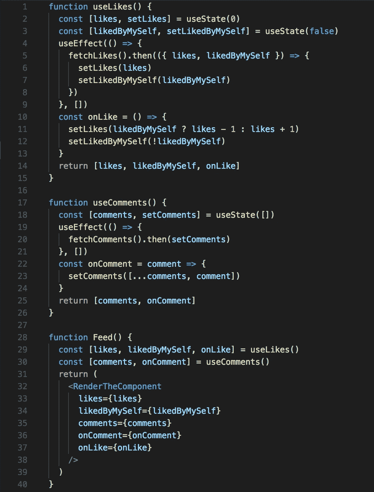

# 为什么要反应钩子？一个开发者的视角。

> 原文：<https://medium.com/hackernoon/why-react-hooks-a-developers-perspective-2aedb8511f38>

Photo by [Cameron Kirby](https://unsplash.com/@ckirby?utm_source=medium&utm_medium=referral) on [Unsplash](https://unsplash.com?utm_source=medium&utm_medium=referral)

> *钩子*是 React 16.8 中新增的。它们允许您使用状态和其他 React 特性，而无需编写类。—反应文档

从 React 版本≤ 16.7 开始，如果某个组件需要状态和/或对生命周期方法的访问，它必须作为类组件构建，因为功能组件没有`instances`的概念。

但是有了 React 16.8，我们就有了钩子。这并不意味着类不能工作，也不意味着类会被弃用。[钩子也没有解决类的所有特性](https://reactjs.org/docs/hooks-faq.html#do-hooks-cover-all-use-cases-for-classes)，有一些拼图缺失了，但是 React 核心团队说这些将很快被解决。

# 钩子背后的动机

在当前的 it 世界中，学习和理解一个新的范例而不从中获得显著的好处是非常困难的。

阅读 React 文档的[动机部分](https://reactjs.org/docs/hooks-intro.html#motivation)并没有给我提供转型所需的动力。所以我给自己做了一个 PoC(概念验证)。我将通过我的概念证明中的伪代码来检查动机文档中提到的 3 点。

我们的 PoC 将是一个 Facebooks feed 组件。

Sample Facebook feed mockup — [https://www.behance.net/gallery/64942921/FREE-Facebook-PSD-Post-Mockup-2018](https://www.behance.net/gallery/64942921/FREE-Facebook-PSD-Post-Mockup-2018)

为了节省时间，让我们降低对组件的要求。它应该能够喜欢饲料，如果有人点击它，并能够评论时，有人在评论框中输入和点击回车。让我们现在不要担心类似的类型和共享功能。

我们需要这个组件的内部状态。对模型的初步观察表明，我们将需要一个状态变量:

1.  要知道提要是否已经被自己喜欢了。(`likedByMySelf`)
2.  来维持点赞数。(`likes`)
3.  维护评论。(`comments`)

# 很难在组件之间重用有状态逻辑。

假设这些是我们的需求:

当用户点击 like 按钮时，如果`likedByMySelf`为`false`则`likes`应增加 1，如果`likedByMySelf`为`true`则减少 1，然后切换`likedByMySelf`的值。

当用户点击评论按钮时，评论输入框应该高亮显示。

在输入一些东西后，如果用户点击 enter，一个注释将被添加到`comments`状态，输入框将被清空。

通常对于类，我们将在类中编写动作处理程序作为实例方法，因为它们需要访问内部状态。

例如:

两天后，如果有一个新的需求，要在注释中添加像一样的*功能，我们将无法重用 onLike 处理程序，因为它与 Feed 组件及其状态相关联。为了在类中解决这样的问题，我们可以使用 hoc(高阶组件),分别实现 like 和 comment，并用这些 hoc 包装 Feed 组件。使用 hoc，我们将无关的状态逻辑分离成不同的功能，并将它们作为道具注入到主组件中。*

但是 hoc 制造了包装地狱。我们将呈现 3 个组件，其中 2 个是包装器组件，而不是只呈现提要组件。在 React dev 工具中进行检查时可以看到这一点。

有了钩子，我们可以像 HOCs 一样解决这个问题，但没有包装地狱。

`useLikes`和`useComments`拥有 HOCs 同样的优势，而且它们没有引入包装器地狱。

## [2。复杂组件变得难以理解](https://reactjs.org/docs/hooks-intro.html#complex-components-become-hard-to-understand)。

对于类，没有办法组成生命周期挂钩。例如，如果我们必须在 Feed 组件 mount 上进行网络调用，以获得要呈现的赞和评论。

很快,`componentDidMount`的逻辑会变得复杂，对于将来读到这篇文章的人来说，这会让他们一阵子不寒而栗。

Hooks 用一种漂亮的方式解决了这个问题。钩子支持同一类型的多个生命周期钩子。例如:

[https://gist.github.com/revanth0212/1a4c949a70a98aae3cb7f0ed5775692c](https://gist.github.com/revanth0212/1a4c949a70a98aae3cb7f0ed5775692c)

**第 4 行和第 19 行**是钩子中的`componentDidMount`生命周期方法。如果我们以`useLikes`为例，它有状态和`componentDidMount`生命周期挂钩。在装载时，它将进行网络调用并立即返回当前状态。以后一旦网络调用解决，状态更新，`likes`也会改变。这将触发任何使用`useLikes`钩子的组件的重新渲染。

**第 29 行和第 30 行**展示了生命周期钩子与钩子的可组合性特征。所以现在，我们可以将生命周期挂钩写入自定义挂钩，让它们在本地维护状态，而不用担心挂载、更新和卸载逻辑。这使得代码可维护性成为一种愿望，而不是地狱。

## [3。类混淆了人和机器。](https://reactjs.org/docs/hooks-intro.html#classes-confuse-both-people-and-machines)

嗯，我不接受上课会把人搞糊涂的前提。他们不应该。我们是开发者，理解语言提供的原语是我们的职责。

另一方面，机器确实会混淆函数和类。例如，缩小器/取消器很难处理类。

此外，根据文档，React 团队一直在试验提前编译和拥有组件折叠等特性，但已经意识到类组件可能会鼓励无意的模式，使这些优化退回到更慢的路径。

我个人对课程没有怨恨，也不能过多评论第三个动机。但是如果你们有什么想法，请随意评论，让我们知道。

我希望这篇文章能够令人信服地说明钩子在 React 中的优势。让我们知道你是否在使用钩子，你最喜欢的特性是什么。