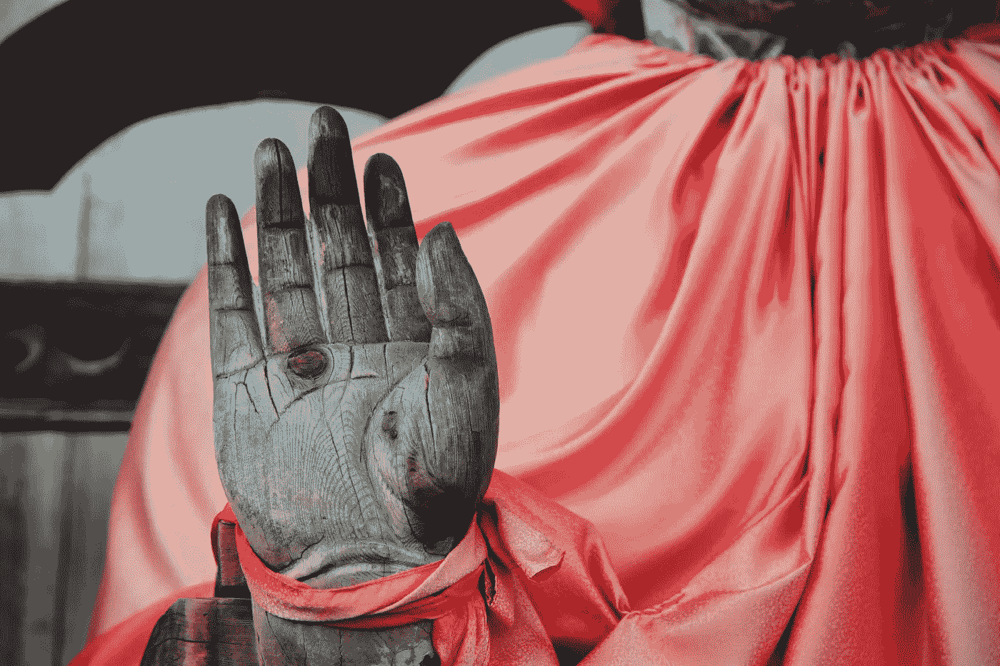

# 为什么中本聪可能是上帝？

> 原文：<https://medium.com/hackernoon/why-satoshi-nakamoto-could-be-god-4ae1dfc19979>

> 巧合是上帝保持匿名的方式。——阿尔伯特·爱因斯坦

区块链可能比广义相对论更普遍。事实上，这可能是生命中最大的未解问题的答案，比如生命是如何运作的，为什么宇宙会以这种方式运行。

阿尔伯特·爱因斯坦解释说所有的运动都必须相对于一个参照系被**定义**，空间和时间是相对的，而不是绝对的概念。爱因斯坦的理论解释了如何和什么，但没有解释为什么？

我一直对**三昧**的印度教哲学很感兴趣，它解释说宇宙很大程度上是三种不同宇宙力量的结果，以梵天为代表的创造者，以克里希纳为代表的保护者，以及以湿婆为代表的毁灭者。这些力量一次又一次地以不同化身的形式来显现他们自己并推进他们各自的议程，从而保持宇宙处于平衡状态。

为了简单起见，我们将在三个不同的存在层次上观察这一现象:

人体

自由生活。

商业交易。

## 人体:

造物主或梵天本质上是灵魂，赋予原本只是地球的生命。

保护者或奎师那以生物解剖学或人体功能的基本原理的形式存在。据我所知，

人体是区块链生态系统相互作用的网络，与外部环境有着极其复杂的智能契约。我知道这些看起来很荒谬，但同时也很有趣，但是请相信我，进一步的解释可能会有所启发。

> 区块链网络是如何运作的

一个由个体对等体组成的网络相互作用以达到相同的目标。该系统定期扫描自身，以确保每个对等体正常运行，如果不正常，则进行纠正。如果大多数对等体腐败，区块链就失败了。

> 就像上面所说的，每个器官都以完全相同的方式运作。

*单个细胞的网络相互作用以达到相同的目标。该系统定期扫描自身，以确保每个单元正常工作，如果不正常，则进行纠正。如果大部分细胞腐败，器官就会衰竭。因此，每个器官系统都是一个可互操作的区块链网络，而人体则是一个更加复杂的区块链网络。*

## 自由生活:

当我们谈论整个人生时，现代版的梵天就是人类自己。他们说，我们今天看到和使用的一切最初都是以人类大脑中的想法的形式被简单地构思出来的。就像区块链网络一样，创造力或与环境其余部分交易的启动首先影响并需要来自生活中最亲近的人(**同辈)****【网络】**，

奎师那或保护者再次成为宇宙运作的基础的基本原则。宇宙的功能，如成功和财富以及它们的负等价物，是基于个体生态系统之间复杂的相互作用而分布的，每个生态系统都控制着这个巨大运动机制的一小部分。

具体来说会限制范围，但是我们可以再次看到各种管理原则的存在，这些原则也用在区块链网络上，如工作证明、股权、权威以及其他许多原则。

生活是你所有选择的总和。你在生活中做出的每一个选择都是对利害关系和你如何达成生活选择共识的实时证明。

商业上的成功很大程度上是由工作证明的区块链共识机制推动的。而像司法系统这样的东西是基于权威的证明。

凭借这一原则分配的后果或奖励和惩罚本质上是湿婆或毁灭者的表现。任何事件的独特结果都有机会成本，本质上它破坏了平行生命，这些平行生命本可以基于除了发生的独特结果之外的任何结果而被引导。

**商业交易:**

市场中的各种利益相关者扮演着创造力或梵天的角色。

直到现在，企业之间的合作和互动都是基于这种被称为信任的神秘力量。区块链消除了这样做的需要。它为基于预定义的条款分配奖励提供了一种安全可信的机制。每一个商业契约都可以用区块链网络的形式来表示，当然，基于用例的类型和共识算法会有所不同。

Photo by [José Martín Ramírez C](https://unsplash.com/photos/lDmCu2afn-g?utm_source=unsplash&utm_medium=referral&utm_content=creditCopyText) on [Unsplash](https://unsplash.com/collections/3673749/god?utm_source=unsplash&utm_medium=referral&utm_content=creditCopyText)

湿婆神以技术和思想的各种变化的形式表现自己，这些变化永远改变了商业交易的范围。我们知道机械化、自动化、互联网对商业交易的影响。湿婆神的化身 Satoshi 决定引进区块链教，彻底改变商业交易的观念。虽然它摧毁了像会计和对账这样的行业，但它为像区块链这样的全新行业提供了发展空间。

我不知道你怎么想，但中本聪绝对拥有一种精神上的超级力量，或者像普通人所说的那样，在我的生命中有一种神圣的存在。