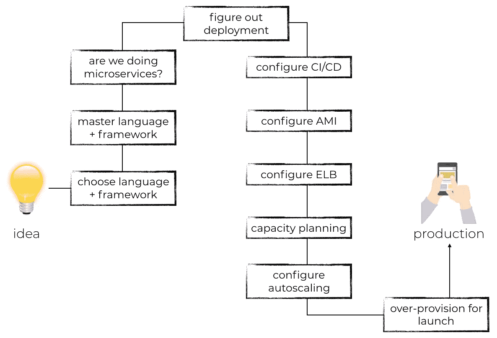
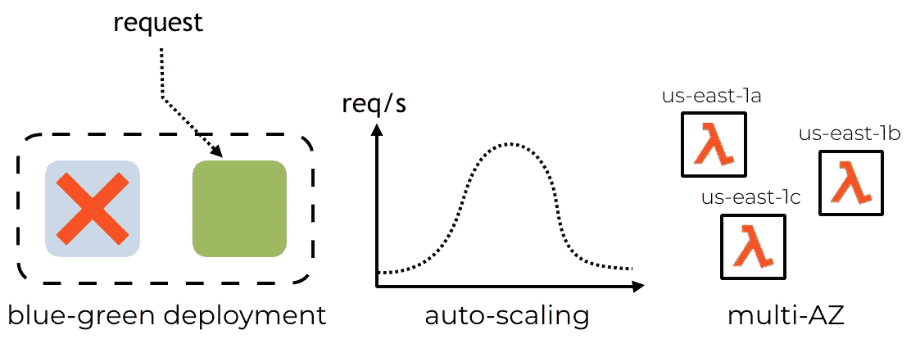
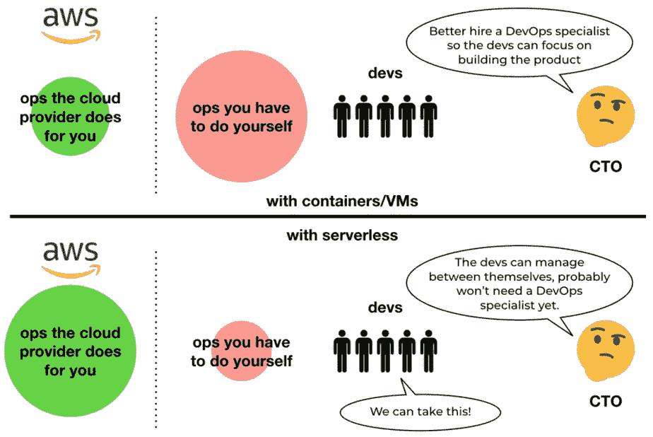
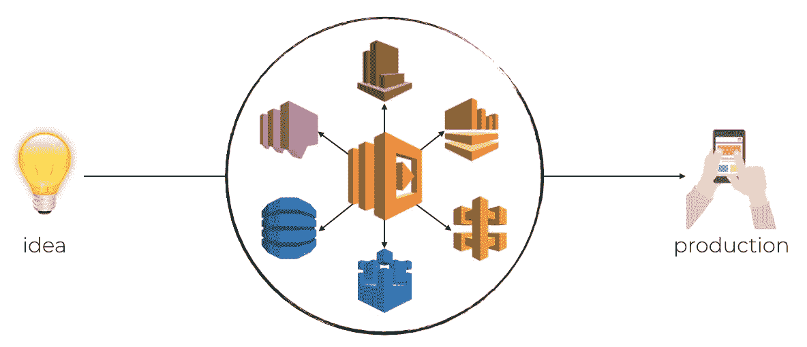
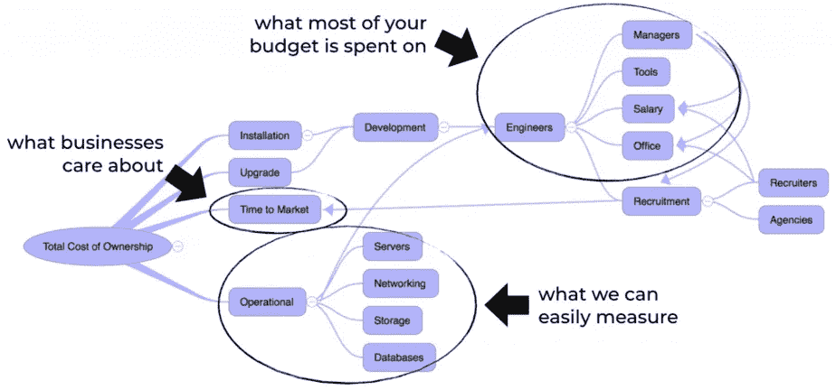
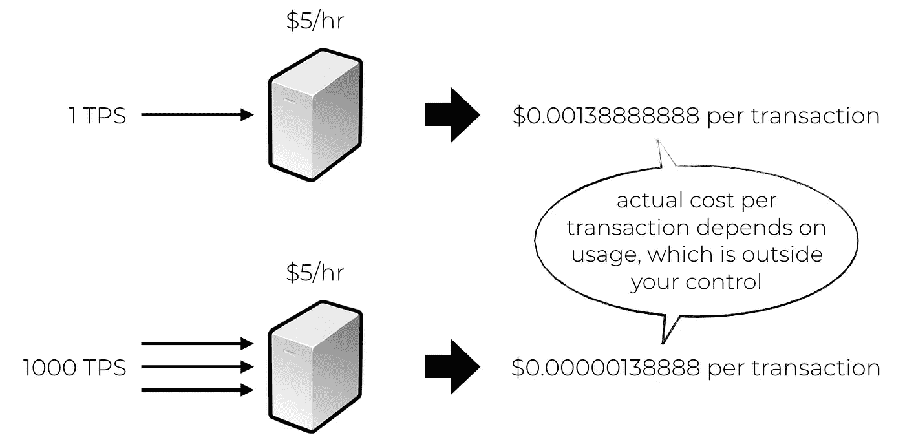
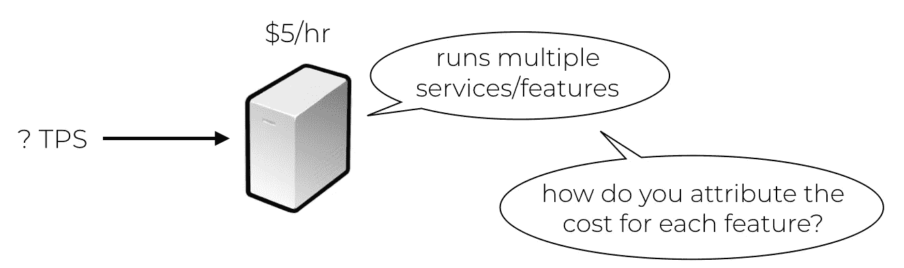
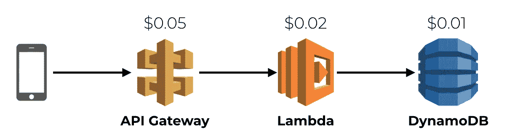

# 为什么无服务器是您企业的最佳选择

> 原文：<https://medium.com/hackernoon/why-serverless-is-a-good-choice-for-your-business-8f6e1a26410f>

## 当你读这篇文章的时候——可能是在你的智能手机上——很容易忘记我们有多少现代技术是理所当然的。

当你想一想，在人类历史的每个时代，我们看到了多少革命性的发明，这可能很难理解。这些发明经常以我们甚至不知道自己想要的形式出现。正如亨利·福特的名言:“如果我问人们想要什么，他们会说是更快的马。”

所有这些与无服务器计算有什么关系？嗯，它让我们更有效地执行重复性的日常任务。它将我们从管理基础设施带来的一些耗时的繁重工作中解放出来，这样我们就可以更好地利用我们有限的认知能力。

无服务器是以一种我们许多人甚至不知道自己想要或需要的形式出现的。如果亚马逊网络服务(AWS)问人们他们想要什么，他们会说“更好的服务器抽象”

但是你可能还没有完全被说服。这就是为什么你不应该仅仅作为一个开发者、管理者或商业利益相关者关心无服务器，而是为什么你应该把它作为一个优先事项。

# 为什么无服务器对开发者更好？

作为一名开发人员，我花了很多年才意识到，我的工作不是写代码；我的工作是帮助企业实现他们的抱负。在大多数情况下，这意味着要打造一个既能在财务上获得成功，又能对用户产生积极影响的产品。期望的结果从来不是代码本身，即使代码是优雅的和精心制作的。这是达到目的的手段，本身不是目的。

为了向市场传递一个产品想法，除了实现功能本身，我还有很多工作要做。这些包括为我的服务器集群配置机器映像或配置自动扩展。

有了 AWS Lambda，大部分都变得无关紧要或被大大简化了。这让我专注于项目更重要的方面，比如实现产品特性和考虑架构权衡。这是对开发人员的时间和精力的一种更有成效的利用，并且它释放了您通常花费在管理基础设施所涉及的平凡(但重要)任务上的时间。

**Lambda 开箱即可提供出色的可扩展性**，可自动扩展以满足需求。因为我们可以利用 AWS 管理的巨大资源池，所以我们的应用程序也可以更快地扩展。当它们不被使用时，它们会一直扩展到零，这意味着我们也不必为闲置的服务器付费。这使得 Lambda 成为大多数系统的经济高效的解决方案。

使用 Lambda，您还可以获得开箱即用的蓝绿色部署。当您将更新部署到您的函数时，AWS 会管理它并将所有请求路由到新版本。默认情况下，功能还被部署到三个可用性区域(AZ ),为您提供了针对 AZ 范围内的故障的良好基线弹性。从这里开始，构建一个[多区域、主动-主动系统](https://read.acloud.guru/building-a-serverless-multi-region-active-active-backend-36f28bed4ecf)就变得很简单了。

# 管理者为什么要关心无服务器？

作为一名经理，你关心你的团队的健康状况和满足业务需求的能力。根据我的经验，采用无服务器的团队交付速度更快，压力也更小。

如前所述，AWS Lambda 使开发人员更容易构建生产就绪的系统。它使您能够利用该平台的大量功能，如内置的自动扩展和多 AZ 弹性。这直接转化为更高的生产率和更快的交付时间。

构建和管理能够提供相同级别的可伸缩性和弹性的基础架构是很困难的，并且需要团队通常负担不起的工程时间。这种基础设施需要的技能是大多数团队手头没有的，但它对你的产品的成功是至关重要的，这可能使它成为巨大的压力来源。团队通常必须:

*   **将注意力从核心业务问题转移到承担这些额外的基础设施责任上。**这增加了赶工期的压力，并可能意味着在其他地方偷工减料，承担可能阻碍未来发展的技术债务。
*   **否则他们将不得不依赖一个通常集中的 DevOps 团队来提供支持。**这种团队间的依赖是一个持续的痛点，会导致整个组织的任何功能障碍。经常出现延迟，增加了整体体验的压力。

采用无服务器的团队发现他们的基础架构职责少得多。大多数都能够处理剩余的问题，而无需依赖专业开发人员或基础架构团队。这意味着团队可以对整个系统享有更多的所有权和自主权；无服务器为他们提供了用更少的资源做更多事情的优势。

# 商业利益相关者

作为企业利益相关者，我关心上市时间和企业投资回报(ROI)最大化等问题。

我们已经讨论过无服务器技术如何让团队更有效率；这种提升直接反映在上市时间的缩短上。无服务器给企业提供了一条将想法推向市场的高速公路。

对于大多数专注于技术的企业来说，最大的成本将来自招聘开发人员。高技能的开发人员很难找到，招募和留住他们的成本也很高，为了帮助他们交付最好的工作，他们还需要一个广泛的支持结构。这包括从办公空间和物质资源到优秀的经理和支持他们的强大团队。

为了获得尽可能好的投资回报，企业需要给开发人员一种他们需要的杠杆作用，用更少的资源做更多的事情。这就是无服务器带来的真正成本节约。

**要了解一家企业的投资回报率，你首先需要了解它的运营成本**。使用交易业务模型的组织需要了解每笔交易的成本。如果您为服务器的正常运行时间付费，这是很难估计的，因为:

*   服务器利用率会极大地影响每笔交易的成本。这也不是你能控制的。

*   一台服务器通常会运行多种服务并支持不同的功能。没有可靠的方法将服务器的成本归因于使用它的所有不同功能。

使用无服务器，**堆栈每一层的成本都是可预测的，并且是按使用付费的**。因此，我可以准确预测每笔交易的成本。

无服务器领域的供应商，比如 Lumigo，可以让你监控交易的性能和成本。

性能优化不仅仅是工程决策。它们会对企业的投资回报率产生重大且可衡量的影响。考虑到开发人员的成本，他们的时间是一种昂贵的资源。因此，任何性能优化都需要产生比开发成本更多的成本节约。交易成本的可见性使您能够就何时何地进行优化做出明智的决策。

# 大家要关心无服务器！

作为一名开发人员，无服务器技术帮助我构建了可伸缩且有弹性的系统。它们让我能够专注于对我的用户和业务利益相关者重要的事情。

作为一名经理，无服务器技术帮助我的团队更快更有效地响应业务需求。它们允许团队对系统拥有更多的所有权，包括它的架构和基础设施，这减少了团队间的依赖性，增加了自主性。这些因素加在一起，会让团队更快乐、更有效率。

作为一名商业利益相关者，无服务器技术使我有可能了解每笔交易的成本。这使我能够在定价以及何时何地优化应用程序以获得最大投资回报方面做出明智的决策。无服务器还帮助我从我最昂贵的资源:我的开发人员那里获得最大的回报。

我希望我激起了你对无服务器的兴趣，并且你渴望了解更多！

*原载于 2019 年 5 月 10 日*[*【https://www.jeffersonfrank.com*](https://www.jeffersonfrank.com/aws-blog/what-are-the-benefits-aws-serverless/)*。*