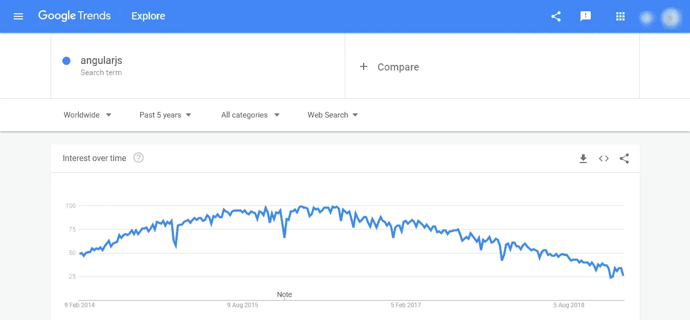

# 2019 年为什么要用 AngularJS？:原因和主要特点

> 原文：<https://medium.com/hackernoon/why-should-you-use-angularjs-key-features-and-reasons-f2be0da0cba9>

Why Use AngularJS

Angular 是一个构建网站交互元素和组件的伟大框架。在流行的 [JavaScript 框架](https://technostacks.com/blog/javascript-frameworks/)中，它提高了效率，开发人员发现它对于构建动态和支持 MVC 编程结构最有用。Angular 推出了最新版本的 [Angular 7.0](https://medium.freecodecamp.org/whats-new-in-angular-7-0-and-how-to-upgrade-f2ed22a79e28) 。

AngularJS 利用麻省理工学院的许可证，这是非常适合所有的开发商以及企业。它被用作创建异常健壮、可伸缩和灵活的单页面应用程序(SPA)的一部分。SPA 结构在 JavaScript 中高度平衡，并支持使用 HTML 作为模板语言。它使开发人员能够构建客户端应用程序。

# **安古拉吉斯为什么如此受欢迎？**

通过提供广泛的功能、特性和好处，AngularJS Framework 为自己赢得了惊人的赞誉。因此，这些优点使得它在构建 web 应用程序时非常流行，成为前端开发最有用的服务。它也在[顶级编程语言](https://technostacks.com/blog/top-programming-languages)列表中获得奖励。

AngularJS 是 Google 在 2009 年推出的一个高级框架，旨在使前端开发过程更易于管理。因此，尽管市场上有数不清的插件和框架，网站所有者还是选择 AngularJs 开发服务，因为它具有先进的特性。

你可以在这里看到谷歌趋势图。

Google Trends Popularity AngularJS

**下面的代码展示了 AngularJS 中 hello world 教程的例子。**

> <title>钻头和碎片</title>
> 
> # { {消息}}