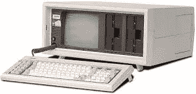
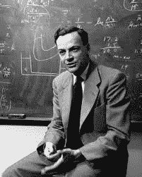
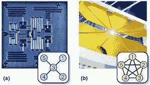

# 为什么科技初创公司 IonQ 可能是量子计算的未来

> 原文：<https://medium.com/hackernoon/why-tech-startup-ionq-could-be-the-future-of-quantum-computing-c4297ba8fb37>

## 从 1981 年的康柏(Compaq)开始，在科技商业的历史上，还没有太多的初创公司从不同的角度看待事物，并在与大公司的竞争中获胜。现在我们来看看康柏量子计算桂冠的一个潜在追求者——IonQ，以及它的 QC 方法如何可能永远改变这一学科。

Photo by [Daniel Clay](https://unsplash.com/@doctor1980?utm_source=unsplash&utm_medium=referral&utm_content=creditCopyText) on [Unsplash](https://unsplash.com/search/photos/graffiti?utm_source=unsplash&utm_medium=referral&utm_content=creditCopyText)

# 墨西哥玉米卷和墨西哥卷饼

一周前，我非常偶然地发现了一部关于网飞的纪录片，名为*。我以为我会在 Youtube 上免费观看网飞、亚马逊 Prime 和所有其他流媒体服务的每一部科技纪录片，所以当这出现在网飞推荐算法上时，我感到惊喜。这部记录片讲述了 20 世纪 80 年代早期康柏如何在个人电脑业务上与 IBM 竞争并取胜的故事，是一个新发现。*

> *世界发展如此之快，要么改变，要么死亡。没有人比我更清楚这一点，”*
> 
> ***— *约瑟夫·r .【罗德】卡农*—***

*当然，我听说过康柏公司及其首席执行官 Rod Canion 等人的历史，他们在 1981 年离开了以计算器闻名的德州仪器公司，创办了这家初创公司。然而，在此之前，卡尼恩、比尔·默托和吉姆·哈里斯曾想过在休斯顿地区开办一家墨西哥餐馆连锁店。*

> *我的玉米煎饼呢！*

*感谢命运的安排。*

# *康柏对 IBM*

*他们说，1982 年秋天，ompaq 公司向美国市场推出了康柏便携式个人电脑，接下来的事情就成为历史了。毫无疑问，它的制胜法宝是与 IBM 个人电脑的兼容性、便携性和合理的价格。*

**

*Compaq’s Portable PC. Source: oldcomputers.net*

*十多年来，大卫和歌利亚并肩作战。当戴尔在 21 世纪初成为个人电脑市场的主要玩家时，康柏的情况才开始变糟。这导致它最终被惠普公司收购，直到 2013 年这个名字被取消。*

*然而，这并不能减损康柏公司在个人电脑市场上的经营方式，而且在很长一段时间内，康柏公司能够与苹果和 IBM 这样的公司抗衡。*

> *我说，三声欢呼。*

*这对科技行业的大佬们来说只是一个警告，不管你有多少钱，你在市场上有多大的影响力，创新都是免费的，在那里，像狼一样潜伏在夜晚的某个地方，有一两个聪明的人准备用这样一个想法偷走你的皇冠，他们将永远扰乱这个行业。*

# *费曼的遗产*

*在过去的五年里，关于计算机如何改变我们生活的想法已经从传统的 1 和 0 的二进制系统转向了不同的方向。“量子”是技术进步和量子计算的新代名词，量子计算是一个又一个创业公司涌现的新产业。这些萌芽中的公司看到了量子理论及其应用将改变计算、工业、商业、教育和人们生活的未来，它们将留在这里。*

**

*The man, the genius, Richard Feynman. Source: mystudentvoices.com*

***20 世纪 80 年代初，诺贝尔奖物理学家理查德·费曼和俄罗斯数学家尤里·马宁首次提出量子计算，他们认为量子计算机比经典计算机有更好的模拟事物的潜力。量子计算已经成为那些对量子力学可以塑造我们未来的世界感兴趣的人的首选领域。***

*马里兰州的大学公园、加拿大的伯纳比和加利福尼亚州的伯克利等地的街道上人声鼎沸——分别是 IonQ、D-Wave 和 Rigetti 的所在地，这三家行业较小的公司正在与量子世界的巨头竞争:IBM、谷歌、英特尔、微软和市场上其他十几家公司试图争夺量子计算机的霸主地位。*

> *“自然不是经典的，该死，如果你想模拟自然，你最好用量子力学来模拟，”*
> 
> *—理查德·费曼*

****One，虽然—***[***IonQ***](https://ionq.co/)***，值得特别关注，也让我想起了大约四十年前康柏的盛气凌人。****

*不仅仅是因为与其他公司相比它的预算很少，还因为它在量子计算机研究方面的方法。虽然其他公司的大部分努力主要是在量子计算的半导体超导方面，但 IonQ 认为，从长远来看，俘获离子技术以及如何有效地利用它来建造更可靠、更具成本效益的量子机器，已经看到这个新兴行业的许多专家声称他们的方法太不现实了。*

# *离子俘获*

*这家初创公司由联合量子研究所研究员、马里兰大学物理学教授克里斯多佛·门罗和杜克大学教授 Jungsang Kim 于 2015 年共同创立，他们反对量子计算机理论的“传统”方法。*

**

*Trapped ions versus Superconductor. Source: iontrap.umd.edu*

**他们声称离子捕获系统需要更少的误差校正，并且纠缠更多数量的量子比特远比目前业内许多其他公司使用的系统简单，并且使用原子钟理论作为基础**

*另一方面，半导体超导方法需要稀释冰箱和其他昂贵的设备。*

> *对底线没有好处。*

*IonQ 的发展相当新，并不是行业中的每个人都站在他们一边，尽管这并没有阻止这家初创公司宣传他们的被困离子架构，他们认为这种架构将很快超过大人物在 QC 领域采用的半导体方法。*

***目前所有公司面临的一个障碍是量子计算机产生的噪音，这对于基于半导体的超导方法来说尤其具有先见之明。说他们吵是一种保守的说法。这些噪音很大的机器需要强大的纠错程序，主要是为了消除外部噪音、任性的电磁场、振动、热量和任何其他外部影响，这些因素可能会破坏作为技术核心的非常精密的量子位。***

*然而，一旦克服了这一点，事情就可以向前发展了。然而，到目前为止，这种方法在很大程度上仍然是初级的。*

## *但是在经典计算机时代的早期阶段不也是这样吗？*

*到目前为止，IonQ 的显著成就是否会开花结果还有待商榷。然而，他们所取得的成就必须因其勇敢和创新的方法而受到称赞。爱因斯坦曾经说过:*

> *任何从未犯过错误的人都没有尝试过新事物。*

*在 IonQ 的案例中也是如此。像 Rigetti 和 D-Wave 一样，这家总部位于马里兰州的初创公司有足够的勇气去做这件事，即使它的胜算百倍。随着谷歌、英特尔和 IBM 获得了无限的资金资源，未来的任务无论是斗争还是复杂程度都将是永无止境的。相信他们独特的 QC 科学方法以及离子阱如何帮助技术向前发展，只会提高那里的工作人员。*

# *积极变异的智力*

*不幸的是，ompaq 已经不复存在，尽管它的遗产仍然存在于笔记本电脑和其他移动设备中，这些设备已经成为我们现代生活的一部分。像门罗和金这样的人只不过是 21 世纪版的卡尼恩、穆尔托和哈里斯，他们拥有许多与所有想要改变世界的企业家相同的特质。*

*比方说，如果十年后，作为一家试图打破科学界限的公司，IonQ 也是 QC 过去的一个名字，被载入历史，我不认为它真的有那么重要。他们现在所做的，就像所有的科技公司一样，就像世界历史上所有的科学家所做的一样，是推动科学思想，让科学思想向前发展，以寻求更好的真理，更现实的愿景，如果我们用心去做，我们会怎样。*

*除了爱因斯坦和世界历史上其他几个智力发生积极变异的天才，人类的成就很大程度上是基于积累的知识，这是一个从一代人传到另一代人的思想连续体，整体上非常无缝，但非常神奇。*

**

*Positively Mutated Intellect or just an overly aggressive alien? Source: comicvine.gamespot.com*

*那么，IonQ 就像它失散多年的兄弟公司康柏一样，可以为自己的成就感到骄傲。不管是今天还是明天。*

> *你看，想法是关键。*