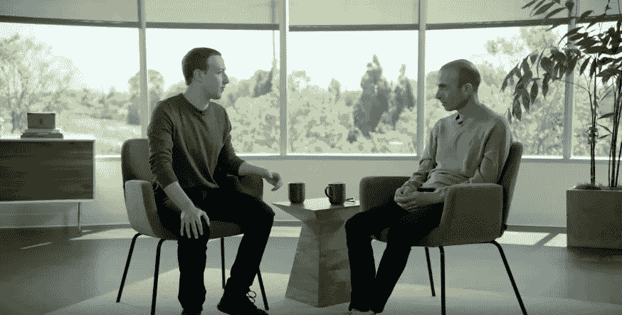

# 为什么技术不应该只由工程师开发

> 原文：<https://medium.com/hackernoon/why-technology-cannot-be-developed-only-by-engineers-4d375f47647e>

## 哈拉里与扎克伯格关于技术的社会影响。

上周，我惊讶地发现尤瓦尔·诺亚·哈拉里(Yuval Noah Harari)和马克·扎克伯格(Mark Zuckerberg，MZ)就科技的未来展开了一场精彩的辩论。我强烈推荐这个演讲。它将为外行和技术人员提供关于当前问题和未来技术发展预测的提示，以及对社会和马克全球野心的影响。

为什么这个讨论很重要？两位参与者都有资格成为顶级影响者，对技术发展有或可能有巨大的影响。一方面，脸书的首席执行官马克·祖克伯格(MZ)管理着世界上最大的社交网络，拥有超过 23 亿活跃用户，在理解技术对人们的影响方面处于领先地位。另一方面，历史学家、哲学家、畅销书《智人》、《德乌斯人》和《21 世纪的 21 个教训》的作者尤瓦尔·诺亚·哈拉里(Yuval Noah Harari)把他的书作为一种工具，在最高层面上启发人们对人类的过去、现在和未来的看法。

如果你开始阅读 YNH 的书，你可能会注意到他的悲观论调，即他反复出现的论点之一是，当前的技术进步，如果处理不当，会对人类未来的社会发展产生有害甚至灾难性的影响。MZ 代表的脸书的语气要积极得多。事实上，FB 是一个强大的平台，能够在社会、政治和经济层面对全球产生巨大影响。从这个角度来看，争议很发人深省。

首先，这场辩论有点不平衡，因为 MZ 有着实际的背景，面临着真实的日常运营问题，经营着一家盈利性公司。MZ 从实际出发思考，他的答案与脸书的能力紧密相关。因此，在很多情况下，他显得更加浅薄，或者至少还没有准备好提升到 ynh 思考的广度和深度。作为首席执行官也伴随着大量的责任，无法在不影响公司形象的情况下自由讨论任何话题。与此同时，正如他自己在辩论中提到的，YNH 可以很容易地在各种想法之间周旋，因为他没有太多的约束。因此，MZ 对 ynh 的许多问题没有直截了当的答案，总体上对所讨论的问题有一个更乐观的看法。

尽管不一定以这种方式组织，但辩论围绕以下两个主题展开，我的观点如下:

**1)科技让我们团结还是分裂？**

YHN 指出，技术有能力增加不平等，因为一些国家在采用新技术方面比其他国家(如人工智能)做得好得多。如果发展中国家无法赶上，我们不确定未来会发生什么。技术化程度越高的国家，经济实力也越强。在接下来的几年里，这种差距还会扩大。

此外，发达国家倾向于在互联网上分裂和孤立自己，以获得更好的保护。

MZ 回应说，开放标准和开放技术(脸书提倡的东西)是发展中国家更好融合的关键。此外，发达国家已经实施了有益的政策(如 GDPR)，为其他国家树立了榜样。

人工智能/未来技术将如何影响人类？

人工智能目前的发展可能会在未来导致权威从人类转移到机器。这样好吗？

一些国家在人工智能方面的进步，可能会导致更大的不平等或权力失衡。这已经发生了，我们不确定当前的民主制度是否能够处理这样的失误。

我们如何防止恶意使用人工智能进行监控？随着人工智能系统变得比你自己更了解你，我们如何才能防止独裁政府的操纵或压迫？

如果我们没有人类发展和生命意义的可持续模式，我们能把我们的信仰交给技术吗？

对于 YNH 提出的上述所有问题，MZ 都有完整的答案，只涵盖了问题的方便部分。尽管他有着全球抱负，但他的观点仍会通过商业过滤，尽管在某些情况下无法掌握其影响程度。他的观点主要是，我们目前还没有一个通用的人工智能，能够实现这样的性能，并且在技术和人类之间应该存在一个战略政策层面。

**结论和要点**

MZs 的乐观看法也可能是对当今技术的社会影响的程度的某种无知。在过去的几年里，MZ 试图以某种全球道德领袖的姿态出现，通过社交网络/技术为人类的建设性发展承担责任。尽管脸书有许多丑闻(见剑桥分析，美国选举丑闻等)。)，这清楚地表明他们的关注点不一定是隐私或其他道德目标，而主要是增加收入。在这方面，脸书显然忽略了具有纯粹负面社会影响的方面。尽管如此，他承认了错误，并实施了变革，他说，这些变革将对人们产生积极影响，尽管短期内会影响他的收入。

YNH 清楚而正确地指出，这里存在利益冲突，因为社交媒体平台的目标应该是促进有意义关系的发展。但是，通过有意义的关系，我们确实理解人们走出家门，或走出屏幕，进行身体接触。然而，管理社交媒体平台的商业公司的目标应该是让客户呆在屏幕前，为他们提供有利可图的内容。处于资本主义方法中心的“顾客永远是对的”或“顾客想要的永远是好的”等语法，在开发人类进步的可持续模式时不一定合适。YNH 声称，目前，我们并不真正知道什么本质上对人类有益，这可能是技术发展的原因之一，在某些情况下，没有明确的道德方向，只受市场需求的指导。

但不要误解我的意思，我们有这样思考的首席执行官是件好事，因为他也考虑到了他的业务对客户的道德影响，并愿意支持整体的人类发展。我们应该有更多像他一样的人！然而，对 MZ 来说，这似乎是一顶太大的帽子，因为社交网络的商业模式本质上可能不一定与采用太多的道德原则齐头并进，最终可能导致利润流失。也许他有其他的野心，我们会看到他以后竞选总统，同时放弃首席执行官的职位。

我的总体看法是，MZ 没有清楚地意识到技术对人类的影响有多大，但他在努力，这很好。不过，他能在多大程度上推进通过脸书发展有意义的人际关系的计划，还有待观察。

我的建议是:

*   到目前为止，两位辩手都没有质疑技术对人类的明显积极影响。从现在开始，他们开始关心了。前段时间我已经就此写了一篇文章。
*   我们不知道当前的技术发展本质上是好是坏；我们需要对此进行更多的研究。人文学科在这一过程中的作用变得至关重要，因为没有心理学家、社会学家、神经学家、公共政策专家等的参与，技术就无法发展。
*   当涉及到社会或政策相关问题时，技术领导者并没有真正的答案；他们的目的是发展技术，做生意，而不一定是拯救世界。这就是为什么我们需要更多像哈拉里这样的思想家/远见者，因为他们挑战系统，这是有益的。

这里有视频:【https://www.youtube.com/watch?v=Boj9eD0Wug8[。](https://www.youtube.com/watch?v=Boj9eD0Wug8)

*原载于 2019 年 5 月 3 日*[*【http://technology-insights.com】*](http://technology-insights.com/blog/why-technology-cannot-be-developed-only-by-engineers-harari-vs-zuckerberg-on-the-social-impact-of-technology/)*。*