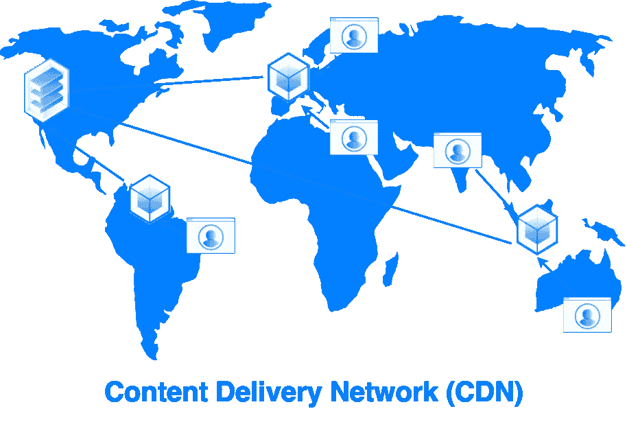
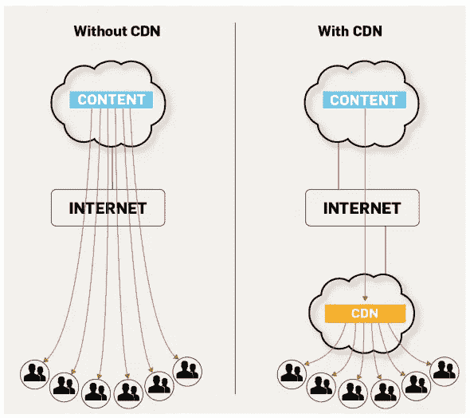
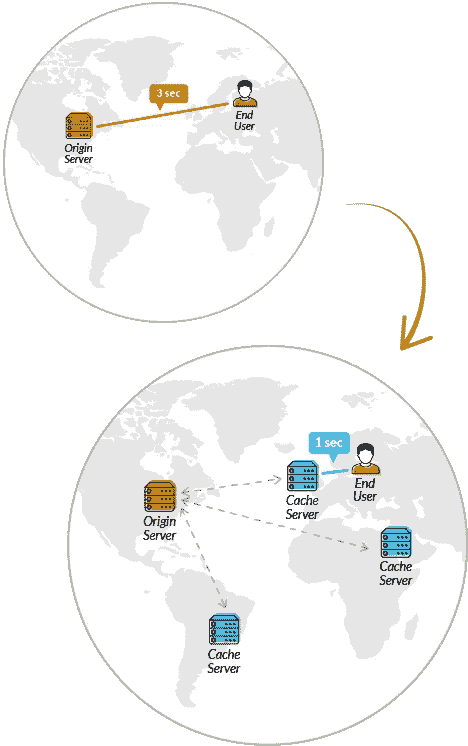
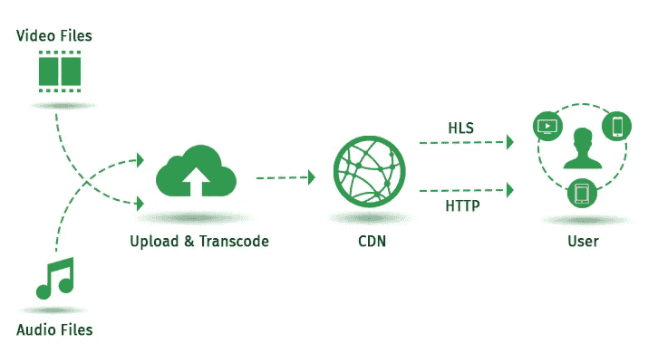
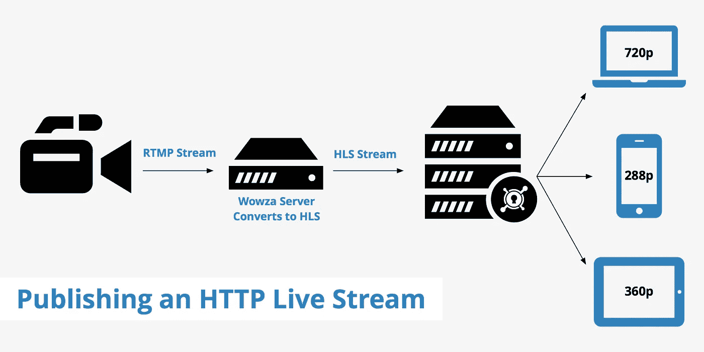

# 为什么要用 CDN？以下是 10 个数据驱动的原因

> 原文：<https://medium.com/hackernoon/why-use-a-cdn-here-are-10-data-driven-reasons-ee0a02672988>

让我们问一个最明显的问题——为什么要使用 CDN？当你仍然可以提供你的内容，运行你的网站，上传图片和视频，那么你会愿意花一些额外的钱购买 CDN 服务吗？这又提出了一个问题——如果主机提供商在施展魔法，那么 CDN 服务提供商会做些什么呢？

一个简单的答案可能是增强用户体验。通过加快内容交付，CDN 可以丰富用户体验，并带来其他好处。然而，这是 CDN 的唯一好处吗？更快的内容交付是鼓励如此多的企业实施 CDN 解决方案的唯一好处吗？

在这里，我们旨在深入了解 CDN 集成如何为许多其他福利奠定基础。有助于您的企业在竞争中保持领先地位并促进多方面效用的优势。

# 什么是 CDN？

CDN 代表什么？它作为一个内容交付网络而扩展。互联网互连节点的物理网络。节点指的是各种系统和服务器。该网络通过将内容缓存在不同的节点(系统和服务器)上，并将其传送给最近的终端用户(该终端用户正在请求相同的内容),来加速内容传送。

目前，不同的网站和应用程序正在使用 CDN 来提高内容交付速度，并使互联网浏览变得愉快。网站和应用将 CDN 内容交付用于一系列内容类型，例如-

文本

制图法

剧本

媒体文件

开源软件

SaaS 软件公司

文档

门户网站

实时视频流数据

点播视频流媒体和

社交媒体网络

对于所有类型的内容，一个 *CDN 平台* 在他们网络中的数百台服务器上复制它们，以便即使在高峰负载期间，内容也能尽可能快地交付给尽可能多的用户。

仅以网飞或亚马逊 Prime 为例。当网飞上传最期待的电影或亚马逊开启惊人的快闪拍卖时，全球数百万用户立刻访问该网站。一个普通的网站主机服务器不可能一次处理这么大的流量。这就是 CDN 开始行动并施展魔法的地方。

# CDN 是如何工作的？

要理解 CDN 内容交付的概念，我们先来了解一下没有 CDN 的情况下事情是如何运作的。互联网是巨大的。

向网站发出请求的用户可能离托管服务器(源服务器)有一千英里远。通过无限的有线和无线网络进行长距离传输，并经过光纤延迟之后，请求最终被传递给用户。现在，源服务器传送所请求内容的时间很大程度上受往返距离的影响。

这是没有 CDN 的情况下发生的-

1.用户向 web 服务器发送请求

2.网络浏览器将该请求发送到网络服务器。

3.web 服务器以单个或多个数据包进行响应。

4.每个数据包可以采用相同或不同的路径在互联网上传输并到达 web 浏览器。

在所有这些过程中，数据包通过各种相互连接的子网传输。它通过一条路径，包括客户端> ISP >互联网>原始服务器。希望从节点到节点，从网络到网络，数据包到达客户端。

现在，如果源服务器和客户端之间的距离最小，连接会更快。当两个节点彼此相距很远时，就会出现问题。数据包以较慢的速度到达客户端。在这里，您希望源服务器就在附近，或者有一个备用源来获取所请求的包。

CDN 就是做这个的。它充当备用源，将数据存储为缓存，并将其提供给最近的请求相同数据的客户端。所以无论什么时候有请求，CDN 都会有最近节点的内容在最短的时间内处理请求。

典型的 CDN 包括 4 个部分或节点:

1.交付节点—存储缓存并交付最近客户端请求的数据。

2.存储节点——提供数据，然后将数据缓存并存储在交付节点中。

3.原始节点—存储原始数据的实际 web 服务器。

4.控制节点—管理数据来回移动的系统和设备。他们管理托管、路由和监控等任务。

# 为什么 CDN 是网站和应用的必需品？

如今最大的网站和应用程序都使用 CDN。甚至大型博客网站也使用 CDN 来加快页面加载速度。几年前，情况有所不同。第一，网站和应用程序相对较少。第二，通过网络传输的唯一重要的内容是文本、HTML、脚本和图像。

到 2019 年，情况会大不相同。今天，一个普通的网页包含复杂的脚本、大量的服务器端请求和大量的内容。常规服务器很难更快地处理网页和服务请求。根据 httparchive.org 的数据，2016 年平均网页重量为 2,409 KB，考虑到 2010 年的 702 kB，这是一个巨大的数字。这是 243%的大幅增长。

通过使过程更快，CDN 交付保持页面更快，并减少原始服务器上的负载。因此，使用 [***CDN 视频流***](https://streamhash.com/cdn-purpose-video-streaming/) ***g*** 和*视频 CDN，即使是海量视频内容传输也不会有任何麻烦。如果没有 CDN，美国的网飞将会在全球 190 多个国家爬行而不是繁荣。即使是脸书也会被限制在美国境内或最大限度地限制在邻近的州内。CDN 帮助网站及其业务走向全球。*

我可以再举一个例子。Twitch 是美国最受欢迎的直播平台之一，但它在一个巨大的南亚市场——印度却很少受欢迎。那是因为 Twitch 在印度没有服务器(CDN)。这使得印度 Twitch streamers 甚至观众很难在正常的互联网带宽下进行流媒体播放。尽管人流不断，但体验不如在美国好，那里有 CDN。

除了性能、用户体验和更快的内容交付，CDN 还为网站、应用和企业提供了许多其他优势。

# 1.减少页面加载时间

我们不能不提到 CDN 整合的最根本原因。CDN 从最近的节点收集数据。因此，通过内容交付网络，请求需要传输的总距离呈指数级减少。最终，它还缩短了加载接收数据的页面 post 所需的时间。降低 TCP 和 TLS 握手的成本。

# 2.减少视频流的延迟

上面提到的好处还有助于减少发出请求和从服务器获得响应所需的总时间。它同样适用于视频文件等动态内容。通过减少时间帧，视频 CDN 设计(尤其是针对动态内容)减少了视频延迟。最终，最终用户将面临更少的抖动和更好的视频流质量。

如果我们看一下*视频 CDN 对比、* ，我们可以发现目前用于流媒体的视频 CDN 有两种类型:

A.**点播视频 CDN** :基于缓存完成，避免了直接下载流视频的需求。缓冲以两种方式工作。一个–多个 CDN 服务器从原始 OTT 服务器提取内容并存储为缓存。两个最近的 CDN 服务器不断将小块内容缓冲到流媒体设备。最终，减少点击播放视频所需的时间和带宽。

B.**直播流视频 CDN** :视频 CDN 工作在缓存上，但是我们不能缓存直接从源服务器开始的直播流。当前的问题是——在这种情况下，直播视频 CDN 是如何工作的？直播 CDN 要么通过显示超高带宽管道将内容即时传输给用户，要么使用多个低带宽管道，这取决于加速内容传输的反射器。当然，直播 CDN 比点播视频 CDN 贵。

# 3.降低带宽消耗

传统的虚拟主机不足以承受现代网站和移动应用的沉重负担。与其直接从源服务器获取数据，不如通过安装在 CDN 中的边缘服务器获取数据。它不仅减少了所需的计算，而且在较短的时间内提供了高质量的媒体。最终，在更短的时间内保持资源并降低带宽需求。这种带宽的节省将减少原始服务器的负载，从而降低托管合作伙伴的费用。

# 4.有助于提高搜索引擎优化

页面加载速度是谷歌用来在其 SERPs 中对页面进行排名的信号之一。你的网站越快，就越有机会在 SERPs 中排名靠前。另一个重要因素是图像利用率。谷歌索引图片的频率高于网页上的任何其他内容。然而，使用普通的虚拟主机，你不能在你的网页上使用很多图片，因为这会使网页加载速度变慢。

幸运的是，CDN 让事情变得非常简单。你可以把你的图片放在 CDN 上，然后以闪电般的速度加载到页面上。大多数大型博客网站都使用 CDN。还有专门的更便宜的图像托管 CDN 服务。事实上，你也可以通过使用 gif 来提高你的博客质量，gif 对于传统服务器来说一般太重了。你可以随时使用谷歌的网站速度测试工具将你的网页与 CDN 和非 CDN 图像进行比较，以证实我的说法。

# 5.降低长期投资

有一个神话，CDN 集成是非常昂贵的，它是只为那些巨头。毫无疑问，巨头没有 CDN 无法生存，但 2019 年的 CDN 是实惠的。CDN 服务提供商为中小型网站提供各种更便宜的计划。前面一点讨论过，也有图像专用的 cdn，比较便宜。底线是——他们不会将 CDN 局限于大型网站。你总能找到适合你的预算和要求的好的 CDN 服务。

此外，从长远来看，CDN 要便宜得多。他们承担了你网站总负载的 60%以上。与源服务器的这种负载共享导致了较低的带宽消耗。最终，减少您从 web 服务器托管合作伙伴那里获得的费用。

# 6.提供更好的分析

通过将资源分配到多个节点，CDN 优化了每个用户请求的负载容量。通过实时统计和分析，您可以更好地了解网站的流量。每个节点将拥有更多关于其生成的流量的可靠数据。这样，你总能找出你需要集中精力的区域。

# 7.提供可扩展性和可伸缩性

根据您的 CDN 托管合作伙伴，您可以随时将您的影响力扩展到它所服务的地区。大量的节点意味着更好的可伸缩性。无论是任何规模的任何资源，您都可以始终获得高质量的交付，并获得更高的可靠性。

# 8.在高峰时间提供稳定性

当传统服务器在高峰负载期间瘫痪时，均匀分布在网络上的 CDN 服务器分担负载并保持网站运行。事实上，即使一个节点出现故障，您也可以期望其他最近的节点承担负载并为请求提供服务。最终，即使在负载很重的情况下，也能保持网站的正常运行和稳定。

# 9.抵御 DDoS 攻击

当攻击者通过向服务器施加很大的负载来控制服务器上的资源时，就会发生 DDoS。它会让传统服务器崩溃，让你的网站瘫痪。

CDN 边缘服务器扮演着传统原始服务器免受 DDoS 攻击的毯子的角色。第一，它们承担网站的大部分负载，即使一个节点出现故障，也能保持网站正常运行。第二，对原始服务器的攻击必须通过边缘服务器，因为数据的分散性，边缘服务器不会让你失败。

此外，您可以集成 SSL，这有助于通过在有限的时间内自行终止对资源的访问来缓解 DDoS。这意味着攻击者不能长时间占有你的服务器资源，即使他们能以某种方式访问它们。

# 10.通过 UX 增强促进业务发展

上面提到的所有好处最终会增加你网站的整体用户体验。从网站速度、稳定性、SEO 好处到防御 DDoS，一切最终都会带来更好的转化率。

你知道吗，如果你的网站在 5 秒内没有加载，74%的访问者会离开你的网站。事实上，54%的访问者会在 3 秒钟后抛弃你的帖子。来源

以下来自谷歌页面加载时间研究的统计数据将让你清楚地理解，哪怕是一秒钟的延迟都会降低你的整体业务:

1-3 秒的加载时间，你有 32%的反弹概率。

1-5 秒的加载时间，你有 90%的反弹概率。

在 1-6 秒的加载时间内，您有 106%的反弹概率。

在 1-10 秒的加载时间内，你有 123%的反弹概率。

这些是 2017 年的统计数据。想想 2019 年的案子就知道了。毫无疑问，肯定是明显高了。因此，随着你每一秒的进步，你会得到稳定的访客，降低跳出率，提高 UX，以及更大的转化机会。

# 结论

你还在困惑为什么要用 CDN 吗？正如你所看到的 CDN 整合的整体优势，我认为这是毫无疑问的。无论你拥有一个博客，一个电子商务网站，一个社交媒体网站，还是一个视频流媒体网站，你都可以找到一个合适的 CDN。通过一些研究，你可以很容易地为你的事业找到更便宜的 CDN 提供商。也许，同样的试验可以帮助你比较你的网站整合前后的 CDN。有很多 CDN 服务，提供免费试用。谷歌一下你就会发现。然而，我建议你在为你的事业最终确定一个好的 CDN 服务之前进行更深入的研究。