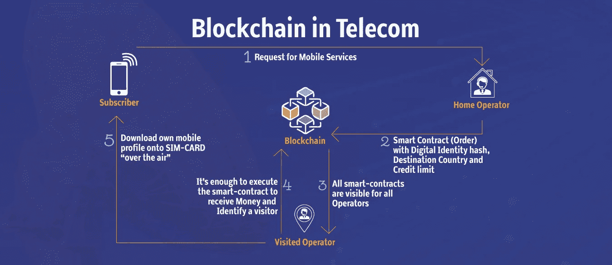

# 为什么使用区块链对电信行业来说是一个“显而易见”的事情

> 原文：<https://medium.com/hackernoon/why-using-blockchain-is-a-no-brainer-for-the-telecoms-industry-33d6586272cb>

电信行业目前正处于一个有趣的时刻，特别是关于采用 5G 的激烈辩论。5G 的使用存在大量问题，许多公民发起运动阻止它的使用，政治家们越来越担心它可能对国家安全漏洞负责，很难忽视可能的负面影响。

但电信业可能还有另一条没有那么大争议的前进道路，那就是采用区块链。在我看来，在分析区块链对通信的潜在好处时，有两个关键领域值得关注:

1.其获取最大利润的商业化潜力

2.它的去中心化本质潜在地解决了隐私、可用性、可访问性和安全性问题。

**区块链的优势**

首先，区块链，也被称为分布式账本技术，是分散的，这使得它很难篡改或追溯更改。

电信行业对区块链应用的兴趣预计会增加。根据研究和市场，该市场将从 2018 年的 4660 万美元增长到 2023 年的 9.938 亿美元，CAGR 为 84.4%。

对电信公司来说，建立不可变信息分类帐的机会可以登记和记录数据，而不需要一个单一的中央机构，可以提高和加快计费和电子交易的效率，并提供一种降低基础设施运营成本的手段。

此外，区块链的架构通过加密技术得到了加强，能够赢得信任，并在隐私和安全方面给企业带来提振。鉴于当前黑客攻击的复杂性和速度，这是对当今通信服务提供商(CSP)的迫切要求。

在漫游服务、身份管理以及电子商务和移动支付系统中实施区块链最大的受益者是

电信基础设施提供商、应用开发商和中间件供应商。

以下是区块链在关键电信领域可能会如何运作的一些例子:

**基于区块链的身份管理**

区块链和身份管理是一种完美的合作关系。目前，身份验证是多层的、繁琐的并且容易出错。还记得 1.48 亿人的个人身份信息(PII)被盗的 Equifax 吗？

区块链可以通过在智能合同上发布唯一的 ID 号来消除盗窃的可能性，这对 CSP 很重要。对于电信早期用户来说，无边界、安全的身份识别系统(可以跨越国界)的前景是一个诱人的前景。此外，区块链可以提供一种简单、安全的方式来认证用户，并为运营商提供机会来彻底检查遗留系统以提高成本效益。

**区块链的国际漫游系统和费用**

漫游费一直是通信服务提供商和消费者面临的挑战。区块链有望解决这个问题。根据 5 月在伦敦举行的 2019 年电信区块链论坛之前准备的一份报告，区块链可以简化这一过程。例如，电信领域的区块链正在开发一个区块链支持的系统，用于向小型移动运营商开放全球电信市场，这将能够使用大型公司的资源，反过来，运营商可以扩大他们的用户群

混合区块链的创建可以包括面向公众的
和后端元素，后者适用于包括跨境用户认证在内的目的。供应商还可以推出具有成本效益的智能合同，以本地费率向消费者提供漫游服务，而无需漫长的支付清算或本地与全球运营商之间的交换。

例如，Bubbletone 是一个漫游网络的开发商，该网络允许消费者保留他们现有的 e-sim 卡，同时利用本地费率。运营商和消费者通过一个位于区块链的市场直接联系在一起，允许用户暂时成为当地公司的客户，并允许他们从平台上提供的计划和价格中进行选择。预付费计划也通过平台上的智能合同提供。

从商业角度总结区块链的优势，着眼于利润最大化，区块链和
智能合约的应用包括用户认证、提高账户安全性、漫游合约和移动交易。此外，分布式分类账技术在正确实施的情况下，可以为减少快速交易的运营支出提供一种具有成本效益的方式

**区块链和 5G**

首先，对于那些可能没有关注这场辩论的人，让我回顾一下 5G 是什么，它的潜力以及它的缺点。

5G 是移动网络的下一代。这是从 4G 到 5G 承诺的重大飞跃。基本上，5G 旨在满足当今现代社会数据和连接性的巨大增长，以及数十亿联网设备的物联网和未来的创新。它目前正在开发和测试，准备从 2020 年开始进行商业发射，预计到 2025 年 5G 服务将广泛可用。

除了提供更快的连接和更大的容量，5G 的一个非常重要的优势是快速响应时间。例如，3G 网络的典型响应时间为 100 毫秒，4G 约为 30 毫秒，5G 将低至 1 毫秒。这几乎是瞬间开启了一个互联应用的新世界。为了实现这一速度，5G 使用无线电波或射频(RF)能量来传输和接收连接我们社区的语音和数据。

5G 将实现:

1.物联网或机器对机器的通信。这包括以前所未有的规模在没有人工干预的情况下连接数十亿台设备。

2.增强型移动宽带，新应用将包括家庭固定无线互联网接入、无需广播车的户外广播应用，以及为移动中的人们提供更好的连接。

3.更快的通信，允许设备和工业机器人的实时控制，以及远程医疗护理和程序的可能性。

正如世界卫生组织和 [EMF](http://www.emfexplained.info/?ID=25916) 解释的那样，“5G 将让我们在未来的智能城市、智能家庭和智能学校中保持联系，并带来我们从未想过的机会。”

**为什么有人反对 5G？**

以前的移动宽带网络专注于连接人，但 5G 也专注于连接机器。

5G 背后的想法是使用 30GHz 至 300GHz 之间的超高频毫米波(MMW)的未开发带宽，以及一些较低和中频频率。但是建筑物、树木和植物吸收这些频率；所以需要更多的手机信号塔。无论你在哪里，每隔几英尺就可能有一个。这篇来自《eluxe》杂志的[文章](https://eluxemagazine.com/magazine/dangers-of-5g/)概述了因发射塔激增和暴露在更多无线电波下而引发的健康问题。

**5G 的政治和伦理方面**

《麻省理工技术评论》指出，5G 是一种“*技术范式的转变，类似于从打字机到电脑的转变。”*正如[政治学家](/the-politicalists/the-political-and-ethical-problems-of-5g-internet-7c5ab0ba9458)在一篇媒体文章中所说:“我们谈论的永久连接远不止是每隔几分钟检查一次你的手机——而是可穿戴设备或植入物、智能城市、神经网络。”

这样一个互联的世界存在政治分歧，尤其是在数据存储和隐私方面。这里有一个 5G 世界的可能场景:“想象一下，你走在你所在城镇的街道上。

路面本身会跟踪你走路的速度、你的心率、你穿的鞋子、你走的路线。所有这些都是为了吸取数据，然后传递给任何愿意购买的服务供应商或政府组织。"

正如政治学家建议的那样，耐克将跟踪有多少人穿着他们的鞋子走路，谷歌地图将跟踪你走路的速度，并为你提供从 A 地到 B 地的个性化路线，Tinder 将检查你的心率，看看你是否超过了你认为有吸引力的人，然后它会向你发送他们的个人资料。是的，听起来很奇怪。

因此，从政治角度来看，围绕我们希望如何、在何时何地使用我们的数据，将需要很多立法、很多辩论和讨论。

**为什么政府在 5G 中禁止华为？**

这一切都与国家安全有关。

目前，围绕中国电信巨头华为的媒体风暴掩盖了许多关于 5G 的讨论。特朗普总统刚刚宣布华为进入国家紧急状态，任何美国公司都不得使用该公司制造的组件。在英国，[军情六处](https://www.theguardian.com/technology/2019/may/16/huawei-poses-security-threat-to-uk-says-former-mi6-chief)的一名前负责人表示，华为对英国的国家安全构成威胁，因为其运营“受到中国政府的影响”，尽管特里萨·梅领导的现任政府已经同意华为可以为英国的 5G 系统提供非核心组件。

华为表示，它从未从事间谍活动，也没有允许自己的技术被中国政府蓄意黑客攻击，但不相信这一点的国家越来越多。在荷兰，有人担心在移动网络中使用华为硬件和软件的荷兰运营商给中国提供了获取客户数据的“后门”，并称之为“可能产生地缘政治后果的确凿证据”。澳大利亚、新西兰和日本已经禁止华为进入 5G 网络。

好吧，用别人你可能会想。不幸的是，正如英国电信首席架构师[最近指出的](https://www.lightreading.com/mobile/5g/bts-mcrae-huawei-is-the-only-true-5g-supplier-right-now/d/d-id/747734)，“现在只有一家真正的 5G 供应商，那就是华为——其他公司需要迎头赶上。”

但是，有一点是肯定的；尽管对华为存在争议，但 5G 即将到来。问题是，区块链能否与 5G 合作，提供更具成本效益的服务。

**区块链部署 5G 的优势**

墨卡托咨询集团(Mercator Advisory Group)支付创新副总裁蒂姆斯隆(Tim Sloane)写了一篇有趣的[文章](https://www.paymentsjournal.com/5g-and-blockchain-add-economic-value/)，讲述了区块链和 5G 在电信领域合作的经济效益。他讨论了 5G 将推动物联网部署以及物联网设备将利用区块链作为安全层的观点。然而，正如他指出的那样，W3C 已经在保护 DNS 和 HTTP，以便使用区块链也使用的公共/私有密钥对来提供更高的安全性。他认为，如果区块链运行速度更快，它可能更适合用于数据分发。

他提到了 IBINEX News 的一篇文章:“通过 5G 连接设备的主要瓶颈与他们的安全问题有关，这正是区块链可以提供巨大帮助的地方。由于区块链的高安全性系统提供了不可改变的、防篡改的记录，伪造和黑客攻击的问题可以很容易地解决。”

但他承认，区块链确实在安全方面发挥了作用:“每台设备都将拥有自己的区块链地址，并可以根据该特定地址进行注册，从而保护自己的身份免受其他设备的攻击。”

区块链还可能协助运营商即将到来的
5G 部署。华为表示，目前正在进行的区块链项目通常与 5G 架构保持一致，包括分布式系统使用和低延迟计算节点使用。区块链甚至可以通过简化底层流程来改善现有架构，并允许

通过分散管理系统更好地分配资源。

**区块链电信业的经济效益**

正如所料，区块链委员会为在电信领域使用区块链提出了强有力的理由。正如它所说，“电信公司最重要的事情之一是在高度竞争的市场中创新，同时降低成本。”它认为智能合同是削减成本的关键，因为电信公司“在其内部运营中提供了许多自动化，如计费、漫游和供应链管理。通过使用智能合约来处理所有与漫游相关的账单，电信公司可以通过防范欺诈性流量来节省大量资金。”

此外，区块链可以让电信公司提供大量新的收入来源。其中包括:

数字资产交易—音乐、手机游戏等的小额支付

数字身份验证—电信公司可以提供身份验证服务

协作生态系统——电信公司拥有独一无二的机遇，可以在广告和物联网领域开创数字服务的新时代。

正如区块链委员会所建议的那样，到 2020 年，物联网设备将成为一个 1000 亿美元的产业，需要数百万台机器对机器(M2M)支付才能工作。这是使用区块链的电信公司可以清理的地方，同时还能确保安全性、可访问性、更低的成本和新收入流的发展。