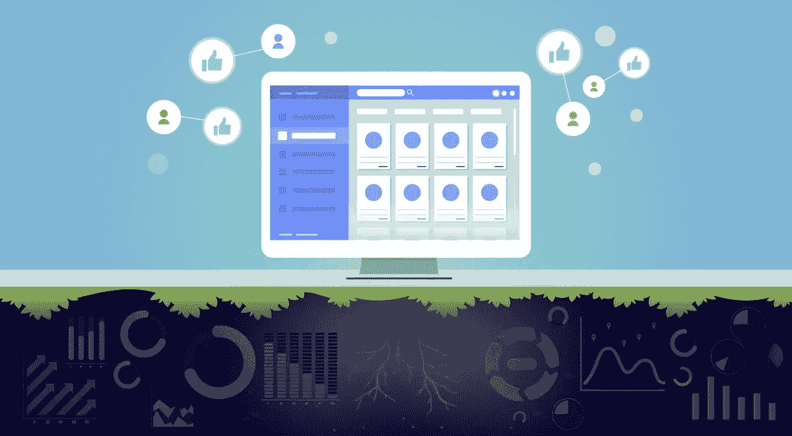
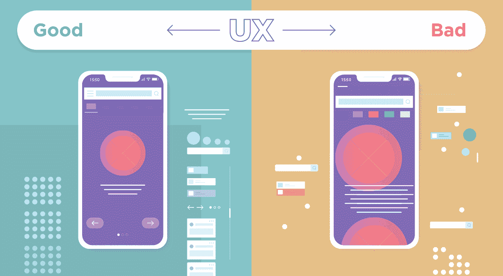
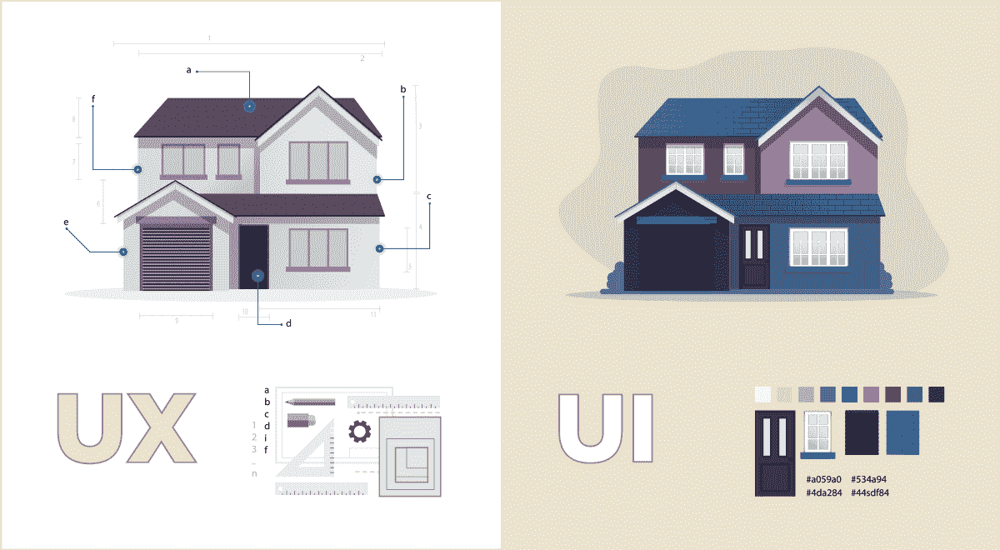
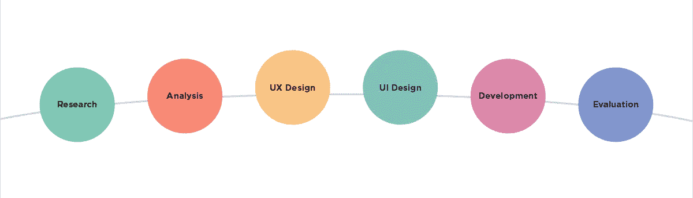

# 为什么 UX 设计必须是你软件产品的基础

> 原文：<https://medium.com/hackernoon/why-ux-design-must-be-the-foundation-of-your-software-product-f66e431cc7b4>

> “用户界面就像一个笑话。如果非要解释，也没那么好。”— *马丁·勒布朗，图标发现者*

众所周知，今天的产品设计主要是为了用户的方便和利益。最好、最成功的产品体现了完美的用户体验。

我们在 [SumatoSoft](https://sumatosoft.com/) 努力将最佳实践融入我们为客户构建的软件中——用户体验设计(UX)就是其中之一。

# **那么到底什么是用户体验设计呢？**

用户体验设计是创建产品的过程，这些产品根据用户的行为分析为用户提供相关的重要体验。通过分析用户的行为，UX 设计识别他们的动机，并为他们创造最佳的数字体验。UX 设计的主要目标是改善用户与设备、应用程序和网站的交互方式，为它们提供价值，从而提高整体用户满意度。

下面我们将从软件开发的角度来谈谈 UX 设计。

从本质上讲，UX 设计应用于软件解决方案的结果是一个用户友好的产品，以满足客户的特定需求。

用户体验设计包含了影响用户与软件产品交互质量的许多方面。这就是为什么用户体验设计涉及品牌，可用性，功能性甚至内容，UX 的设计师在视觉设计，编程，心理学和文案方面有着多样化的经验。成为一名优秀的用户体验设计师的主要标准是成为用户的代言人，捍卫他们的利益，并清晰地向设计和开发团队传达他们的需求。

根据术语“*用户体验*”的发明者，同时也是[尼尔森诺曼集团](http://snip.ly/1prrb#https://www.nngroup.com/articles/definition-user-experience/) (UI 和 UX 咨询公司)的联合创始人 Don Norman 的说法，“用户体验*涵盖了最终用户与公司、公司服务和产品*互动的所有方面。”

# **简单来说，UX 和 UI 设计的区别是什么？**

你可以经常同时遇到这些概念，然而，UX 设计超越了 UI 设计——正如你可能已经意识到的，用户体验设计是一个比任何其他类型的设计都更广泛的概念。事实上，用户界面设计是用户体验设计的子领域。

UX 和 UI 对于构建一流的软件产品都是至关重要的，并且是相互作用的。但是他们的角色有很大的不同。UX 设计更多的是关于深入软件产品功能的分析和技术方面，而 UI 设计更多的是关于应用程序的外观。

UX 设计就像设计一栋建筑。UI 设计就像室内装修。

# **为什么我需要用户体验设计？**

1.  **UX 节约资源**

投入到 UX 设计中的努力可能会节省你的开发团队很可能花费在改变和重新设计产品上的时间和金钱。

根据 [Experience Dynamics](https://www.experiencedynamics.com/blog/2014/07/making-strong-business-case-roi-ux-infographic) 的一项研究，UX 设计师的参与可以减少开发人员花费在重新制作软件上的时间高达 50%。更重要的是，通过明确开发任务的优先级和改进的决策，总体开发时间可以减少 33–50%(这要感谢 UX)。

**2。UX 提升销量**

UX 设计不仅能降低成本，还能通过增加销售额为您带来利润。调查显示，投资 UX 设计的公司设法将销售额提高了 75%。

**3。UX 带来高投资回报率**

UX 设计项目提供了相当可观的投资回报(ROI)。Forrester 研究发现，在 UX 设计上投入的每一美元都会带来 100 美元的回报。

Forrester 报告还显示，对用户体验的关注促使客户多支付 14.4 %的费用，并使他们向其他人推荐你的产品的热情增加 16.6 %。

**4。UX 提高了客户满意度**

牢记用户体验的重要性将使你的产品发挥潜力，并通过响应客户需求击中靶心。努力不会没有回报，你会赢得客户的忠诚度。

> “没有产品是一座孤岛。产品不仅仅是产品。这是一系列紧密的、完整的经历。考虑产品或服务的所有阶段——从最初的意图到最终的反思，从第一次使用到帮助、服务和维护。让它们无缝协作。”
> 
> *—唐·诺曼*

# **UX 设计流程的关键步骤是什么？**

以下是小指南:

1.  **研究**

在初始阶段，你应该收集有关市场需求的信息，试图了解谁是你的客户，从网络、目标受众的环境和其他来源收集想法。此外，你还需要进行客户调查，监控你的竞争对手在做什么，以及用户如何与他们的产品互动。

**2。分析**

这一步是深入挖掘和组织您在前一阶段收集的数据。在这一点上，你将更多地了解用户，探索他们的行为，找出他们的痛苦和需求(通过创建[用户角色](https://en.wikipedia.org/wiki/Persona_%28user_experience%29)和[用户流](https://uxdesign.cc/the-biggest-wtf-in-design-right-now-87139f367d66))，根据所有这些数据区分优先级并决定设计什么。

**3。UX 设计**

现在是你把以前学到的一切付诸实践的时候了。在这里，您将利用您创建的用户流来构建产品结构。开始制作线框和原型，探索 UX 设计的最佳实践，与团队讨论并绘制草图。

**4。UI 设计**

将 UX 和 UI 结合在一起。为产品做 UX 的视觉展示。创建一个经过深思熟虑的 UI 风格指南，并坚持下去。目标是确保用户能够正确地获得每个元素的功能。

**5。开发**

在这里，软件开发人员开始发挥作用。将你所做的一切交给他们，但注意这不是结束:你将与开发者密切合作，并向他们咨询。

**6。评估**

执行可用性测试，找出产品是否是用户一直想要和需要的解决方案，以及它是否完全解决了他们的问题。记住完美是没有限制的，在用户反馈的基础上找出可以改进的地方。

# **还有别的吗？**

**只是几个小技巧:**

**提示 1:相信数据，不要相信观点**

他们说，很多人，很多想法。在做决策时，牢记最终用户，坚持数据、数字和事实。记住你的目标是建立一个满足用户需求的产品，而不是高管。如果你是高管，读一下前面的句子。

**提示 2:** **要改善现有应用、网站或其他产品的 UX，检查用户如何与之互动**

从观察用户与产品的交互开始，与他们交谈，然后评估解决方案的可用性。分析结果，找出阻碍你的产品成为顶级产品的问题。修复它们，提高可用性，进行必要的调整，结果很快就会到来！