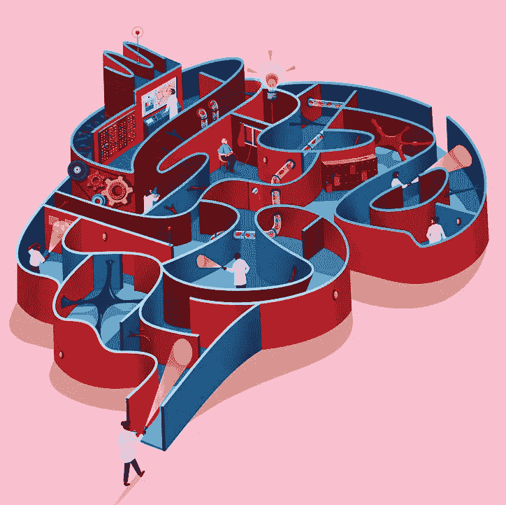

# 为什么我们创建了一个生态系统基金和一个致力于比特币的创新工作室。

> 原文：<https://medium.com/hackernoon/why-we-created-a-fund-and-an-innovation-studio-dedicated-to-bitcoin-82f2bed7b04b>

Art by Jack Hudson

要推动世界前进，你需要跳出框框思考。为了实现这一点，全世界的开发者都需要获得资源和技术。

这就是为什么我们，在周一资本，决定与 RSK 合作，在三藩市创建一个 T2 创新工作室和一个 T4 生态系统基金，致力于投资那些建立在最安全的区块链之上的团队。

目标是为最聪明的头脑创造一个自由实验的机会。

## 彻底的反思——比特币不仅与金融服务相关

当互联网首次被广泛采用时，人们的印象是它的主要用途是电子邮件通信。同样，比特币给人的印象是，它的主要目的是作为货币或价值储存手段。

工作室和基金通过向开发者提供正确的工具和资源，将能够创造超越金融服务的想法，这将为比特币和区块链技术开辟可能性，以我们以前从未想象过的方式造福社会。

## 平衡创新和可用性

在易于使用的开发工具、技术和业务建议以及资金之间，目标是为开发人员创造无缝体验。**工作室的角色是创建具有出色 UX 的完美开发工具**，让开发人员能够轻松探索并开始构建他们的想法。当该基金发现一个有潜力成为可持续发展公司的伟大创意时，它将向这些开发商提供建议并进行投资。

有些开发团队致力于创新项目，通过与分散式基础设施的技术集成来解决交易问题，例如:

*   消费支付产品
*   银行解决方案
*   市场
*   虚拟现实游戏
*   解决隐私和身份问题的产品等。
*   以及任何我们还没想到的东西！

让我们一起做这件事。如果你有一个伟大的团队和想法，请随时[联系我们这里](https://www.monday.capital/contact-1)。