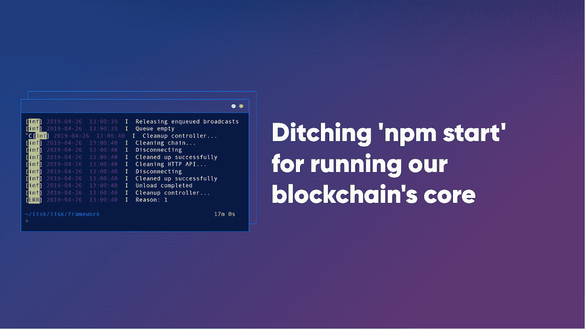
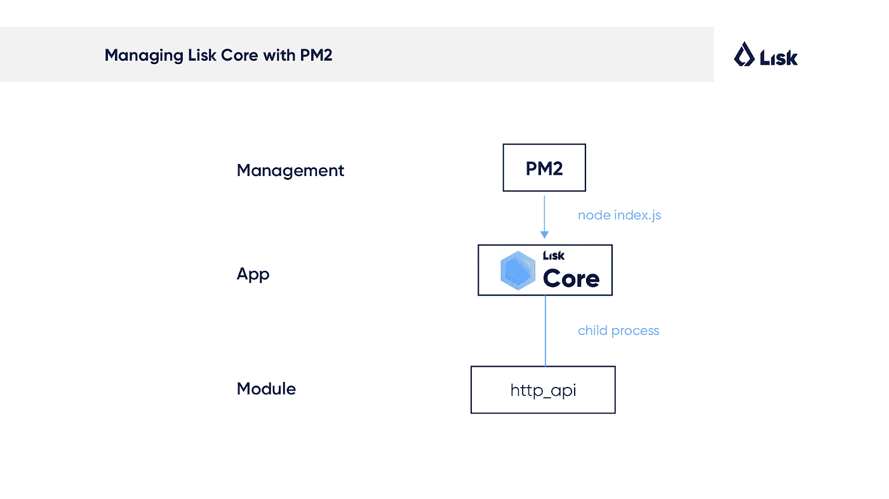
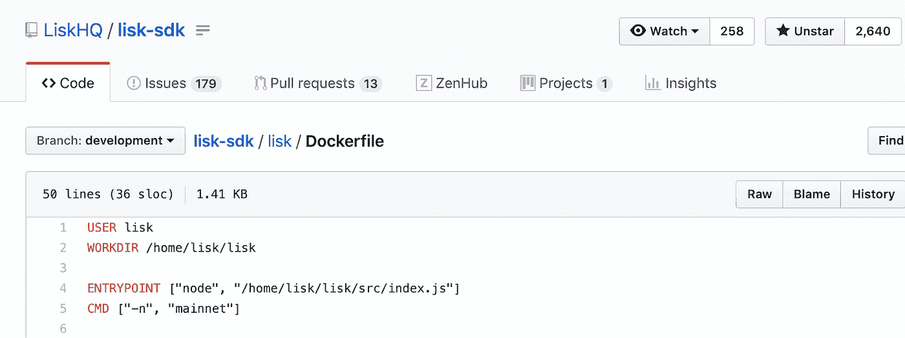
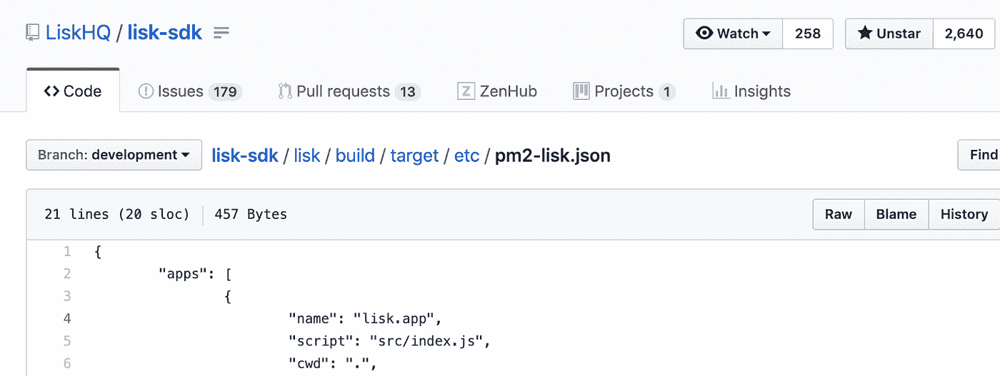
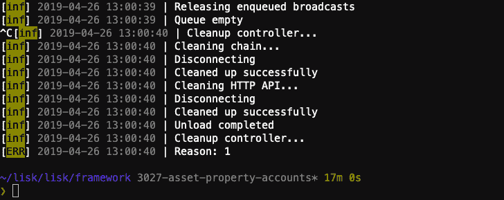
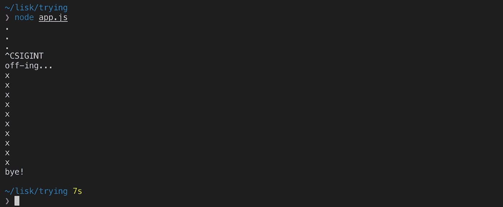
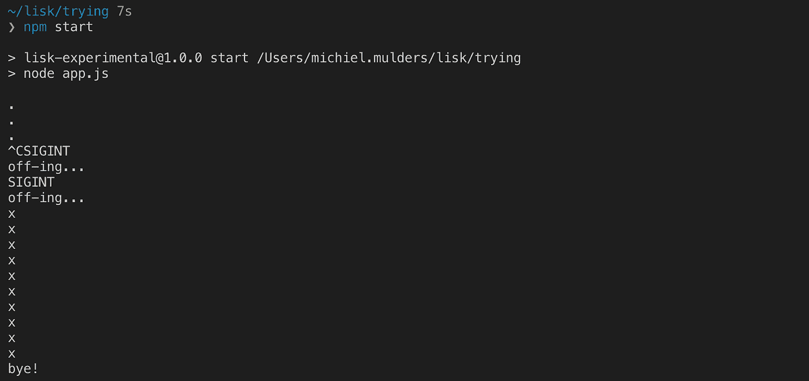
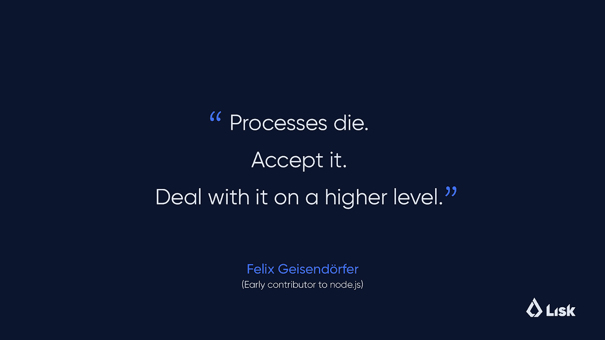

# 为什么我们停止使用“npm 启动”来运行区块链核心的子流程

> 原文：<https://medium.com/hackernoon/why-we-stopped-using-npm-start-for-running-our-blockchain-core-s-child-processes-8826e8299e79>

当 Node.js 本机支持子进程时，您不应该通过 npm 启动应用程序。在本文中，我们将提供 Node.js 应用程序的最佳实践列表，其中包含概述核心问题的代码片段，并向您展示如何通过 3 个步骤重现该问题。简而言之，我们不再使用`npm start`来运行我们的区块链内核，而是选择使用本地的`node`命令。

# 介绍 npm 及其最著名的命令“npm start”。

Npm 是处理 JavaScript 项目时的首选节点包管理器。它允许你将其他人的代码包安装到你自己的项目中，这样你就不必从头开始编写你需要的所有代码。Npm 之所以出名，还因为它在行业范围内使用脚本命令，可以在 shell 中输入这些命令来启动应用程序。当然，最广为人知的命令是充当`node app.js`包装器的`npm start`。

# 我们的挑战:npm 将 app.js 文件作为 npm 的子进程运行。

然而，很多人不知道的是，在使用 npm start 触发节点 app.js 的同时， **npm 实际上是在运行你的 app.js 文件，作为管理这个**的 npm 的子进程。在 99%的情况下，您不应该关心这个，但是当在您自己的项目中使用子过程时，事情会变得棘手。你能感觉到盗梦空间在这里发生吗？**#子流程-启动**

**如果你想了解更多关于**[**Lisk**](https://lisk.io/)**先来看看这篇短文** [**讲解人剪辑**](https://www.youtube.com/watch?v=BnMrIgSoiJQ) **和我们的** [**文档**](https://lisk.io/documentation) **！**

为了让您更好地理解这与我们的**“NPM vs node**”**问题**的关系，让我们来谈谈我们是如何运行 Lisk Core 的。对于那些不知道 Lisk 内核是什么的人来说，本质上，它是一个实现 Lisk 协议的程序，该协议包括共识、块创建、事务处理、对等通信等。每台机器都必须设置成运行一个允许加入网络的节点。

# 介绍 Node.js 应用程序的生产流程经理 PM2。

在我们的例子中，我们使用 [PM2](http://pm2.keymetrics.io/) 在失败时重启应用程序。PM2 是 Node.js 应用程序的生产流程管理器，内置负载平衡器。它允许您永远保持应用程序的活力，在不停机的情况下重新加载应用程序，并简化常见的系统管理任务。

几周前，我们决定提供将`http_api` 模块作为子进程运行的能力，以提高 Lisk 核心应用程序的整体效率，同时使用相同的分配资源。

# 决定将 http_api 模块作为子进程运行的基本原理。

这一决定背后的想法主要是基于这样一个事实，即功能上隔离的组件可以形成多进程应用的基础，以便利用物理处理器的多个硬件核心的潜力(如果可用的话)。此外，以弹性的方式设计每个组件，以解决多重处理的脆性。这意味着一个组件的故障对其他组件的影响极小，并且这些组件可以单独恢复。关于子进程的更多信息可以在我们的提案[中找到](https://github.com/LiskHQ/lips/blob/master/proposals/lip-0005.md)为 [Lisk 核心](http://lisk.io)引入一个新的灵活、有弹性和模块化的架构。

# 我们无法用 npm 优雅地退出 Lisk 核心。

在为 http_api 模块实现子进程时，Lightcurve 后端开发人员[使用 PM2 将 http_api 模块作为子进程](https://medium.com/u/cea5cfe8641f#issuecomment-477551495)运行时，Lisk 核心没有正常退出。这导致了一个棘手的情况，每当主进程(Lisk 内核)崩溃时,`http_api`就继续在后台运行。

每当这种情况发生时，PM2 将尝试恢复 Lisk 核心进程。然而，这将产生一个新的`http_api`进程，这是不可能的，因为端口已经被使用，因为清理进程没有被调用。这导致 PM2 无法恢复应用程序，这在运行作为网络一部分的区块链节点时是一个大问题。在这种情况下，用户必须手动重启区块链节点，这是我们绝对希望避免的。

# 使用 node 命令运行 Lisk Core

这个问题让我们意识到 npm 和 node 之间的区别，并让我们重新考虑我们运行 Lisk Core 的方式。以前，我们只是接受`npm start`行业标准作为运行应用程序的首选方式。

后来，我们发现 docker-node [GitHub 仓库](https://github.com/nodejs/docker-node/blob/master/docs/BestPractices.md)提供的最佳实践专门用于 Dockerizing Node.js 应用程序。在这里，可以找到一个关于在 Dockerfile 或任何其他高级应用程序管理工具(如 PM2)中使用 npm 的明确警告消息。

> “创建映像时，可以绕过 package.json 的 start 命令，直接烘焙到映像本身。首先，这减少了容器内部运行的进程数量。其次，它导致 SIGTERM 和 SIGINT 等退出信号被 Node.js 进程接收，而不是被 npm 吞掉。”

每当我们试图退出 Lisk 核心或应用程序崩溃时，SIGINT 信号就会发送到应用程序。在 Node.js 中，您可以监听这个信号并执行一个清理函数，以便优雅地退出应用程序。在我们的例子中，我们正在删除各种侦听器，并将 SIGINT 信号传递给子进程，以便也优雅地退出这个进程。

正如 *docker-node* 所述，npm 会吞掉这个信号，并且不会触发 SIGINT 信号的监听器，导致应用程序无法正常清理。这也是为什么`http_api`模块一直在 PM2 境内运行的原因。

[Nick Parsons](https://twitter.com/nickparsons) ，一位使用 PM2 运行节点应用程序的专家，也提到了这样一个事实:当使用 PM2 时，为了最大化健壮性并实现快速启动(无停机时间)，优雅地关闭应用程序**是非常重要的。**

# 终止信号:什么是 SIGKILL、SIGTERM 和 SIGINT？

我们必须深入研究才能发现这些信号是关于什么的。这些信号是告知进程终止的信号集合的一部分，实际上还有更多，可以在*gnu.org*提供的文档中找到，在 [24.2.2 终止信号](https://www.gnu.org/software/libc/manual/html_node/Termination-Signals.html)部分。

*   **SIGKILL**:“SIGKILL 信号**用于使** **程序立即终止**。它不能被处理或忽略，因此总是致命的。也不可能屏蔽这个信号。”
*   **SIGTERM**:“SIGTERM 信号是一个通用信号**，用于引起程序终止**。与 SIGKILL 不同，这个信号可以被阻塞、处理和忽略。礼貌地要求一个程序终止才是正常的方式。”有趣的是，shell 命令 kill 默认生成 SIGTERM。
*   **SIGINT**:“SIGINT(*'****程序中断*** *'* )信号在用户输入 INTR 字符(通常为`C-c`)时发出。”开发人员可能更熟悉用于中断 shell 中正在运行的进程的`CTRL/CMD+C`命令。

# 将码头工人和 PM2 转移到节点。

这让我们决定去掉`npm start`，用节点命令取而代之。在 Dockerfile 文件和 PM2 运行文件中都使用了`start`命令。

下图显示了 Docker 的典型`ENTRYPOINT`片段。以前，这将包含`ENTRYPOINT ["npm", “start"]`。这个文件现在可以在我们新的 [Lisk 核心库](https://github.com/LiskHQ/lisk-core/blob/master/docker/docker-compose.yml#L19)中找到，它是从 Lisk-SDK Monorepo 中提取的。

Lisk-SDK [Dockerfile.](https://github.com/LiskHQ/lisk-core/blob/master/docker/docker-compose.yml#L19)

同样，这也适用于包含启动 Lisk 内核的 PM2 配置的`pm2-lisk.json`文件。`script`属性现在包含了`index`文件的相对路径。

Lisk-SDK [pm2-lisk.json](https://github.com/LiskHQ/lisk-core/blob/master/build/target/etc/pm2-lisk.json)

# 了解如何通过 3 个步骤重现问题。

我们可以找到 GitHub 用户 EvanTahler 创建的一个很酷的[片段来解决上述问题。让我们重现这一点！](https://github.com/npm/npm/issues/4603#issue-26860428)

## 第一步。创建 package.json 和 app.js

为了模拟这个问题，您需要在同一个目录中创建两个文件(`package.json`和`app.js`)。确保您的计算机上安装了 Node.js 版本`10.x`或更高版本，以便使用 Node 命令运行代码片段。因为我们不需要任何代码依赖，所以我们不需要安装任何其他东西。

**Package.json**

**App.js**

**代码片段澄清** —代码片段将每 0.5 秒打印一个点，并监听 SIGINT 和 SIGTERM 信号。一旦收到两个终止信号中的一个，我们将延迟关机 5 秒*(5 * 1000 毫秒)*，并打印出*“拜拜！”*。

**在运行这个片段**之前，我想向您展示当点击`CTRL/CMD+C`时，一个被终止的进程是如何在您的终端中显示的。你可以通过`^C`字符注意到它。

*Shows Lisk Core running for exactly 17 minutes after getting killed with the SIGINT signal.*

## 第二步。使用节点运行代码段

现在我们知道了 SIGINT 在我们的终端中是如何表示的，让我们以`node app.js`开始这个片段。让它运行 5 秒钟，然后点击`CTRL/CMD+C`。您将看到 kill 信号被 Node 正确处理，并在关闭前再等待 5 秒钟。

## 第三步。使用 npm start 运行代码片段

然而，当我们用`npm start`运行这个片段时，你会注意到收到了两个终止信号。正如我们现在所知道的，start 命令将作为子进程运行`node app.js`。因此，当接收到`^C`时，它将尝试退出 npm 进程，并将此终止信号传递给子进程，这导致了主进程退出但子进程仍处于活动状态达 5 秒的问题。

**如前所述，在使用** `**npm start**` **运行应用程序时，尤其是在运行子进程时，当您试图监听终止信号时，会出现各种各样的问题。**

*有兴趣学习如何设置和运行自己的* ***自己的 Lisk 节点*** *？更多信息可以在* [***Lisk 核心文档***](https://lisk.io/documentation/lisk-core/setup) *网站上找到。您可以选择二进制安装，这是默认的(也是最简单的)安装技术。其他选项包括使用 Docker 运行 Lisk Core 以支持其他平台，或者对于更高级的用户，可以从 Lisk Core 构建。*

由于这个**“子进程启动”**,`http_api`模块无法优雅地退出并继续运行。停止这个进程的唯一方法是使用一个 shell 命令，杀死所有节点进程:`sudo killall node`(或者锁定要杀死的特定进程 ID)。幸运的是，这可以通过使用 node 启动应用程序来轻松解决。

# 处理 Node.js 应用程序的最佳实践

Node.js 的早期贡献者 Felix geisendrfer 非常清楚地说明了如何处理崩溃的应用程序:

Source: [Node.js Best Practices SlideShare](https://fr.slideshare.net/the_undefined/nodejs-best-practices-10428790/29-Deployment)

**以上教导我们什么？**避免通过`npm start`启动应用程序，而是使用 node。此外，如果出现问题，优雅地退出并接受它。菲利克斯建议使用像 PM2 这样的高级工具来处理应用程序的恢复和重启。

我们从中了解到，你不应该总是认为标准是理所当然的。有时候，保持简单并使用简单的节点命令运行它会更好。

总结我们在 Lisk 所做的，我们决定通过在 PM2 运行配置和 Dockerfile 中将`npm start`命令改为`node src/index`来解决这个问题。现在，在接收到 SIGINT 信号后，节点进程直接接收该信号，并可以将 SIGINT 信号传递给其子进程，这样每个进程都可以正常退出。

因此，PM2 可以在不停机的情况下轻松重启应用程序。通过这种设置运行我们的应用程序允许我们部署一个更稳定的应用程序，这对于创建一个稳定的区块链网络是绝对重要的。

**Lisk 让个人能够创造一个更加分散、高效和透明的全球经济。我们欢迎你加入我们的使命:**

*   [简讯](https://mailchi.mp/lisk/newsletter)
*   [Lisk 研究](https://research.lisk.io/)
*   [Lisk.chat](https://lisk.chat/)
*   [Reddit](https://www.reddit.com/r/Lisk/)