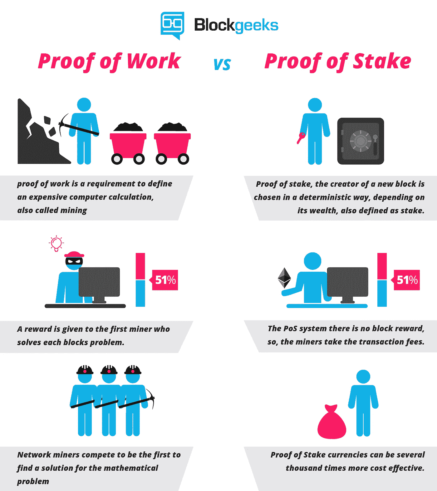
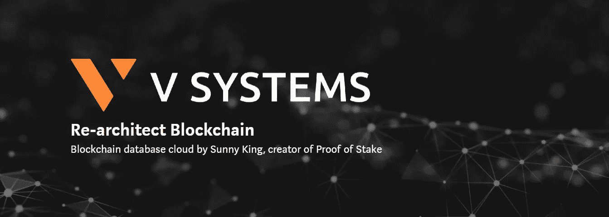
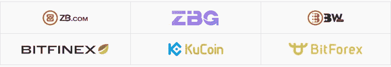
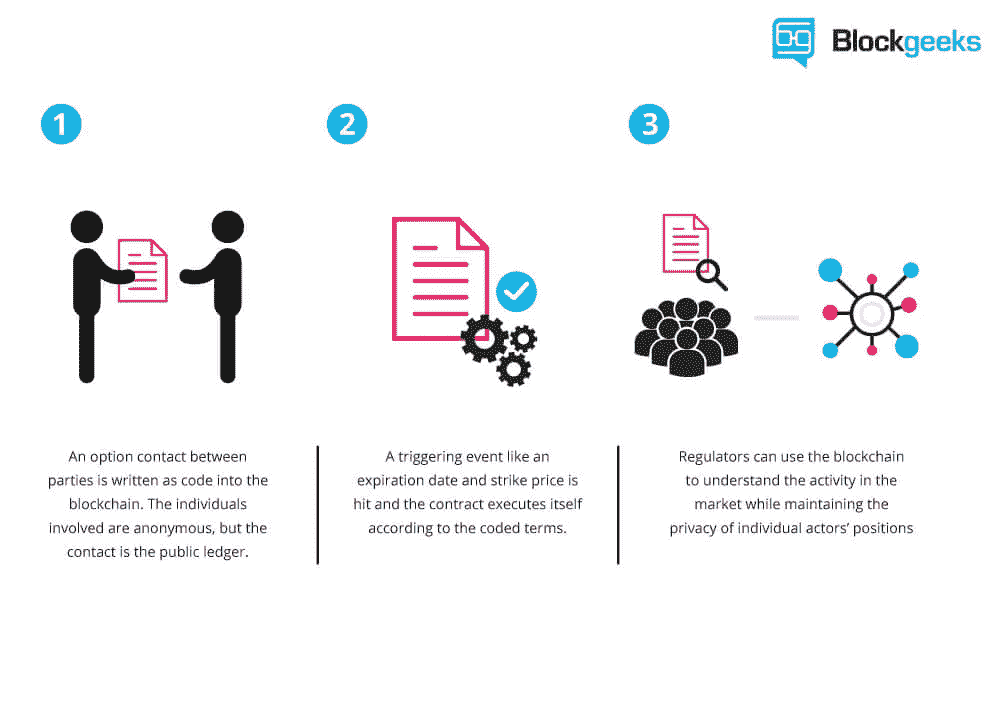
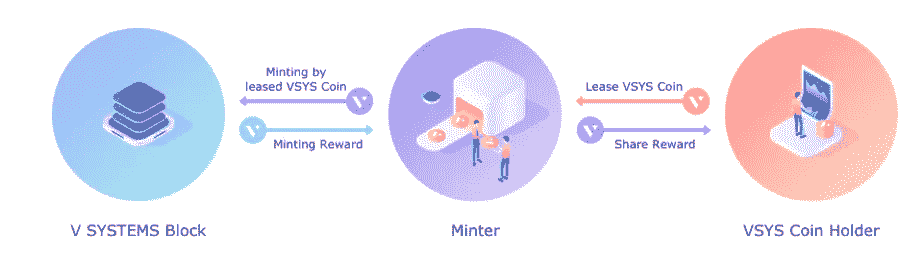
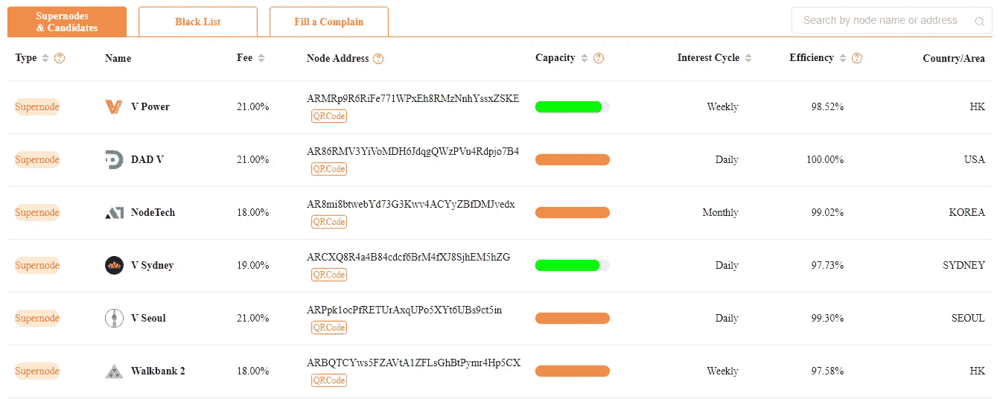
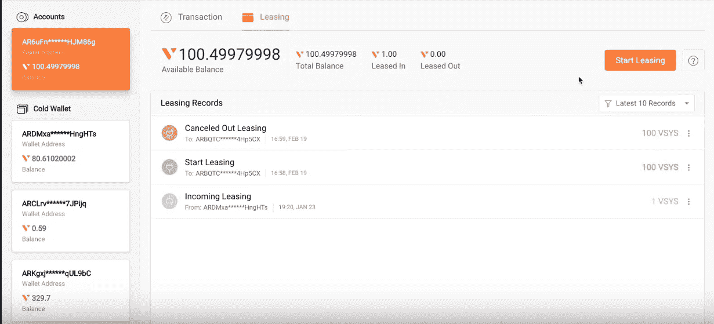

# 为什么我们要重新架构区块链！

> 原文：<https://medium.com/hackernoon/why-were-going-to-re-architect-blockchain-b617fac5ba4b>

一个全新的可能性世界！

**·用于数据库存储的区块链。😍**

我们可以使用区块链来存储数据，而不是以本地数据库的形式存储数据，这样做的结果是变得高度安全和分散(区块链的本质)。

👉一般来说，在区块链，传统的用户帐户可以被公-私密钥和地址所替代。传统的数据库受到严格的访问控制，几乎所有的数据都被限制在经过认证的账户中。此外，在传统数据库中，帐户创建也是一种集中模式，即数据库管理员授予用户一个帐户进行访问。相反，使用区块链，密钥对可以由任何人自由生成，不需要集中管理。

👉对于需要某种形式的集中管理的应用程序，这可以通过客户机/节点软件内部的业务逻辑来实现。称为管理员的特权密钥对可以内置到客户端软件中。👼

*   传统数据库的元素可以作为区块链环境中的对象有新的解释。以下是基本对象的示例:
*   **公钥**:用户生成的密钥对的公开部分
*   **地址**:公钥的缩写
*   **虚拟身份/化身**:长期使用身份，与公钥相比，可以是临时使用
*   **组织**:与多个虚拟身份/化身关联并由其管理的身份
*   **可替代的**:具有可替代性质的虚拟资产/代币，如货币、股票等。

> **那为什么我们还没有用区块链做数据库:*😔***

> **原因如下:*😅***

这个想法有很多问题。

首先，比特币式的区块链被证明既困难又昂贵。这种区块链基于一种“工作证明”共识，即矿工们相互竞争验证区块链区块，谁先验证谁就获得奖励。一般来说，计算能力强的人会得到奖励。

挖掘需要大量的能量和计算能力。这受到了强烈的批评😥在国际层面上，开采一枚比特币所消耗的电力几乎相当于一个家庭每天消耗的电力，所有其他矿工的精力和时间都被浪费掉了。

提高比特币的最大块大小限制是一场旷日持久的战斗和戏剧，这显然反映了该技术固有的可扩展性限制。可扩展性问题源于这样一个事实，与以前的分布式数据库不同，比特币是一个极其冗余的系统。

单区块链在应用程序之间不提供隔离系统或资源。

> 如果我说没有必要花费时间和精力来验证区块链交易，但我们仍然可以验证区块链，我们可以拥有数百万个互动的区块链，那会怎么样？*😌*

*   **阳光大王来了**😇

*Sunny King，一位传奇的区块链开发者，是股权共识机制证明的发明者，也是三个加密货币/区块链项目的创造者，包括 V SYSTEMS、Peercoin 和 Primecoin。*

Sunny king 发明了利益相关者共识证明机制，利用该机制，区块链仍然可以在不花费任何能量的情况下得到验证。

source: **Blockgeeks**

source: V systems

> V SYSTEMS 是一个原生的区块链数据库和分散的应用程序平台，旨在创建一个全新的数字经济时代。该项目由首席建筑师 Sunny King 领导。
> 
> 他们的使命是基于超级节点利益证明(spo)在数百万区块链的基础上创造未来经济。V SYSTEMS 旨在通过构建一个创新的数据库云来实现这一愿景，从而使区块链的开发变得快速而简单。
> 
> “世界各地有成千上万个区块链项目。但由于许多缺陷和固有的可扩展性问题，世界尚未见证这一技术的大规模采用。是时候解决区块链的核心问题，并重新发明技术，以带来一个真正可扩展、稳定、全球化的区块链平台，该平台易于使用，并与数十亿个系统兼容。通过这样做，使区块链的广泛采用，并推动一个全新的时代。”

以下是基本的用户数据库操作:

创建数据库插入对象

更新对象删除对象

创建索引按索引键值查询

JSON 对象形式的对象是表示结构化数据的非常强大的数据结构。键值对可以被认为是对象的一个简单例子。

> **区块链数据库如何处理并发:*😕***

当用户试图插入键-值对时，观察者在广播中看到键或名称，然后进行相同键或名称的竞争插入，这可能在区块链中而不是在原始插入中得到确认。Namecoin 引入了一个协议来处理这个问题。这个想法是这样的:

*   用户发送插入前预订交易，其中通过哈希隐藏插入的密钥/名称。该协议理解预留事务预留给定密钥的插入一段时间。
*   等待插入前预订交易确认。然后向网络广播实际的插入事务。插入事务应该包括对预订事务的链接/引用，以通过插入和预订相互匹配的协议验证。

> ***高级数据库功能👇***

该平台还计划引入高级数据库查询功能。类似于 MongoDB 的对象关系查询语言比传统的关系查询模型(也称为 SQL)更加灵活。谷歌的 MapReduce 也呈现了一种新的数据处理形式。

> ***数据库迁移👇***

迁移特性对于数据库来说极其重要。随着数据库的扩展，将它迁移到自己的独立区块链会更加经济高效，因此可以降低特定于应用程序本身的区块链费用。该平台计划提供迁移工具，将数据库从一个区块链迁移到另一个。移动中的区块链创作。

# 虚拟系统

V Systems 的加密货币 VSYS 在 BITFINEX 等顶级加密货币交易所中被提及。

BITFINEX

Exchanges which support VSYS coin

然而，人们对工作证明和利害关系证明共识机制存在担忧，包括缺乏对节点执行硬件升级的激励以及块生成的随机过程。这些被证明是区块链规模的主要障碍。经过仔细评估后，V Systems 设计了全新的**超级节点利害关系证明** (SPoS)共识，既包含了旧机制的优点，又摒弃了旧机制的缺点。

**超级节点利害关系证明**共识机制规定提升节点(超级节点)充当铸币池，而区块链本地货币 VSYS 硬币的持有者通过将其硬币出租给超级节点来承担铸币者的角色。利息将支付给把硬币出租给超级节点铸造的硬币所有者。这种新的激励模式不仅保证了节点的质量，还保证了一个真正去中心化的生态系统，在这个生态系统中，VSYS 硬币所有者拥有治理网络的实际权力。

> **全球首款智能合约**

source: blockgeeks

智能合同允许各方在没有第三方信任的情况下创建有约束力的协议。比特币在验证交易时使用简单的脚本系统。后来，以太坊用一种称为 Solidity 的图灵完整编程语言重新设计了一个新的智能合同系统。

V Systems 计划支持以太坊和 EOS 风格智能合约的兼容实现。虚拟机将以模块化的方式实现，以便应用程序可以选择启用首选的智能合约风格。

> **云特征**

该平台计划提供工具集来为应用程序设置区块链。区块链模板准备允许用户选择不同的协议参数和可插拔组件，如共识模型。一旦选择了模板和选项，平台就提供**工具集来为应用**部署新的区块链，甚至可能在开发应用所需的特定业务逻辑之前。

> **可扩展性**

为了解决单个区块链的可扩展性限制，已经投入了大量的精力。虽然其中一些值得注意，但我们认为生态系统中可伸缩性的最终未来是无限数量的区块链的结果。我们设想一个可能有数十亿区块链同时运行的世界。因此，如果有必要，该平台将允许应用程序在单独的区块链中运行，实现与同一生态系统中的其他应用程序系统的完全可扩展性隔离。

> **可用性**

可用性长期以来一直是加密货币被普遍接受的瓶颈。该平台计划为智能手机开发基于浏览器的钱包和移动轻量级钱包，同时兼顾现代用户体验和高安全性。Cold wallet 应该易于每个人使用，允许用户安心地保护他们的虚拟资产，免受来自网络黑暗角落的威胁。

> 【VSYS 币持有者如何参与 SPoS 铸币？

VSYS Ecosystem

硬币持有者非常容易参与铸造。只需从 V SYSTEMS 官网的 Supernode 页面查看当前的 Supernode 候选列表及相关信息即可。

*   选择超级节点候选的节点地址，其视野与你的一致，并通过你的 V SYSTEMS 钱包将你的 VSYS 硬币租赁到相应的地址。

*   如果您选择的超级节点候选人获得批准，您可以在 V SYSTEMS wallet 的租赁页面查看您的兴趣。VSYS 硬币持有者有权随时取消对任何超级节点候选人的租赁。

我希望你今天学到了真正新的东西。请分享并留下👏。

感谢阅读😃。

享受铸造！

有关更多信息:

 [## 桩的超级节点证明完全指南

medium.com](/vsystems/supernode-proof-of-stake-complete-guide-by-moonking9998-41a8f7675a28)