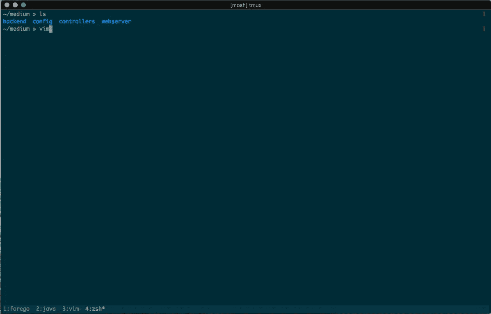

# 为什么应该在命令行上开发

> 原文：<https://medium.com/hackernoon/why-you-should-be-developing-on-the-command-line-e3353bbdaf51>

作为一名工程师，我所做的最伟大的决定之一就是放弃自己的想法，并深深地爱上了命令行。

对于外行人来说，终端可能很可怕:颜色很奇怪，文本在屏幕上的速度通常比眼睛看到的速度快，对灾难性生产失败的隐约恐惧只是一个回车键。那么为什么会有人想要…