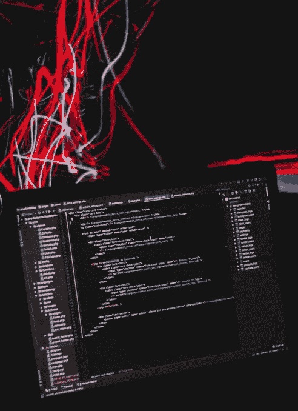

# 为什么你的 Lambda 函数注定会失败

> 原文：<https://medium.com/hackernoon/why-your-lambda-functions-may-be-doomed-to-fail-4ede5885824d>

AWS Lambda 有一个很酷的特性，对于一个无服务器应用程序来说，这既是一件好事，也是一件噩梦，这取决于我们的代码是否正确地处理了它:重试行为。

当 Lambda 函数的调用导致错误并且 AWS Lambda 平台使用相同的事件有效负载自动再次调用该函数时，会发生重试。

*在我们深入之前，请确保您熟悉关于该主题的* [*AWS 文档*](https://docs.aws.amazon.com/lambda/latest/dg/retries-on-errors.html) *。*

# 噩梦

Photo by [Joel Filipe](https://unsplash.com/photos/_AjqGGafofE?utm_source=unsplash&utm_medium=referral&utm_content=creditCopyText) on [Unsplash](https://unsplash.com/search/photos/storm?utm_source=unsplash&utm_medium=referral&utm_content=creditCopyText)

假设您正在运营一个电子商务网站，AWS Lambda 用于处理客户订单。一个人购买了一件商品，您有一个负责以下步骤的功能，所有这些都在一次运行中完成:

1.  确保该商品有现货
2.  处理信用卡
3.  从库存中移除项目
4.  发送确认电子邮件

现在，假设前三个步骤已经成功完成，但是在发送电子邮件时出现了一个暂时的问题，您的应用程序出现了一个错误。Lambda 平台自动再次调用函数，参数不变，邮件发送成功。太棒了，不是吗？

嗯，没那么快。我们的系统刚刚记录了同一个客户的第二次意外购买……并从他的信用卡上扣了两次钱！

休斯顿…我们有麻烦了！

Photo by [Sebastian Herrmann](https://unsplash.com/photos/jzTQVxCyKYs?utm_source=unsplash&utm_medium=referral&utm_content=creditCopyText) on [Unsplash](https://unsplash.com/search/photos/houston-problem?utm_source=unsplash&utm_medium=referral&utm_content=creditCopyText)

*该流程很少会完全按照这种方式实施，但它是一个说明性的示例。*

# AWS 到底为什么要这样对我？

Lambda 重试行为实际上是一个非常酷的功能，不要误会。在分布式系统中，许多事情都可能出错。事实上，当事情*可能*出错时，请放心，它们*会在某个时候*出错。AWS 负责确保这些错误不会被掩盖，并且操作有更多成功的机会。我们当然不想因为技术问题而错过销售收入。

# 解决方案

好吧，我们看到了重试行为的价值，但是我们如何避免令人头疼的问题，比如双重收费的例子呢？

有一个叫做[幂等性](https://en.wikipedia.org/wiki/Idempotence)的概念来拯救我们。维基百科将其定义为“数学和计算机科学中某些运算的*属性，由此它们可以被多次应用，而不会改变最初应用之后的结果*”。

结合幂等性的一个好的实践是[关注点分离](https://en.wikipedia.org/wiki/Separation_of_concerns)。在前面的例子中，我们将几个不同的操作捆绑在一起。如果可能的话，让不同的功能负责每一项操作会更好。原因之一是幂等性需要从操作的角度来分析和实现。

读操作通常不会产生任何副作用，它们本质上是幂等的。在我们的例子中，操作#1(检查一个项目是否有库存)就是一个例子。在大多数情况下，您不需要担心这些，所以将它们分开实现会使您更容易管理堆栈的其余部分。

存储和删除一个值本质上不是幂等操作，但是如果我们有该资源的唯一标识符(UID) ，它们可以是*。在我们的电子商务场景中，如果客户订单有一个 UID，那么可以多次执行存储操作，而无需创建多个不同的订单。*

例如，订单 UID 可以是客户电子邮件或用户名的散列、购买时间戳和购买的商品列表。当站点收到订单请求时，这些变量将作为参数发送给我们的 API。如果函数在某一点失败，调用被重试，将再次生成相同的订单 UID，满足幂等性要求。同样，*这只是出于说明的目的*——每种情况都需要适当的分析，以找到稳定且有弹性的幂等实现。

对于信用卡收费部分，大部分平台都会支持幂等请求。例如， [Stripe](https://stripe.com/) 将提供一个 [*等幂键*](https://stripe.com/docs/api/idempotent_requests) ，这样，如果在传输过程中出现问题，您可以安全地重试请求。

通常，如果操作发生在您的堆栈领域中，那么它将完全由您来满足幂等性要求。上面解释的唯一标识符原则通常就足够了。但是如果您依赖于第三方 API，确保幂等性可能会很棘手，并且您可能需要另一方的帮助来实现这个目标，以防这种操作不被支持。如果您不能让第三方与您合作，总是有可能首先在您的终端运行所有操作，创建一个单独的进程来检查所有操作是否成功运行，然后与外部 API 进行交互。这可能不是理想的实现，但在某些情况下可能是最好的了。

# 像专家一样管理 Lambda 重试

无服务器开发人员需要一个工具来自动识别调用实际上是对以前执行的重试。专门的日志服务——比如有一个免费层的 dash bird——可以做到这一点。第一次执行和随后的重试应该链接起来，这样它们就很容易导航。这使得理解函数失败的原因以及幂等策略实现是否正常工作变得容易得多。