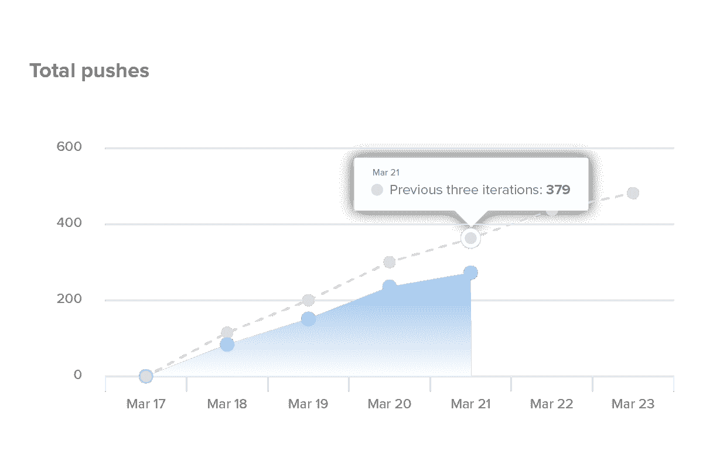
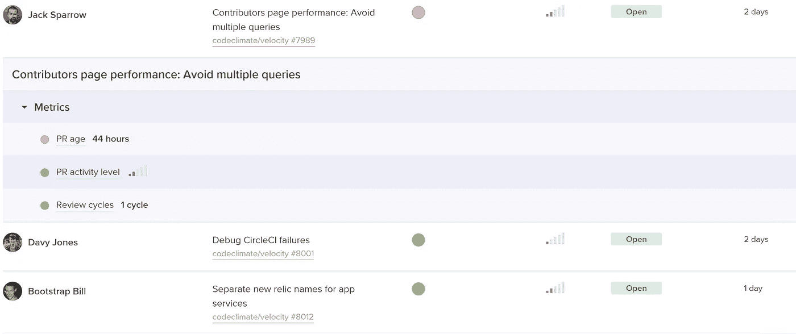
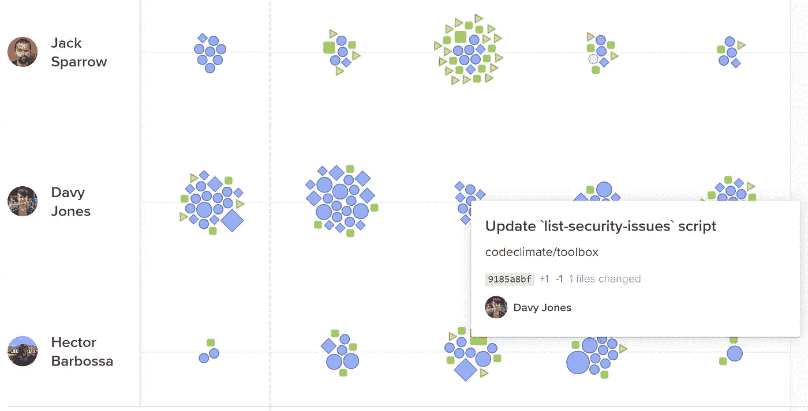
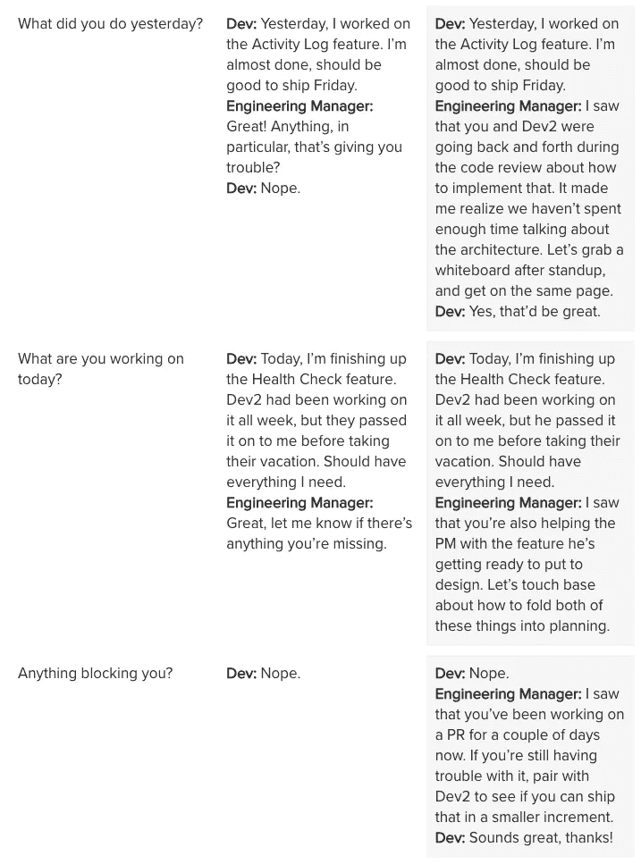

# 为什么你的单口相声没有达到预期的效果。

> 原文：<https://medium.com/hackernoon/why-your-standups-arent-as-productive-as-they-could-be-faa9f00864f>

“每日站立会议不是另一个浪费人们时间的会议。它将取代许多其他会议，带来数倍于其自身长度的净节省”——[*XP 规则*](http://www.extremeprogramming.org/rules/standupmeeting.html)

每次起立都会发生三件事之一:

1.  **问题省略。**
2.  **问题被拖延。**
3.  **问题被掩盖。**

可能是因为一个开发者不想在同行面前出丑。或者，也许，他们更喜欢独自面对挑战的满足感。不管怎样，所有的开发人员都会受到偏见的影响，这些偏见会影响他们是否以及何时共享关键问题的决定。

然而，房间里的一个人通常离代码库太远，以至于不能认识到所有有可能使 sprint 脱轨的问题。那个人——无论是经理、团队领导还是 scrum 大师——通常是负责确保团队不偏离轨道的人。

这造成了不良的动态。那些最接近问题的人没有时间后退一步，只见树木不见森林。负责保持 sprint 正常运行的经理没有发现路障和瓶颈的可见性。

开发人员最终会无意中成为关键问题的守门人。

为了改变这种动态，经理需要做一些研究。在步入单口相声之前，他们需要了解短跑风险的早期预警信号。

# 通过噪音识别信号

经理首先应该考虑的是:团队的发展速度有多快？这个速度是比正常速度快还是慢？

目前，大多数经理跟踪一些版本的计划与完成的工作。他们可能会看看故事点或门票关闭。虽然这些对于评估计划的有效性是有用的，但它们不是诊断性的。你不知道这是容量问题还是效率问题。

更准确地反映速度是一个活动指标，比如推送或提交计数。当活动低于正常水平时，经理知道有阻碍工程师编码的障碍。

[*Code Climate’s Velocity*](https://codeclimate.com/velocity/signup/) *shows a burn-up each sprint based on push volume.*

如果这个活动计数很低，经理将希望进一步调查开发人员可能会被卡在哪里。他们应该注意三个危险信号:

*   **长期运行的拉取请求:**是否有超过三个工作日仍未完成的拉取请求？如果是这样，谁能帮忙把它弄出去，或者把它分成小块？
*   **审核周期高:**是否存在在审核者和作者之间来回传递多次的拉取请求？
*   **大型拉取请求:**贡献者是否以易于审查的小型单位打开拉取请求？如果不是这样，这些拉请求就更难审查，并且在合并时产生问题的风险更大。

如果进度缓慢，但是没有拉取请求变得难以处理，那么您将需要拉取工程活动的列表。检查票证、提交、合并和评审，以确保团队的工作符合计划和预期。

*In* [*Velocity*](https://codeclimate.com/velocity/signup/)*’s Activity Log, every engineering activity is represented with a shape. Hover over to get context on what a team member is working on.*

您可以通过设置一个 Git 历史统计工具来显示这些信息，比如 [GitStats](http://gitstats.sourceforge.net/) ，然后在每次站立之前提取数据。或者，您可以使用类似 [Velocity](http://codeclimate.com) 的工程智能平台，在一个地方查看所有这些风险。

不管你如何提取数据，花 15 分钟来完成所有正在进行的重要工作可以确保在实际站立时没有时间被浪费。

# 将对话转向行动

有了更多的共享环境，对话从谈论问题转移到谈论解决方案。下面是两个并排出现的场景:

当您用实际数据开始对话时，提供支持的机会会大得多。它减轻了每个开发人员寻求帮助的负担，并将会议转变为保持团队步调一致的建设性方式。

# 起立不是点名

打扰开发者见面的价值在于识别和计划解决瓶颈——而不是证明他们在工作。

一旦时间被重新分配到识别风险和确保团队在实现冲刺目标的轨道上，你会发现，最终，单口相声比几倍于其长度的会议提供了更多的价值。

所需要的只是一点准备。

*原载于*