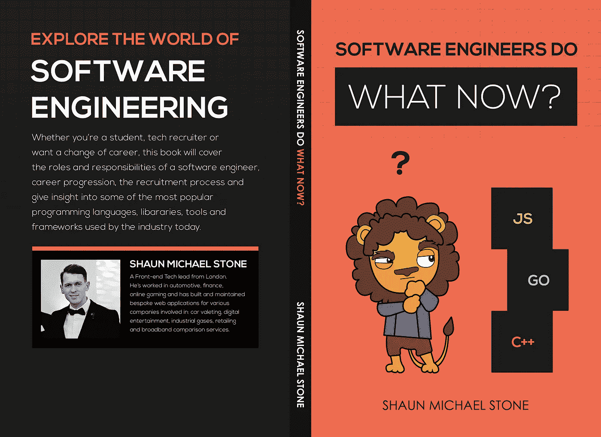

# 为什么你的技术面试过程可能有缺陷😐

> 原文：<https://medium.com/hackernoon/why-your-tech-interview-process-may-be-flawed-47a0cb70b1d4>

> “对于候选人来说，不仅仅是确定他们是否知道如何展平多维数组，原型链或闭包是什么。他们平易近人并且乐于助人吗？他们能把骄傲留在门口，做对球队最好的事吗？…"

我和很多朋友讨论过他们在技术面对面面试中的一些经历。有些进展顺利，有些进展不佳，有些简直荒谬绝伦。你看，有时候面试出错，并不总是候选人的错。这个人可能被认为是创造性/视觉型的，在构建可用于 web 应用程序的可靠 UI 元素方面有很强的专业技能，但在面试中被问到如何在白板上围绕二叉树或大 O 解决复杂的算法。

这个问题——并不总是——对于脸书或谷歌这样的公司的数据科学家来说可能是正确的，但大多数情况下，一项工作并不需要如此复杂的日常工作。这项工作可能包括为现有的 web 应用程序构建常识性的功能:与利益相关者的可靠沟通，干净、经过测试和组织良好的代码，以及包含可访问性的强大 web 标准。最终，代码被他们顺利地交付，并及时交付。

这些品质在一个角色中非常重要，通常不会在面试过程中被发现。面试官更感兴趣的是试图让候选人看起来愚蠢，寻找他们知识上的差距，或者只是为了满足他们自己的自豪感。‘我知道这个，但是他知道吗？’你猜怎么着也许他们不知道，不知道一切也没关系。不是每个人都这样。

> "那些认为自己什么都懂的人真的让我们这些知道自己什么都不懂的人很恼火"
> 
> 比雅尼·斯特劳斯特鲁普

公司也有自己的领域知识。这意味着在内部，他们熟悉自己的术语，事物如何工作或运作，并习惯于他们面临的常见问题。对于内部员工来说，这些问题可能非常简单，但对于来自外部的人来说就不那么简单了，所以面试官应该试着从受访者的角度看问题。面试官可能会谈论他目前面临的一个问题，并问应聘者我们将如何解决这个问题。他们可能会给人一种像车灯前的鹿一样的感觉。

Errmm. Can you repeat the question?

我认为最好不要去找出一个潜在候选人的弱点，而是找出他的优点。他们有什么是我们可能缺少的？我们有 CSS 方面的专家可以简化我们的一些规则吗？他们之前的角色是否更侧重于营销，这意味着他们对谷歌标签管理器了如指掌？了解深层反应的人能够识别我们从未考虑过的性能问题？有人谁拥有丰富的 DevOps 知识，可以帮助我们建立强大的詹金斯管道为我们的一些包？有人提倡 100%的测试代码覆盖率，并能在团队中强制执行？

对于候选人来说，不仅仅是确定他们是否知道如何展平多维数组，原型链或闭包是什么。他们平易近人并且乐于助人吗？他们能把骄傲留在门口，做对球队最好的事吗？他们能用外行的术语向涉众解释技术需求吗？他们是否让每个人都了解情况——谁可能会受到他们计划进行的变革的影响？

如果你在候选人身上看不到任何潜力，并且你觉得他不具备技术知识，那么是的，也许最好不要继续下去，但是不要因为某人不能在白板上解决问题就把他排除在外。检查他们代码测试的质量，他们在面试中遇到的方式，他们在以前的角色中解决的问题。大局。你会惊讶地发现，这个行业中有多少有才华的人曾经被拒绝，现在仍然如此。

看看这个[网站](https://rejected.us/)，它展示了被拒绝的有影响力的人。《你不知道 JS》的作者凯尔·辛普森(Kyle Simpson)被一家大型社交网络公司拒绝，理由是“不懂 JavaScript”。他的书很畅销，非常棒。谷歌 90%的员工使用的自制软件的创造者 Max Howell 被谷歌拒绝，因为他不知道如何在白板上做二叉树。

说真的，糟糕的面试过程会给公司带来很坏的影响。如果他们有不好的经历，他们会告诉[一些有趣的细节。一些最大和最成功的公司在这些领域有巨大的缺陷，认为仅仅因为公司做得好，他们就应该让事情保持原样是错误的。总有改进的余地。](https://www.glassdoor.co.uk)

这条建议是，

> **‘软件工程师现在做什么？’**

Book Cover for Software engineers do what now?

通过这本书，我们将向您介绍各种各样的技术角色、招聘流程、职业阶梯上存在的职位，并通过大量受欢迎的技术语言、工具、库和框架来了解当今公司从候选人那里寻求的方法。

**打印:**【https://www.amazon.co.uk/dp/1707231079】T2

**Kindle:**https://www . Amazon . co . uk/Software-engineers-do-what-now-ebook/DP/b 08413 xhs 8

**lean pub:**[https://leanpub.com/softwareengineersdowhatnow](https://leanpub.com/softwareengineersdowhatnow)

**Google Play:**https://books.google.co.uk/books/about?id=lijLDwAAQBAJ

New Book, ‘Software engineers do what now?’

感谢您的阅读！附言:如果你买不起这本书，请直接通过 Twitter 给我发消息！

肖恩·迈克尔·斯通

肖恩·迈克尔·斯通。
看看我写的其他一些帖子，在 [Twitter](https://twitter.com/shaunmstone) 上关注并联系我。