# AI 会接管世界吗？

> 原文：<https://medium.com/hackernoon/will-ai-will-take-over-the-world-in-a-nutshell-part-1-9712646af32f>

## 第一部分

## 简而言之，你一直在寻找的答案。

Source: Unspalsh

## 在对“人工智能”(AI)有一个(稍微)全面的了解之前，这篇文章将带你经历一个在这个话题上没有/几乎没有经验的人的内心之旅。

## **这次旅程将分为三个不同的部分:**

**第一部分:***人工智能将如何取代人类智能*

***第二部:*什么时候****AI 智能会超过人类吗**

****部分(3): *如果*** 一个数字超级智能已经被成功制造出来，并且出于某种原因，它想要接管世界，那该怎么办。它能够做到吗？**

***参考消息:本文主要关注第一部分。***

**在我们开始之前，我想澄清一个关于人工智能概念的普遍误解。蒂姆·厄本总结得很好:**

> **不要再想*机器人*。机器人是人工智能的容器，有时模仿人类形态，有时不——但人工智能本身就是机器人内部的计算机。人工智能是大脑，机器人是它的身体——如果它甚至有身体的话。例如，Siri 背后的软件和数据是人工智能，我们听到的女人的声音是人工智能的化身，根本没有机器人参与。**

# **这一切是如何开始的？**

## **开始**

**“人工智能”一词是由约翰·麦卡锡在 1956 年创造的，他后来在麻省理工学院和斯坦福大学建立了人工智能实验室。**

**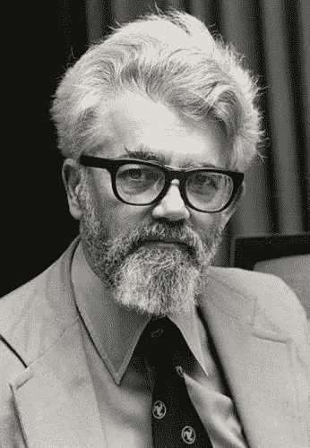**

**Meet THE man- John McCarthy**

**在 20 世纪 50 年代早期，对“思维机器”的研究有各种各样的名称，如控制论、自动机理论和信息处理。麦卡锡想要一个新的、中性的总括术语，可以收集和组织这些不同的研究成果进入一个单一的领域，专注于开发可以模拟智能各个方面的机器。**

**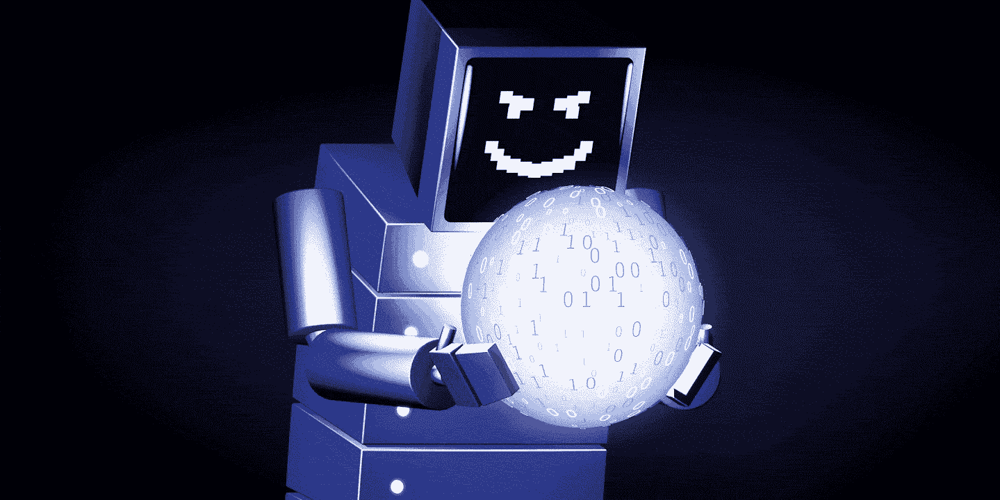**

**在早期，人工智能的先驱们不相信机器会有智能行为，也绝对没有考虑过机器最终会远远超过任何人的所有智力活动的可能性。**

**然而，当结果被证明是惊人的时，计算机能够解决数字问题，发明比原来更优雅的数学证明，遵循指令并用英语回答问题，像 DARPA 这样的组织向麻省理工学院、卡内基梅隆大学、斯坦福大学的人工智能项目投入了数千万美元！**

**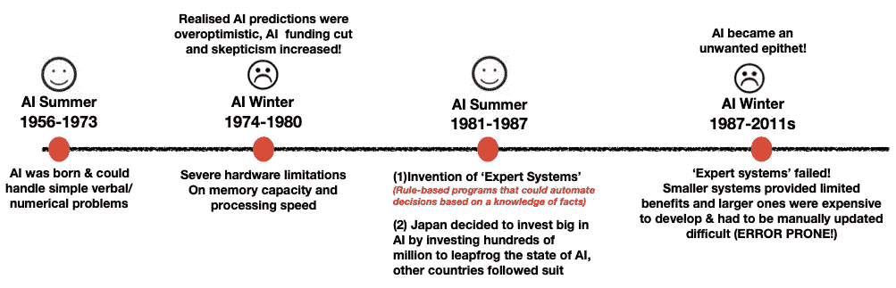**

**Evolution of AI**

**多年来，随着计算成本开始下降，处理能力变得更加强大，人工智能现在能够对更多的数据运行更复杂的算法！**

# **有什么含义？**

**人工智能现在可以在许多领域超越人类的智力！你可能很熟悉这些 *'* ***人工智能击败人类冠军*** 事件中的一些，这标志着一个重大进步，它的发生远远早于专家的预期！**

**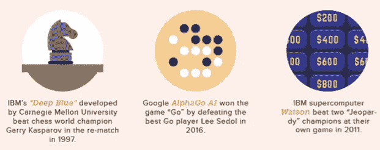**

**Source from Valuewalk**

**炒作仍在继续。即 2019 年，AI 在策略游戏 Dota 2 中战胜世界顶级职业队…..**

# **AI 还没有接管人类的是什么？**

**在本文中，我将试图通过揭示博斯特罗姆的《超智能》一书中提到的不同因素来分解这个**百万美元的问题**:**

1.  **人工智能的技术局限性**
2.  **通向超级智慧的不同道路(上)**

**这将让你对人工智能的未来形成最终的观点/结论。**

# **人工智能的技术挑战**

**虽然人工智能已经在多个领域(国际象棋、dota)击败了人类冠军，但人们可能会认为人工智能已经掌握了高水平的一般智能，能够学习抽象概念，聪明地思考策略，制定灵活的计划，并进行广泛的逻辑推理。**

****你错了。****

> **虽然人工智能基本上成功地做了所有需要思考的事情，但它仍然缺乏大多数 10 岁孩子所拥有的东西:**普通常识。****

**如果足够具体，人工智能可以模仿人类的任务。他们可以[定位识别物体](https://futurism.com/robot-picks-objects-recognize/)、[攀爬](https://futurism.com/build-better-climbing-robot-copy-cockroach/)、[救灾](https://futurism.com/walk-man-italian-humanoid-robot/)，在特定游戏中击败人类。**

**然而，**人工智能只能在特定的明确定义的任务中表现良好**，这就是为什么 IBM 围绕国际象棋特定算法构建的深蓝将无法击败“围棋”冠军，因为它没有被编程为这样做！**

**EY 艾，牛奶盒满了吗？如果我把糖果放在罐子里，明天它还会在那里吗？**

**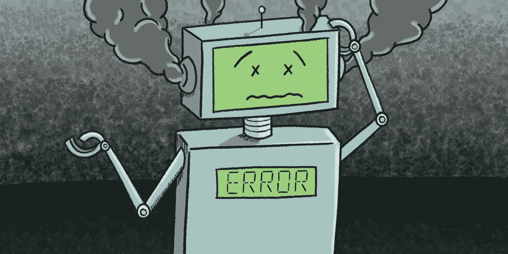**

**因此，除非有人成功地创造了一个能像人类一样理解常识的人工智能，否则他们已经成功地创造了一个能做人类智能所能做的一切的人工智能。**

## **人类水平的机器学习何时才能实现？**

****

**没有人有线索！**

**嗯，博斯特罗姆确实引用了一项由一群人工智能研究人员进行的调查，这些是他们的意见:**

> ***2030 年有 10%的几率发生***
> 
> ***2050 年有 50%的几率发生***
> 
> ***2100 年有 90%的几率发生***

**这可能需要十年或者下一个百年，没有人知道！不管怎样，现在你知道你的人工智能进展知识是**而不是过时的**。**

# **2.0.通向超级智慧的不同道路**

## **2.1.人工智能**

**传统的计算机依靠人类来告诉他们做什么和如何反应。“人工智能”意味着给机器配备像人类一样自己做决定的能力。**

****如何给他们权力？****

**就像人类如何在大脑中存储信息并从他们的模式中学习一样，科学家也已经能够使用存储的机器信息让机器向他们学习。这种训练计算机的方法以**、T5【机器学习】而闻名。****

****

**当我们人类的大脑看到这种动物时，我们可以立即吸收这些复杂的信息，并将其标记为‘海豹’。如果我们想要一台计算机来做同样的任务，将照片分类(标记)为密封/非密封，会怎么样？**

**没那么简单*(正如我文章前面解释的)*。**

**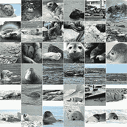**

> **从本质上讲，机器学习通过向计算机显示一系列可爱的海豹图片来训练人工智能充当“物体标签”，以便它可以找出什么是海豹/不是海豹。**

## **如果人类花了几十年的时间来训练我们的大脑，那么机器呢？**

**目前，没有人类的帮助，人工智能无法适应新的情况。即在国际象棋中训练的人工智能不能赢得 dota 游戏。**

## **精神食粮:人工智能种子**

**1950 年，Alan Turning 提出了 ***【儿童机器】*** 的概念，与其试图制作一个刺激成人思维的程序，为什么不训练一个人工智能来刺激儿童的思维呢？**

**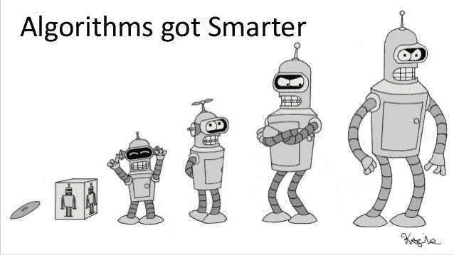**

**Humans have been evolving and learning from their past experiences, can AI grow up too?**

**这就给我们带来了***‘种子 AI’的概念*** 简而言之，Seed AI 必须具备**“递归自我改进”**的能力，能够通过[递归重写](https://wiki.lesswrong.com/wiki/Recursive_self-improvement)自己的源代码来迭代改进自己，而无需人工干预。**

**种子人工智能可以从相对较低的智能水平开始。然而，如果它足够聪明，可以重写它的源代码以变得更聪明(也就是说，更好地实现它的目标)，结果，它甚至可以更好地重写自己的源代码以变得更聪明。这个*可能*导致智能爆炸，人工智能迅速变得超级聪明！**

## **当前进度**

**据我们所知，还没有人建立一个种子人工智能。我不打算深入讨论辩论的全部内容，但这个概念已经值得思考。**

> **而不是从头开始训练人工智能…如果我们把人类的大脑下载到一个 u 盘里，然后连接到我们的电脑上，会怎么样？**

**这给我们带来了通往超级智能的下一条可能的道路…**

## **2.2.全脑仿真**

**全脑仿真包括扫描和密切模拟生物大脑的计算结构，以产生智能软件。**

****

**Imagine uploading Einstein/ Elon Musk/Steve jobs minds into your own body :O**

> **这种方法完全让我想起了《改变的碳》这个节目，在这个节目中身体不再重要。正如一个角色讽刺的那样:“你像蛇蜕皮一样蜕掉它。”这是因为人类的意识已经被数字化，可以在身体之间移动——包括真实的和合成的。**

****

**展示这个图表只是为了说明这个方法的复杂性。我想我点的菜不会很快来了。**

**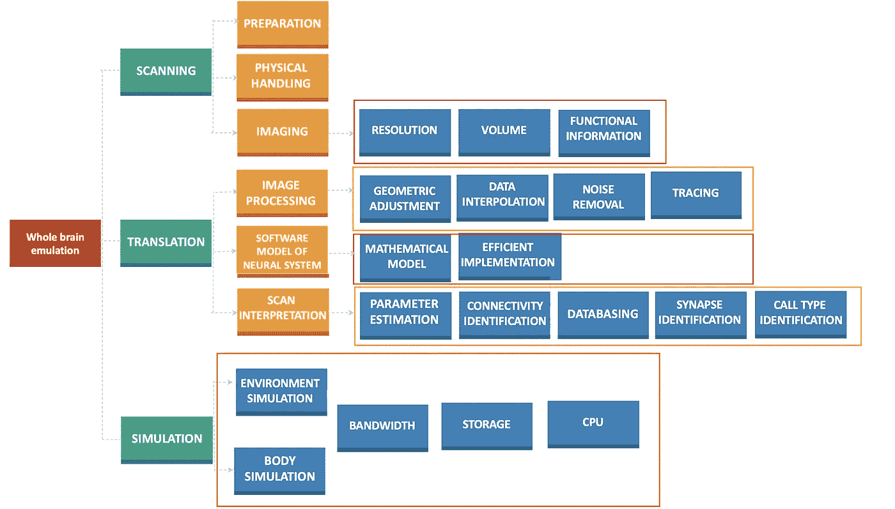**

**Capabilities required for brain emulation (Don’t bore yourself with the details!)**

## **我们目前离实现全人脑仿真还有多远？**

**目前还没有大脑被模仿。然而，当博斯特罗姆在 2014 年写下他的超级智能书时，仿真路径被认为需要另外 10-15 年才能获得一些牵引力，因为有几项具有挑战性的技术(算法和超级计算机)尚未开发出来！**

## **算法？科学家破解了！**

**2018 年，一项惊人的突破发生了，科学家成功创建了 [**一种能够通过模拟大脑单个神经元和突触之间的十亿个连接来进行完整人脑模拟的算法**](https://thenextweb.com/artificial-intelligence/2018/03/22/theres-an-algorithm-to-simulate-our-brains-too-bad-no-computer-can-run-it/) **！****

****

## **那还有什么问题呢？**

**目前，即使是当今最强大的超级计算机，如日本神户高级计算科学研究所的“K 计算机”，也只能处理最多 10%的人脑模拟。**

## **这种方法将来真的可行吗？**

**也许吧？当未来的[亿亿亿次超级计算机](https://singularityhub.com/2018/02/09/what-global-challenges-will-we-solve-with-exascale-supercomputers)出现时——预计比今天性能最高的计算机强大 10 到 100 倍——算法可以立即在这些计算巨兽上运行，研究人员希望达到 100%的模拟。**

**然而，与人工智能通往机器智能的道路相比，大脑仿真似乎更可行，因为它更依赖于具体的可观察技术(有牵引力)，而不是完全基于理论见解。**

## **2.3.生物认知**

**如果我不能训练机器像人类一样做决定，或者下载人脑，为什么不开一片药来增强我的智力呢？**

****

**Does this concept reminds you of the show “limitless”???**

**不幸的是，市场上已经存在使用药物来提高记忆力和注意力的情况，而让这种特殊的“药丸”引发智力的大幅上升通常是可疑和可疑的(要警惕你在易贝/亚马逊上看到的营销噱头)。**

**这一途径超越了服用药物，将**‘操纵基因’**纳入其中，作为实现认知能力实质性改善的一种方式。**

**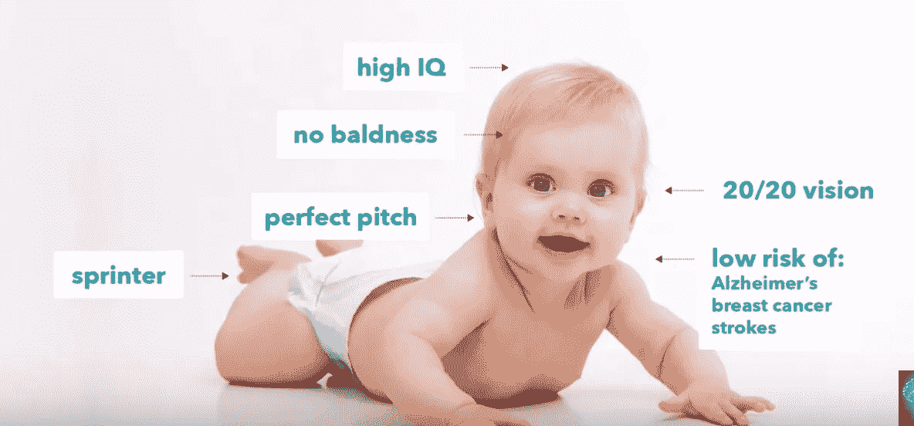**

**The creation of the perfect babies known as ‘designer babies’**

**牵强？**我认为不会。****

**咚咚咚……..**

**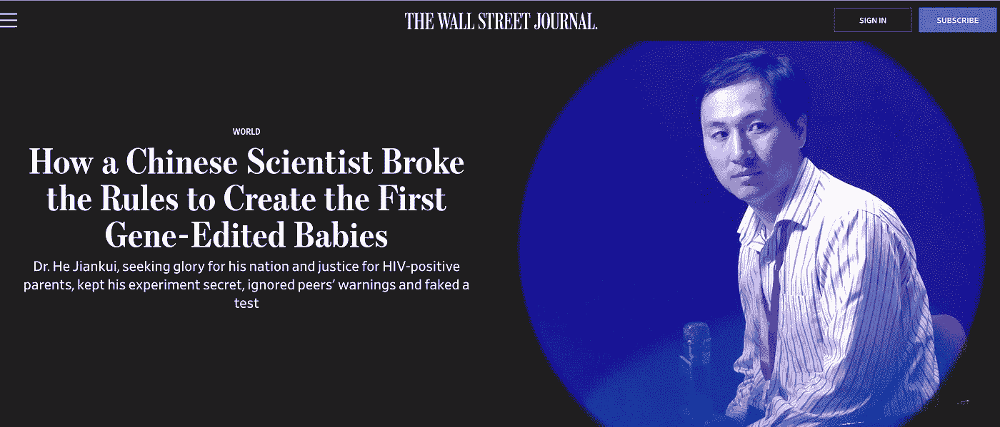**

**去年年底(2018 年 11 月)，由南方科技大学研究员何建奎领导的一个科学家小组声称，他们使用一种被称为“CRISPR”的基因编辑工具来定制双胞胎女孩的基因，使他们对艾滋病毒具有抵抗力**。****

**这一事件是人类遗传学史上最重要的实验之一，并引发了一场关于设计婴儿是否会在不久的将来成为现实的新辩论。**

**啊，但是没那么简单…**

## **等等，但是为什么？**

**(1)遗传学研究还没有进展到科学家可以精确定位与智力有关的基因的地步。**

**(2)成熟滞后——当选定的胚胎长成一个成年人时会发生什么？如果对特定基因(智力)进行基因改造导致了新的罕见和讨厌的疾病的产生呢？**

**(3)对 1 个孩子进行基因改造，会影响其后继世代。我们谈论的是一个将会波及几代人的影响！**

**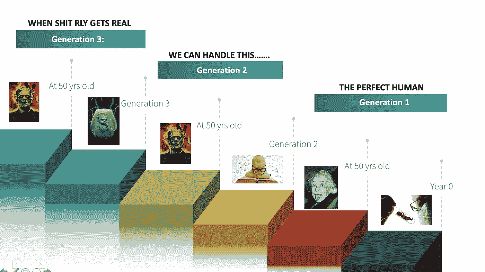**

**(4)社会影响——想象一下，一个国家充满了聪明的婴儿，只是因为这个国家能够负担得起财政和技术资源。有什么含义？**

**在个体层面上:非转基因人类将如何应对一群转基因人类？**

**在全球范围内，其他国家将在经济、科学、军事等方面遭受损失。试想这种现象会对全球平等产生怎样的影响？**

**&约束列表还在继续…..**

## **这种方法将来真的可行吗？**

**正如你所看到的，生物路径显然在技术上是可行的，认知增强可以加速科学和技术，包括机器学习和大脑仿真的进展。想象一个普通人拥有爱因斯坦/艾伦的大脑的世界。**

**但是(总是有但是)，如前所述，采用这种方法会有重大的后果。**

# **概括起来**

1.  **实现超级智能的 3 条潜在途径:**

*   ****机器学习**——输入代码给机器学习。开发 SEED AI:一台无需人工干预就能不断自我改进的机器，直到它变得比人更聪明**
*   ****大脑仿真**——将人脑的内容插入拇指驱动器，然后插入超级计算机**
*   **生物认知 -采取较少以计算机为中心的方法:婴儿营养，更好的教育，甚至选择性育种**

**2.弱形式的超智能可以通过生物技术增强手段实现(教育/婴儿营养/提高记忆力/注意力的认知相关药物)。**

**3.如果创造“完美婴儿”的所有伦理/科学问题都得到解决，这增加了高级机器智能将变得更加可行的可能性。**

**希望部分(1)回答了“如何”的问题，并为您提供了关于人工智能可能达到超智能的各种方式的深刻见解。**

**请继续关注第二部分“何时”(以时间为单位)人工智能有可能取代人类智能！**