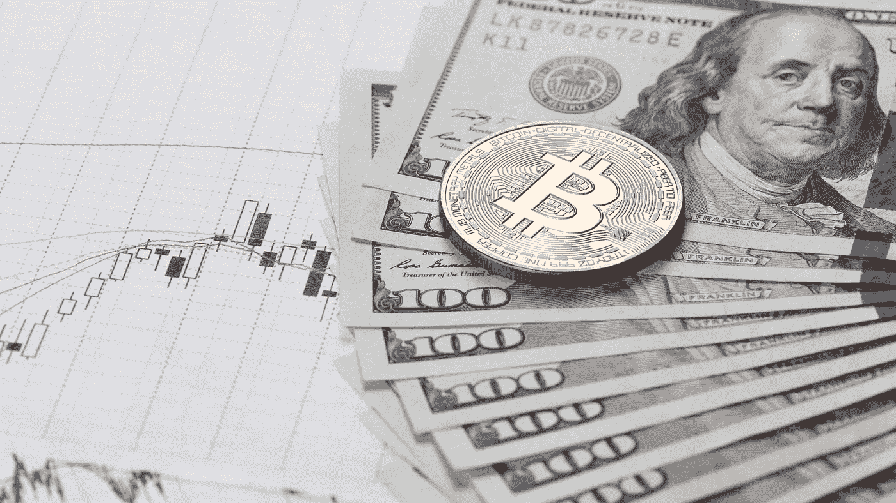
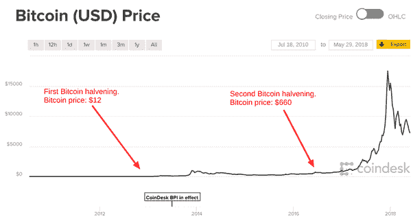

# 2020 年减半后，比特币的价格会上涨吗？

> 原文：<https://medium.com/hackernoon/will-bitcoins-price-rise-following-the-halving-in-2020-4885f9dcffb0>

## 2020 年比特币减半会造成比特币价格快速上涨吗？

一年后(2020 年 5 月 27 日，除非采矿散列率的大幅波动改变任何事情)，在比特币区块链上开采新区块的奖励将从 12.5 比特币降至 6.25 比特币——这已经让人们开始猜测这将如何影响比特币价格。

自 2016 年 7 月 9 日比特币减半以来，比特币发生了很多变化，每次都没有人完全确定比特币的价格或加密货币市场会如何反应。

比特币减半是一个固定事件，每 21 万个区块被矿工开采或确认后就会发生。

## 之前的比特币减半及其价格如何受到影响

自 2009 年比特币诞生以来，已经有两次减半，第一次减半发生在 2012 年 11 月 28 日，第二次减半发生在 2016 年 7 月 9 日。

在 2012 年 11 月第一次比特币减半事件大约 12 个月后，比特币价格达到了 1000 美元的历史高点。

2016 年减半预示着 2017 年的牛市，牛市在 2017 年 12 月达到顶峰，一个比特币的价格达到令人垂涎的 2 万美元。

因为价格已经回落——但在 2012 年减半和随后的繁荣之后，同样的事情发生了，比特币价格跌至每枚 200 美元，然后在 2016 年减半之前回升。

在前两次减半事件后，比特币的价格已经飙升

虽然比特币的价格在随后的两次减半事件之前有所攀升，但在随后的 12 个月左右的时间里，价格继续飙升。

许多金融专家认为，这与传统市场价格因利率或商品供应变化而变化的方式类似。

先前的减半对比特币价格的影响可以忽略不计。这是因为，就像万众期待的降息一样，**每个人都已经知道它会提前发生**，”比特币分析师、即将出版的新书《加密交易员》(The Crypto Trader)的作者格伦古德曼(Glen Goodman)表示。

如果市场知道供应将在某个时间减少，以及将减少多少，**它将开始逐渐将减少应用到价格上**——避免急剧上升和下降。

匹兹堡大学(University of Pittsburgh)教授、《糊涂人的比特币》(Bitcoin for the Befuddled)的合著者克里斯·威尔默(Chris Wilmer)表示:“从历史上看，降价几乎没有立竿见影的效果，尽管之后价格通常会上涨。”。

价格上涨是有道理的，因为比特币的大买家要么在市场上购买，要么通过采矿获得，在减半事件后，它迫使更多人在市场上购买。

“加密货币市场通常非常受事件驱动，随着我们越来越接近下一个减半，比特币的价格将受到那些预计新供应即将减少的人的提振，”区块链研究主管兼 Mosaic 联合创始人加里克·希勒曼(Garrick Hileman)表示。“在过去两次减半活动之前的几个月里，我们看到比特币的价格稳步上升，然后在奖励减半后上涨。”

**还有更多因素在起作用，但是……**

加拿大皇后大学的经济学教授 Thorsten Koeppl 说:

> “在我们看来，任何加密货币在经济上都应该与比特币背道而驰。”

> “比特币的价值在一定程度上受到其作为支付工具的潜力的推动，在费用随价格上涨之前，有人使用比特币进行国际转账。现在这样做的成本变得更高了。但是价格还在支撑。”

过去几年费用的增加——以及比特币价格的上涨——是越来越多的人使用比特币网络的直接结果。

目前，比特币网络上每天大约有 40 万笔交易，市价为 7825 美元。

## 比特币减半将如何影响矿工

随着比特币大宗奖励的减少，矿商将越来越依赖费用，这是他们确认比特币交易的一种激励。

矿工使用交易附带的矿工费来决定确认哪些交易——首先选择最大的交易。

最终，一旦所有 2100 万个可能的比特币被开采出来，矿工们的收入将完全依赖这些费用。

比特币减半首先影响的是矿工，新的比特币是以牺牲计算机处理时间和电力为代价的。

近年来，采矿成本大幅上升，尽管大型比特币采矿财团和较小的矿商仍能盈利。

但对矿商来说，减半意味着收入大幅下降。

在 2016 年第二次减半之前，当时比特币的价格意味着开采一个区块会产生价值约 1.6 万美元的新比特币。减半后，价格将直接降至 8000 美元。

然而，网络有可能自我平衡。随着采矿难度的增加，越来越少的矿工可能会继续保护网络。

## 包装东西

如果历史表明了什么的话，我们可以预期最初的**、**会有一个可以忽略不计的不同，随后是事件发生后可能的价格上涨。

从长远来看，减半会对比特币的价格产生多大影响？这是我们无法确定的，影响比特币价格的最大因素是其网络上的用户数量。

## 我希望你喜欢我的故事，请随意查看下面这些有用的资源:

[**免费下载勇敢浏览器，观看广告赚取 BAT 密码**](https://brave.com/kxh360)

您可以在世界任何地方使用[**【CEX】**](https://cex.io/r/0/up106280379/0/)购买比特币、以太坊、XRP/瑞波、比特币现金、Dash、比特币黄金、恒星/XLM 等等

您可以使用 [**BitPanda**](https://www.bitpanda.com/?ref=3127933809251797450) 在欧洲任何地方购买比特币、以太坊、BAT、IOTA、OmiseGo、EOS、比特币现金、莱特币等。

可以跟上我上 [**推特**](https://twitter.com/CryptoniteTweet) 和****中** **。****