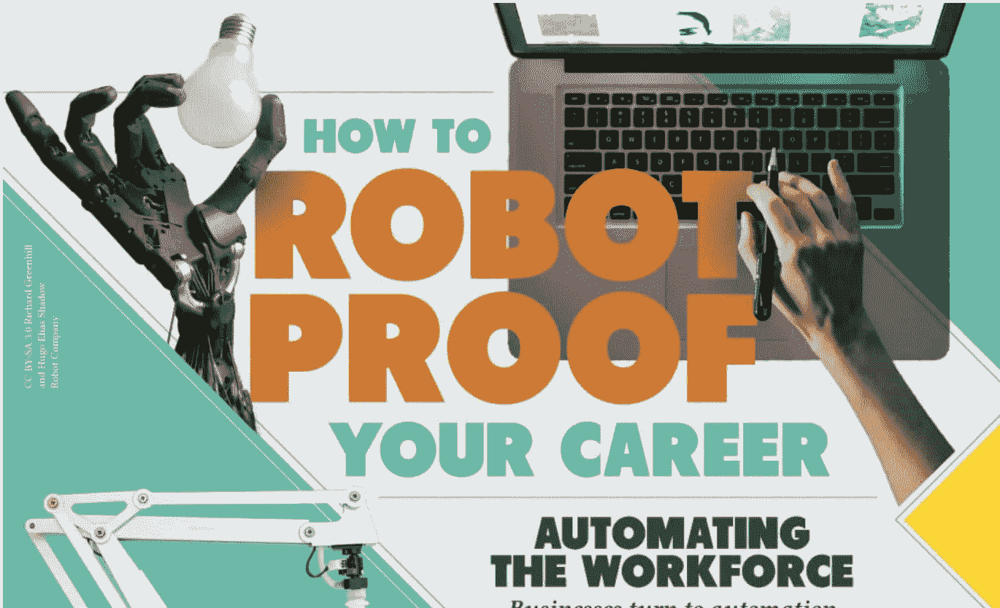
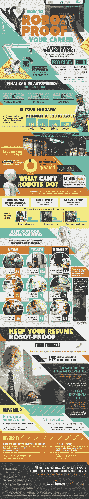

# 机器人会抢走你的工作吗？

> 原文：<https://medium.com/hackernoon/will-robots-take-your-job-96fa3d861f42>

机器人、自动化和人工智能的兴起最能吸引我们的注意力。虽然我们中的一些人可能期待专业行业的自动化，但另一些人可能对此感到恐惧。但是，当谈到自动化的真正影响时，并不是所有的专家都同意彼此的观点——你的工作可能比你想象的更安全。

近 50%的企业领导人表示，到 2022 年，自动化可能会导致员工数量减少。在未来的十年或二十年内，像零售工人、厨师和服务员，甚至看门人和管家这样的工作可能会有数百万份工作被自动化取代。那么，怎样才能真正让你的工作“防机器人”呢？归根结底，人类的软技能不可能完全自动化。事实上，随着自动化的发展和人工智能技术开始承担更专业的角色，人类只会变得更有价值。情商、领导力和人脑的创造力是我们(和我们的职业)不可或缺的。难怪客户服务、规划和创造性工作以及管理是自动化潜力最低的职位。

自动化意味着许多不同行业的巨大变化，有助于简化小规模和大规模运营。但是机器人不能靠自己成功——随着自动化的发展，人类和创造力的价值将是必不可少的。请看这张信息图，了解更多关于[自动化的未来](https://www.online-bachelor-degrees.com/automation-career/)以及如何培养自己的技能以在自动化世界中保持优势的细节。

