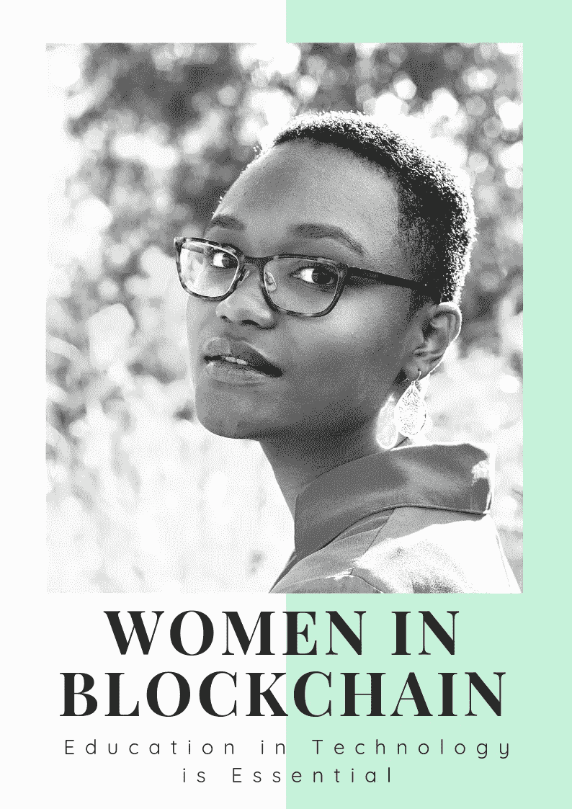
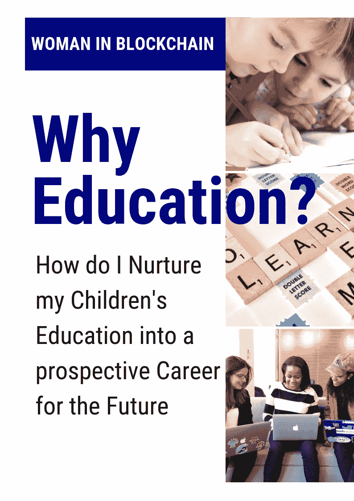
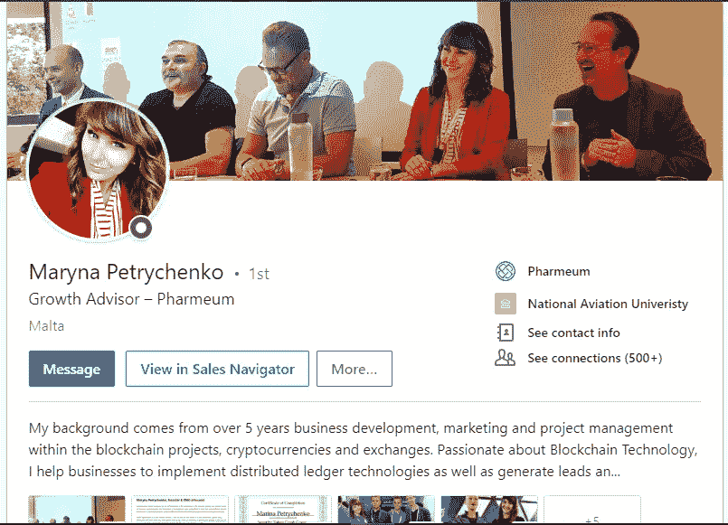
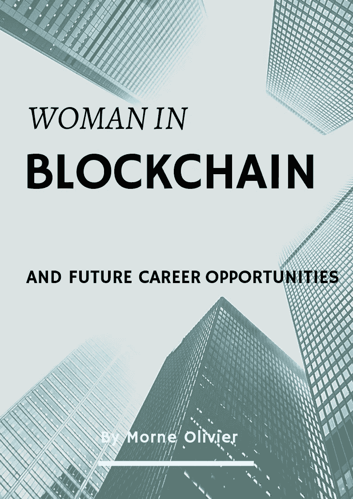
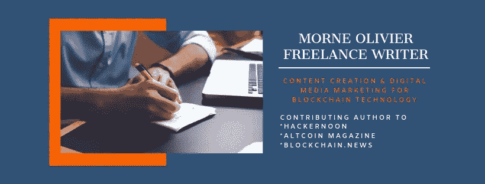

# 区块链中的女性|技术教育至关重要

> 原文：<https://medium.com/hackernoon/woman-in-blockchain-education-in-technology-is-essential-11f608a71e30>

2019 年 5 月 29 日

#区块 1

这篇文章和接下来的许多文章“区块链中的女性”将成为我写第一本书的系列资料的一部分。所有参加这个系列的女性都有一个共同点；通过教育推进区块链技术。

我以一篇文章的愿景开始了我关于如何让区块链教育更接近“正常”人的想法，结合了区块链界几位备受尊敬的女性进行辅助。反应是压倒性的，所以我决定把我的文章变成一个系列，甚至可能是一本书。

免责声明:这不是我或本文任何参与者的财务建议。

[此处为完整免责声明](/@morneolivierblog/disclaimer-c22bc70d7a29)

为什么是教育？

Why education?

我是两个男孩 11 岁和 13 岁的丈夫和父亲。比方说，由于许多误解，我家对加密货币和区块链的介绍并不总是很好。然后还有我的朋友知道我参与“加密货币”；问了我一些问题，但我可以看出他们并不真正理解我的兴趣是什么，或者这与他们有多大关系。我想每个人都认为你想向他们推销什么东西。
我不可告人的动机是什么？我为什么要这么做，写区块链？嗯，有几个答案。

在某种程度上，我的写作之路是有机发生的，这是我从未想过要做的事情。写作是我发现我真正喜欢做的一种媒介；它是如此的有创意，有趣和具有挑战性。

开始时只是一种爱好，现在已经发展成为一种全面的兴趣，所以我已经把它作为谋生的目标。

我新发现的激情来的正是时候。区块链是世界的技术进步，如果你认为互联网的创业阶段始于 1993 年，这种进步只是偶尔出现。Web 2 是在 2005 年互联网成为社交活动中心时实现的。2019 年的今天，我们正在开发 Web 3 和 4。

写作作为一种媒介从第一天起就已经发展成为一种交流和教育的形式。从 1450 年的印刷革命，到 17/19 世纪的报纸和杂志，再到 20 世纪社会媒体内容的演变，再到今天的互联网。写作是一种永无止境的艺术形式，永远在进化。

我怎么能不抓住这样的机会呢？我开始研究数字金融，加密货币，区块链。我确保在研究之后，我尝试和测试了所有有价值的东西。我爱上了生态系统，这些年轻的开发商开始参与他们的项目，成为他们生态系统的一部分。

Children need to want to learn

这让我想到了教育，这是采用任何新实现的关键。为什么要颠覆苹果车？如果系统运行平稳，为什么要改变它？
事情就是这样，我们并不是要改变它，车轮不能变得更圆，但可以改变它来辅助车辆行驶得更平稳，更快&更经济。
那这跟你有什么关系？
区块链正在被开发，以改善你的生活方式。它本质上是一个不可改变的分类账，是一种新的更强大的在互联网上运行数据的方式。

它将改善支付系统并节省成本，(您的银行交易、购物体验、数据证明、无国界支付解决方案……)
推进商业应用。
成为世界经济固有的一部分。
就我个人而言，我觉得应该把财政权力还给那些想要和需要它的人。

我想你真的不需要知道或理解所有这些，只需要知道它，它会变得更好，但是你的孩子呢？他们将在这项新技术中成长，对他们来说，工作机会可能会改变他们的生活。
那么，我为什么要写这个关于区块链教育的系列呢？
我想让你更接近区块链社区，特别是这一新技术的领导者。帮助弥合差距，并帮助你(尤其是如果你是父母的话)，为这个新行业的可能性提供指导，以便我们可以向你的孩子提供这些信息。

这将是一系列持续的文章，只要我们能够建立在这个想法上。文章开始将有 10 个问题，问两位来自不同国家的女士，她们在区块链领域从事不同的职业。我会在最后补充一个总结。我希望我们的读者能有一次非常有趣的经历，并获得大量信息。

首先上场！

**Sam (Sam Armour) Shrager | Digital Marketing Officer**

**山姆(Sam Armour)施拉格|数字营销官**

[**linkedin.com/in/samarmour**](https://www.linkedin.com/in/samarmour)

**山姆供职于** [**NKB 集团金融服务部**](https://www.linkedin.com/company/nkbgroup/) **数字世界投资银行部。**

**问&答**

**Q #1 给我们总结一下你的背景，你是怎么进入区块链&数字货币/加密货币的？**

第一，我一直在与一家初创公司合作，该公司由于将一个全球内容应用程序改造为支持加密支付选项的模型，而进入了区块链和加密领域。其中一位投资者也在创建一家区块链投资银行，并聘请我管理数字营销，并与团队一起了解更多关于这个领域的信息。我开始与 ICO 项目的顾问团队合作，为他们提供公关、营销方面的建议，随着 ICO 市场的萎缩，我更加专注于主要 NKB 品牌的内容创作、形象和社区建设。

问 2:告诉我们你目前的职位、职责和你期待的日常活动？

第二，我喜欢每天查看新闻流，看看我们可以从什么角度发表评论，通过常规渠道，也通过大社区(WhatsApp / Telegram)渠道。看到这一领域的发展并走出去为 NKB 团队和我们的服务摇旗呐喊是非常令人兴奋的。

**问题 3:如果你必须对自己严格要求，你希望在职业生涯的哪个方面有所提高？**

我希望我有机会在角色中更多地使用我的德语，并在国外工作更长时间。

**Q #4 关于区块链世界，你对今天的儿童/青少年(10-18 岁)尤其是年轻女性有什么建议？我们如何培养对这项新技术的兴趣？**

第四，在区块链，女性应该注意一些事情来获得成功。如果你没有技术背景，不要气馁，认为只有当你是一名开发人员时，你才能在这个领域取得成功。在这个生态系统中，有许多角色在进化，它们可以很好地适应各种背景和技能。

围绕该部门的更广泛的倡导举措也将有所帮助。大学的努力尤为重要——牛津区块链小组做出了一些惊人的努力，希望其他大学能够赶上。此外，我认为英国的中学正在真正解决这一问题——例如，我女儿的 IT 老师最近找到我，给她正在学习这一模块的 A 级学生做了一次关于区块链的讲座和信息。即使对于 12 岁和 13 岁的孩子来说，学校也在他们的 IT 课程中讲述区块链和加密货币，这非常令人鼓舞。

问题 5:你希望求职者具备什么样的技能？

第五，能够快速学习，适应和适应新的机遇和机会，并理解网络和数字的重要性。

**Q #6 区块链对我来说是滚雪球技术的前瞻性力量，但在我所在的地方，许多人仍将比特币视为骗局。我们如何在技术和持怀疑态度的人们之间架起一座桥梁？**

答 6:这个领域仍然非常不成熟，这意味着存在参与者不一定符合道德运营的风险。随着市场的成熟，我认为来自传统资本市场背景、拥有正确治理经验的个人加入市场来提高投资区块链和加密项目的标准将变得越来越重要。

**Q #7 如果有人阅读这篇文章，决定了解更多关于区块链的信息，请提供您所在地区或国家的教育机构的详细信息。**

【http://www.oxfordblockchain.net 号

[https://block chain . univ . ox . AC . uk](https://blockchain.univ.ox.ac.uk/)

**问#8 您目前对数字资产(加密货币)市场有什么看法，请与我们分享您对这项技术将引领我们走向何方的看法？**

第八，2018 年的剧烈波动——这是一个典型的泡沫情景。从积极的一面来看，它给这个领域带来了很多兴趣和更广泛的意识。从负面来看，牛市的过度不可避免地意味着或许是过度负面的情绪，就像去年年底我们发现自己所处的情况一样。这并不是什么新鲜事，在历史上，这已经在各种资产中上演过很多次了。

基础设施的逐步建设仍在继续，机构进入这一领域也是如此，这非常令人鼓舞。

我认为这项技术将会被大规模采用，但是我确实认为，最有可能的是，这将比我们想象的要长得多。我们谈论的可能是三到五年，而不是一到两年。但是十年后，我相信我们大多数人都会拥有各种各样的资产——从房产到艺术品等等。

**Q #9 你目前正在进行或计划进行哪些激动人心的新项目？**

答 9:下个月初，我们将举办首届区块链投资者论坛，届时投资者和创新的区块链公司将齐聚一堂，少数精选项目将提交给投资者小组，由业内更多观众观看。这非常令人兴奋，我们希望在今年的一系列此类活动中推广这一做法。

**Q #10 你最喜欢的区块链项目是什么，为什么？**

排名第十的 Nebula Genomics，他们正在通过允许个人通过收集和拥有健康数据来控制自己的健康数据，并能够安全地分享这些数据以获得回报，从而加快医学研究和对科学的贡献，同时获得对我们健康的独特见解，从而在医疗保健领域建立一个更美好的世界。

“谢谢你，山姆，那太棒了！你的投资者论坛听起来像是一个在安全环境中进行教育的可靠方法。我们将密切关注您的帖子，了解他们的进展。我还发现非常令人鼓舞的是，英国学校在与孩子们分享区块链信息方面如此开放，当然，南非学校可以注意到这一点！”

****************************************************************

Maryna Petrychenko | Growth Advisor

对于我们的下一位参与者，我邀请了 Maryna Petrychenko |成长顾问

[linkedin.com/in/maryna-petrychenko-619476ba](https://www.linkedin.com/in/maryna-petrychenko-619476ba)

玛丽娜为区块链医疗行业的创新者[制药公司](https://www.linkedin.com/company/pharmeum/)工作。

**Q #1 给我们总结一下你的背景，以及你是如何进入区块链&数字货币/加密货币的？**

答 1:我的背景是在区块链/加密领域从事了大约两年的数字营销和业务开发。
我作为首席营销官和首席业务发展官的职业生涯包括不同类型的初创公司:ico、交易所、冷钱包解决方案、OTC 交易服务商、交易所的白标解决方案、区块链游戏公司、风险投资公司……

我还拥有尼科西亚大学的数字货币认证和“STO 速成班”证书。

问 2:告诉我们你目前的职位、职责和一些你期待的日常活动？

A #2 目前我是市场营销和业务发展方面的咨询公司。在我的客户中，有一家加密媒体初创公司“新闻证据”(Proof Of News)([http://proof-of-news.com](http://proof-of-news.com/))、人工智能(AI)和区块链医疗保健初创公司 Pharmeum [、](https://pharmeum.io/)以及风险投资公司 Atomind([https://www.atomind.com/](https://atomind.com/))。我还将寻找 IEO 的项目与不同的交易所联系起来。

如果你必须对自己严格要求，你希望在职业生涯的哪个方面有所提高？

答 3:我想提高我的公开演讲技巧，我已经开始在一些秘密活动中演讲了。

**Q #4 关于区块链世界，你对当今的儿童/青少年(10-18 岁)尤其是年轻女性有什么建议？我们如何培养对这项新技术的兴趣？**

A #4 我会建议不要害怕这个行业“太复杂”，你“不够聪明”。身处区块链世界并不意味着，你必须成为一名编码员/程序员/超级技术人员。如果你花一点时间和精力，这项技术的基础对每个人来说都很容易理解。像在任何行业一样，在区块链中有大量的非技术性工作，如公关、营销、会计、法律、客户支持等。如果你对它有热情——就去做吧！

问题 5:你希望求职者具备什么样的技能？

答 5 当然取决于工作职位。在我看来，最重要的是这个人对区块链行业及其背后的理念充满热情。对于这样的人来说，这绝不仅仅是“朝九晚六”的工作。带着热情的心态，在这个行业工作成为你的生活方式，你的激情，你准备好为之 24/7 工作，因为你明白你正在建设未来！

**Q #6 区块链对我来说是滚雪球技术的前瞻性力量，但在我所在的地方，许多人仍将比特币视为骗局。
我们如何在技术和持怀疑态度的人之间架起一座桥梁？**

原因是缺乏教育和媒体的虚假信息。当然，外面有坏玩家，但是如果这个人受过足够的教育，了解这个行业的运作方式，他/她就永远不会被骗。就像在任何投资活动中一样——你必须首先研究你在哪里投资，不要期待奇迹般的每日投资回报率——没有人能向你保证这一点。

**Q #7 如果有人阅读本文，决定了解更多关于区块链的信息，请提供您所在地区或国家的教育机构的详细信息。**

答 7:我建议参加尼科西亚大学的[数字货币入门课程(我自己有)。你可以在网上下载，而且是免费的。本课程内容丰富，对加密和区块链技术的每个方面都有很好的详细描述。](https://www.unic.ac.cy/blockchain/free-mooc/)

**问#8 您目前对数字资产(加密货币)市场有何看法，并与我们分享您对这项技术将引领我们走向何方的看法？**

第八个棘手的问题。由于许多外部和内部因素，加密货币目前仍未准备好完全取代法定货币。尽管如此，你已经可以用你的密码在任何地方支付了，比如使用 Wirex 或 Revolut——你只需将你的资金转移到他们的 Visa / Mastercard 卡上，然后像普通卡一样使用它。我们可以看到，虽然大规模采用正在到来，越来越多的人开始使用和理解加密。甚至像脸书、易贝、微软等公司也对此感兴趣——这意味着什么。

你目前正在着手或计划什么令人兴奋的新项目？

我正在为儿童和青少年写一本关于区块链和密码的书，以帮助这项新技术的教育。希望对某人有用:)

教育主题对于大规模采用非常重要，所以我可能会在不久的将来专注于与他人分享我的知识，以更快地让世界变得更美好:)

**Q #10 你最喜欢的区块链项目是什么，为什么？**

答 10:有很多令人惊奇的、真正有用的区块链项目，所以很难说。我喜欢像 Brave browser 这样的项目，你可以通过看广告获得报酬，或者 Steemit，你可以通过制作内容获得报酬……毕竟，为什么人们不断地制作内容和免费观看广告，而大公司却从中赚钱，收集和交易人们的数据？！数据应该属于人，内容生成应该得到回报。

“谢谢你，Maryna，你说得太对了，内容一代应该为他们的技能得到奖励！我将期待你的书，我相信将来我们能在这里分享它。教育是关键！知识就是力量！”

这就是我的第一个系列#Block1，关于区块链中的女人。感谢 Sam 和 Maryna 的参与，从像你们这样的领先区块链专业人士那里获得第一手信息真是太棒了。

Woman in Blockchain and future career opportunities

我期待着我们在一周内的后续行动。

*莫娜·奥利维尔#莫娜·奥利维尔*

*自由撰稿人|区块链技术的内容创作和数字媒体营销|让我来帮你创作内容*

[#免责声明](/@morneolivierblog/disclaimer-c22bc70d7a29)[LinkedIn](https://www.linkedin.com/in/morne-olivier-20406989/)[Medium](/@morneolivierblog)[hacker noon](https://hackernoon.com/@morne-olivier)[Twitter](https://twitter.com/Morneolivierhc1)[Telegram](https://t.me/MorneOlivier)[Telegram for Passive Income](https://t.me/BlockchainPCI)[uptrend](https://www.uptrennd.com/user/NTg5Mw)[Steemit](https://steemit.com/@morneolivier)[FaceBook](https://m.facebook.com/morne.olivier.98#_=_)