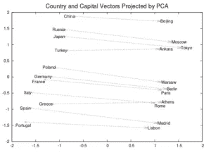

# 自然语言处理中的词嵌入及其应用

> 原文：<https://medium.com/hackernoon/word-embeddings-in-nlp-and-its-applications-fab15eaf7430>

单词嵌入基本上是一种单词表示形式，它将人类对语言的理解与机器的理解联系起来。单词嵌入是文本在 n 维空间中的分布式表示。这些对于解决大多数 NLP 问题是必不可少的。

领域自适应是一种允许机器学习和迁移学习模型映射利基数据集的技术，这些数据集都是用同一种语言编写的，但在语言上仍然不同。例如，法律文档、客户调查回复和新闻文章都是独特的数据集，需要进行不同的分析。常见的垃圾邮件过滤问题的任务之一涉及采用从一个用户(源分布)到接收显著不同的电子邮件的新用户(目标分布)的模型。

通过查看该领域的研究数量，单词嵌入在深度学习领域的重要性变得显而易见。Google 在单词嵌入领域进行的一项此类研究导致了一组相关算法的开发，通常称为 *Word2Vec。*

*Word2Vec* 最常用的单词嵌入形式之一被[维基百科](https://en.wikipedia.org/wiki/Word2vec)描述为:

*“word 2 vec”将大型文本语料库作为其输入，并产生通常具有数百维的向量空间，语料库中的每个唯一单词被分配给该空间中的相应向量。单词向量被定位在向量空间中，使得语料库中共享共同上下文的单词在空间中彼此非常接近*

在这篇文章中，我们来看看单词嵌入(Word2Vec)和域自适应的一些实际应用。我们也看看 *Word2Vec* 的技术方面，以便更好地理解。

# 分析调查反馈

Word2Vec 可用于从成千上万的客户评论中获取可操作的指标。企业没有足够的时间和工具来分析**调查回复**并据此采取行动。这导致投资回报率和品牌价值的损失。

在这种情况下，单词嵌入证明是非常宝贵的。在调查数据集上训练的(或适应于调查数据集的)单词的向量表示可以帮助嵌入被审阅的响应和做出响应的特定上下文之间的复杂关系。机器学习算法可以利用这些信息来为您的业务/产品确定可行的见解。

查看一下 [SmartReader](https://blog.paralleldots.com/smartreader/analyse-survey-responses-using-machine-learning/) ，这是 ParallelDots 推出的一款基于 Excel 的简单工具，可以自动进行调查响应分析，任何人都可以使用。

# 分析逐字注释

在单词嵌入的帮助下，机器学习已经在逐字评论的分析领域取得了很大进展。这种分析对于以客户为中心的企业非常重要。

当您分析文本数据时，一个重要的用例是分析逐字注释。在这种情况下，数据科学家的任务是创建一个可以挖掘客户评论或评论的算法。

像 Word2Vec 这样的单词嵌入对于这样的机器学习任务是必不可少的。在客户评论和评论上训练的单词的向量表示可以帮助描绘出被分析的不同逐字评论和评论之间的复杂关系。像 Word2Vec 这样的单词嵌入也有助于找出发表特定评论的特定上下文。事实证明，这种算法在理解买家或客户对特定商业或社交论坛的情绪方面非常有价值。

通过 ParallelDots 查看 [SmartReader](https://blog.paralleldots.com/smartreader/analyzing-verbatim-comments-on-spreadsheets-using-machine-learning/) ，在自动化企业逐字评论分析的过程中取得进展。

# 音乐/视频推荐系统

互联网上的流媒体服务彻底改变了我们体验内容的方式。在过去，推荐侧重于向您呈现供将来使用的内容。相反，现代流媒体平台专注于推荐当下可以欣赏的内容。流媒体模式以个性化广播和推荐播放列表的形式带来了新的发现方法。这里的重点是生成歌曲序列凝胶。为了增强用户体验，推荐系统的模型不仅应该捕获相似的人*通常对什么歌曲感兴趣*，还应该捕获在非常相似的背景下*经常一起听什么歌曲*。

这样的模型利用了 *Word2Vec* 。该算法将用户的收听队列解释为一个句子，每首歌曲被视为句子中的一个单词。当在这样的数据集上训练 Word2Vec 模型时，我们的意思是用户过去听过的每首歌曲和当前正在听的歌曲在某种程度上属于相同的上下文。Word2Vec 用一个坐标向量准确地表示每首歌曲，该向量映射了歌曲或视频播放的上下文。

对于那些想要深入研究 Word2Vec 如何工作的技术方面的人，这里是 ParallelDots 的内部专家对这个主题的看法。

# 单词嵌入的技术方面

NLP 中的一个常见做法是使用预训练的单词向量表示，也称为嵌入，用于各种下游任务。直观上，这些单词嵌入表示单词之间的隐含关系，这在对可以受益于上下文信息的数据进行训练时是有用的。

考虑 Mikolov 等人的 Word2Vec skip-gram 模型的例子——训练单词嵌入的两种最流行的方法之一(另一种是 GloVe)。作者提出了一个类比推理问题，这个问题本质上要求提出这样一个问题:“德国之于柏林，如同法国之于 __？”。当你把这些单词中的每一个看作一个向量时，给定问题的答案就简单地由公式给出了

**vec("柏林")— vec("德国")= x — vec("法国")**

也就是说，向量组之间的距离必须相等。因此，

**x = vec("柏林")— vec("德")+ vec("法")**

假设向量表示被正确学习，则所需单词由最接近所获得点的向量给出。另一个含义是，具有相似语义和/或句法意义的单词将组合在一起。

## 改进

虽然通用数据集通常受益于这些预先训练的单词嵌入的使用，但是表示可能并不总是很好地转移到专业领域。这是因为嵌入已经在从维基百科和类似来源创建的大规模文本语料库上被训练。

例如，python 这个词在日常上下文中意味着其他的东西，但是在计算机编程的上下文中它完全意味着其他的东西。当您构建模型来分析上下文关键数据(如医疗和法律记录)时，这些差异变得更加重要。

一种解决方案是简单地在特定领域数据集上训练手套或跳格模型，但是在许多情况下，不容易获得足够大的数据集来获得实际相关/有意义的表示。

改造的目标是获取现成的预训练单词向量，并使它们适应新的领域数据。与预先训练的单词嵌入相比，所得到的单词表示可以说更具有上下文感知性。

点击阅读原博客[。](https://blog.paralleldots.com/data-science/nlp/word-embeddings-use-cases/)