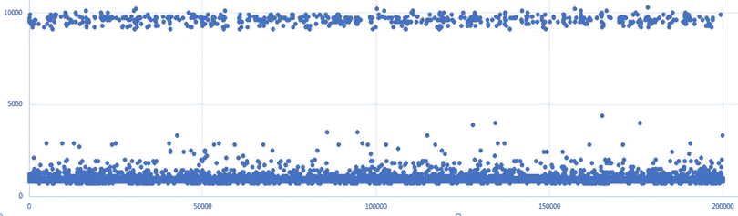
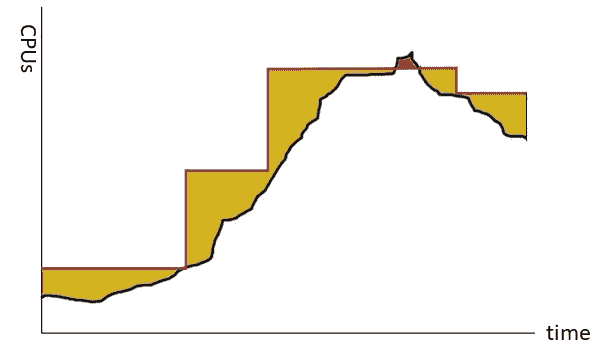
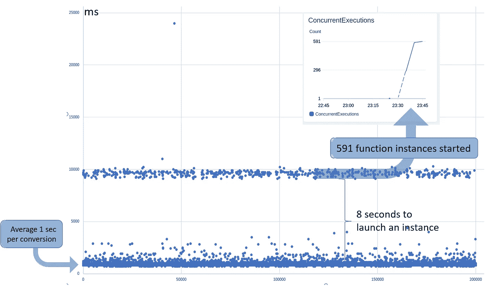
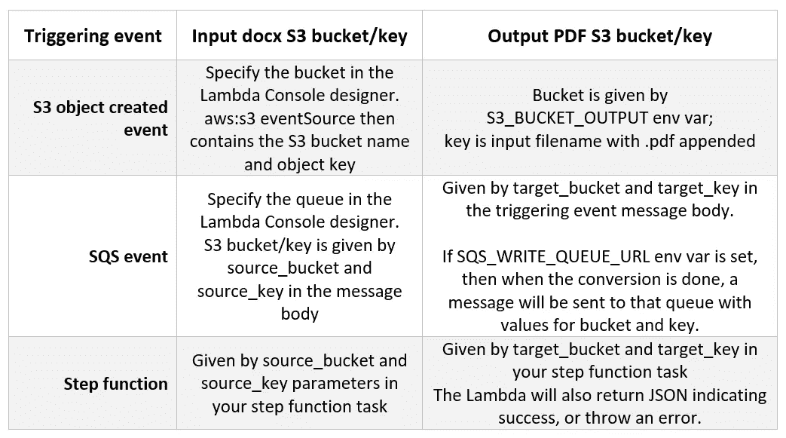

# Word 转 PDF +无服务器=💕

> 原文：<https://medium.com/hackernoon/word-to-pdf-serverless-437c26c73604>

如何解决将 Word 文档大规模转换为 PDF 的普遍问题？

我的[早期文章](https://hackernoon.com/generating-pdfs-in-javascript-for-fun-and-profit-c7af594cf697)主要针对 Javascript 开发人员；它展示了 docx 模板现在是用 Javascript 创建 pdf 的最简单的方法。你生成一个 docx，然后用我们的 [docx-wasm](https://www.npmjs.com/package/@nativedocuments/docx-wasm) 把它转换成 PDF。

在这里，我将向您展示无服务器如何实现从 docx 的大规模转换；想想每小时一百万个 pdf。容易且成本低。虽然在这里我们将再次使用 node.js，但作为一名 Java 开发人员，这种无服务器的方法对于其他领域的开发人员来说也非常有效。

这是我将在六月西雅图 PDF 协会会议上的[演讲](https://www.pdfa.org/electronic-document-conference-agenda/#nativedocuments)中涉及的更多内容的一个预览。在那里见？

**转换是 CPU 密集型的**

docx 到 PDF 转换的一个特点是它本身就是 CPU 密集型的。基本上每个 CPU 内核一次可以转换一个输入文件。试着做 2，它会花两倍的时间。“多长”取决于文档的复杂程度。页数是复杂性的粗略代表，但是它包含的内容也很重要:想想表格、图片、分页符、目录等等。

从历史上看，更多的内核意味着更多的服务器，因此您可以通过投入更多的服务器来解决问题。但是这是昂贵的:在硬件、软件许可和管理复杂性(也就是人)方面。您要么过度配置硬件(浪费资金)，要么冒着超负荷的风险(即延迟或丢失工作)。

**无服务器救援！**

我不打算在这里解释基础知识；可以说，所有主要的云提供商(AWS、Azure、Google 等)现在都有无服务器/FaaS(功能即服务)产品，也有更多开放/可移植的替代产品，如无服务器框架、OpenWhisk 和 Kubernetes 上的无服务器选项。

这里我们将使用 AWS Lambda，但是我们的方法很容易转移到其他无服务器环境。这主要是因为这些其他环境也支持用 node.js 编写的函数。

切入正题，这是在 Lambda 上执行转换时可以预期的可伸缩性:

200,000 PDFs in 10 mins on AWS Lambda

在这里，我们创建了 20 万个 pdf。花了 10 分钟。

一个 PDF 大约需要 1 秒钟，AWS 总共启动了 591 个函数实例来完成这项工作。启动一个运行我们函数的实例大约需要 8 秒钟，所以在 10，000 毫秒标记下有 591 个点(这个时间包括实际转换)。

下面，我将解释如何使用 SQS 来生成这个负载。不过，这里要强调的要点是如何简单(而且便宜！)就是把那 590 个“核”火起来。我们真的不需要做任何事情；AWS Lambda 为我们做了这一切。无服务器的本质是你不用考虑服务器。

它是如何工作的？

基本上，我们的 docx 到 PDF 函数的执行是为了响应某个**触发事件**。在 AWS 中，可能的触发事件有一长串，但值得注意的包括 REST API 调用、S3 对象创建事件、SQS(消息)和步进函数。

我们希望我们的触发事件告诉函数要转换什么 docx，以及如何处理结果。由于 AWS 对调用有效负载的大小施加了限制，我们的设计将围绕某个 S3 桶中的输入 docx，生成的 PDF 将被写入 S3。

如何告诉函数要转换哪个 S3 docx 对象？

在[https://github . com/native documents/docx-to-pdf-on-AWS-Lambda](https://github.com/NativeDocuments/docx-to-pdf-on-AWS-Lambda)的示例代码中，我们支持在 S3 创建 docx 对象时触发，或者当我们接收到一个 step 函数事件，或者一个标识该对象的 SQS 消息时触发。如何识别输入 docx 和输出 PDF 取决于触发事件:

详见[自述文件](https://github.com/NativeDocuments/docx-to-pdf-on-AWS-Lambda)。S3 对象创建事件对于开发测试很有用，但是其他事件对于真正的无服务器应用程序更好，因为您可以更好地控制要转换的文档和要写入的 PDF。如果您需要一些其他的 Lambda 触发器，添加它应该很简单:只需克隆或派生 GitHub repo 就可以开始了。

一旦 lambda 有了 docx，执行实际的转换就是一个简单的 API 调用，使用 [docx-wasm](https://www.npmjs.com/package/@nativedocuments/docx-wasm) 。PDF 将被写入 S3 存储桶，密钥如上表所示。

现在来试试吧，我们在无服务器 repo 里有一个 app:[https://server lessrepo . AWS . Amazon . com/applications/arn:AWS:server lessrepo:us-east-1:992364115735:applications ~ docx-to-pdf](https://serverlessrepo.aws.amazon.com/applications/arn:aws:serverlessrepo:us-east-1:992364115735:applications~docx-to-pdf)或者在[无服务器应用库](https://serverlessrepo.aws.amazon.com/applications)里搜索“docx-to-pdf”。或者可以从 [GitHub](https://github.com/NativeDocuments/docx-to-pdf-on-AWS-Lambda) 获取源码。

在结束这篇文章之前，让我谈三点。

**负载测试**

生成 S3 创建事件的一个简单方法是在 S3 web 控制台中复制/粘贴 docx。这样做的好处是，一旦你在 S3 有了 docx，你就不需要再上传了。您可以简单地复制/粘贴对象来生成事件。如果您在 S3 复制/粘贴一个文件夹，也会发生同样的事情:您会为其中的每个 docx 获得一个事件。

这对于基本测试来说很方便(比方说，有 1000 个文档的目录)。

但是它不适合快速触发 200，000 次λ。怎么做呢？

SQS 在这里帮忙。当 lambda 完成时，我让它生成一个 SQS 事件，该事件触发 lambda 运行另一个转换。实际上，不是一个 SQS 事件，而是 9 或 10 个，所以每个 lambda 有效地启动了 9 或 10 个额外的转换。例如，在第 1 代中，有 9 个转换请求；在第二代中，有 10 x 9 = 90，以此类推，因此在第五代中有 90，000。SQS 消息包含一个值，表示它属于哪一代，经过一定数量的代(比如 5 代)后，我们停止生成事件。

我发现这是一种快速简单的生成负载的方法:Lambda 本身在 SQS 的帮助下生成负载。请注意，AWS 确实提醒您避免递归代码，它说:

> 这可能会导致意外的函数调用量和成本增加。如果您不小心这样做了，在您更新代码时，立即将函数并发执行限制设置为 0，以限制对函数的所有调用。

**Lambda 内存(MB)设置**

你应该注意你的内存配置设置，因为它会影响[你花了多少钱](https://aws.amazon.com/lambda/pricing/)，以及事情需要多长时间。

我之前提到过转换成 PDF 是 CPU 密集型的。但是它不占用太多内存(至少 Native Documents 已经实现了它)。不幸的是，云提供商总是把 CPU 和内存绑在一起:想要更多的 CPU？你必须带更多的内存。对于 Lambda，他们只有一个 RAM 滑块，它决定了你得到多少 CPU。

由于更多的 RAM (CPU)成本更高(每 100 毫秒的执行时间)，理想情况下，我们希望工作完成得更快*和*花费更少。确认这一点需要对您的特定文档进行实验，但经验表明，2048MB 会产生足够的处理器，转换速度更快，成本更低。要知道 docx-wasm 最少使用 500MB 左右的 RAM，Node 下的 WebAssembly 最多可以使用 2GB RAM，所以这些是上限和下限。

**云 API 和敏感文档不要混用**

公司倾向于担心通过互联网发送到某个第三方 API 端点的文档的命运，这是有道理的。

在 AWS Lambda 上自己执行转换可以帮助您晚上睡得安稳。您可以控制端点，并且还可以获得简单且透明的可扩展性(第三方端点*到底能扩展到什么程度呢？).*

不喜欢什么？:-)