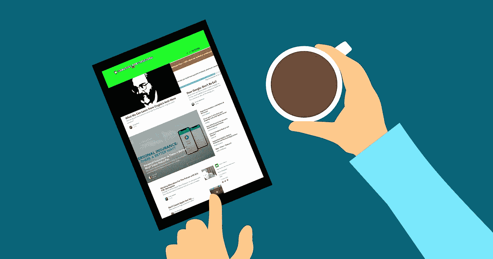
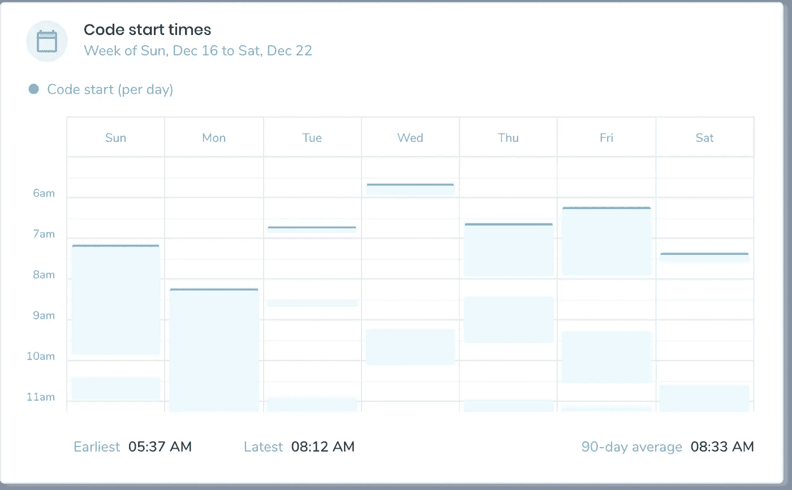

# 工作日优化:尽可能早地编写代码

> 原文：<https://medium.com/hackernoon/work-day-optimization-write-code-as-early-as-you-can-c6da1e57bafd>

你的第一个工作时间是花在[代码](https://hackernoon.com/tagged/code)上，还是浪费在查看你的待办事项清单和回复懈怠信息上？

我经常发现，完成一天中最重要的任务花的时间越长，一天结束时完成的任务就越少。

我最喜欢的博客帖子之一是“[火与运动](https://www.joelonsoftware.com/2002/01/06/fire-and-motion/)”——乔尔·斯波尔斯基公开承认，作为一名程序员，他曾有过感觉效率低下的日子。斯波尔斯基在博客中写道:

> 一旦你进入心流，保持下去就不会太难。我的许多日子都是这样度过的:(1)开始工作(2)查看电子邮件、浏览网页等等。(3)决定我还不如在上班前吃午饭(4)吃完午饭回来(5)查看邮件、阅读网页等。(6)最终决定我必须开始了(7)查看邮件，浏览网页，等等。(8)再次决定我真的要开始了(9)启动该死的编辑器(10)马不停蹄地写代码，直到我没有意识到已经是晚上 7:30 了。

然后他解释了在他什么也做不了的日子里会发生什么:

> 在第 8 步和第 9 步之间的某个地方，似乎有一个 bug，因为我不能总是跨越那个鸿沟。**对我来说，刚刚起步是唯一困难的事情。**

当我第一次读他的博客帖子时，我想，哇，听到连创建 Trello *和* Stack Overflow 的人都在拖延真是太好了！世界上最有生产力的开发人员之一也有一事无成的时候！与我们不同的是，当斯波尔斯基在 2002 年写这篇文章时，他不必处理消耗我们今天生活的不间断的 Slack、Instagram、脸书和 Twitter 通知。

我最喜欢的部分是斯波尔斯基在这篇文章中分享的一个简单的见解:“也许这是提高效率的关键:刚刚开始。

*刚刚入门*。答案会这么简单吗？早点开始编码？

斯波尔斯基的话是一个重要的提醒，我们应该更加注意我们进行创造性工作的最佳时间——对我们许多人来说，这是早上的第一件事。

这就是为什么我们在 Software.com[建立了一个机制来跟踪我们每天开始编码的时间。](http://www.software.com)

Coding early can help us take advantage of our mornings.

我们需要长时间不受干扰地进入状态，所以保护我们的时间不受干扰以帮助我们度过更有效率的早晨是很重要的。了解团队的时间也很重要，尤其是如果你是经理的话。

例如，我的一个队友是一个早起者，通常在早上 5:30 到 9:00 之间开始编码，所以我尽量不在空闲时间给他发消息或者安排会议。

我相信个人和团队都可以采取“代码第一”的心态来提高生产力，通过有意识地保护自然的专注时间，把代码时间放在会议和其他活动之前。

当然，编码不应该与深思熟虑的设计和架构、良好的团队沟通或整体代码质量相冲突，但是尽早编码是我们应该遵循的好习惯。