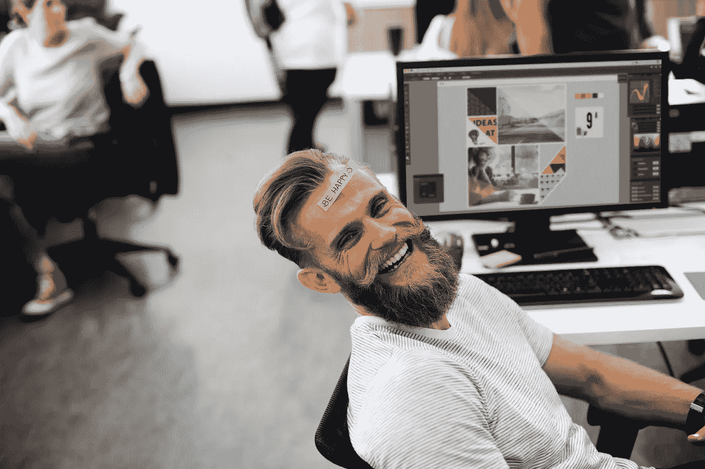

# 面向技术人员的工作生活平衡与健康

> 原文：<https://medium.com/hackernoon/work-life-balance-wellness-for-techies-ab0aef29ae80>

[Photo Source](https://www.pexels.com/photo/adult-chill-computer-connection-450271/)

对于任何工作来说，激情和要求表现出色的压力都会导致你过度劳累。这对于那些经常坐在电脑前从事技术工作的人来说尤其困难。除了因加班而产生的典型压力和疲惫之外，这类工作通常所处的环境也会导致眼睛疲劳、颈部和背部问题以及心脏问题。

有时，工作的要求会变得过高，会影响健康和工作效率。这里有一些改善工作生活平衡和整体健康的建议——特别为技术人员和 IT 工作者量身定制。

# 让你的眼睛休息一下

根据哈佛健康出版社的一份报告，长时间盯着电脑会导致[电脑视觉综合症](https://www.health.harvard.edu/diseases-and-conditions/electronic-screen-alert-avoid-this-vision-risk)。这导致了两个主要问题。第一种是干眼症，由缺乏眨眼引起。报告指出，当你专注于电脑时，你每分钟眨眼的频率会减少一半以上，从正常的每分钟 15 次眨眼减少到只有 5 次或 7 次。

第二个问题是眼睛疲劳。这可能是由于屏幕的亮度或耗尽了眼睛的聚焦能力。幸运的是，有一些简单的方法可以缓解你的眼睛，包括:

*   全天使用人工泪液
*   专注于更频繁地眨眼
*   为你的眼睛戴上正确的处方

此外，该报告指出，你可以通过在日常生活中纳入以下一些技巧来防止眼睛干涩和疲劳:

*   坐在离屏幕大约两英尺远的地方
*   将您的显示器放在比眼睛低 4 到 8 英寸的地方
*   使用哑光屏幕滤镜来减少眩光
*   使用更大的字体
*   降低亮度

另一件要考虑的事情是让你的眼睛多休息一下。许多技术人员可能会在一整天的电脑工作后回家，花更多的时间在屏幕前。也许你有一个个人技术项目，或者你只是想看电视放松一下。虽然这很好，但你也应该试着培养一些不涉及屏幕的爱好或消遣。

你可以尝试的一些事情包括去散步，和朋友出去，涂颜色，用手写出东西，和你的宠物玩耍，等等。这可以帮助你实现[更好的工作生活平衡](https://hackernoon.com/finding-work-life-balance-in-a-digital-age-69c8b2a55ef9)，保持眼睛健康。

# 充分休息

获得充足的休息听起来可能是显而易见的，但许多技术领域的人仍然没有得到足够的休息。然而，优先考虑休息是很重要的，因为这是实现身心健康的基础。这对于技术人员来说尤其重要，因为他们所做的工作经常需要长时间集中注意力，这可能会让他们精疲力尽。每晚睡眠充足可以帮助大脑充电，为第二天再次出发做好准备。

此外，[睡眠的好处几乎影响到你生活的每一个方面,](https://www.visionbedding.com/blog/8-things-can-get-good-night-sleep)“充足的睡眠改善身体表现、认知功能和体重管理。持续、高质量的睡眠也有助于情绪健康，这就是为什么一个人从令人满意的睡眠中醒来后会感觉如此丰富。”

作为你工作生活平衡的一部分，你可以在睡觉前一个小时把屏幕收起来。这样，你可以放松大脑，休息眼睛，也有更好的机会睡一整夜。

# 腾出时间照顾自己

过度劳累会导致一系列额外的健康问题。如果你长时间压力过大，你可能会筋疲力尽。为了防止这种情况发生，请留意[倦怠的症状](https://bostitchoffice.com/articles/protect-small-business-from-burnout)，包括:

*   焦虑
*   愤怒
*   抑郁
*   乏力
*   失眠
*   食欲下降
*   扭曲浓度
*   身体问题
*   疾病

如果你开始注意到自己身上的这些症状，你应该把它作为一个信号，为自己腾出更多的时间。解决这个问题的一个方法是给自己放一天假，让自己好好照顾自己。无论你是在周末休假还是休假，你都可以尽情享受这一天。这可能包括睡懒觉和看电视，在外面呆一天，休息一天不看手机，等等。

度过自我保健日的一个很好的方式是让自己享受水疗日。你可以洗个放松的澡，如果你一直在拖延的话，去理个发，或者做个按摩。你也可以[使用精油来帮助你放松](https://blog.planttherapy.com/blog/2018/08/07/5-essential-oils-for-headaches/)，比如薰衣草、薄荷和甘菊——特别是用来缓解工作时的头痛。使用精油的两种方法是使用扩散器将精油释放到空气中，或者将滚涂精油直接涂抹在皮肤上来舒缓肌肤。

实现工作与生活的平衡对每个人来说都不一样，这对你的健康和幸福至关重要。即使你对工作充满热情，你也需要能够放下工作，有自己的时间。这不仅会提高你的生活质量，也会提高你的工作效率。