# 2018 年表现最差的 10 种加密货币

> 原文：<https://medium.com/hackernoon/worst-10-performing-cryptocurrencies-of-2018-4ff6a533fb3c>

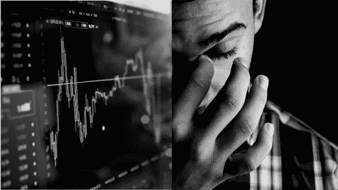

2018 年随着每一种加密货币达到其 [ATH](/being-passionate/a-glossary-of-all-the-cryptocurrency-terms-you-need-to-know-66b2d6f998ba) 价格而轰轰烈烈地开始，以大多数加密货币意想不到的暴跌而结束。导致[山寨币](https://www.investopedia.com/terms/a/altcoin.asp)价格消亡的主要因素之一无疑是比特币价格的下跌趋势。显然，2018 年可以被称为区块链历史上“密码崩溃”的一年。相反，如果我们考虑到多年来比特币价格的年度低点，比特币交易对霍德勒来说仍然是有利可图的。

即使在这种负面的市场情绪中，cryptos 的技术发展如[【瑞波】](https://ripple.com/press-center/)【创】【TRX】等。不时成为头条新闻，提醒人们 ICO 时代尚未结束。

在这篇文章中，我们考虑了至少一年前的货币。在计算百分比时，我们考虑了它们今年的高点和 2018 年 12 月 31 日的收盘价格。我们还提到了他们今年的最低价。尽管比特币和以太坊没有进入前十名，但仍然出现了值得一提的大幅下跌。

# [**比特币(BTC)**](https://bitcoin.org/en/)

自从 2017 年 12 月的**到月球**之旅(加密货币市场的辉煌时代，比特币的 ATH 价格几乎触及 20，000 美元)以来，这一旅程一直在恶化，达到 3156 美元的一年低点(根据币安交易所的数据)。今年以来，比特币价格已经暴跌了约 **77.94%** 。

高:17527.30 美元

低价格:3156 美元

**收盘价格:$** 3865.95

**百分比下降:** 77.94%

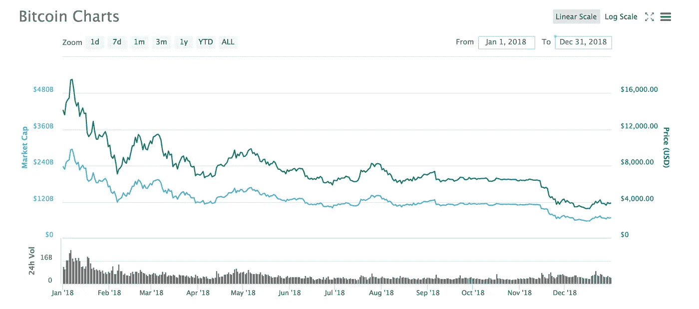

Source: [https://coinmarketcap.com/currencies/bitcoin/](https://coinmarketcap.com/currencies/bitcoin/)

**比特币日均价值变化期间:**
2010 年:+0.82%
2011 年:+0.76%
2012 年:+0.26%
2013 年:+1.11%
2014 年:-0.25%
2015 年:+0.09%
2016 年:+0.22%
2014 年

数字不言自明，2018 年可以被称为比特币迄今为止最糟糕的一年。即使在这样的喧嚣和哭泣中，几乎每个人都在为加密货币和 ico 叫屈，但约翰·迈克菲已经证明是一个真正的信徒，他预测到 2020 年比特币的价格将达到 100 万美元。

# [以太坊](https://ethereum.org/)

以太坊是全球市值第二大的加密货币。其开发人员友好的平台使得构建和部署分散式应用程序(DApps)变得更加容易。维塔利科对彭博的采访，他在采访中宣布加密技术的指数增长时代已经结束。他说

> *这个领域的任何东西都不再有再增长 1000 倍的机会。*

这一评论进一步推动以太坊暴跌至 100 美元区间。尽管他在推特上解释了他的评论，但伤害已经造成了。

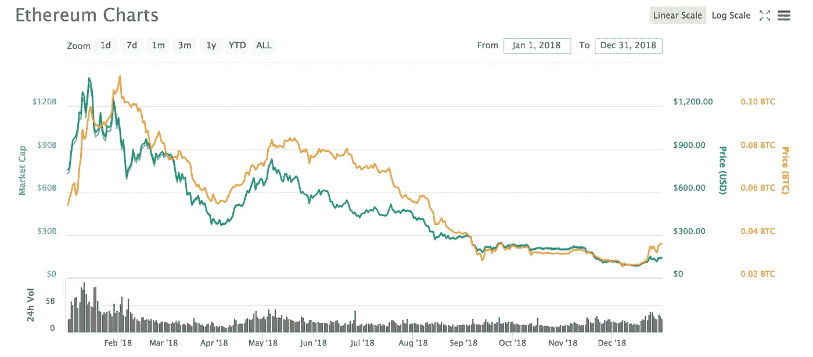

Source: [https://coinmarketcap.com/currencies/ethereum/](https://coinmarketcap.com/currencies/ethereum/)

**高价:$** 1397.48

低:84.66 美元

收盘价格:$ 139.86

**百分比下降:** 89.99%

# **1。**[**【Qtum】**](https://qtum.org/en)

Quantum 是一个公共区块链平台，它利用了比特币 UTXO 协议的简单性和安全性，同时增加了智能合约的便利性和灵活性。这个混合区块链应用平台的建立是为了开发移动 DApps(去中心化应用)市场。2018 年，Qtum 恰好是表现最差的加密货币。

**高位:$** 94.07

**低点:$** 1.48

收盘价格:2.31 美元

**百分比下降:** 97.54%

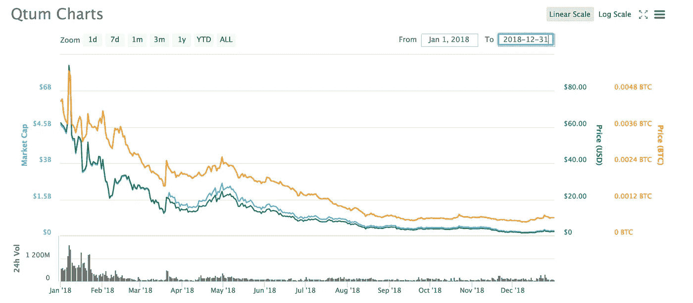

Source: [https://coinmarketcap.com/currencies/qtum/](https://coinmarketcap.com/currencies/qtum/)

# 2.[卡尔达诺(阿达)](https://www.cardano.org/en/home/)

与以太坊类似，Cardano 是一个可扩展的安全智能合约平台，由以太坊的联合创始人之一 Charles Hoskinson 提出概念。

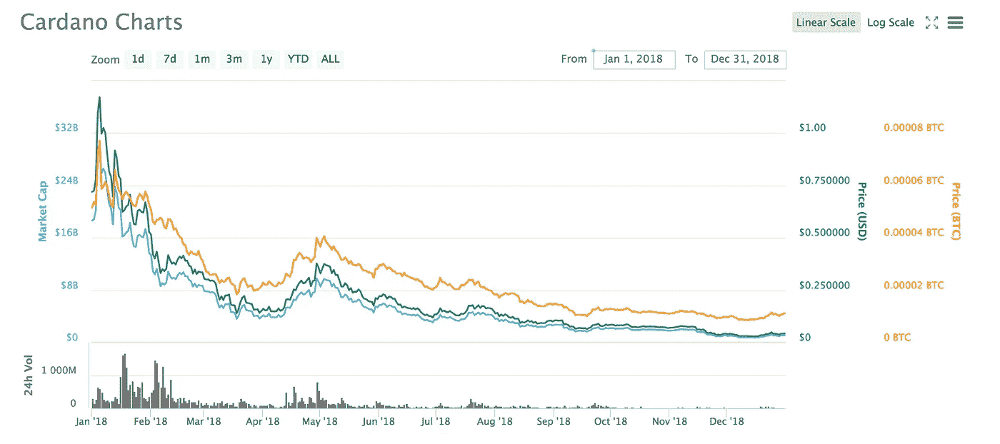

Source: [https://coinmarketcap.com/currencies/cardano/](https://coinmarketcap.com/currencies/cardano/)

**高位:$** 1.17

**低点:$** 0.027

收盘价格:$ 0.043

**百分比下降:** 96.32%

# 3.[纽姆(XEM)](https://nem.io/)

Nem 的智能资产区块链系统允许企业为真实世界的使用案例构建应用程序。

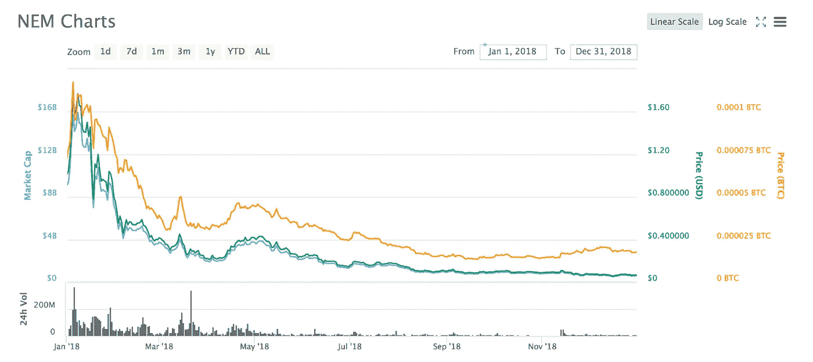

Source: [https://coinmarketcap.com/currencies/nem/](https://coinmarketcap.com/currencies/nem/)

**高位:$** 1.84

**低点:$** 0.057

**收盘汇率:$** 0.068

**百分比下降:** 96.30%

# 4.[尼奥(NEO)](https://neo.org/)

Neo 以前被称为 Antshares，是数字资产、数字身份和智能合同的聚合，从而为世界构建智能经济。在 2017 年从 Antshares 重新制作后，Neo 的成名成为了交易界的一个讨论点。在其推出的最初几天，回报率高达 50 倍。2018 年第一季度，ATH 价格为 187.97 美元。从那里开始，这是一个下降的道路，今年结束时，在 **$** 7.53。

Source: [https://coinmarketcap.com/currencies/neo/](https://coinmarketcap.com/currencies/neo/)

**年内高点:$** 187.97

年内低点:$5.53

**收盘价格:$** 7.53

**从年内高点下降的百分比:** 95.99%

# 5.[利斯克(LSK)](https://lisk.io/)

Lisk 成立于 2016 年初，是一个**侧链开发平台**，允许开发者用 javascript 创建 DApps。它还允许他们部署一个侧链链接到利斯克区块链。

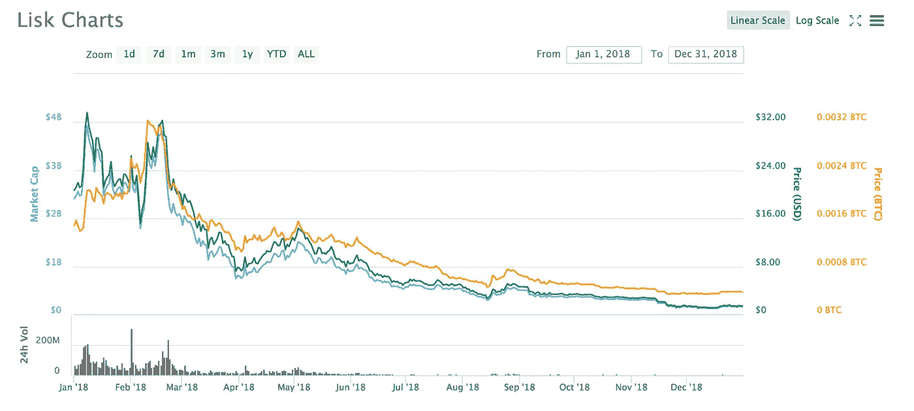

Source: [https://coinmarketcap.com/currencies/lisk/](https://coinmarketcap.com/currencies/lisk/)

高:33.59 美元

**低:$** 1.10

收盘汇率:$ 1.46

**百分比下降:** 95.65%

# 6. [OmiseGo (OMG)](https://omisego.network/)

Omisego Network 主要在泰国使用，它讨论了如何破坏当前世界各地的支付网络系统。它的座右铭是**取消银行账户**意味着金融包容性。它是建立在以太网基础上的下一代金融网络，提供实时透明的点对点交易。

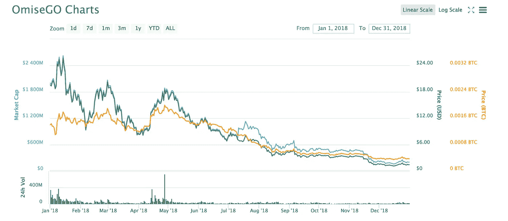

Source: [https://coinmarketcap.com/currencies/omisego/](https://coinmarketcap.com/currencies/omisego/)

高:25.72 美元

**低点:$** 1.09

**收盘汇率:$** 1.42

**百分比下降:** 94.48%

# 7.比特币现金(BCH)

比特币现金于 2017 年发布，是由[罗杰 Ver](https://medium.com/u/6d5e25448edf?source=post_page-----4ff6a533fb3c--------------------------------) 支持的比特币的叉币。这是比特币核心软件的升级版，使用起来更快、更便宜、更可靠。比特币现金今年收于 163.62 美元，遭遇了 **-94.34%** 的暴跌。事实上，比特币现金面临着比特币现金 ABC (BCHABC)和比特币现金 Satoshi Vision (BCHSV)的又一次艰难分化。

**高:$** 2891.55

**低点:$** 76.52

收盘价格:$ 163.62

**百分比下降:** 94.34%

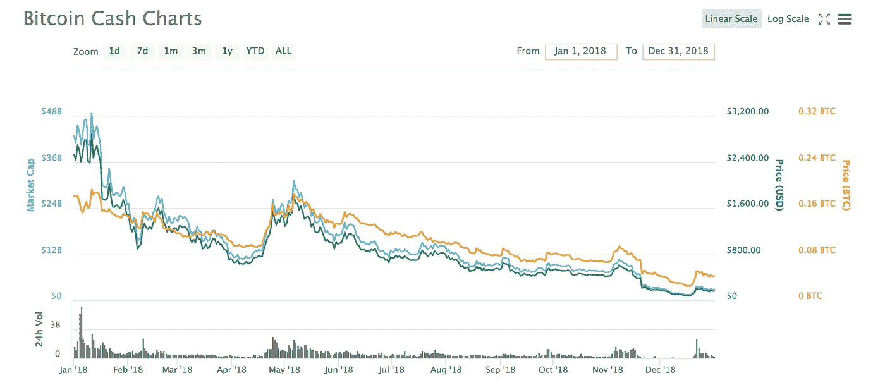

Source: [https://coinmarketcap.com/currencies/bitcoin-cash/](https://coinmarketcap.com/currencies/bitcoin-cash/)

# 8.[破折号(DASH)](https://www.dash.org/)

基于比特币框架，数字现金(Digital cash)也称为 Dash，它使使用加密货币进行网上购物变得更容易，因为它可以实现更快和更私人的交易。它重视客户的财务隐私。

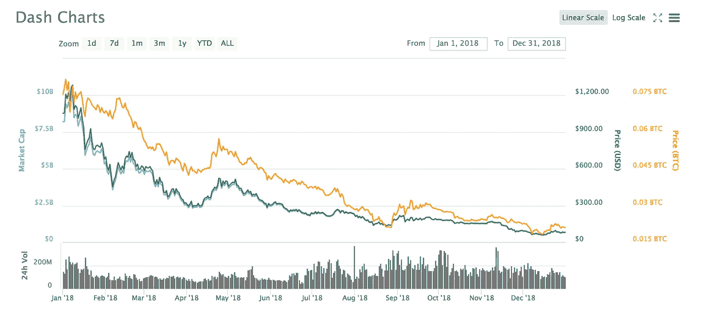

Source: [https://coinmarketcap.com/currencies/dash/](https://coinmarketcap.com/currencies/dash/)

**高位:$** 1283.36

**低点:$** 58.47

**收盘汇率:$** 81.79

**百分比下降:** 93.62%

# 9.[莱特币](https://litecoin.org/)

litecoin 于 2011 年推出，是一个分散的全球支付网络，旨在提供即时支付。交易速度是比特币网络交易的 4 倍。就像比特币只有 8400 万莱特币可以开采。莱特币的开发者称之为**银对比特币的**金。

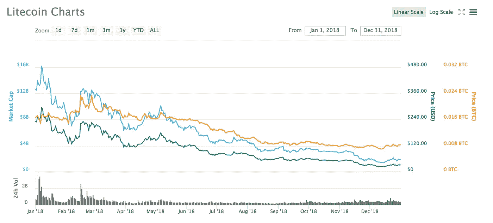

Source: [https://coinmarketcap.com/currencies/litecoin/](https://coinmarketcap.com/currencies/litecoin/)

**高位:$** 300.49

低:22.97 美元

**收盘价格:$** 31.98

**百分比下降:** 89.36%

# 10.[恒星(XLM)](https://www.stellar.org/)

stellar 由 Jed McCaleb 于 2014 年创立，像 ripple 一样促进跨境支付。恒星网络推出的加密货币是流明(XLM)。

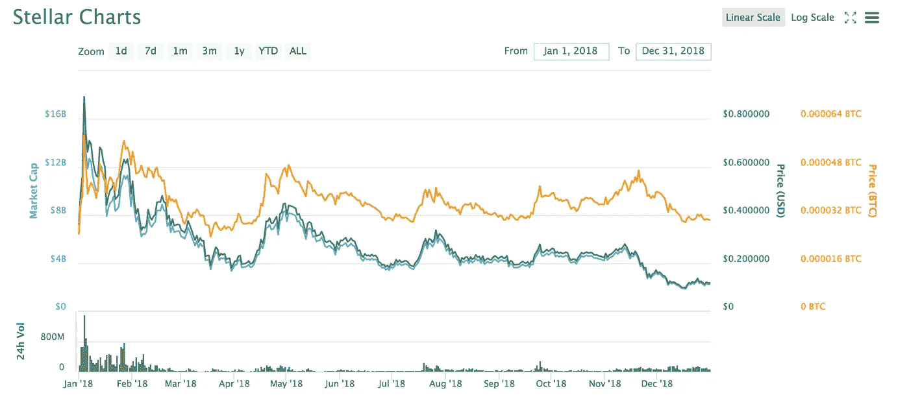

Source: [https://coinmarketcap.com/currencies/stellar/](https://coinmarketcap.com/currencies/stellar/)

**高位:$** 0.892

低:0.093 美元

收盘价格:0.117 美元

**百分比下降:** 86.88%

# 前方的路

加密时代的终结还远未到来。2018 年的 crypto crash 告诉我们，迫切需要遏制导致价格如此波动的**泵送和倾倒**等不当行为。随着机构投资者、sto(安全令牌)和多个国家加密货币合法化的出现，crypto 还有很长的路要走。