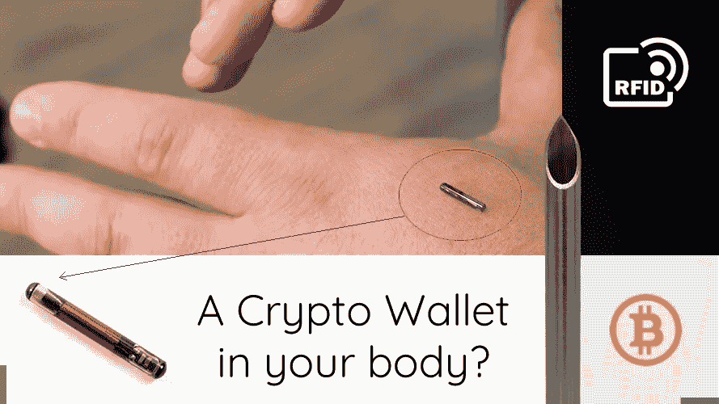

# 你会在体内植入加密货币钱包吗？

> 原文：<https://medium.com/hackernoon/would-you-implant-a-cryptocurrency-wallet-in-your-body-857149c0f188>

## 你在服务台刷过你的手，立刻你就支付了你的商品。这是一个潜在的选择，面对那些在销售点已经同意皮下植入想法的个人。

这里已经有一个规模虽小但正在成长的“人体黑客”社区，他们对这些皮下植入物和其他人体增强技术(HET)的想法持开放态度。这个不断发展的领域旨在融合技术世界和人体。

皮下植入是将 RFID(射频识别)芯片植入皮下的过程。再加上你的比特币钱包的私钥，你就有了一个现成的支付选项，这是**不可能丢失的**。

> *把加密货币钱包作为你身体的永久附属品，你会舒服吗？*
> 
> *如果这也可以扩展到包括紧急响应信息或护照信息呢？*

加密货币正试图彻底改变世界数字支付系统；然而，先进技术在销售点的实施落后于这一部门取得的进展。“非接触式”支付提高了销售点的速度；然而，这是由维萨(Visa)和万事达(Mastercard)等成熟的传统支付处理器主导的。

如果加密货币要发表领养声明，*皮下植入会是那种声明吗？我认为，在现阶段，尽管它很新颖，而且可能是革命性的，但它会成为大规模采用的障碍。这是因为这将被认为是第一次大规模实施超人类技术的真正尝试，这在全球社会中引起了强烈的分歧*。我想问的是，这是否会是一个反乌托邦，像《1984》一样朝着错误的方向前进？*

Is implanting a cryptocurrency chip like something out of ‘1984’ by George Orwell?

让我们看看健康问题。首先，皮下加密货币钱包会与其他被接受的植入物(如节育)有显著区别吗？它的大小和形状大致相同；然而，有些人会说，他们最担心的是电子通讯。第二，这种外来的电物体长期储存在你体内会有什么长期影响？这需要大量的研究，目前测试案例有限。

目前可供个人使用的可植入技术非常有限，只能容纳少量数据，并且交互性有限。芯片很小，很容易插入。你可以把你的私人钥匙安全地存放在一个不可能丢失的“冷钱包”里。这确实是将你作为一个人与你的经济地位联系起来的最安全的方式。价值储存不再是与人分离的东西，*皮下植入将人和经济地位紧密结合*。

“人体黑客”社区正在变得越来越大，他们的一些曾经被认为是科幻小说的想法正在变成现实。想要挑战极限是人的天性，而与人体接口的技术组合太方便了，不容忽视。

*感谢阅读*。我管理着一家即将在澳大利亚推出的数字货币交易所。在 www.easycrypto.com.au 的[查看我们，或者如果您在新西兰，我们已经在](http://www.easycrypto.com.au) [www.easycrypto.nz.](http://www.easycrypto.nz.) 运行

*就个人而言，我不会在现阶段考虑皮下植入。