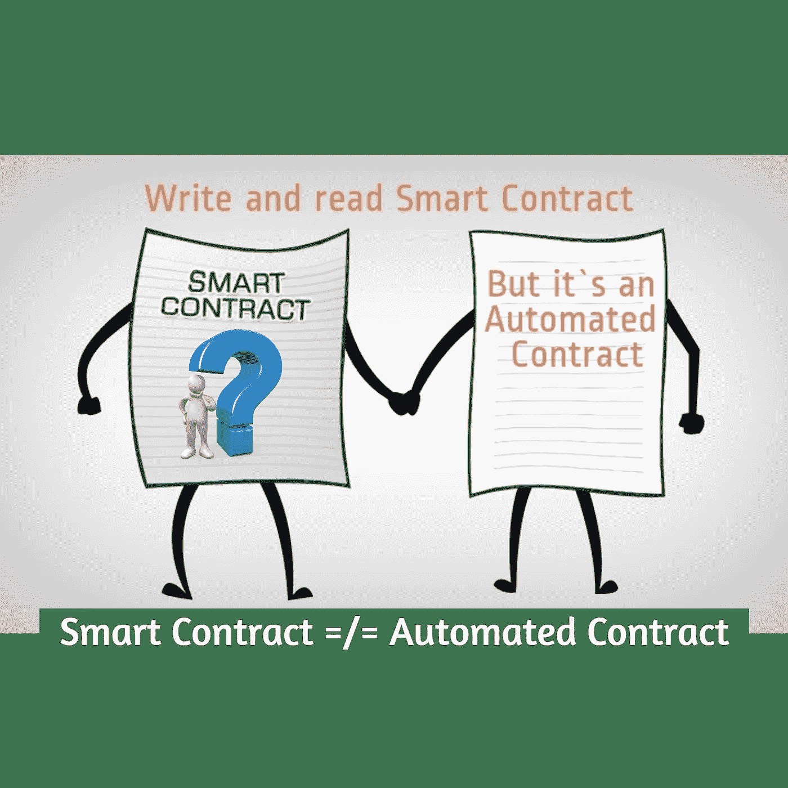
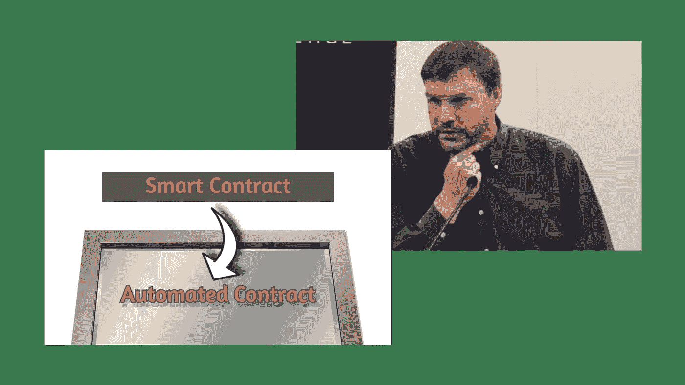
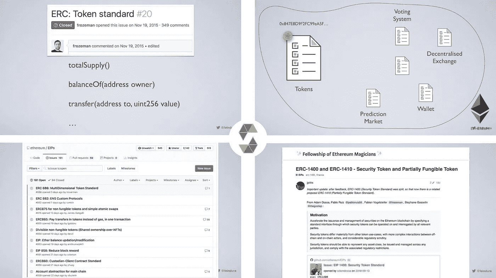

# 写和读“智能合同”，但它是一个“自动化合同”

> 原文：<https://medium.com/hackernoon/write-and-read-smart-contract-but-it-s-an-automated-contract-c2325d634a77>

智能合约最大的成就是在区块链技术的帮助下，它们只能独立运行自己的初始代码。因为不可能有人干预和篡改功能或交易结果。但不管怎么说，这些契约并不一定有智能或聪明的概念。

这篇文章的作者是索马耶赫·戈拉米和迈赫兰·卡泽米尼亚

Smart Contract Vs. Automated Contract

作为一个聪明人的名声与这些合同的现实不相称，也不是一个恰当的名称。它们最好的名字可能是自动化合同，因为这些合同不一定是智能的，但肯定是自动化的！

根据初始代码，这些合同在注册并部署到区块链后自动工作，任何人，甚至合同的所有者或开发者，都不能对其初始代码或功能进行丝毫更改。这可能是这些合同的主要特征，为了传达这一概念，使用“自动化合同”的标题是合适的，因为聪明或智能不是这些合同的主要标准。

# 聪明的发明家，自动化的发明

Nick Szabo 先生在 90 年代后期提到了“智能合同”的概念。你可以在他 1997 年的文章 中读到他关于 [*这个主题的结论。与此同时，智能合约开发者直到 2014 年才能开始工作(直到以太坊网络在 2014 年开始工作)。因为这些合同与区块链技术公司合作。当然，在以太坊之后，也推出了其他区块链来开发智能合约。*](https://firstmonday.org/ojs/index.php/fm/article/view/548/469)

智能合同是模拟传统或经典合同的计算机程序。他们可以交换自己的加密货币或特殊令牌。此外，对于每个合同，定义一个帐户或钱夹，称为“合同钱夹”。其编码的一部分是合同钱包和用户之间(或合同钱包和其他合同钱包之间)交换的条件和方式。

智能合约可以在一些区块链网络上注册。这些合同在发射后将是不朽的。这意味着，只要区块链工作，原始智能合同以及所有交易和交换的全部细节都将持续、永久地存储和维护在区块链网络上。这些契约永远有效，只是根据原始的契约代码，任何人，甚至是所有者或开发者都不能对程序的代码进行丝毫的更改。

Nick Szabo

像尼克·萨伯或维塔利克·布特林这样的人肯定是聪明人！但是他们的研究成果，即区块链平台上的自动合同，并不总是明智的。因此,“智能合同”的名称与这些合同的实际情况并不相称。然而，如果我们不能或不想改变这些契约的名称，至少我们获得了对这些契约的正确认识。

在许多情况下，分散式网络比集中式网络更受限制。例如，随机函数在 Solidity 语言中不存在，因为 EVM 以太坊虚拟机要求智能合约中的完全确定性，但所有这些技术原因并没有阻止在必要情况下使这些合约智能化的努力。甚至开发者都在致力于区块链和人工智能技术的相互服务，并取得了一些成果，或者……然而，需要注意的是，今天和以往，许多已经在区块链网络上注册和部署的合同，他们并不聪明或智能，也可能不需要！这就是为什么“智能合约”的标题不应该让开发者和用户产生误解。

# 不聪明的聪明合约！

在以太坊区块链推出后，开发者们非常兴奋，他们只需要写一份智能合同就可以创建代币，而不需要专用的区块链网络。以太坊网络支持这些代币的交易，一切都为最初的硬币发行(ICO)这一伟大的冒险做好了准备。出于这个原因，第一个也可能是最大数量的智能合约是为生产令牌和推出 ICO 而编写的。

智能合约的一个不智能的例子！也许， [*ERC-20*](https://theethereum.wiki/w/index.php/ERC20_Token_Standard) *标准*自 2015 年末以来已被许多公司用于在以太坊网络上生成令牌。该标准包括六个主要功能:

*totalSupply()公共常量返回*

*balanceOf(address tokenOwner)公共常量返回*

*allowance(地址令牌所有者，地址花费者)公共常量返回*

*transfer(address to，uint tokens) public returns*

*批准(地址支出者、uint 令牌)公共回报*

*transferFrom(address from，address to，uint tokens)公共返回*

ERC-20 >> Token standard

如果您熟悉 [*Solidity 编程语言*](https://solidity.readthedocs.io/en/v0.4.25/) 及其功能，您也确认上述标准不能作为令牌生成器契约的 smart 或 intelligence 的结构。更确切地说，函数是确定性的和非智能的。当然，如果我们想把智能合约假定为 smartness，我们必须把所有或大部分计算机程序都称为“智能”！

许多智能合约仅提供上述所有功能的方法体，并不具有特定的智能特性，但它们都是自动化的，并且在注册和部署它们之后，它们根据初始代码永久地继续它们的活动，而不涉及任何人为因素。

我们的讨论到此结束，我们渴望收到您的评论。

[网站](https://www.soliset.com/) | [推特](https://twitter.com/SetSoli) | [电报](https://t.me/soli_set)