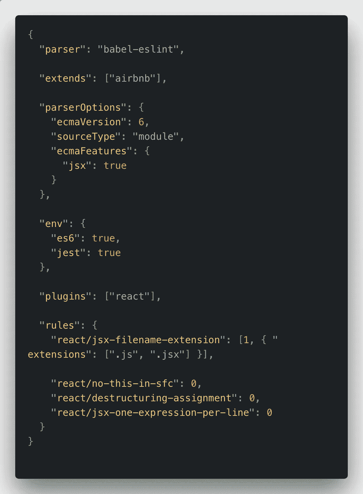
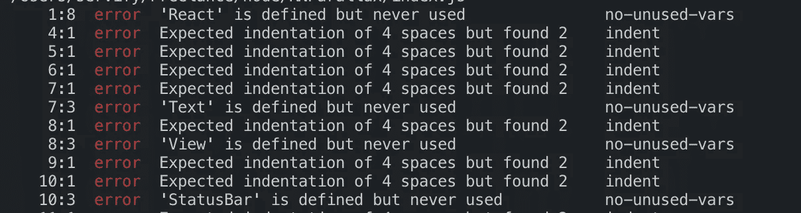
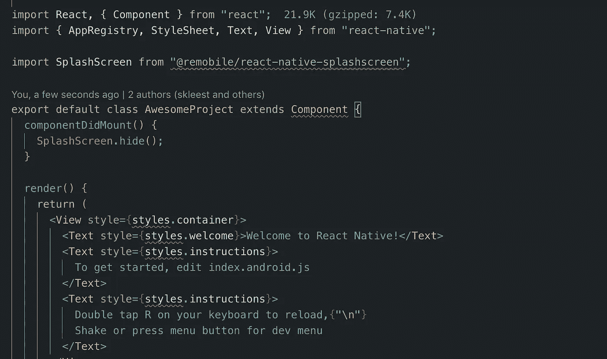

# 使用 ESLint、appellister 和 VSCode 编写漂亮且一致的 JavaScript 代码

> 原文：<https://medium.com/hackernoon/write-beautiful-and-consistent-javascript-code-using-eslint-prettier-and-vscode-760837fdef89>

## 让你的 JS 代码和团队保持一致


Photo by [Markus Spiske](https://unsplash.com/@markusspiske?utm_source=medium&utm_medium=referral) on [Unsplash](https://unsplash.com?utm_source=medium&utm_medium=referral)

正确的代码样式和格式对于每个项目都是必须的，当有多个开发人员在同一个代码库上工作时更是如此。由于遵循 ECMA 标准的 JavaScript 增加了如此多的内容，并且执行同一任务有不同的方法，所以在您的项目中需要有统一的标准来选择。你可以在网上找到关于选择什么的建议，但是仍然没有严格的规则来规定使用什么。例如，对于基于范围的变量，您可以选择使用`var`而不是 JavaScript 的新的`let`关键字来创建变量。因此，由你来为你的项目制定规则，以便团队中的每个开发人员都遵守这些规则，并且你的所有代码都是一致的。这就是代码林挺发挥作用的地方。

## 什么是棉绒？

linter 是一个程序，它分析你的源代码中可能的编程和样式错误。不同的语言有不同的短绒。ESLint 是 JavaScript 的缩写。因为 JavaScript 是一种解释语言，所以在运行应用程序之前指出编程错误是非常有用的。下面是 ESLint 将捕获并向您报告的一个编程错误:

```
let myFunction = () => {};
myFuction(); // A typo causing error at runtime
```

对于样式错误，ESLint 允许您设置特定于项目的规则。如果您在编写代码时偏离了这些规则，ESLint 会向您报告。要查看 ESLint 支持的所有规则，请点击以下链接:

[](https://eslint.org/docs/rules/) [## 可用规则列表

### 一个可插入和可配置的 linter 工具，用于识别和报告 JavaScript 中的模式。维护您的代码…

eslint.org](https://eslint.org/docs/rules/) 

> 嘿，那不是我来的目的，我已经想要 ESLint 设置了。

## 设置 ESLint 非常简单。

首先我们需要安装 ESLint 作为一个开发依赖:
`npm install eslint --save-dev`

接下来，我们为我们的项目初始化 ESLint:
`./node_modules/.bin/eslint --init`
然后会问你几个关于配置 ESLint 的偏好的问题，最后会生成`.eslintrc`。
如果您对问题不确定，可以跳过这一步。相反，只需手动创建`.eslintrc`。

至此，您的项目已经有了一个可运行的 ESLint 设置。默认的 ESLint 配置使用来自`eslint:recommended` 配置的规则。不过在我看来还有更好的替代方案: [eslint-config-airbnb](https://github.com/airbnb/javascript/blob/master/packages/eslint-config-airbnb/README.md) 。

Airbnb 已经基于 [Airbnb JavaScript 风格指南](https://github.com/airbnb/javascript)创建了一套预定义的 ESLint 规则。对于所有 JavaScript 开发人员来说，这是一个非常有用的资源，它试图为良好的 JS 实践建立一个共同的基础。他们对他们所做的每一个决定都进行了推理，并给你一个理解的机会。要开始安装以下 npm 软件包作为开发依赖项:

```
// For react projects
babel-eslint
eslint-config-airbnb
eslint-plugin-import
eslint-plugin-jsx-a11y
eslint-plugin-react//For non react projects
babel-eslint
eslint-config-airbnb-base
eslint-plugin-import
```

接下来你需要编辑你的`.eslintrc`来扩展 Airbnb 配置。您的配置应该是这样的:



还要注意，您仍然可以编写自定义规则，通过在`rules`块中指定它们来覆盖 Airbnb 配置规则。

现在 ESLint 已经为你的项目设置好了，你可以通过运行这个命令 Lint 你的文件:`./node_modules/.bin/eslint [fileName]`，它会给你一个类似如下的输出:



太好了！现在，您可以在项目中拥有一致的代码，并遵守您所设置的规则。但是我们也讨论了正确格式化的代码，在哪里？

## 进来，漂亮点

漂亮是一个固执己见的代码格式化程序，它有预定义的代码格式化和缩进规则。要在你的项目中使用更漂亮的，运行下面的命令:
`npm install --save-dev prettier`

这将使您能够访问更漂亮的 CLI，您可以通过一个命令来检查和执行自动格式化:
`./node_modules/.bin/prettier --write [fileName]`
该命令将在文件上运行更漂亮，并重新格式化代码。很方便，不是吗。只需确保您之前的所有更改都已保存，因为该命令直接写入文件。

关于 pretty 的另一个好处是，它可以配置为与 eslint 一起使用，其中它使用 eslint 规则进行代码格式化，当我们在文件上运行 ESLint 时，我们可以看到文件中的 pretty 格式化错误。

**使用带有 ESLint** 的 Prettier 首先您需要安装以下 npm 包作为开发依赖项:

```
eslint-config-prettier
eslint-plugin-prettier
```

接下来我们需要配置 ESLint 来使用 prettier，所以我们对`.eslintrc`做了必要的修改，在这种情况下，我们只需要将`"plugin:prettier/recommended"`添加到 extends 块中。结合我们之前的配置，最终的扩展块将如下所示:

```
"extends": ["airbnb", ""plugin:prettier/recommended""]
```

现在，你将得到包含在 ESLint 错误中的更漂亮的错误。上述设置与编辑器无关，不需要使用扩展。

我们已经走了很远，使我们的代码一致和美丽。但是，如果你注意到了，这个过程是没有效率的。我们必须通过终端对每个文件运行 ESLint 和 prettier。对于 ESLint 错误，我们需要修复错误并再次运行 ESLint 进行验证。这就是为什么我们有文本编辑器，而 VSCode 是其中最好的一个。

## vs 效率代码

VSCode 为 ESLint 和 Prettier 提供了扩展，无需 CLI 即可自动完成整个过程。首先安装这两个扩展:

[](https://marketplace.visualstudio.com/items?itemName=dbaeumer.vscode-eslint) [## ESLint - Visual Studio 市场

### Visual Studio 代码扩展——将 ESLint JavaScript 集成到 VS 代码中。

marketplace.visualstudio.com](https://marketplace.visualstudio.com/items?itemName=dbaeumer.vscode-eslint) [](https://marketplace.visualstudio.com/items?itemName=esbenp.prettier-vscode) [## 更漂亮的代码格式化程序- Visual Studio 市场

### 现在就去拿。

marketplace.visualstudio.com](https://marketplace.visualstudio.com/items?itemName=esbenp.prettier-vscode) 

当您重新启动 VSCode 并完成上述 ESLint 和 Prettier 的设置时，您应该能够看到奇迹发生了。ESLint 错误现在可以在编辑器中直接看到，而不需要通过终端运行命令。



您可以将鼠标悬停在红线上，查看错误是什么。更好的是，您可以查看 VSCode 中的 Problems 面板来获得文件中出现的所有错误的详细信息。


漂亮的作品也开箱即用。只需按`cmd + shift + P`打开 VS 代码命令框，点击格式化文档，你就有美化的代码了。另一个有用的附加功能是保存时自动格式化。点击`cmd + ,`打开 VSCode 设置，将这一行添加到工作区设置:`"editor.formatOnSave":true`
现在每次保存文件都会自动美化。

> 难以置信！现在，您已经轻松高效地拥有了漂亮且一致的代码。