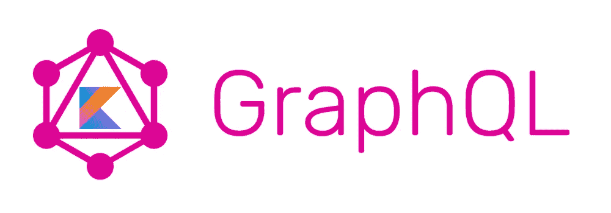
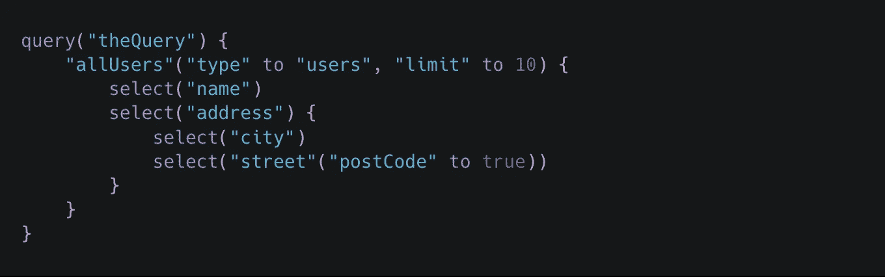
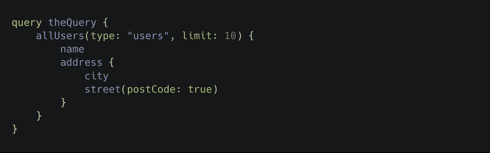
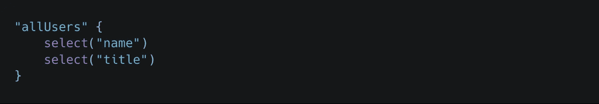
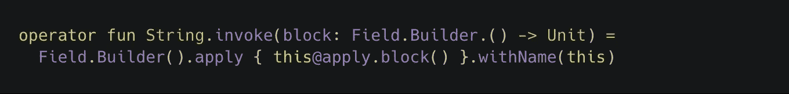
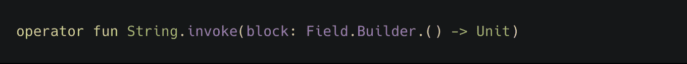
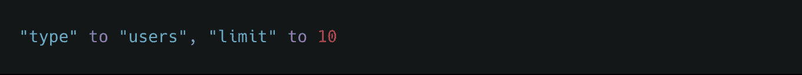
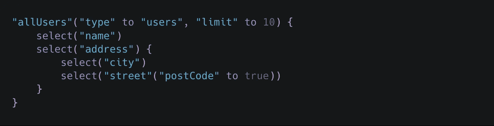
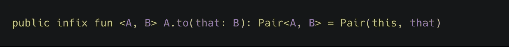
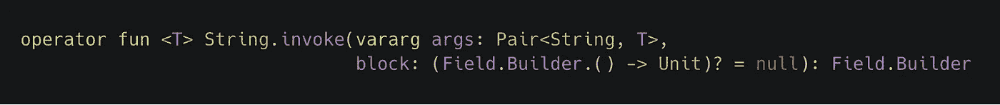

# 用 Kotlin 编写 GraphQL 领域特定语言(DSL)

> 原文：<https://medium.com/hackernoon/writing-a-graphql-dsl-in-kotlin-4a74e55e2c49>

我最近花了一些时间针对几个查询测试了一个 GraphQL 端点。目前，我将我的查询保存为多行字符串，但是我想知道:

> *用 Kotlin 构建一个 GraphQL 查询 DSL 会有多难？*

我认为这是一个更熟悉 Kotlin DSL 功能的好机会。

这是我目前掌握的情况。

A GraphQL DSL in Kotlin

上面的代码片段会产生以下结果:

The GraphQL resulting from the DSL

到目前为止，我面临的主要挑战是支持:

*   用作查询根字段的任何字符串(例如`"allUsers"`)
*   字段的嵌套选择
*   字段参数的类似 map 的语法(目前我已经满足于使用`[to](https://kotlinlang.org/api/latest/jvm/stdlib/kotlin/to.html#to)`方法)

# 任何字符串都是一个字段

从上面的例子可以看出，可以使用一个字符串开始根字段声明，后跟字段选择:

多亏了对[调用操作符重载](https://kotlinlang.org/docs/reference/operator-overloading.html#invoke)的支持，我才做到了这一点。请继续阅读，了解我是如何实现它的。

# 拯救世界

极其强大的[扩展支持](https://kotlinlang.org/docs/reference/extensions.html)帮助我在`String`上定义自己的`invoke`实现。

String.invoke overload

这样，通过将一个块传递给`invoke`操作符`()`，任何字符串实例都可以变成一个`Field.Builder`。此外，Kotlin 的紧凑语法使我们不必显式地使用左括号和右括号，从而使结果更具可读性。

# 选择子字段

在声明的根字段中，一系列的`select`指令通知当前的字段构建器我们对哪些子字段感兴趣。实现这一点的方法是让编译器知道我们在一个`Field.Builder`的上下文中，并且块中指定的任何方法都必须根据它进行解析。多亏了带有接收者的*函数文字，这才成为可能。*

# 带接收器的函数文字

这可能是 Kotlin 在构建 DSL 时提供的最有用的特性。

块参数已被声明为`Field.Builder.() -> Unit`。
从文件中我们可以看到:

> *[…] Kotlin 提供了* [*调用函数类型的实例*](https://kotlinlang.org/docs/reference/lambdas.html#invoking-a-function-type-instance) *的能力，receiver 提供了* receiver 对象*。*
> 
> [*带接收方的函数文字—科特林引用*](https://kotlinlang.org/docs/reference/lambdas.html#function-literals-with-receiver)

这意味着我可以调用当前的`Field.Builder`实例作为接收者的`block`,导致`select`调用被解析。

# 字段参数

当谈到指定字段参数时，我不得不满足于这种不太好的语法。

我仍然认为这是一个很好的妥协，因为 Kotlin 在地图构建语法方面并没有提供太多。

允许这样做的 to 方法来自标准库。

注意，`[infix](https://kotlinlang.org/docs/reference/functions.html#infix-notation)`关键字允许简化符号`receiver method argument`。

最后，`String.invoke`稍微复杂一点的定义接受`Pair<String, T>`的实例，允许在指定字段参数时使用`*to*`语法。作为左类型的显式字符串类型有助于使它更加健壮。

# 包扎

如你所见，我不是 DSL 专家(根本不是！)但这是一个有趣的实验。你可以在[graph QL-forger](https://github.com/alediaferia/graphql-forger)repo 跟踪我的工作。请随意提出问题或请求。

我希望你喜欢这篇文章，并对科特林有所了解。

*原载于 2019 年 3 月 18 日*[*alediaferia.com*](https://alediaferia.com/2019/03/18/writing-graphql-dsl-kotlin/)*。*