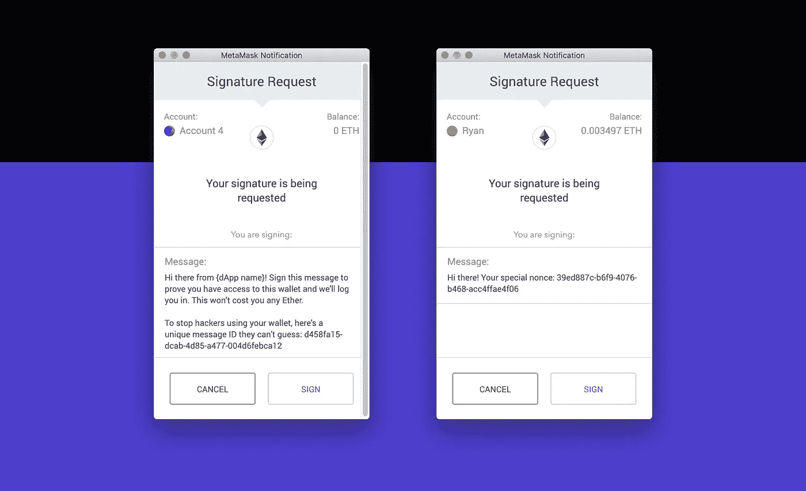
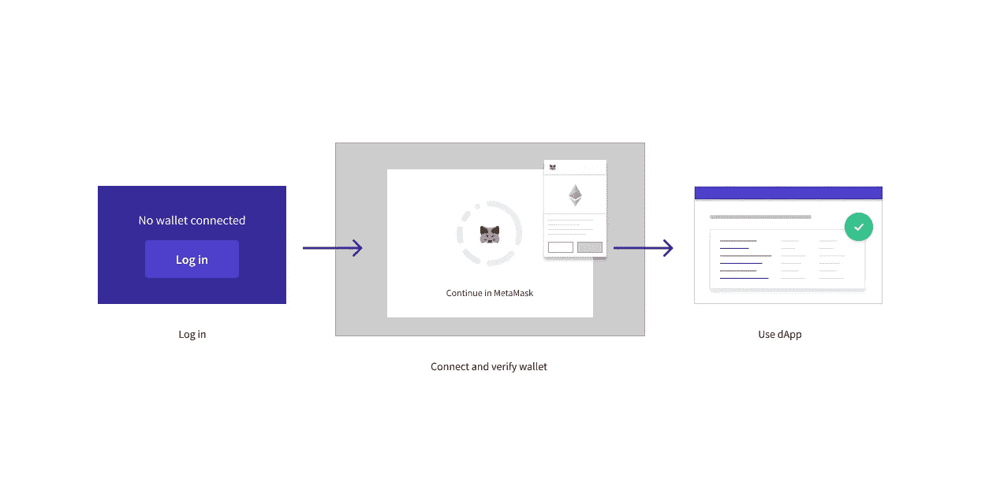
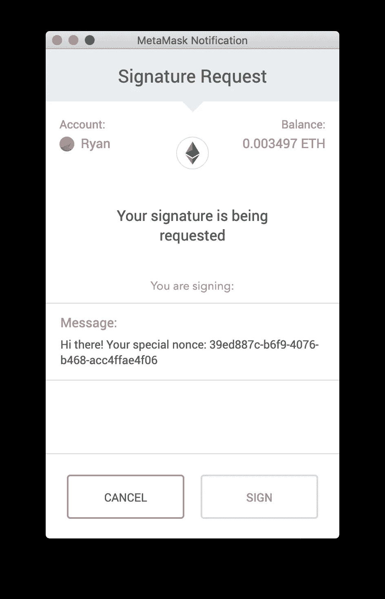
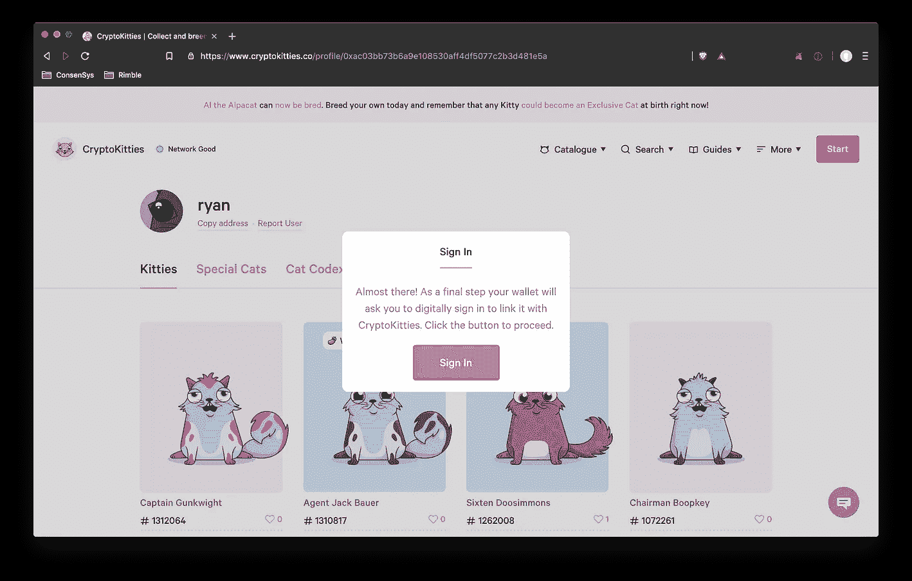
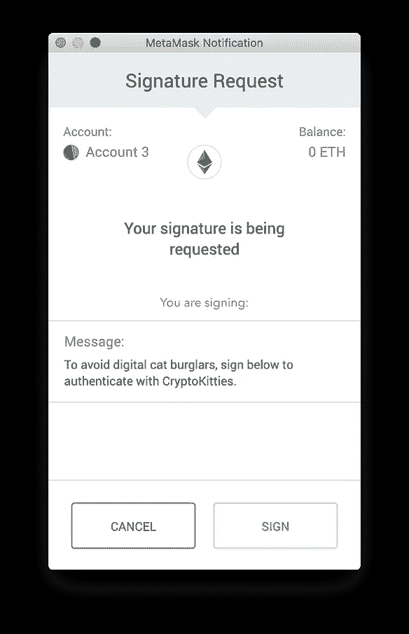
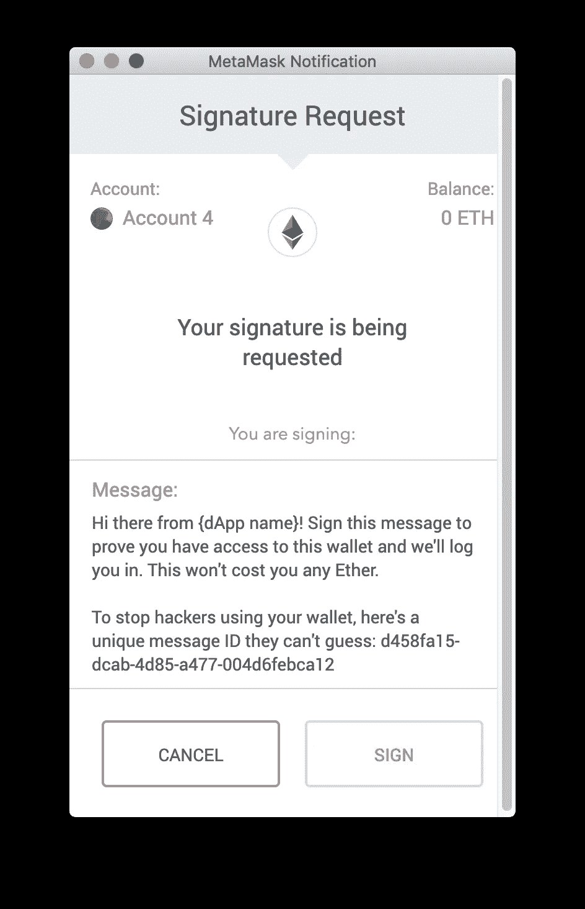

# 为区块链写作:钱包签名请求消息

> 原文：<https://medium.com/hackernoon/writing-for-blockchain-wallet-signature-request-messages-6ede721160d5>



## 问题#1 —什么，为什么，什么？钱包签名请求

如果你对区块链空间的设计问题感兴趣，这篇文章是为你准备的。如果你的团队中没有作家，或者你想提高你的区块链产品在 UX 的知名度。如果你在考虑让你的产品进入比现有的、精通技术的区块链社区更多的人手中的挑战。或者以上所有情况。

我是 Ryan，在[开始使用 dApps 时，钱包签名请求是您首先遇到的一些事情。它们是分散式“登录”过程的关键部分。](https://medium.com/u/6c7078bf7b01#1 </strong>:我将在登录或访问以太坊区块链上的 dApp 的上下文中讨论签名请求消息，而不是当它们用于验证智能合约交易时(稍后将会介绍)。</p></blockquote><p id=)

[对于一些 dApps，你需要的只是一个钱包来访问它。没有账户，没有用户名，没有密码，根本没有 dApp 存储的个人数据！很多时候，您可以通过事后添加数据来增强体验，但这不是 access 的先决条件。](https://medium.com/u/6c7078bf7b01#1 </strong>:我将在登录或访问以太坊区块链上的 dApp 的上下文中讨论签名请求消息，而不是当它们用于验证智能合约交易时(稍后将会介绍)。</p></blockquote><p id=)

[](https://medium.com/u/6c7078bf7b01#1 </strong>:我将在登录或访问以太坊区块链上的 dApp 的上下文中讨论签名请求消息，而不是当它们用于验证智能合约交易时(稍后将会介绍)。</p></blockquote><p id=)

[The simplified process: log in -> Connect and verify wallet -> Use dApp](https://medium.com/u/6c7078bf7b01#1 </strong>:我将在登录或访问以太坊区块链上的 dApp 的上下文中讨论签名请求消息，而不是当它们用于验证智能合约交易时(稍后将会介绍)。</p></blockquote><p id=)

[你的钱包是你去区块链派对的门票。它允许您访问网站的区块链功能。](https://medium.com/u/6c7078bf7b01#1 </strong>:我将在登录或访问以太坊区块链上的 dApp 的上下文中讨论签名请求消息，而不是当它们用于验证智能合约交易时(稍后将会介绍)。</p></blockquote><p id=)

[因此，举例来说，如果你前往](https://medium.com/u/6c7078bf7b01#1 </strong>:我将在登录或访问以太坊区块链上的 dApp 的上下文中讨论签名请求消息，而不是当它们用于验证智能合约交易时(稍后将会介绍)。</p></blockquote><p id=)[奖金网络](https://explorer.bounties.network/explorer)，你可以立即浏览奖金(人们愿意在 crypto 中支付的任务)。但要外包或兑现一笔赏金，你需要与区块链有联系，因为它们是通过巧妙的合约完成的，不需要中间人。要连接到区块链，您只需使用钱包登录即可。

这就是为什么我们在登录 dApp 时会收到签名请求消息。它们本质上是一种安全预防措施，有点像你在网上购物时有时会得到的银行验证模式。在一个去中心化的世界里，我们不需要银行。可以用钱包验证自己。所以 dApps 要求你在你的钱包里签署一条信息，以证明你有访问权，而不是有人用别人的钱包/资金进行欺诈。

*顺便说一句，我不确定签约是否是最好的类比。这听起来有契约性，很吓人，而且没有传统意义上的签名，但《区块链的隐喻》肯定是另一个时代的文章。*

不管你是否同意这个比喻，这个验证步骤的重要性是毋庸置疑的。然而，这些信息往往完全是胡言乱语，导致不必要的摩擦和混乱。



这往往是最后一步(跨栏？)登录，所以这很关键。我认为是时候我们开始更关心它说了什么。

# 签名请求消息的内容

> **警告#1** :从技术上讲，本文现在只关注[元掩码](http://metamask.io)。MetaMask 是一个扩展，允许您在 Chrome、Firefox、Brave 或 Opera 浏览器中放置钱包。我不能保证我提供的建议与其他技术兼容。
> 
> 警告#2 :一些 dApps 比其他的更加分散。有些只允许你通过钱包访问，有些则要求你将钱包与一个集中账户关联。尽管我主要关注的是前者，但我的建议也更广泛地适用于后者。

我在区块链工作的第一个月，花了很多时间用我的钱包登录 dApps。

理论上，你只需要安装 MetaMask 并创建你的钱包一次。从那里你可以用你的钱包登录许多 dApps。这其实是一个快速登录体验的好机会。你只需要签署一份数据就可以通过你的钱包进入了。然而，即使过了一个月，这仍然让人觉得有问题。我以前从未“签署过数据”。我需要一些背景，我迫切需要一些“为什么”或者至少“为了什么？”。好消息是，没有理由你不能提供这样的背景。

## 技术部分

在引擎盖下，签名请求是一个 dApp 发送一小段数据到钱包，并要求用户进入钱包并签名说他们已经收到它。

这些数据可能看起来像:`d458fa15-dcab-4d85-a477-004d6febca12`

*有道理吗？*

经过一番调查(多亏了[这篇教程](https://www.toptal.com/ethereum/one-click-login-flows-a-metamask-tutorial)，我意识到这些数据可以被转化成**能够**理解的东西，并提供更好的用户体验。万岁！

`Personal_sign`是一种签名类型([实际操作](https://danfinlay.github.io/js-eth-personal-sign-examples/) —您需要安装元掩码)，允许您定制呈现给用户的消息。

在代码中，它看起来有点像这样…

```
handleSignMessage = ({ publicAddress, nonce }) => {
    return new Promise((resolve, reject) =>
      web3.personal.sign(
        web3.fromUtf8(`**I am signing my one-time nonce: ${nonce}**`),
        publicAddress,
        (err, signature) => {
          if (err) return reject(err);
          return resolve({ publicAddress, signature });
        }
      )
    );
  };
```

*我用粗体显示了您定制消息的位置。*

这将把字母和数字的随机组合转换成人类可以阅读的东西。

现在你只需要想好该说什么。

## 内容位

我相信正确地传达这一信息真的可以改善新用户和老用户的登录体验——而且是以一种非常便宜的方式。

以下是我的内容设计建议…

**不要只是在你的应用中预先解释** 你可能会想，我们的 dApp 中有一个屏幕。但是内容应该放在与上下文最相关的地方。这就是为什么你应该花时间来写你的元掩码消息——这是你的用户完成签名动作的地方。如果 MetaMask 通知自动弹出(有时会这样)，你的用户可能甚至不会阅读你的 dApp 屏幕。事实上，即使 MetaMask 没有自动弹出，他们也可能不会阅读它，尤其是在没有相关按钮或操作的情况下。当我们认为可以的时候，我们都喜欢跳过内容。

然而，也一定要在你的 dApp 中预先解释消息签名的概念。空间如此新颖，概念如此不同，过度解释可能是个好主意。当您要求用户签署邮件时，请确保您将用户引导到 MetaMask，它并不总是会弹出来。

**做人，对行话采取零容忍政策** Nonce 对普通用户没有任何意义。在英国是完全不同的意思😱。为什么不说“嗨”？即使他们与 MetaMask 互动，这仍然是你的品牌和产品的一个很大的空间。

**保持透明:解释为什么** 我在签署信息时最大的障碍是试图弄清楚我在做什么，为什么要这么做。这个领域有很多假设的知识。记住，没有人会因为你告诉他们一些他们已经知道的事情而放弃你的 dApp。但是想想有多少人在他们只想登录的时候，因为遇到可怕的加密散列或谈论随机数而放弃了。

*为什么他们需要签名:*证明钱包是他们的。

请记住，现实世界中的“签署”具有金融和法律内涵——这有点吓人。我认为这更像是签收货物，而不是合同上的东西。这是我在 dApp 中要求用户签署信息时提出的一点。

**直接** 邀请他们签名留言。这是你希望他们采取的行动，所以请他们签名。在你的信息和“签名”按钮之间创建一个链接，这样签名的作用就很明显了。

*签名会做什么:*证明他们有访问权限，然后让他们登录

**让你的用户知道这是免费的** 在区块链世界，每个链上事件(与区块链互动的交易)都需要手续费。签名请求是离线的，所以不会。用户可能一开始并不理解这一点，也不愿意连接到你的 dApp。要明确这不会给你的用户带来任何损失。

**确保安全** 仍然建议以原始形式包含部分数据。这样，如果攻击者知道以前的签名结果，他们就不能重用它。所以留着`${nonce}`。只要确保你解释了为什么你要包括一个随机的数据串——以保证他们的钱包安全和阻止黑客。

有创意
这是展示你的品牌风格或语气的好机会。看看 CrytpoKitties 就明白我的意思了。



Them pesky cat burglars… not the most secure example, but a fun one

# 这个建议是什么样的？

一条好的但通用的消息可能看起来像这样:

> 您好，这里是{dApp name}！签署此消息以证明您有权访问此钱包，我们将让您登录。这不会花费你任何乙醚。为了防止黑客使用你的钱包，这里有一个他们猜不到的唯一消息 ID:d 458 fa 15-DCA b-4d 85-a477–004 D6 feb ca 12



该消息的作用:

*   向用户寻址
*   使用人类语言，没有行话
*   重申消息来自谁
*   请他们签名并解释他们要签什么
*   根据他们的目标设定期望和框架信息:“通过这样做，你将登录”
*   解释了为什么
*   表明这不是财务问题
*   包括用于安全目的的随机数

或者换句话说……当面对这条消息时，**你的用户明白他们需要做什么，为什么需要这么做，以及接下来会发生什么**。

所有这些都包含在短短几行内容中。

我希望你尝试一下——我希望下次签名时能看到更多信息丰富、有帮助和人性化的信息。

非常感谢 MetaMask 的@danfinlay 回答了我的所有问题。感谢我的 Rimble 和 ConsenSys 团队成员为本文的早期草稿提供反馈

# 快速编辑

在更多的用户测试之后，我发现这个消息必须清楚地表明用户不必记住 nonce 或者写下来。如果你的听众不精通技术，那么删除任何关于黑客的内容也是值得的。

区块链很复杂，把它变简单就更复杂了。所以请让我知道你是否觉得这有用或者你是否发现了任何错误。

如果你有任何你想在未来的问题中涉及的领域，请在评论中留下，或者你可以通过 Twitter 上的 [@ryancreatescopy](https://twitter.com/ryancreatescopy) 联系我。