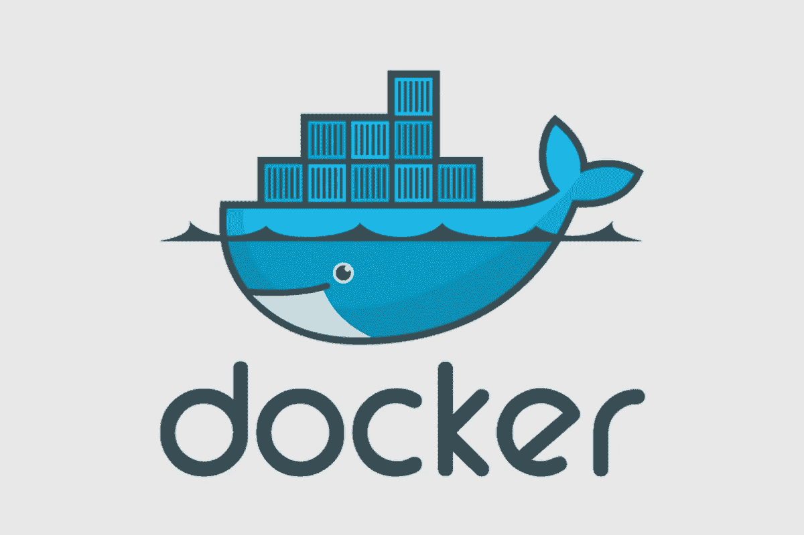
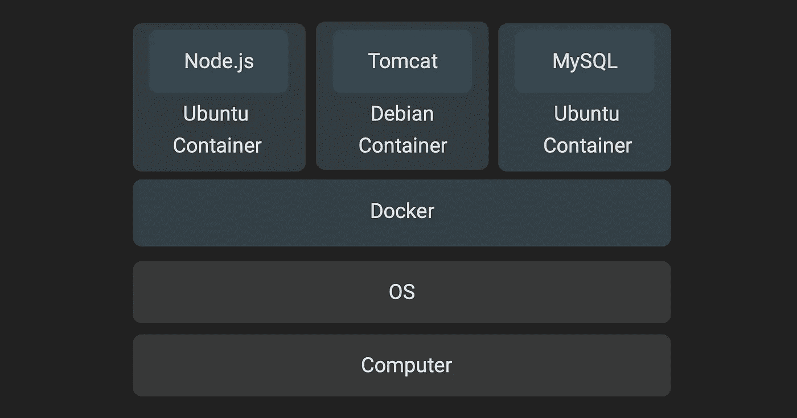
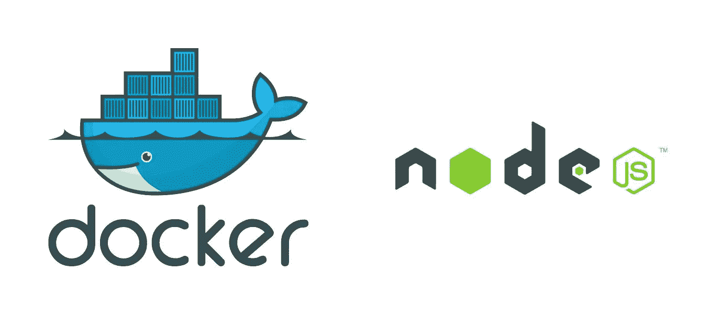

# WTF 是 Docker？

> 原文：<https://medium.com/hackernoon/wtf-is-docker-7e69e9f1a139>

## 简述英语中的 Docker 和 Docker compose

# 内容:

*   docker 是什么？
*   在 Docker 中部署 Node.js 应用程序
*   docker compose 是什么，如何使用？



# Docker 是什么？

Docker 是一个让你在*容器*中部署应用的工具。容器是轻量级的虚拟机。



你可以创建一个 linux 容器，在里面设置你的应用程序，并和其他人分享这个容器。

> 这就像共享一台已经安装并运行项目的笔记本电脑。

便携性是 Docker 的一个巨大优势。使用 Docker 还有其他几个好处。现在，让我们继续学习如何使用它。

# 在 Docker 中部署 Node.js 应用程序

让我们创建一个简单的 Node.js 应用程序，并将其部署在 Docker 中。



nodejs 站点有一个出色的[示例](https://nodejs.org/en/docs/guides/nodejs-docker-webapp/)，我将在这里遵循相同的步骤:

## 创建 Node.js 应用程序

1.  在新目录中，创建一个描述您的应用程序及其依赖项的`package.json`文件:

运行命令`npm install`来安装上面列出的依赖项。

2.使用 [Express.js](https://expressjs.com) 框架创建一个定义 web 应用的`server.js`文件。

app 准备好了，运行命令`npm start`运行。在浏览器中打开`[http://0.0.0.0:8080](http://0.0.0.0:8080)`查看你的应用。

## 将应用程序归档

1.  [安装码头工人](https://docs.docker.com/install/)🐳
2.  **创建一个名为**T5 的文件。这定义了您的容器。

这个文件里是怎么回事？

`FROM node:8` —这是基本图像。**图片**是一个容器的快照/蓝图。 ***一个正在运行的 docker 图像是一个容器。*** `node`镜像是安装了 node.js 和 npm 的`linux`镜像。

在这个 docker 文件中，我们使用了`node`图像，并对其进行了一些添加，以创建一个新的图像。

让我们来看看我们对节点图像所做的添加:

*   `WORKDIR /usr/src/app`:在镜像中创建一个名为 app 的文件夹，并设置为当前工作目录。
*   `COPY package*.json ./`:将您电脑(名为 **Docker host** )中的 package.json 和 package-lock.json 文件复制到镜像中的`./`文件夹中(在步骤 1 中设置为`/usr/src/app`)。
*   `RUN npm install`:这将运行图像中给定的命令。
*   `CMD npm start` : CMD 定义了从这个映像启动容器时运行的 entrypoint 命令。一个图像可以有多个`RUN`命令，但只有一个`CMD`。

现在你的形象已经定义好了，让我们来建立它。

**3。建立形象** 🛠 : `$ docker build -t node-app-image .`

该命令将从 [Docker Hub](https://hub.docker.com) 下载(拉取)图像，Docker Hub 是 Docker 图像的公共库( ***注册表*** )。

> 对于`Dockerfile`中的每一行，构建一个中间图像。在运行整个 docker 文件后，就创建了最终的映像。

您现在可以查看系统上的所有图像:

```
$ docker imagesREPOSITORY               TAG       IMAGE ID            CREATED
node                     8         2a3ba2f43d22        2 minutes ago
node-app-image           latest    53eeb30b855e        1 minute ago
```

4.**部署！！**🚀

运行镜像:`$ docker run -p 41122:8080 -d node-app-image`

容器的端口 8080 映射到系统的端口 41122，在浏览器中打开`http://localhost:41122`查看应用程序。

尝试这些命令:

```
# **List the running containers**
$ docker ps# **Print logs of a container** (use container id from above command)
$ docker logs 8473137bc8e1# **Go inside the running container**
$ docker exec -it <container_id> /bin/bash# Command to return outside: exit# **Stop a container**
$ docker stop <container_id># **List all containers** (including stopped ones)
$ docker ps -a# **Remove stopped container**
$ docker rm <container_id># **Remove an image**
$ docker rmi node-app-image
```

恭喜你！🎉 🎉 🎉

喘口气。以下是迄今为止你学到的东西:

1.  酷短语——容器、图像、注册表、docker hub、Dockerfile
2.  神秘艺术——如何写文档和创建图像。
3.  巫术——控制容器的咒语

现在你知道 WTF 是 Docker，让我们进行下一步:

# Docker 作曲 WTF？

Docker compose 用于处理许多容器。


假设你需要一个`mysql db`和`redis`以及`node.js`应用，你会怎么做？

*创建 3 个 docker 文件，构建 3 个映像并运行 3 个映像。—* 人类已经进化到超越这一点。

相反，创建一个文件`docker-compose.yml`:

现在运行`docker-compose up -d`并观察奇迹的发生。

`docker ps`将显示 3 个容器正在运行。

尝试这些命令:

```
# **Stop the entire stack** $ docker-compose stop# **Stop and remove all containers** $ docker-compose down# **Start a specific service**
$ docker-compose up -d redis
```

如果你的项目有多个容器，Docker compose 会让你的项目变得非常容易管理。

# 你成功了！！


Photo by [David Beatz](https://unsplash.com/@_davidgavi?utm_source=medium&utm_medium=referral) on [Unsplash](https://unsplash.com?utm_source=medium&utm_medium=referral)

欢迎来到码头工人的世界。

## 进一步阅读:

1.  编写 Docker 文件的最佳实践——这是一本很好的读物，它会告诉你更多关于 Docker 是如何工作的。
2.  官方 Docker 文档——一旦你了解了基本概念，它们会非常有用。