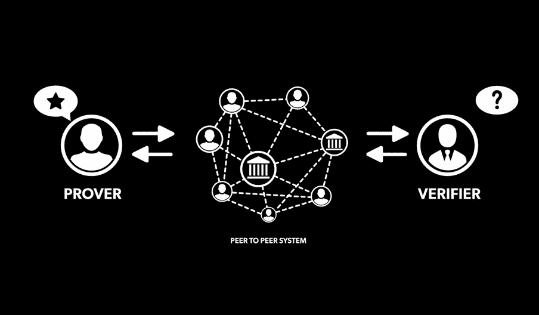
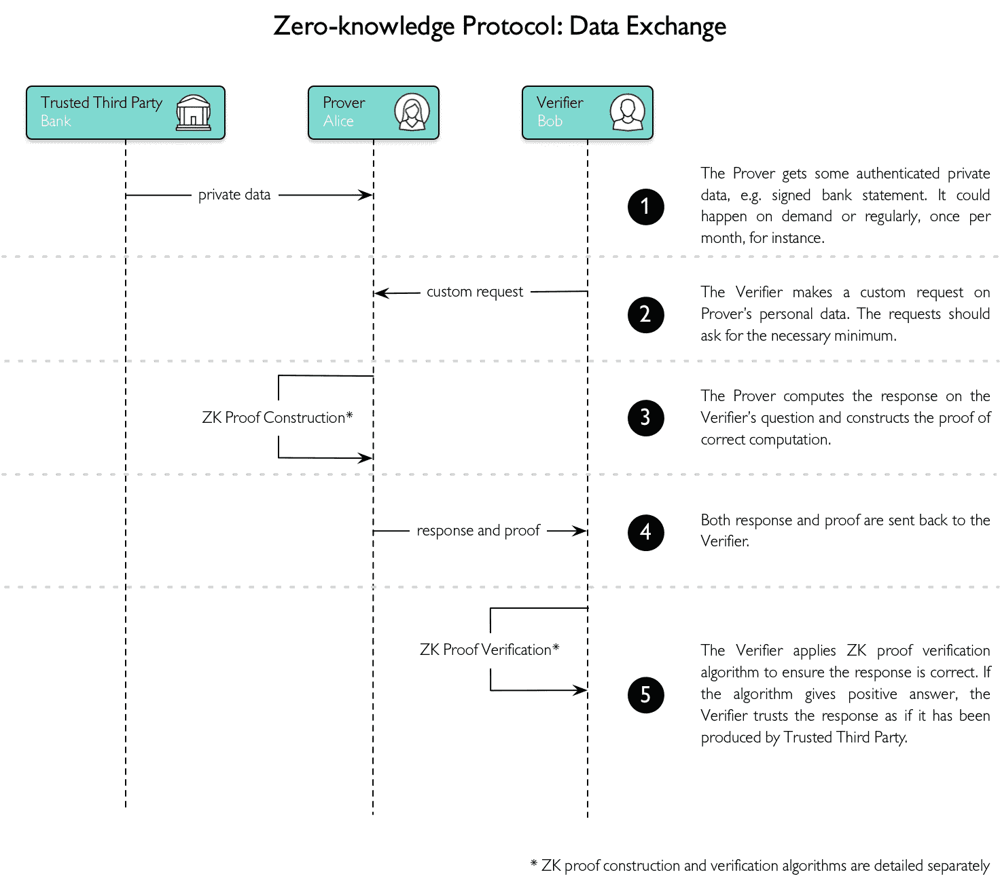
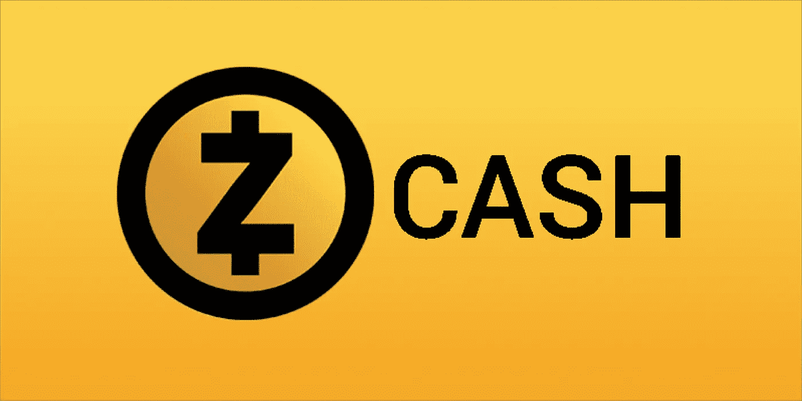

# WTF 是零知识证明

> 原文：<https://medium.com/hackernoon/wtf-is-zero-knowledge-proof-be5b49735f27>

## 另一个“WTF”帖子，在之前的帖子中我们谈到了区块链的 DApp。在这篇文章中，我试图解释神秘的零知识证明及其目前的应用

零知识证明或零知识协议是一种基于概率的验证方法，包括“类似事实的陈述”和“关于个人知识的陈述”。验证者基于一定的随机性询问证明者。如果给出了正确的答案，证明者很有可能拥有他声称的“知识”零知识证明可以验证你确实花了这笔钱，而不用透露花的是哪种货币。

> 在不知道用户是谁或者他们有多少钱的情况下，能够回答“一个用户有足够的钱给另一个用户吗”的问题，是区块链零知识证明的主要用例之一。— [德米罗·马塞西](/coinmonks/blockchain-zero-knowledge-proof-in-a-nutshell-f0684a669a68)

## **为什么重要？**

数据隐私是当今最重要的课题之一。保护与个人身份相关的个人数据(出生日期、银行对账单、交易历史、教育证书)至关重要，并且其重要性将会不断增加。在技术时代，我们正在产生前所未有的令人难以置信的大量数据，并且我们不断创造的关于我们自己的数据是公开的。像**谷歌**和**脸书**这样的大公司已经利用我们的数据成为主导当今世界的科技巨头。然而，最近密码学的突破和区块链的兴起为保护我们的数据和身份提供了一种新的方法，即使是来自我们与之互动的组织。**零知识证明**可能就是答案。

## **零知识证明的原理**

零知识证明(Zero-Knowledge Proof)是一种加密方案，最初由麻省理工学院的研究人员在 20 世纪 80 年代提出。零知识证明协议是一方(证明方)可以向另一方(验证方)证明某事为真的方法。除了这一具体陈述属实之外，没有披露任何其他信息。

例如，当前的网站将用户密码的哈希值存储在它们的 web 服务器中。为了验证客户端确实知道密码，目前大部分网站都采用对客户端输入的密码进行哈希处理，并与存储的结果进行比较的方法。

零知识证明可以保护用户帐户不被泄露。如果可以实现零知识证明，那么任何人都不知道客户端密码，但仍然可以认证客户端登录。当服务器受到攻击时，用户的帐户仍然是安全的，因为客户端的密码没有存储在 web 服务器中。

## **交互式零知识证明**

零知识证明协议的基础是交互性。它要求验证者不断地询问一系列关于证明者所拥有的“知识”的问题。

source: [Introduction to Zero Knowledge Proof: The protocol of next generation Blockchain](/coinmonks/introduction-to-zero-knowledge-proof-the-protocol-of-next-generation-blockchain-305b2fc7f8e5)

例如，如果有人声称知道一个数独谜题的答案，零知识证明是验证者随机指定按列、行或九个正方形进行验证。每个测试不需要知道具体的答案，只需要检测数字 1 到 9 是否包含在内。只要验证的次数足够多，就有可能相信证明者知道数独问题的解。然而，如此简单的方式并不能让人相信证明者和验证者都没有被证伪。在数独的情况下，两者可能是事先串通好的，让证明者在不知道答案的情况下通过验证。如果他们想要说服第三方，验证者还必须证明验证过程是随机的，并且不会向证明者泄露答案。因此，第三方很难验证交互式零知识证明的结果；需要额外的努力和成本来向多人证明一些事情。

## **非交互式零知识证明**

非交互式零知识证明，顾名思义，不需要交互过程，避免了合谋的可能性，但可能需要额外的机器和程序来确定实验的顺序。

例如，在数独游戏中，程序决定验证哪一列或哪一行。验证序列必须保密，否则，验证者可能在实际上不知道真实“知识”的情况下通过验证序列。

## **区块链上的零知识证明应用**

**比特币**和**以太坊**网络都使用公共地址代替当事人的真实身份，使得交易部分匿名；公众只知道发送和接收地址以及数量。然而，通过区块链上可用的各种信息，如交互记录，可以找出地址的真实身份，因此存在隐私暴露的隐患。

零知识证明、发送者、接收者和其他交易细节可以保持匿名，同时保证交易是有效的。

[***ZCash***](https://z.cash/technology/zksnarks)可能是最知名的成功实现零知识证明的区块链项目之一。Zcash 实现了 ZKP 的一个修改版本，称为 zk-SNARKS，代表“知识的零知识简洁非交互论证”。

## **zk-SNARK**

zk-SNARK 技术减少了证明的大小和验证它们所需的计算量。它能够证明有效交易的条件已经得到满足，而不会泄露有关所涉及的地址或价值的任何重要信息。

zk-SNARK 将需要验证的交易内容转化为两个多项式乘积相等的证明，结合同态加密等先进技术，在进行交易验证的同时保护隐藏的交易金额。其过程可以简要描述为:

1.  将代码分解成可验证的逻辑验证步骤，然后将这些步骤分解成由加、减、乘、除组成的算术电路。
2.  进行一系列变换，将待验证的代码转换成多项式方程，如 *t(x)h(x)= w(x)v(x)* 。
3.  为了使证明更加简洁，验证者事先随机选取几个检查点， *s* ，检查这些点上的方程是否成立。
4.  通过同态编码/加密，验证者在计算等式时不知道实际的输入值，但仍然可以验证。
5.  在等式的左侧和右侧，乘以不等于 0 的秘密值 k。在验证 *(t(s)h(s)k)* 等于 *(w(s)v(s)k)* 时，无法知道具体的 *t(s)* 、 *h(s)* 、 *w(s)* 、 *v(s)* ，因此可以保护信息。

当前 zk-SNARK 实现的一个缺陷是参数需要预先内置。如果这些参数被泄露，整个网络将面临毁灭性的井喷。因此，用户在使用这些网络时必须相信这些信息不会被泄露。

可能的解决方案包括使用现代的“可信执行环境”，如英特尔 **SGX** 和 **ARM TrustZone** 。对于英特尔的 SGX 技术，即使应用程序、操作系统、BIOS 或 VMM 遭到破坏，私钥也是安全的。此外，最近的一份白皮书揭示了它在零知识密码学方面的创新:**ZK-斯塔克斯**(零知识可扩展的透明知识论证)。

根据 [***zk-STARK 白皮书***](https://eprint.iacr.org/2018/046) 介绍，zk-STARK 是第一个不依赖任何信任设置实现区块链验证的系统，同时计算速度随着计算数据量的增加呈指数级加速。它不依赖于公钥密码系统，更简单的假设使它在理论上更安全，因为它唯一的加密假设是哈希函数(如 SHA2)是不可预测的。像零知识证明和 zk-S(T|N)ARK 这样的技术需要时间来检验和采用。