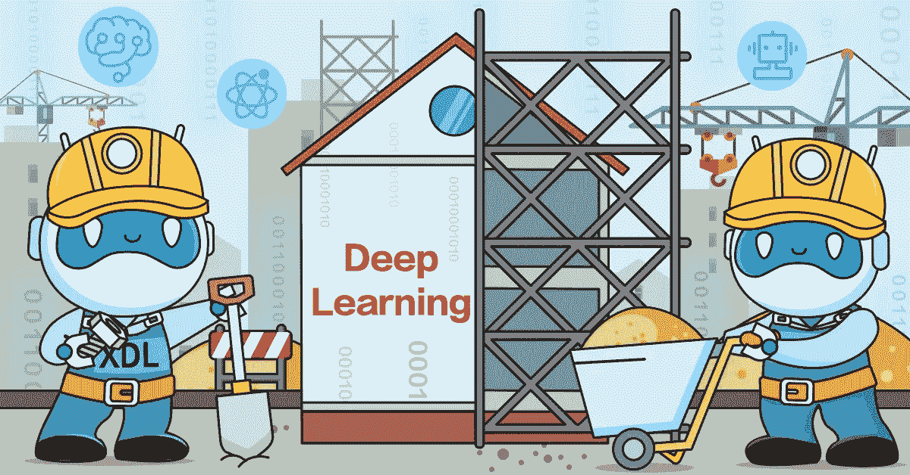
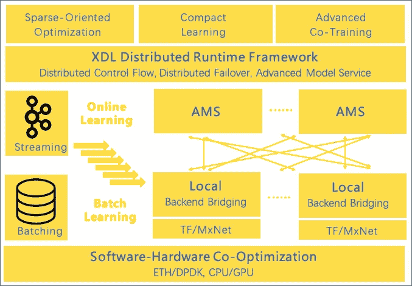
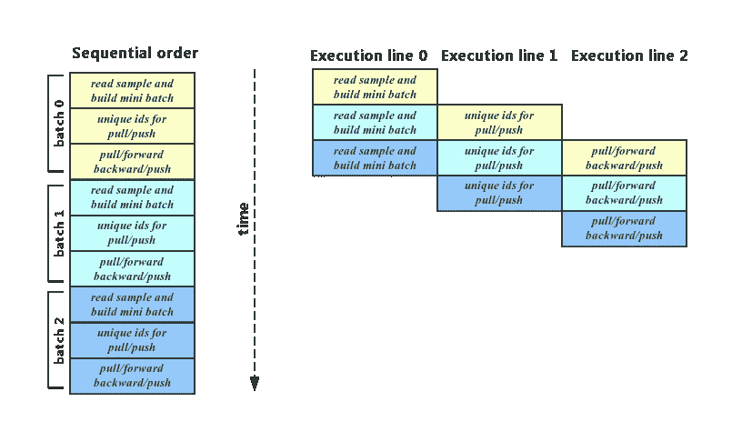
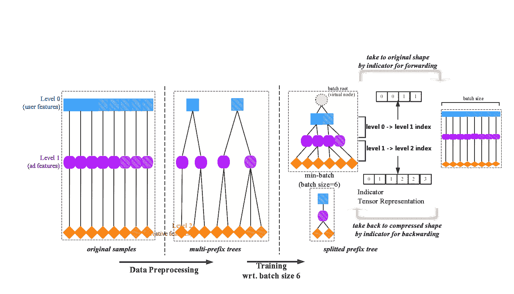
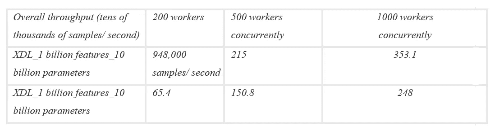
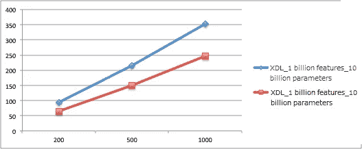
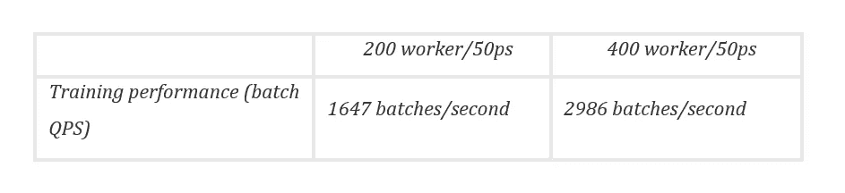
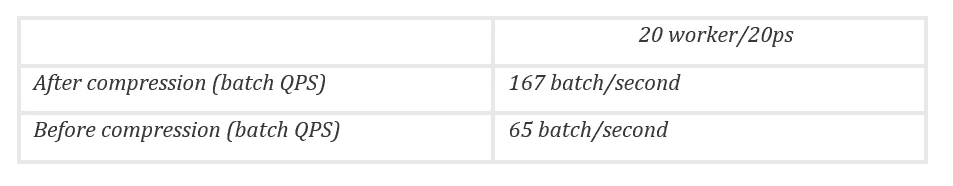

# XDL 框架:为大规模深度学习应用提供强大的性能

> 原文：<https://medium.com/hackernoon/xdl-framework-delivering-powerful-performance-for-large-scale-deep-learning-applications-3e45f1f7bc9a>

## 阿里巴巴科技团队开源了其自主开发的深度学习框架，该框架适用于其他人失败的地方

深度学习人工智能技术为语音识别、计算机视觉和自然语言处理等领域带来了显著的突破，其中许多发展都受益于开源深度学习框架的流行，如 TensorFlow、PyTorch 和 MxNet。然而，由于可用框架的不足，将深度学习引入大规模行业级场景(如广告、在线推荐和搜索场景)的努力在很大程度上失败了。

虽然大多数开源框架是为低维、连续的数据(如图像和语音)设计的，但大多数互联网应用程序处理的是异构数据，这些数据是高维、稀疏和离散的，并且出现在数百亿甚至数千亿的参数规模上。此外，许多产品应用要求对大规模深度学习模型进行实时训练和更新，大大超过了现有开源框架的分布式性能、计算效率、水平可扩展性和实时系统适应性。

现在，阿里巴巴已经推出了一个工业规模的深度学习框架，专门为这种场景设计和优化。它被称为 X-DeepLearning，简称 XDL，是从阿里巴巴在线生态系统的发展中崛起的，在训练规模、性能和横向扩展能力方面与众不同。

这篇文章详细介绍了阿里巴巴新框架的技术基础，从其内置的广告算法解决方案到其对推荐和搜索功能的支持。

(在 Github 上探索 X-deep learning:[https://github.com/alibaba/x-deeplearning](https://github.com/alibaba/x-deeplearning))

# 系统优势

以下几节共同概述了推动 XDL 作为工业规模深度学习框架的可行性的关键组件，特别是其核心和现成的算法解决方案。

## XDL 框架

XDL 框架是为高维稀疏数据场景设计的。支持千亿参数超大规模深度模型训练，支持批量学习、在线学习等多种训练模式。

具备行业级分布式训练能力，支持 CPU/GPU 混合调度，拥有完整的分布式故障转移策略。除此之外，它还具有出色的横向可扩展性，允许 XDL 以最小的努力进行数千次并发训练。

XDL 的内核还提供高效的结构化压缩训练，提出了一种结构化训练方法来处理互联网样本的数据特征。与传统的平面样本训练方法相比，在典型场景下，样本存储空间、样本 IO 效率和用于训练的绝对计算量都大大降低。例如，在推荐场景中，这将训练的整体效率提高了 10 倍以上。

最后，内核提供了成熟的多后端支持。单机内部的高密度网络计算复用了成熟的开源框架，只需要修改少量分布式驱动程序代码，就可以在 XDL 上运行 TensorFlow/MxNet 等单机代码，获得 XDL 的分布式训练和高性能稀疏计算能力。

## 内置算法解决方案

对于点击率估计，XDL 最新的算法包括深度兴趣网络(DIN)、深度兴趣进化网络(迪恩)、跨媒体网络(CMN)。

全空间多任务模型(ESMM)算法联合对点击率和转换率数据进行建模。

在匹配方面，XDL 使用了召回领域的最新算法:基于树的深度匹配(TDM)。

对于一个轻型通用模型压缩算法，XDL 使用火箭训练。

这些算法将在本文“探索 XDL 算法解决方案”一节中进一步讨论。

# 系统设计和优化

以下部分介绍了阿里巴巴在构建 XDL 框架时所采用的设计原则和优化措施。

## XDL 流:数据流和分布式运行时

XDL 流组件驱动整个深度学习计算图的生成和执行，包括数据读取和处理管道、稀疏表示学习和密集网络学习。同时负责分布式模型存储和参数交换控制逻辑的全局一致性协调，以及分布式灾难恢复。

搜索、推荐、广告和其他类似场景中的样本量非常大，通常达到几十到几百兆字节。如果样本读取和处理管道没有得到很好的优化，样本 IO 系统很容易成为整个系统的瓶颈，导致计算硬件利用率低。在大规模稀疏场景下，样本读取以 IO 密集为特征，稀疏表示计算以密集的参数交换网络通信为特征，密集深度计算以密集计算为特征。

通过异步并行化三个主要阶段，XDL 流可以更好地适应三种不同类型任务的性能需求。在最好的情况下，前两个阶段的延迟是隐藏的。目前，阿里巴巴正在尝试自动化调优，作为异步执行线上各种参数的一种方式，包括每个步骤的并行性、缓冲区的大小等等，这样用户就不需要介意整个并行和异步执行线的细节。

## AMS:一个高效的分布式模型服务器

XDL 的 AMS 组件是为稀疏场景设计和优化的分布式模型服务器。为此，阿里巴巴通过整合小型分组网络通信、参数存储结构、参数分发策略等，实施了大量硬件和软件优化。这使得 AMS 在吞吐量和水平可伸缩性方面都比传统的参数服务器好得多。AMS 还支持内置深度网络计算，实现表示子网络的二阶计算。

AMS 的大部分优化都集中在网络通信层，使用软件和硬件集成以及包括 Seastar、DPDK、CPUBind 和 ZeroCopy 在内的技术来充分挤压硬件性能。经过大规模并发训练后，发现参数交换导致的小数据包吞吐量是测试中使用的传统 RPC 框架的 5 倍以上。

通过使用内置的参数动态平衡策略，阿里巴巴在运行过程中发现了最优的稀疏参数分布策略，为传统的参数服务器有效解决了参数分布不均匀导致的热点问题，极大地提高了系统在高并发情况下的横向扩展能力。

AMS 在用 GPU 加速大批量的场景下支持稀疏嵌入计算，在处理超大批量的场景下表现出色。它还支持内部定义的子网。例如，XDL 算法解决方案中提供的跨媒体建模，其中图像的表示子网被定义为在 AMS 中运行，大大减少了重复计算和网络吞吐量。

## 后端引擎:重用成熟框架的独立功能

为了充分利用密集深度网络上现有的开源深度学习框架，XDL 通过使用桥接技术，将开源深度学习框架(目前支持 TensorFlow 和 MxNet)作为其独立的密集网络计算引擎后端。用户只需修改少量驱动代码，就可以直接获得 XDL 在大规模稀疏计算中的分布式训练能力，同时保留 TensorFlow 或 MxNet 网络发展趋势。

换句话说，使用 XDL 不需要学习新的框架语言。这带来了额外的好处，即 XDL 可以与现有的成熟开源社区无缝对接，这意味着用户可以使用 XDL 轻松地将一些开源模型从 TensorFlow 社区扩展到行业级场景。

## 紧凑学习:提高培训效率

稀疏行业级场景中的样本表示往往呈现出用户特征、商品特征、场景特征等强结构特征。这种类型的结构决定了某些特征会大量出现在重复样本中，这样多个样本属于同一个用户，并且大部分用户特征是相同的。结构化样本压缩利用大规模样本中的大规模局部特征重复。它在存储和计算维度上压缩特征，从而节省存储、计算和通信带宽资源。

在样本预处理阶段，对需要聚合的特征进行排序(例如，通过用户 ID，以便聚合用户特征)；在批处理阶段，这些特征在张量级被压缩；在计算阶段，压缩后的特征只在最后一级进行扩展，这大大节省了深度网络的计算开销。推荐器场景中的效果验证表明，在典型的操作数据中，基于聚集样本和基于完全混洗样本的 AUC 是相同的，并且整体性能提高了 10 倍以上。

## 大规模在线学习

在线学习近年来被广泛应用于行业级场景，作为工程和算法的深度结合，使模型能够实时捕捉在线流量变化。在时效性至关重要的场景中，例如电子商务推广场景，它尤其有价值，因为在线学习可以更实时地捕捉用户行为的变化，并显著提高模型的实时有效性。

XDL 提供完整的在线学习解决方案，支持实时持续学习。XDL 内置了对卡夫卡作为消息来源的支持，并允许用户根据自己的设置控制模型编写周期。此外，为了避免新功能无限制流入导致的实时模型爆炸，XDL 内置了自动功能选择和过期功能消除等功能，以确保用户使用 XDL 进行在线学习的便利性。

传统的机器学习框架一般需要类 ID 表示稀疏特征(从 0 开始的紧凑编码)，以保证训练的效率。XDL 允许使用原始哈希特征进行直接训练，这大大降低了特征工程的复杂性，并显著提高了端到端建模流水线的效率。这在实时在线学习场景中更加重要。

通过实时特征频率控制，用户可以设置特征过滤的阈值。例如，只有出现次数超过 N 次的特征才会包含在模型训练中。系统自动采用自动概率丢弃算法进行特征选择，可以大大减少模型无效超低频特征占用的空间。

在进行长期在线学习的同时，用户还可以激活 XDL 的过时特征消除功能。然后，系统将自动禁用受影响较弱且用户长时间未触及的功能参数。

# 探索 XDL 的算法解决方案

如前所述，XDL 的算法解决方案支持一系列应用，包括点击率预测、转化率估计、匹配和召回以及模型压缩。以下部分详细探讨了这些领域的具体算法。

## 点击率预测

XDL 的第一个点击率预测算法是深度兴趣网络，简称 DIN。

传统的嵌入和 MLP 模型并没有为用户表达做太多的工作。历史用户行为通常通过使用嵌入机制被投影到固定长度的向量空间，然后通过 sum/avg 池操作获得固定长度的用户向量表达式。但是用户的兴趣是多样的，用一个固定的向量来表达一个用户的各种兴趣是非常困难的。当用户面对不同的商品时，他们会表现出不同的兴趣，只有与特定商品相关的兴趣才会影响他们的决策。

因此，在估计用户对给定产品的点击率时，只需要显示与该产品相关的用户兴趣。通过 DIN，XDL 提出了一种兴趣激活机制，该机制通过浏览用作估计用户对特定产品的兴趣的基础的产品来激活用户历史行为的相关部分。

XDL 的第二个这样的算法，深度兴趣进化网络(迪恩)，解决了兴趣提取和兴趣进化的问题。在兴趣提取方面，传统算法简单地将用户的历史行为视为表明其兴趣。同时，整个建模过程的监督信息集中在广告点击样本中，这些样本只能反映用户决定是否点击广告的兴趣。很难在历史中每个行为发生的时刻对用户的兴趣建模。

对于迪恩，XDL 建议在利息提取模块中使用辅助损失。约束模型可以从用户每个历史行为时刻的隐含层表达中推断出后续行为。理想情况下，这种隐藏层表达式可以更好地反映用户在每个不同动作时刻的兴趣。

继兴趣提取模块之后，XDL 提出了另一个兴趣进化模块。传统的类似 RNN 的方法只能模拟单一的连续订单，而在电子商务场景中，用户兴趣的演化过程是完全不同的。因此，XDL 建议 AUGRU(激活单元 GRU)使 GRU 的更新门与预测项目相关。在对用户兴趣的演化过程进行建模时，AUGRU 会根据预测的目标商品构建不同的兴趣演化路径，并推断出与这些商品相关的用户兴趣。

最后，XDL 的跨媒体网络(CMN)算法旨在将图像信息等更多模态数据引入点击率预测模型。除了原有的类 ID 特征外，还增加了图像可视化特征；这些都被添加到 CTR 预测模型中，这在大规模 Alimama 数据的应用中实现了显著的改进。

CMN 包括许多技术特征。首先，它的图像内容特征提取模型与主模型联合训练和优化。第二，使用图像信息来表达广告和用户，其中图像被用作与用户的历史行为相对应的用户表达。第三，为了处理训练中涉及的海量图像数据，提出了计算范式高级模型服务，有效地减少了训练过程中的计算、通信和存储负载。除了基于图像的信号之外，在相同的范例下，CMN 还可以用于从文本、视频和其他来源提取特征。

## 转换率估计

XDL 的全空间多任务模型(ESMM)是由 Alimama 开发的一种新的多任务联合训练算法范式。

ESMM 模型最初提出了通过学习 CTR 和 CTCVR 的辅助任务来间接学习 CVR 的思想。它利用用户行为的顺序数据在完整的样本空间中建模，避免了传统 CVR 模型经常遇到的问题——即样本选择偏差和训练数据稀疏。这已经取得了重大成果。

ESMM 可以很容易地推广到序列相关的用户行为预测(针对浏览、点击、购买、购买等)来构建全链路多目标预测模型。ESMM 模型中的基本子网络可以用任何学习模型代替，因此 ESMM 框架可以很容易地与其他学习模型集成，从而吸收它们的优点，进一步提高学习效果。

## 匹配并回忆

XDL 的基于树的深度匹配(TDM)独立创建了一个完整的、基于树的深度学习推荐器匹配算法框架。它通过建立用户兴趣层次树结构来实现高效的全库检索，并以此为基础，通过引入注意力和其他高级计算结构来实现深度建模。与传统的推荐方法相比，其计算结构在准确性、召回率和新颖性方面取得了显著的进步。

此外，TDM 设计是从初始树模型训练-树重建-模型再训练构建的完整的联合训练迭代框架，这进一步促进了有效性。联合训练使 TDM 算法框架具有很强的通用性，并为 TDM 迁移到新的场景和领域提供了坚实的理论基础和工程可行性。

## 模型压缩

对于模型压缩，XDL 使用了一种叫做火箭训练的算法。

工业用在线模型的实时推理对响应时间有非常严格的要求，这在一定程度上限制了模型的复杂性。这种有限的复杂性可能会导致模型学习能力的下降和有效性的降低。

目前有两种方法可以解决这个问题。一方面，在模型结构和参数固定的情况下，通过计算数值压缩，以及设计更精简的模型，改变模型的计算方式，比如用 Mobile Net，ShuffleNet 等等，可以减少推理时间。

另一方面，复杂的模型可以用来辅助流线型模型的训练。在测试阶段，可以用一个学习过的小模型来做推理任务，这两种方案并不冲突。在大多数情况下，第二种方案可以通过应用第一种方案来进一步减少推理时间。同时，考虑到相对严格的在线响应时间，有更多的自由训练时间可用于训练复杂的模型。火箭训练属于第二种，比较轻盈飘逸。该方法通用性强，可根据系统能力定制模型复杂度，并提供无级调速手段。在阿里妈妈实践环境中，火箭训练已被证明能够节省在线计算资源，并显著提高系统应对年度 11.11 全球购物节期间高峰流量的能力。

# 基准数据的发现

在下面详细介绍 XDL 上的基准数据的部分中，其在大批量、小批量和其他训练场景中的训练性能和水平可伸缩性尤其显著，以及其结构化压缩训练带来的速度提高。

## 基于 CPU 训练的深度 CTR 模型

对于模型结构，Alibaba 选择了稀疏嵌入 DNN 方法，执行 N 路稀疏特征嵌入，然后通过双向交互获得一些 NFM 特征。当选择双特征尺度场景时，稀疏特征的总大小在 10 亿(对应于 100 亿个参数)和 100 亿(对应于 1000 亿个参数)之间；维度密度是几百个维度；并且单个样本的稀疏特征 id 的数量在 100+和 300+之间。对于异步 SGD 训练，训练模式定义为 BatchSize=100。

基准测试结果表明，XDL 在高维稀疏场景中具有很强的优势，在显著并发的情况下保持很强的线性可伸缩性。

## 基于 GPU 训练的深度 CTR 模型

对于该模型，使用了 51 路嵌入+ 6 层全连接层特征规模的结构:batch_size=5000。每批稀疏 id 过百万，在 GPU 下大批量独特训练后 20 万，还具有良好的线性扩展性。

## 结构化压缩模型

在这种情况下，测试样本压缩比为 4:1，批量大小为 5000 个样本。如下表所示，结构化压缩将整体训练性能提高了 2.6 倍。

# 关键要点

正如上述基准测试结果所表明的，XDL 提供了一种高性能的深度学习解决方案，它特别适合于大规模的在线业务和相关活动，这是一个开源框架以前无法进入的领域。凭借强大的设计基础和内置算法，可以解决高度复杂任务中的独特数据需求，该框架能够在开源的基础上继续发展，以进一步支持像阿里巴巴引入的挑战性场景业务。

**有兴趣的开发者可以在 Github 上进一步探索 X-deep learning:**

https://github.com/alibaba/x-deeplearning

**(Original article by Zhu Xiaoqiang 朱小强)**

# 阿里巴巴科技

关于阿里巴巴最新技术的第一手深度资料→脸书: [**【阿里巴巴科技】**](http://www.facebook.com/AlibabaTechnology) 。Twitter:[**【AlibabaTech】**](https://twitter.com/AliTech2017)。