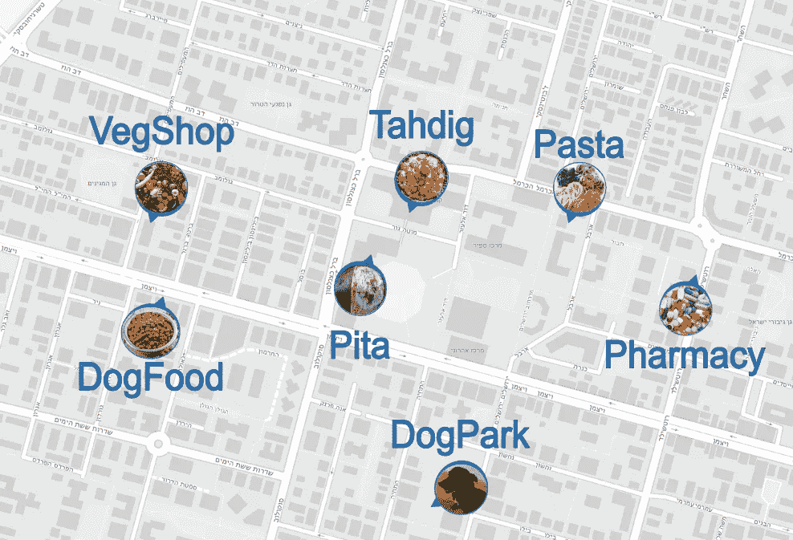
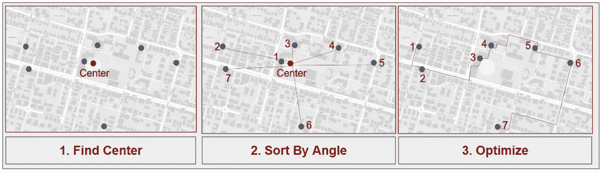
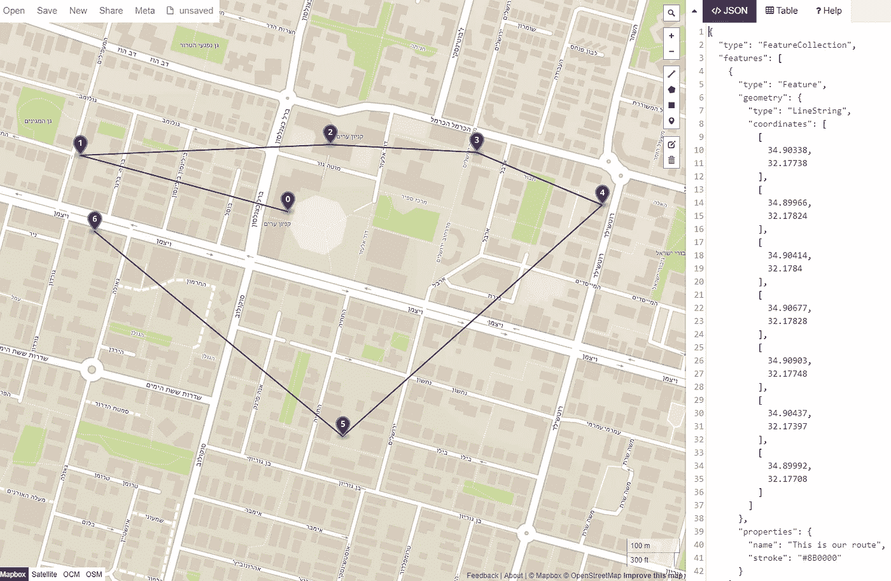
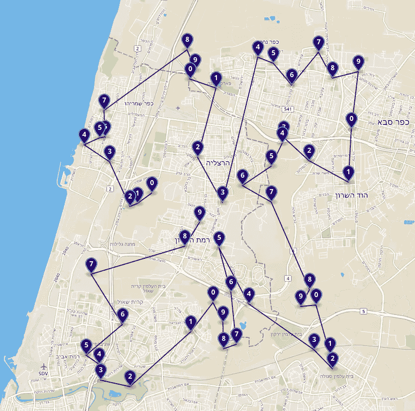

# YATS -另一个 TSP 解决方案

> 原文：<https://medium.com/hackernoon/yats-yet-another-tsp-solution-6a71aeabe1f8>


今天，我想告诉你我为著名的欧几里德旅行推销员问题提出的另一个解决方案。这种启发式解决方案的优点是直观，因此易于实现。

还有更好的[(更精确+更快)方法](http://citeseerx.ist.psu.edu/viewdoc/download?doi=10.1.1.258.9895&rep=rep1&type=pdf)，但我选择花时间与您分享我的简单解决方案，因为我认为它可以作为该领域的一个很好的介绍，也可以作为我在智能移动领域的同行的一个新观点，我相信他们和我一样，有时只想把事情做好。

如果你只是想看看代码，因为，嘿，你也只是想把事情做好，欢迎你直接去[这里](https://github.com/DalyaG/CodeSnippetsForPosterity/blob/master/YATS_YetAnotherTSPSolution/YetAnotherTSPSolution.ipynb)。


> N **注意:**这篇文章中的代码是用 **Python 3.7** 编写的，这主要意味着它有**类型**，这是我最喜欢的 Python 特性💜

# 让我们把事情做好

这是我想在星期五早上，在我昏昏欲睡的家乡为以色列的周末而死去之前做的事情的简短清单:拜访做了惊人的 [Tahdig](https://en.wikipedia.org/wiki/Scorched_rice) 的波斯夫妇，吃来自可爱的德鲁兹家庭的美味[皮塔](https://en.wikipedia.org/wiki/Flatbread)，为我自己和我的狗买一些食物和药物，还可以在狗公园休息一会儿。



我说过这是一个沉睡的小镇吗？所以我必须在所有商店关门之前找到完成所有任务的最快路线。

由于 E-TSP 是一个 [NP-hard 问题](https://en.wikipedia.org/wiki/NP-hardness)，我想实现一个启发式方法，而不是寻找最优解(是的，我知道这个输入的大小是 7，我们将在最后探索更大的输入)。


# 完成比完美更好

的确，完成比完美更好，但我们如何才能完成这一项呢？？

在过去的几年里，我是一名智能移动算法开发人员，所以我有时会在无休止的移动算法论文中迷失，这次我遇到了[这一篇](https://link.springer.com/article/10.3758/BF03196857)它表明人类非常善于用他们的视觉直觉找到 E-TSP 的解决方案，这让我想到我可以将这种直觉用代码表达出来。


source: [https://xkcd.com/2173/](https://xkcd.com/2173/)

这是我们将要实施的解决方案的概要:

1.  找到所有我想去的地方的中心点。
2.  把我想去的地方按照它们离中心的角度排序。
3.  执行[贪婪](https://en.wikipedia.org/wiki/Greedy_algorithm) [局部搜索](https://en.wikipedia.org/wiki/Local_search_(optimization))以优化该角度路线。



# 好了，让我们把事情做完吧

## 1.奠定基础

我们将使用以下软件包:

```
import numpy as np
import math
```

并定义我们将使用的以下`GeoPoint`类:

```
class **GeoPoint**:
    def __init__(self, lng: float, lat: float):
        # Why 5 digits? It's 1 m. accuracy according to  
        # [https://en.wikipedia.org/wiki/Decimal_degrees](https://en.wikipedia.org/wiki/Decimal_degrees)
        self.lng = round(lng, 5)
        self.lat = round(lat, 5)

    def __repr__(self):
        # Copy-pastable format for most map applications
        return f"[{self.lng}, {self.lat}]"
```

从现在开始，我们将假设我们想去的地方的列表保存在`geo_points: [GeoPoint]`中(在 Python 3.7 中，这意味着`geo_points`是`GeoPoint`实例的`list`)。

## 2.寻找角度路线

我们首先要找到中心:

```
def **get_geo_point_of_center**(geo_points: [GeoPoint]) -> GeoPoint:
    lng_list, lat_list = list(zip(*[[g.lng, g.lat] 
                                    for g in geo_points]))
    lng_center, lat_center = np.mean(np.array([lng_list, lat_list]),
                                     axis=1)
    return GeoPoint(lng_center, lat_center)
```

然后计算离中心的角度:

```
def **get_angle_from_reference_geo_point_in_deg**(
    reference_geo_point: GeoPoint, 
    other_geo_point: GeoPoint) -> float: x = other_geo_point.lng - reference_geo_point.lng
    y = other_geo_point.lat - reference_geo_point.lat
    angle_from_reference_in_deg = math.degrees(math.atan2(y, x)) return angle_from_reference_in_deg
```

最后，使用内置的`sorted`函数完成，得到角度路线:

```
def **get_angular_route_idxs**(geo_points: [GeoPoint]) -> [int]:
    center = get_geo_point_of_center(geo_points)
    route_idxs = sorted(
        list(range(len(geo_points))), 
        key=lambda i: 
        get_angle_from_reference_geo_point_in_deg(
            center, geo_points[i]),
        reverse=True)
    return route_idxs
```

**注意:**我们想保留角度路线的**索引**。

## 2.5.一些可视化技巧

如果你不想像我上面“懒洋洋地”做的那样，在一张 [s2map](http://s2map.com) 上手动绘制你的路线，这里有一些使用奇妙的`[geojson](https://geojson.org/)`格式的基本技巧，以及更奇妙的`[geojson.io](http://geojson.io/#map=2/20.0/0.0)`可视化服务和[伴随包](https://pypi.org/project/geojsonio/)。

为了**而不是**把它变成一个`geojson`教程，我会把它以最终的形式泄露出来，所以你可以愉快地复制粘贴它:

```
from geojson import LineString, Point, Feature, FeatureCollectiondef **visualize**(route_idxs: [int], geo_points: [GeoPoint]):
    lng_lat_list = [tuple([geo_points[i].lng, geo_points[i].lat])
                    for i in route_idxs]
    route = Feature(geometry=LineString(lng_lat_list),
                    properties={"name": "This is our route",
                                "stroke": "#8B0000"})
    places = [Feature(geometry=Point(lng_lat), 
                      properties={"name": f"Place {route_idxs[i]}",
                                  "symbol": str(i)[-1],
                                  "marker-color": "#00008B"})
              for i, lng_lat in enumerate(lng_lat_list)] features = [route] + places
    feature_collection = FeatureCollection(features)

    return feature_collection
```

如果您正在使用 `jupyter notebook`，您可以使用这些行自动打开一个 geojson.io 选项卡，显示您的可视化:

```
import geojsonio
import jsonroute_idxs **= get_angular_route_idxs**(geo_points)
feature_collection = **visualize**(route_idxs, geo_points)
geojsonio.display(json.dumps(feature_collection));
```

预期结果:



## 3.使最佳化

在我们的贪婪局部搜索中，我们将:
-执行固定次数的迭代。
-在每次迭代中，我们将:
*改变列表中一个随机位置的索引，
*如果新路线更短，则保持这种改变。

为了能够做到这一点，我们将假设我们持有一个`distances_array`，它是一个`numpy`数组，保存位置`i,j`处`i`和`j`之间的距离。

使用这个数组，我们可以计算给定路线的长度:

```
def **get_route_len**(distances_array: np.array, route_idxs):
    route_len = sum([distances_array[i1][i2]
                     for i1, i2 in zip(route_idxs[:-1],
                                       route_idxs[1:])])
    return route_len
```

最后，我们的简单优化如下所示:

```
import random
random_seed = 42
random.seed(random_seed)def **optimize_route**(distances_array: np.array, 
                   route_idxs: [int], n_iter: int) -> [int]:
    prev_cost = **get_route_len**(distances_array, route_idxs)

    all_idxs = list(range(len(route_idxs)))
    for _ in range(n_iter):    
        i1, i2 = random.sample(all_idxs, 2)
        route_idxs[i2], route_idxs[i1] = (route_idxs[i1],
                                          route_idxs[i2])
        new_cost = **get_route_len**(distances_array, route_idxs)
        if new_cost < prev_cost:
            prev_cost = new_cost
        else:
            route_idxs[i2], route_idxs[i1] = (route_idxs[i1],
                                              route_idxs[i2])
    return route_idxs
```

总而言之，我们可以定义:

```
def **plot_best_route**(geo_points: [GeoPoint], 
                    distances_array: np.array, n_iter: int) -> None:
    route_idxs = **get_angular_route**(geo_points)
    route_idxs = **optimize_route**(distances_array, route_idxs, n_iter)
    feature_collection = **visualize**(route_idxs, geo_points)
    geojsonio.**display**(json.dumps(feature_collection));
```

预期结果:


您希望在一个地方看到所有代码吗？这里欢迎你去[。](https://github.com/DalyaG/CodeSnippetsForPosterity/blob/master/YATS_YetAnotherTSPSolution/YetAnotherTSPSolution.ipynb)

# 完事了吗？

在我准备的 [jupyter 笔记本](https://github.com/DalyaG/CodeSnippetsForPosterity/blob/master/YATS_YetAnotherTSPSolution/YetAnotherTSPSolution.ipynb)中，通过这篇文章中的完整管道，你还可以找到一个更大输入的玩具示例，并看到同样对于 50 分，这是不可行的，以解决最优，你可以在不到 1 秒钟内得到，看起来并不坏，就像这样:



希望你喜欢和我一起走这段旅程，并在接下来的几周内关注更多的算法帖子，:D