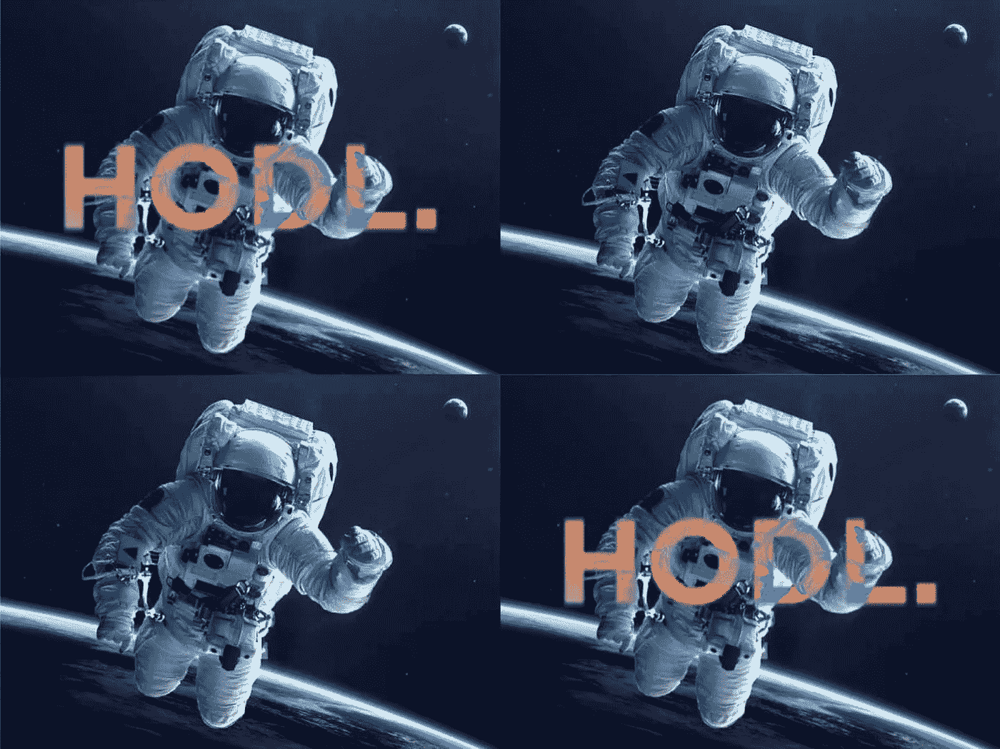
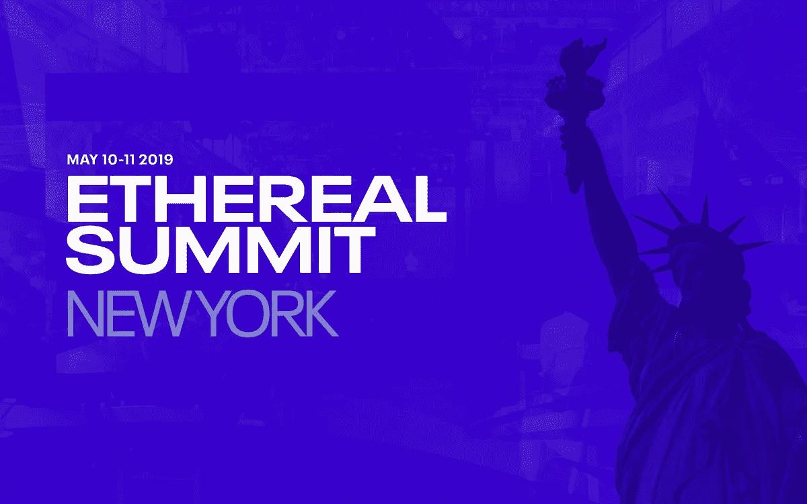
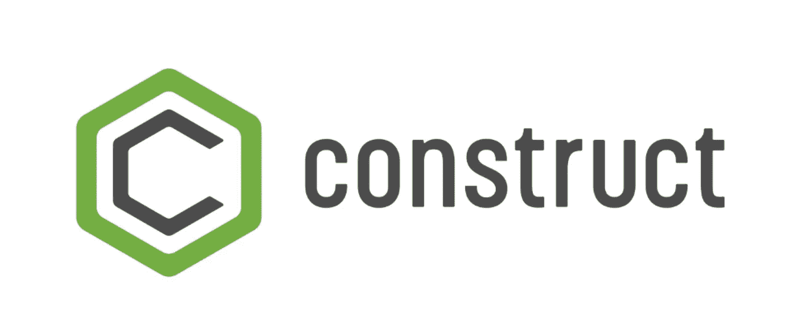
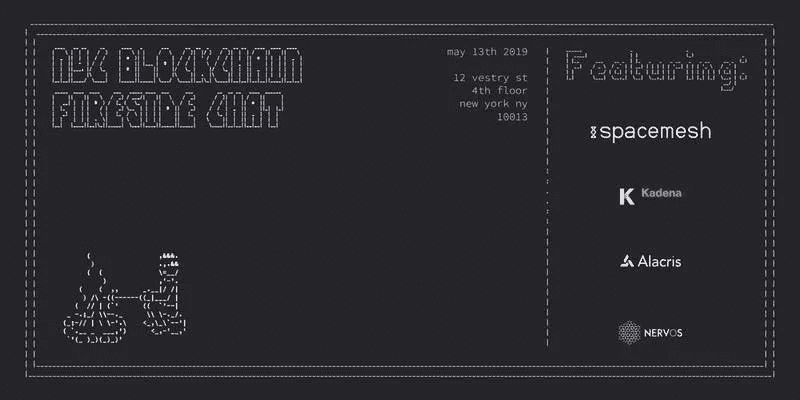
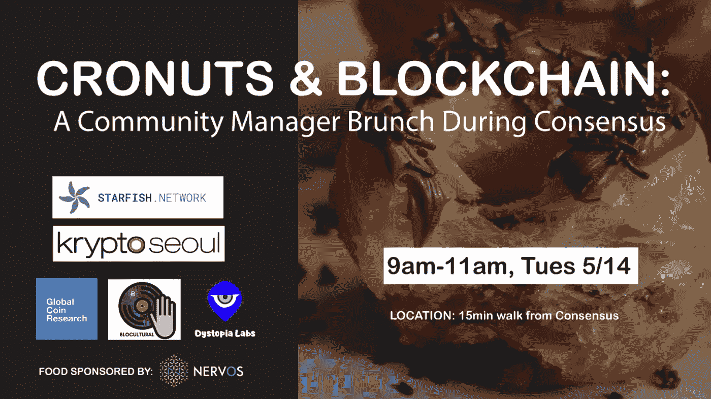
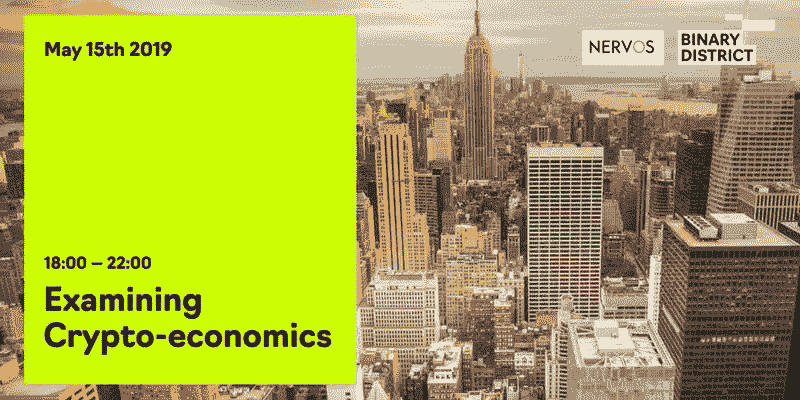
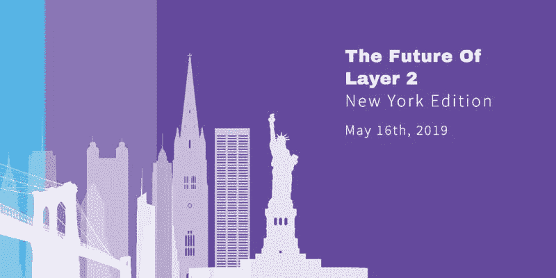
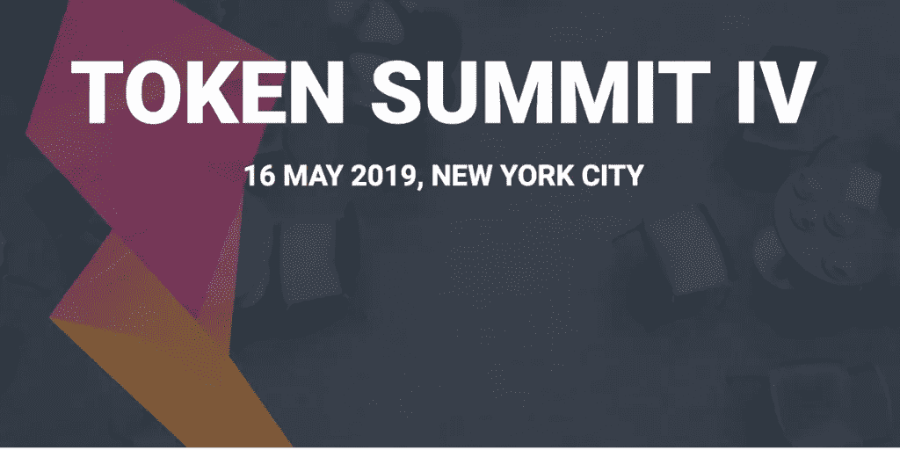
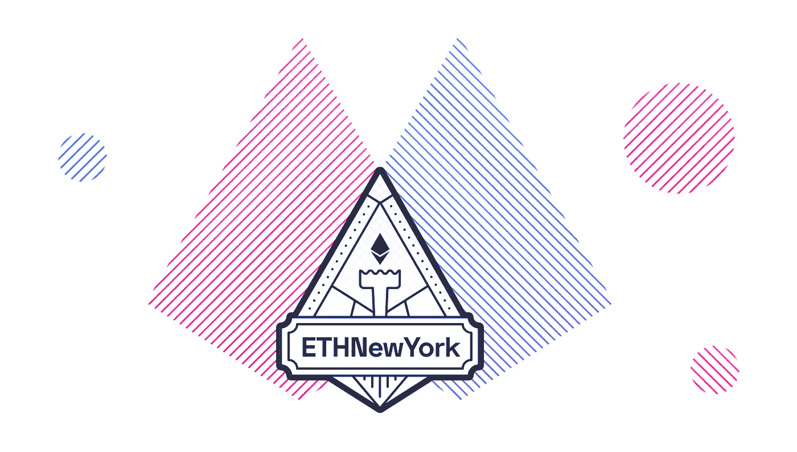

# 另外两周的免费早餐、午餐、晚餐和饮料；)—纽约区块链周活动指南

> 原文：<https://medium.com/hackernoon/yet-another-two-weeks-of-free-breakfast-lunch-dinner-and-drinks-a-nyc-blockchain-week-event-e6cdb25aeb8f>

Credit: worldatlas

聪明点，小心选择你的道路，我的同胞们！(如果你们找不到免费的食物，我拒绝承担责任；)

**如果你想分享一个活动，请回复下面的 twitter 帖子**

**或在网站上提交** 🥰

 [## 区块链周-纽约

### 版权所有 2019 纽约市区块链周。

nycblockschainweek . info](https://nycblockchainweek.info/) 

事件按日期排序。

5 月 1 日(周五)下午 1:00-7:30 在 T2 举行的全球地方区块链、金融技术和人工智能研讨会(常规门票:20 美元-99 美元)纽约市顶尖 T4 公司齐聚一堂，探讨围绕区块链的挑战和机遇。对于那些不确定未来监管会是什么样的人来说，这是一件大事。与全球各地的行业领袖、投资者、创新者、监管机构和学术界人士一起参加为期一天的系列小组讨论和演示。所有与会者都将有机会参加网络活动和书籍签名。寻求投资资本的创业者将有机会进行短期推销。

[区块链+ Ai 医疗对话](https://www.eventbrite.com/e/blockchain-ai-healthcare-conversation-tickets-57618570696?aff=ebdssbdestsearch)
5 月 2 日(星期四)下午 6:00—8:00
免费活动
参加免费讲座，了解区块链和医疗行业的技术。无论你是在医疗保健领域，还是想知道技术是如何改善和塑造未来的医学，一定要访问这个天台事件，以网络和了解该行业。

[春季区块链快乐时光(区块链周启动)](https://www.meetup.com/Blockchain-NYC-Start-Up-Tech-Events/events/260536761/)
5 月 6 日周一下午 6:30—晚上 9:30
免费活动
让新的一周有机会与新老区块链爱好者交流。您可以在 Slate NY 享用特色饮品，同时有机会与来自区块链地区的人们交流。这是一个很好的机会参与区块链空间，网络和谁不爱一个快乐的时间？

[大数据金融](http://bigdatafinance.org/BDF2019/product/attendee-ticket/)
5 月 9 日(周四)–10 日
常规票价:650 美元
大数据为人工智能和区块链等技术铺平了道路。此活动涵盖投资组合管理和投资分析。了解在金融领域使用大数据的最新技术和工具。该活动为期两天，与会者可以学习从行业的顶级，以及一个机会，以网络，以满足未来的业务合作伙伴和客户。

[重建金融:流动性 2019 峰会](https://www.fluiditysummit.io/)
5 月 9 日星期四
普通票:$249
作为关于金融未来的行业领先会议，流动性汇集了区块链技术和机构金融领域最伟大的思想，以重建旧结构，开辟新的前进道路。在满座的首届峰会之后，流动性以强大的编程、深刻的见解和诚实的对话再次回归。

Nice IKB ❤️

[Ethereal 2019](https://etherealsummit.com/events/ethereal-summit-ny/)
2019 年 5 月 10 日—5 月 11 日星期五
常规门票:$815
特别说明: **ETHEREALNYC15** (将为您提供八五折优惠)
区块链周最大活动之一，Ethereal 2019 年再次回归。一整天的会议，它的一切区块链和加密，从用例，挑战，可能性和解决方案。您会发现本次活动涵盖了广泛的行业，继续为权力下放运动提供了一个强大的平台。Ethereal 因纽约区块链周期间的一些最佳演示者、礼品、食物和饮料而闻名。前两年我们去过，那是一次令人惊奇的经历。我们强烈推荐那些喜欢亲眼目睹伟大工程的人。

[神奇的加密会议](https://www.magicalcryptoconference.com/)
5 月 11 日至 12 日星期六
普通票:$330.00
从一个受欢迎的播客开始，三位加密业内人士受到启发，创建了一个人人都可以参加的会议。顶级加密影响者和投资者的聚会，分享想法、策略和方法。来自世界各地的 40 多位演讲者齐聚一堂，参加这次为期两天的活动。与志趣相投的人建立联系。

[Chromapolis:区块链/dApp 开发者研讨会&挑战赛(BTNW 之前)](https://www.eventbrite.nl/e/chromapolis-blockchaindapp-developer-workshop-challenge-prior-to-btnw-tickets-60705902990)
5 月 12 日周日
免费活动
5 月 12 日加入 Chromapolis，参加纽约区块链周期间的互动开发者午餐研讨会。这个研讨会面向那些想要学习更多关于构建分散式应用程序(dapps)的知识，并且想要获得使用 Chromapolis 的实践介绍的开发人员。
当然提供午餐:-)

[BTNW 纽约市— Chromapolis、Beam、GEO Protocol、Algorand、thunder core&iExec](https://www.eventbrite.nl/e/btnw-nyc-chromapolis-beam-geo-protocol-algorand-thundercore-iexec-tickets-52955898518)
5 月 12 日周日
免费活动
建设新网络。纽约版。去中心化世界的技术探索。以前的版本包括来自大型机、Nucypher、Solana、The Graph、Chromapolis、Quarkchain、Tomochain、Dfinity、Hedera Hashgraph、Dusk Network、Avalanche Labs、Matic Network、Infura、algrand&等项目的展示。

[令牌化资产纽约](https://thefutureof.finance/tokenized/new-york/)
5 月 12 日星期日
普通票:$695
本次会议提供了关于将区块链技术应用于真实资产令牌化和安全令牌创建的整个过程的全面见解。对发行者来说，资产证券化意味着降低成本，但也意味着提高现实世界资产的透明度、效率和流动性。实物资产的虚拟化使获得新投资机会的途径民主化，并允许部分清算和方便与其他投资者交换。

[钱币中心年度晚宴](http://coincenter.org/dinner)
5 月 13 日星期一，晚上 7:00 酒会，晚上 8:00 晚宴
这是与共识 2019 同时举行的筹款晚会。每年，硬币中心的年度晚宴都是加密货币社区聚在一起庆祝我们非凡的行业所取得的成就的机会。

[Crypto Briefing Connect](https://www.eventbrite.com/e/crypto-briefing-connect-new-york-blockchain-week-2019-tickets-60942161646?mc_cid=e51868aad0&mc_eid=f244c8233f)
5 月 13 日星期一，下午 6:00-10:00
免费活动
complimative 伏特加酒吧，从下午 6:00-7:00，我们有来自密码、金融、风险投资、区块链科技和市场营销领域的许多有趣的人前来享受这个夜晚。来见见他们吧！

[共识](https://www.coindesk.com/events/consensus-2019)
5 月 13 日星期一——5 月 15 日星期三
晚多数票:$1999
共识是加密货币和区块链技术世界的年度聚会。共识吸引了加密货币和区块链世界的每一家主要公司、开发商、创始人和投资者参与关于行业未来的年度讨论。

For the builders among us

[Construct](https://www.coindesk.com/events/consensus-2019/construct) Construct 将提供密码和区块链行业最新动态的快照。

[区块链中的黑人](https://www.eventbrite.com/e/black-in-blockchain-tickets-60303650843?aff=ebdssbdestsearch)
5 月 13 日周一下午 6:00-8:30
免费活动
参加区块链最大的黑人专业人士聚会之一，进行一个晚上的合作，了解区块链在黑人社区中的影响。与 BitMex 联合创始人 Arthur Hayes 一起加入行业专家的网络、小组讨论和炉边聊天。

Deep～

[纽约区块链 deep tech 炉边聊天](https://www.eventbrite.com/e/nyc-blockchain-deep-tech-fireside-chat-tickets-60679107845)
5 月 13 日星期一下午 6:00-10:00
免费活动
来自 Spacemesh、Nervos、Kadena、Alacris 和 1kx 的区块链行业领袖参加:来自 Spacemesh、Nervos Network、Alacris、1kx 和 Kadena 的人物齐聚一堂，讨论 Deep Tech、区块链和更多！

Blockparty(没有找到这个活动的链接，抱歉~)
5 月 13 日星期一
地点:上&下
上&下——纽约的夜总会，有一群 DJ，还有舞蹈，在喧闹的空间里喝&更多的酒。晚上 8-10 点鸡尾酒会时间&接待//晚上 10 点后 DJ 集合

[Cronuts&block chain:Consensus 期间的社区经理早午餐](https://www.meetup.com/San-Francisco-Nervos-Meetup/events/261252342/)
5 月 14 日星期二上午 9:00-晚上 11:00
免费活动
5 月 14 日星期二，我们将在 Consensus 期间为区块链社区经理举办一场非正式会议&见面会。由反乌托邦实验室、海星任务、全球硬币研究、博客文化和氪星首尔组织。Nervos 赞助的食物。这将是旧金山、纽约和国外的区块链项目聚集在一起，分享最佳实践，和一些甜甜圈(没错！)、水果和含羞草。

[比特币直播炉边聊天](https://www.eventbrite.com/e/intimate-bitcoin-fireside-chat-with-peter-brandt-tuur-demeester-tickets-55235865962)
5 月 14 日星期二下午 6:30—9:30
常规价格:$79- $199
比特币直播自豪地举办他们的首次年度面对面活动。世界知名交易员彼得·勃兰特(Peter Brandt)和顶级加密货币经济学家图尔·德默斯特(Tuur Demeester)将坐下来进行一次独家炉边谈话。两位先生将谈论加密市场的历史以及下一轮牛市可能会是什么样子。

[去月球！区块链推介比赛](https://paywithmoon.com/tothemoonpitch/)
5 月 14 日星期二，下午 6:00-9:00
免费活动
Moon Technologies 将举办首次登月活动！2019 年纽约区块链周期间的区块链推介比赛。我们正在寻找区块链最优秀、最聪明的初创公司，来纽约市向一些最大的风险投资家进行推介。期待一个有趣、友好的比赛之夜(有奖品！)，以及与区块链理工大学最聪明的人交流的绝佳机会。

[100xcrypto 峰会](https://www.100xcrypto.net/)
5 月 14 日星期二，下午 5:00—晚上 10:00
普通票:$199
项目包括:投资者速配、45+灯光讲座以及展示和交流。

[2019 可编程经济与数字资产大会](https://www.eventbrite.com/e/2019-programmable-economy-and-digital-assets-conference-blockchainconsensus-tickets-60508311990)
5 月 14 日星期二下午 6:30—9:30
常规门票:$10
Bytom 全球巡回赛是 Bytom 为全球区块链爱好者举办的一系列活动，包括在线见面会、志愿者大会和区块链技术峰会，致力于促进全球区块链行业的知识和创新。

[Stellar 和数学之夜](https://www.meetup.com/Stellar-New-York/events/260764492/)
5 月 14 日星期二下午 6:30-8:30
免费活动
Stellar 用他们最喜欢的三件事来庆祝纽约市区块链周:技术讲座、社区和数学！请于 5 月 14 日加入我们国家数学博物馆的数学游戏之夜，与恒星发展基金会的成员一起深入探索恒星。节目将包括创始人杰德·麦卡勒的演讲，以及由社区主任扎克·弗罗因特和开发人员参与主任约翰尼·古德诺主持的分组会议。

[strong URL](https://strongurl.splashthat.com/)
5 月 15 日星期三下午 1:30-7:30
常规门票:99-249 美元
Strongurl BLunch 区块链周将是一场特别的小型会议 BLunch，有 20 多位区块链领域的女性领导者参加。Strongurl BLunch 是 2018 年 1 月推出的一项私人策划的区块链午餐活动。它提供了一个包容性的环境，并为那些对学习区块链技术充满热情和兴趣的人建立了社区。布伦奇还通过邀请女性领导人作为演讲嘉宾分享她们的工作来突出女性领导人。BLunch 的使命是提升、赋权和鼓励区块链行业的女性，促进性别、年龄和专业背景的多样性。

[共识:区块链营销人员和社区建设者](https://www.eventbrite.com/e/consensus-blockchain-marketers-and-community-builders-tickets-60936398408 )
5 月 15 日星期三晚上 8:30—10:00
免费活动
欢迎区块链社区幕后的营销人员和社区建设者！我们在 2018 年敌无双举办了一次类似的聚会，取得了很大的成功。因此，我们将它带回 2019 年共识。这是区块链地区顶级营销和社区领袖的聚会，旨在分享知识、经验和最佳实践。我们的人数有限，所以如果你打算参加，请回复。

5 月 15 日，星期三，下午 6:00-10:00
免费活动
在这个免费活动中，加入许多专家讨论加密经济模型及其设计。一边享用美食和饮料，一边聆听包括 Nervos、Prism 和 Livepeer 在内的业内顶级初创公司的演讲。

[54 号录音室的一夜——区块链影响](https://nightonbi2.eventbrite.ca/)
呈现的 Fintech 共识之舞 5 月 15 日星期三晚上 7:00——凌晨 12:00
常规门票:$ 288
54 号录音室的一夜由区块链影响特色传奇录音室 54 号 DJ Robbie Leslie 呈现！这个鸡尾酒会和共识舞会聚集了有限合伙人、普通合伙人、家族理财室、公司投资办公室和高净值个人，在全球范围内参与区块链投资的网络机会。

[第二层会议:区块链周纽约版](https://www.eventbrite.com/e/layer-2-meetup-blockchain-week-ny-edition-tickets-60248365483)
5 月 15 日星期三下午 6:00—9:30
免费活动
第二层解决方案的技术领导者将齐聚一堂，讨论第二层解决方案开发中的共同痛苦和收获。meetup 上什么都有，从可伸缩性到互操作性等等！

[NYC 区块链中心早餐系列](https://www.eventbrite.com/e/weekly-community-breakfast-at-nyc-blockchain-center-tickets-56369234899)
5 月 16 日星期四上午 8:00—10:00
免费活动
NYC 区块链中心星期四上午 8—10 点 NYC 区块链每周四上午 8—10 点举办每周社区早餐。在全新的 4000 平方英尺的区块链中心，与企业家、爱好者和思想领袖联系，讨论趋势，分享见解，并保持在该领域的前沿。供应咖啡和清淡的早餐。

😉

[第二层的未来:纽约版](https://www.eventbrite.com/e/the-future-of-layer2-nyc-edition-registration-60735035125)
5 月 16 日星期四，下午 6:30—9:30
免费活动
下一个加密春天将在第二层开始。新一代可扩展性协议将使 dApps 能够以高速低成本运行，将消除智能合约复杂性的限制，并帮助创建不再受缓慢终结影响的 Web3 用户体验。5 月 16 日星期四，在纽约区块链周期间，就在 EthNewYork 黑客马拉松之前，加入我们的啤酒之夜、交流和技术讨论，了解扩展解决方案的最新进展&突破！这将是一次教育活动，所以带上你最好的问题吧！

[面向女性的区块链研讨会](https://www.eventbrite.com/e/multi-disciplinary-hands-on-blockchain-workshop-geared-for-women-2019-tickets-57638401009)
5 月 16 日星期四—5 月 17 日星期五
常规门票:725 美元—1375 美元
这个为女性设计的多学科实践研讨会涵盖了分布式账本技术的许多方面，包括令牌、加密货币、加密经济学和代码片段。学生将与行业领导者接触，亲身体验这些技术如何推动应用。

[ASDToken](https://anysizedeals.com/event/asdtoken-new-york)
周四，5 月 8:30–下午 3:00
常规门票:$300 — $600
ASDToken 又名#BitcoinCRE，是全球首屈一指的区块链&房地产品牌。自 2018 年 3 月推出以来，ASDToken 与来自以太坊的 Steven Nerayoff 等行业领袖一起，在纽约和伦敦举办了高水准的活动。第二年，ASDToken 将成为 CoinDesk 纽约区块链周的特色活动之一。从 5 月 10 日到 5 月 17 日，区块链生态系统中的所有主要参与者都会来到纽约，参加纽约区块链周，今年 ASDT 将成为所有活动的中心。

[Token Summit IV](http://www.tokensummit.com/)
5 月 16 日星期四
普通门票:$849
Token Summit IV 将是 Token Summit 系列的第四场活动，也是首次深入探讨基于 Token 的经济的会议。第三次在纽约，我们将继续讨论基于区块链的令牌、协议和加密资产的经济、发展、监管和最佳实践。具体来说，本次会议的一些关键主题将包括如何成功发展分散式开源协议，从区块链数据中提取见解，分散式开源协议，从区块链数据中提取见解，分散式治理，估价模型和令牌功能模型。

[伊特纽工作](https://ethnewyork.com/)
5 月 17 日至 19 日星期五
免费活动
伊特纽工作为您提供了与开发人员、行业专家、顾问和公司一起工作的机会，他们正在开发支持开放金融和新的去中心化网络的基础设施和应用程序。加入其他 500 名黑客，参加在纽约举办的最大的以太坊黑客马拉松，向世界展示我们的开发者社区仍然在# BUIDLING。

[加密数字空间](https://www.storm-7.com/crypto-digital-space)
5 月 17 日星期五
regular 门票:700
在此次活动中，知名加密货币和技术专家的主要演讲阵容将涵盖许多创新和探索主题，以及当今加密市场中涌现的问题。将包括对全球数字货币市场效率的分析；关于捕捉错位市场机会的讨论；在动荡的数字市场中保持稳定流动性的挑战和解决方案。
本次活动将涵盖全球市场动态、趋势和来自世界各地的创新区块链技术。在区块链第一时间了解世界各地发生的事情。

参考资料:

 [## 共识 2019 -区块链周活动- CoinDesk

### 区块链周活动

- CoinDesk 区块链周 Eventswww.coindesk.com](https://www.coindesk.com/events/consensus-2019/blockchain-week/events)  [## 2019 年纽约区块链周活动策划指南-

### 欢迎来到第二届 NYC 区块链周！去年，我们因为编写了这个指南而获得了巨大的积极反馈，所以…

silicon .纽约](http://silicon.nyc/blockchain-week-guide/)