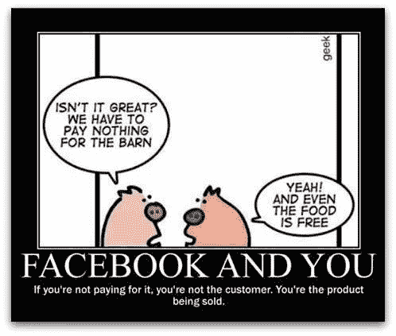

# 你每天都在赌博

> 原文：<https://medium.com/hackernoon/you-are-gambling-daily-bf2ed376ac61>

## 注意力经济时代的技术成瘾

“该死，我刚刚打开 YouTube 看了一个视频，结果花了几个小时”，“这些应用程序就像兔子洞”，“我登录脸书找到一个人的联系方式，一个小时后我发现自己在笑一个模因”等等。感觉有血缘关系？

我们中的大多数人，拥有活跃的网络生活，在某个时候或其他时候都有这种感觉。为什么我们最终会在网上浪费宝贵的时间？我们只是不小心还是另有隐情？我们会被完全责备吗？

为了很好地回答这些问题，我们先来了解一下科技巨头们是如何运作的，他们在争取什么。

我们听说过这样一句话“数据是新的燃料”，“如果你不为此付费，你就不是顾客，你是被销售的产品”。

我们最终花费时间的所有应用，无论是 YouTube、Instagram、脸书、Snapchat 等等。基本上是免费的。

这些公司是怎么赚钱的？—通过给你看广告。

他们如何增加广告收入？—向您展示个性化的相关广告。

他们如何向你展示个性化广告？—通过从数据中收集您的偏好和兴趣。

他们如何丰富这些数据？—让你更多地参与平台，向你展示相关信息，让你在平台上花更多时间。

你的“时间”或者换句话说，你的“注意力”是他们所寻求的，因此他们设计的应用程序会让你着迷。你花在应用上的时间越多，你的参与度就越高，他们手头的数据就越多，不用说你花在他们展示的广告上的时间也就越多。

在开发者的世界里，制作能够吸引客户的应用被视为一件非常积极的事情，这本身就是一种讽刺。想想看，一群聪明的人，我们称之为开发者，分布在不同的科技巨头中，都试图实现同一件事:“关注”。我们的时间是有限的，我们的注意力是有限的资源，所有的科技巨头都在竞相获取更多的注意力，以便让他们的经济依靠你的注意力运转。这些巨头有足够的资源、人才和研究来帮助实现同样的目标。在这种情况下，心理因素会变得更加有趣。不能说这是偶然或有意发生的，我们对智能手机的使用类似于一种令人上瘾的赌场游戏。还记得老虎机吗？

Natasha Dow Schüll 是《设计成瘾》一书的作者，她谈到了老虎机的设计，正是这种设计让老虎机在赌博界如此受欢迎。这些都是上瘾的程度，有一些情况下，人们最终花了 72 个小时一口气，钩到这些机器。

她说，在其他因素中，孤独(只是人和机器)、系统设计的连续性和不确定性使它非常容易上瘾。如果我们在与智能手机的日常互动中检查一下所有这些功能，我们会发现它们都存在。

1.  孤独:看屏幕不是一个集体活动，它只是一个人和他的机器
2.  连续性:我们的反馈是无止境的，youtube 视频是无止境的，提供了源源不断的娱乐。它甚至有像自动更新或自动播放这样的功能，不需要人类的交互就可以继续。
3.  不确定性:我们不知道接下来网络世界会发生什么，下一个通知会是什么样子，下一个提要条目会显示什么。一些评论，一些标签，一些喜欢，有人得到一份工作或四处旅游。世界总是不确定的。它不断给我们带来意想不到的信息，这些信息可能会增加一些东西或完全无用，就像老虎机一样，但我们仍然不断滚动它，希望获得一些有意义的信息。

正如特里斯蒂安·哈里斯在他的文章中所写的

> **几十亿人口袋里都有老虎机:**
> 
> -当我们从口袋里掏出手机时，我们正在*玩老虎机*，看看我们收到了什么通知。
> 
> -当我们刷新电子邮件时，我们正在*玩老虎机*看我们收到了什么新邮件。
> 
> -当我们向下滑动手指滚动 Instagram feed 时，我们正在*玩老虎机*看下一张照片是什么。
> 
> -当我们在 Tinder 等约会应用程序上向左/向右刷脸时，我们正在玩一个吃角子老虎机，看看我们是否找到了匹配。
> 
> -当我们点击红色通知的#时，我们正在对下面的内容玩吃角子老虎机。我得到了多少个赞？

难怪我们会迷上使用这些应用程序，一次又一次地回到它们身边。

牛津对“赌博”的定义是:

# 冒险

[ **动词**

*   为了期望的结果而采取冒险的行动。

说我们每天都在赌博，对吗？区别仅仅在于，我们在拿我们的“时间”冒险，希望得到一些“想要的”通知。

> 这篇文章是在 90 年代夏天的概念下撰写的。
> 
> “90 年代的夏天”是一个有意识地分析我们对技术的使用，并传播对它带来的问题的认识的倡议，如数字隐私，安全，技术成瘾和设计道德。
> 
> 欢迎你加入我们的行列！
> 
> 在媒体上关注我们，在[脸书](https://www.facebook.com/summer.of.90s)或在 Instagram *上关注[@ 90 年代的夏天，因为](https://www.instagram.com/summer.of.90s/)*我们需要传播消息。

