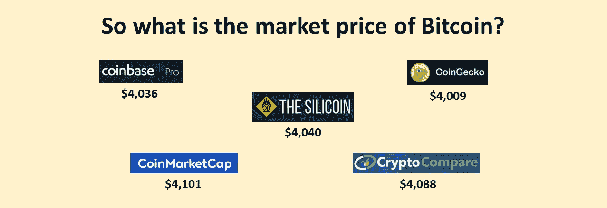
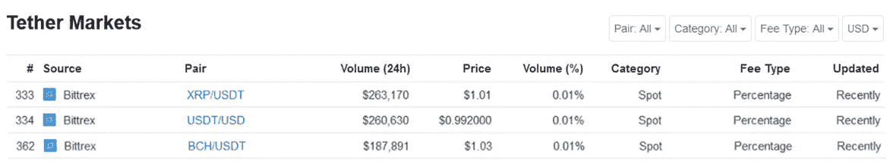
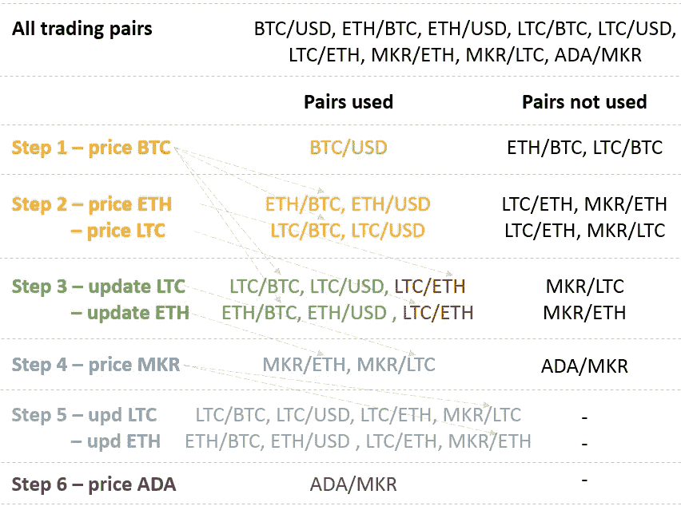
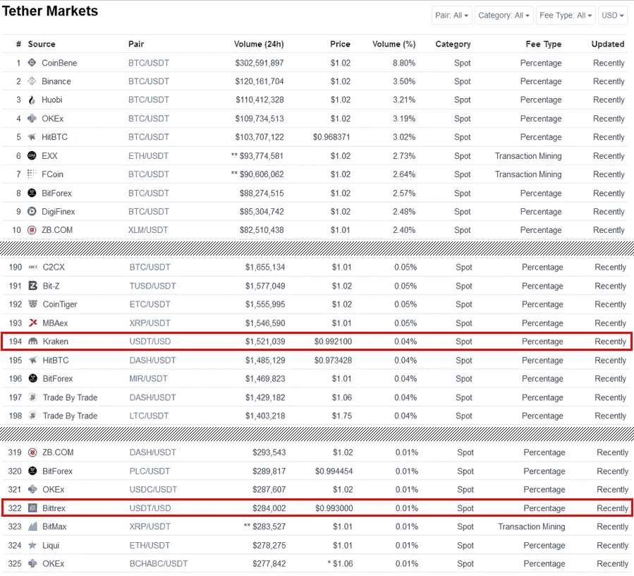
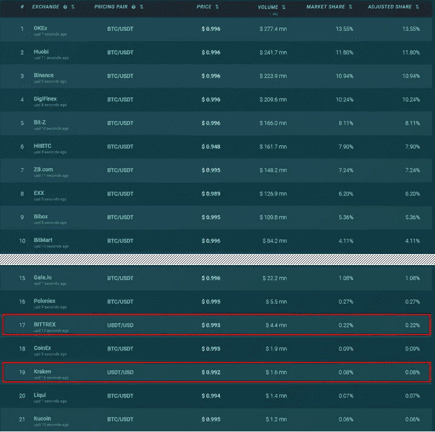
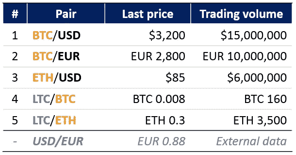
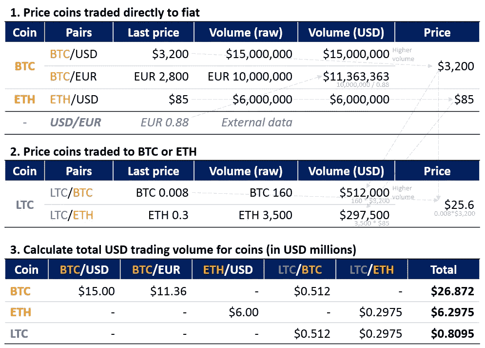
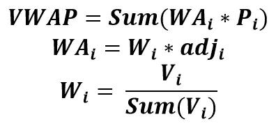
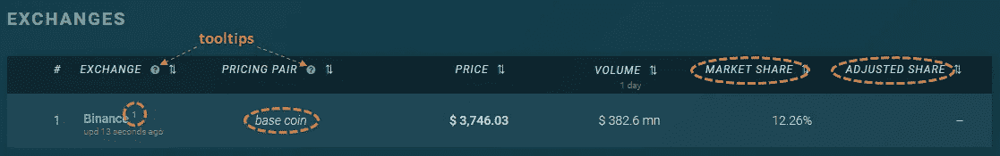

# 在秘密价格聚合器的掩护下

> 原文：<https://medium.com/hackernoon/you-do-not-know-how-coinmarketcap-prices-coins-42c8a4063bb3>

> 加密货币价格聚合器是黑箱——没有人真正知道他们如何计算平均价格。
> 
> 然而，现有的信息足以理解他们这样做是不正确的。
> 
> 我们发现问题，并提出一个 100%透明的专业定价工具。

令人沮丧的是，加密货币的流动依赖于完全不透明的定价数据。怎么可能根据黑匣子里的数据做出任何决定？

一年多前，我们开始开发自己的加密价格聚合器[来解决这个问题。在这一年中，我们解决了许多方法和技术问题，现在我们想分享我们的发现:](https://thesilicoin.com/)

1.  **聚合器将所有交易所的交易对汇集到一个桶中，计算平均价格。这种方法扭曲了价格。我们应该首先找到每个交易所的硬币价格，然后找到跨交易所的平均值(见本文第 2 节**
2.  ******有许多方法可以找到与美元没有直接交易的硬币的美元价格。大部分都不合适。我们讨论可用的选项，并解释为什么逐步定价是最佳的。******

****我们在下面讨论这些发现。他们创造了计算机使用的定价方法。我们的方法在第 4 节中有最详细的描述。****

****这份材料很长。然而，我们确信值得花 15 分钟来一劳永逸地了解我们每天看到的数据是如何计算出来的。****

****如果你对这篇文章有疑问，欢迎在评论中提问。****

********

*****Data as of 20 Dec 2018 10:48 UTC. Source:* [*CoinMarketCap*](https://coinmarketcap.com/currencies/bitcoin/)*,* [*THE SILICOIN*](https://thesilicoin.com/coins/bitcoin-BTC)*,* [*CryptoCompare*](https://www.cryptocompare.com/coins/btc/overview/USD)*,* [*CoinGecko*](https://www.coingecko.com/en/coins/bitcoin)*,* [*Coinbase Pro*](https://api.pro.coinbase.com/products/BTC-USD/ticker)****

# ****内容****

1.  ****[**coin market cap 方法论的灰色地带和问题**](/p/42c8a4063bb3#c802)****
2.  ****[**为什么把所有交易对集中在一个桶里是错误的**](/p/42c8a4063bb3#816a)****
3.  ****[**CMC 如何计算参考价格**](/p/42c8a4063bb3#9460)
    3.1。[选项 1 —逐步传播](/p/42c8a4063bb3#5e31)
    3.2。[选项 2 —迭代重新计算跳过对的价格](/p/42c8a4063bb3#b2ee)
    3.3。[选项 3 —使用之前计算的价格作为参考](/p/42c8a4063bb3#2f9a)
    3.4。[CMC 可能会使用哪个选项？](/p/42c8a4063bb3#bab8)****
4.  ****[**硅币价格计算方法论**](/p/42c8a4063bb3#8feb)
    4.1。[方法论总结](/p/42c8a4063bb3#8828)
    4.2。[方法学结果](/p/42c8a4063bb3#752a)4.3
    。[详细方法论](/p/42c8a4063bb3#d3a8)4.4
    。[为什么用流动性最强的交易对来计算交易所的币价](/p/42c8a4063bb3#69c9)
    4.5。[如何观察用于计算的所有输入](/p/42c8a4063bb3#4589)****
5.  ****[**结论**](/p/42c8a4063bb3#61a4)****

# ****1.CoinMarketCap 方法的灰色区域和问题****

****CoinMarketCap 的方法中存在重大的未知和问题。我们说 CMC 不是因为它的方法论特别差，而是因为它是一个市场标准。****

> ****我们所知道的所有加密价格聚合器都使用 CoinMarketCap 的黑盒方法的某种变体。****

******乍一看** [**CMC 的方法论**](https://coinmarketcap.com/methodology/) **看似直白:******

******步骤 1。**从交易所接收所有交易对的数据，应用清理和验证算法****

******步骤二。汇集所有交易对，找出每对的美元价格和交易量******

******步骤三。**计算所有交易对中硬币的成交量加权平均价格****

******步骤 2 的方法如下:**
*"每个单独市场* [*对*](https://coinmarketcap.com/glossary/#pair) *的价格是通过采用直接从交易所报告的未兑换价格并使用 CoinMarketCap 的现有* ***参考价格*** *"* 将其兑换成美元来计算的****

> *******CMC 的方法论有两大问题:
> 1。将所有交易所的交易对聚集到一个池中是不正确的。*** 正如我们在下面的[第 2 节](/p/42c8a4063bb3#816a)中所展示的，这种方法产生了模糊和抽象的价格****
> 
> *******2。步骤 2 中使用的参考价格是如何计算的？*** 我们甚至不知道用什么交易对来给比特币定价。
> 计算选项在[第 3 节](/p/42c8a4063bb3#9460)中描述****

****最重要的是，我们不知道使用了什么“数据清理和验证算法”。很可笑，但却是最不重要的问题。****

# ****2.为什么把所有的交易对放在一个桶里是错误的****

****如上所述，CoinMarketCap 汇集所有交易所的交易对，并计算所有交易所的平均值，而不考虑交易对属于哪个交易所。****

****从我们可以发现的其他加密价格数据提供商的方法来看，他们也汇集交易对([例 1——经济学](https://blog.nomics.com/nomics-newsletter/nomics-pricing-methodology-explained/)、[例 2——辣椒粉](/coinpaprika/price-calculation-algorithm-on-coinpaprika-94973023ff57)、[例 3——逐位](https://www.bitwiseinvestments.com/indexes/methodology))。****

> ****汇集所有交易对的方法是有缺陷的。它输出不正确的价格。****

****汇集所有交易对的另一种方法是为每个交易所分组。在交易所交易的每一枚硬币都应该有一个独特的价格。**正确**:在币安，比特币的价格是 4000 美元。
**不正确**:比特币在 BTC/美元市场的价格为 3990 美元，在币安的瑞士联邦理工学院/BTC 交易所的价格为 4010 美元。****

> ****一点理论:****
> 
> ****如果没有市场摩擦，[套利机会](https://en.wikipedia.org/wiki/Arbitrage)就不存在。这意味着资产在交易的所有市场上都有相同的价格。****

****在将资金从一个交易所转移到另一个交易所时，存在严重的市场摩擦。这就是为什么计算交易所间加密货币的平均价格是有意义的。****

******相反，一个人内部的交流摩擦是极小的。因此，如果我们在一个特定的交易所用一些硬币进行交易，每对硬币的价格应该是一样的。******

******考虑一个例子:******

*   ****假设在“XYZ”交易所有两个交易对:MKR/BTC=0.092，MKR/瑞士联邦交易所=3.60****
*   ****首先，我们使用与菲亚特交易的其他交易所的交易对来计算 BTC 和 ETH 的美元价格。
    让 BTC = $ 3400，ETH=$90(这些都是声名狼藉的 ***参考价格****——待下文讨论)*****
*   *****让我们两人一组计算制造商的价格。来自 MKR/BTC 的价格是 3400 美元*0.092= **$312.8** ，来自 MKR/ETH 的价格是 90 美元*3.60= **$324.0*******
*   *****在几乎没有摩擦的市场上，我们对同一种密码得出了两种不同的价格。实际上这是不可能的！交易者立即发现任何偏差并消除它们。*****
*   *****为什么会这样？我们将两种外部价格引入一个交易所。通过计算*【BTC】和 ETH ***价格*** ，我们发现，这个交易所的交易者对 BTC 相对于 ETH 的估值与普通交易者不同******
*   ******为了消除这个问题，我们应该在这个交易中为制造商找到一个最佳价格。它应该来自已经建立了美元价格的最具流动性的货币对******
*   ******假设 MKR/BTC 对的交易量高于 MKR/ETH 对的交易量。那么我们应该把 BTC 的价格定为 3400 美元。MKR = $ 3400 * 0.092 =**$ 312.8**，ETH=$312.8/3.6= **$86.89 *交易所“XYZ”*********

******这个问题很容易说明。根据 CoinMarketCap，BITTREX 上的 USDT 价格在交易对之间相差超过 3%，而交易费仅为 0.25%，交易量很大。这显然是不可能的——这种偏离会立即被套利者利用。******

************

******Source: [CoinMarketCap](https://coinmarketcap.com/currencies/tether/#markets). Price difference may fluctuate******

# ******3.CMC 如何计算参考价格******

******当汇集所有交易对 ***时，参考价格*** 是主要输入——它们对所有其他硬币的价格有巨大影响。******

******虽然我们已经表明联营是错误的，让我们讨论一下如何计算**参考价格。这有助于理解密码定价的复杂性。********

## *******3.1.选项 1 —逐步传播*******

*********第一步。**首先计算 BTC/法币交易对中比特币的成交量加权平均美元价格(比特币对法币的交易对数量最多)*******

*********第二步。**计算 BTC 或菲亚特(硬币/BTC 或硬币/菲亚特)交易对的美元价格。BTC 的价格是 ***参考价格*** 。然后计算这些硬币的体积加权平均价格。不是所有的硬币都可以交易到 BTC 或菲亚特。因此，到目前为止，并不是所有的硬币都有定价*******

********步骤三。**计算与步骤 2 中定价的硬币有交易对的硬币的美元价格。在**步骤 2** 中定价的硬币在**步骤 3** 中提供 ***参考价格*********

********第四步。**继续这样的迭代，直到所有密码都收到美元价格******

******请注意，到目前为止，并不是所有的 BTC 交易对都将被用于在此选项下对比特币进行定价。除了在最后一步定价的硬币外，配对样本将仅限于所有硬币。******

********考虑这个过程的一个例子:**
假设我们汇集了来自所有交易所的下列货币对:BTC/美元、瑞士联邦理工学院/BTC、瑞士联邦理工学院/美元、瑞士联邦理工学院/BTC、瑞士联邦理工学院/美元、瑞士联邦理工学院/瑞士联邦理工学院、MKR 联邦理工学院、MKR/瑞士联邦理工学院、阿达/MKR******

1.  ******使用 BTC/美元对查找 BTC 的美元价格******
2.  ******使用 ETH/BTC、ETH/美元和 LTC/BTC、LTC/美元查找 ETH 和 LTC 的美元价格******
3.  ******使用 MKR/瑞士联邦理工学院、MKR/LTC 查找 MKR 价格******
4.  ******使用 ADA/MKR 查找 ADA 价格******

************

******Option 1 — step by step propagation******

******根本没有使用 LTC/ETH 对。巴黎联邦理工学院/BTC，伦敦贸易学院/BTC 不用于比特币定价。不用于为莱特币等定价的成对 LTC/ETH、MKR/LTC。******

## ******3.2.选项 2-迭代重新计算跳过对的价格******

********第一步。**类似于选项 1 的步骤 1******

********第二步。**类似于选项 1 的步骤 2******

********第三步。**使用所有可用对重新计算步骤 2 中硬币的价格(只有 BTC 价格是固定的)，找到 ***更新的参考价格*********

********第四步。**计算剩余硬币的价格******

********第五步。**再次重新计算******

********第六步。**继续这样的迭代，直到所有密码都收到美元价格，并且所有密码对都被使用******

******在选项 1 下，许多对没有被考虑。选项 2 试图解决这个问题。**让我们考虑上述使用选项 2 方法的示例:********

1.  ******类似于选项 1 的步骤 1******
2.  ******类似于选项 1 的步骤 2******
3.  ******使用步骤 2 中未使用的 LTC/ETH 对重新计算 ETH 和 LTC 价格。人们可以将步骤 2 中找到的 ETH 美元价格代入方程，得到 LTC 美元价格和 LTC/ETH 美元交易量。现在我们可以使用三对重新计算 LTC 平均美元价格。然后，可以将步骤 2 中找到的 LTC 美元价格(或者甚至是最近重新计算的 LTC 价格)拟合到 LTC/ETH 等式中，并从这对等式中获得 ETH 美元价格和新交易量******
4.  ******MKR 价格******
5.  ******再次重新计算 LTC 和 ETH 价格******
6.  ******价格 ADA******

************

******Option 2 — iteratively recalculate prices for skipped pairs******

******在第 3 步中，我们通过得出两个不同的 LTC/ETH 交易对的美元交易量产生了一个奇妙的随机性，这两个交易对被标为红色。第一个通过使用 ETH 查找 LTC/ETH 对的美元值获得，第二个通过使用 LTC 查找该对的美元值获得。******

> *********我们可以进行无限次迭代。每次迭代后，我们会得出不同的价格。我们可以祈祷趋同，但即使出现这种情况，由此产生的价格是…除了市场平均水平。*********

*******我们还可以修改选项 1 和 2，首先固定几个顶级硬币(不仅仅是 BTC)的美元价格，或者尝试在任何步骤中多次迭代计算。但是，我们总是会忽略一些对，或者通过迭代产生随机性。*******

## ******3.3.选项 3 —使用之前计算的价格作为参考******

******这是最糟糕的选择，因为价格变得有粘性，变化缓慢。******

******假设我们只有两对:BTC/美元和 ETH/BTC。
假设 BTC 以前的平均价格= 4000 美元，ETH 以前的平均价格= 100 美元。
当前 BTC/美元报价为**3000 美元，成交量为 9000 美元，ETH/BTC 报价为 0.027 BTC，成交量为 1 BTC。********

********从 BTC 联邦理工学院= 0.027→BTC = 100 美元/0.027 = 3703.7********

********则新成交量加权平均 BTC 价格为(3000 * 9000+3703.7 *(1 * 3703.7))/(9000+1 * 3703.7)=**$ 3205.16**
平均 ETH 价格为 0.027 * 4000 = $ 108********

******该算法输出的 BTC 价格为**$ 3205.16，**，而它应该是**$ 3000**。产出最终会收敛于实际价格，但这需要很长时间。******

## ******3.4.CMC 可能使用哪个选项******

******我们试图从 CMC 的比特币页面的[市场部分提供的数据中逆向计算 CMC 的平均 BTC 价格。我们尝试了几种方法:](https://coinmarketcap.com/currencies/bitcoin/#markets)******

*   ******包括所有市场，除了标记为从平均价格中排除的市场******
*   ******仅包括菲亚特市场******
*   ******这些的组合******

******没有一种方法能给出我们在 CoinMarketCap 上看到的平均 BTC 价格。******

******我们用一个更小的硬币制造机做了同样的事情。在这种情况下，平均价格似乎只是承诺的成交量加权平均。******

********因此，CMC 的方法看起来像选项 2** 的某种变体。******

******[谷歌电子表格和我们的计算可以在这里找到](https://docs.google.com/spreadsheets/d/1Rx_ETSgesrHsL84uSTcfg3Blzu_ZHEMblrozsL0H0QY/edit?usp=sharing)。请尝试自己进行计算，如果有显著的结果，请告诉我们。******

# ******4.硅币价格计算方法******

*******(或如何正确计算平均硬币价格)*******

> ******下面我们列出了计算平均价格的方法，解决了上面第 2 节和第 3 节中描述的问题。******
> 
> ******这种方法是 100%透明、稳健的，并且使用真实的交易价格。******

******用于计算的输入数据可在[硅](https://thesilicoin.com/)上获得——您可以随时验证我们的计算。例如，有关以太坊平均价格计算的详细信息，请参见[以太坊页面](https://thesilicoin.com/coins/ethereum-ETH)的交易所部分。******

## ******4.1.方法总结******

1.  ********对于每个交易所，计算在该交易所交易的每枚硬币的价格** 1.1。一枚硬币在特定交易所的价格是根据最佳交易对确定的，即具有最少的平盘步骤和最大交易量的交易对。对于没有菲亚特交易的交易所，使用一枚顶层硬币来建立与菲亚特的联系******
2.  ********计算一枚硬币在特定交易所的总交易量，作为在该交易所使用该硬币的所有交易对的交易量总和********
3.  ********计算所有交易所的成交量加权平均硬币价格********

## ******4.2.方法结果******

> ******这种方法的好处显而易见。******

******让我们来比较一下 USDT 在 CoinMarketCap 和 T2 在 SILICOIN 上的价格。******

******只有两家交易所提供美元 USDT 交易——北海巨妖和 Bittrex。这些交易所的 USD 美元价格反映了真实的市场价格。******

********除了直接由菲亚特定价的 USD 美元市场之外，CMC 在大多数交易对中得出虚高的 USDT 价格。见下面截图。********

************

******As of 18 Dec 2018 Source: [CoinMarketCap](https://coinmarketcap.com/currencies/tether/#markets)******

******利用我们的方法，我们可以在所有交易所实现稳定的价格。此外，用户可以随时验证加密货币的平均价格是通过价格乘以调整后的份额计算出来的(详情请参见下面的[完整方法](/p/42c8a4063bb3#d3a8))。******

************

******As of 18 Dec 2018 Source: [THE SILICOIN](https://thesilicoin.com/coins/tether-USDT)******

## ******4.3.详细方法******

******我们鼓励您保持耐心，并投入时间来审查详细的方法。******

> ******第一步:******
> 
> ******从交换中检索原始数据******

******从每个交易所接收可用交易对(即 etc 美元、XRP/瑞士法郎等)的最新价格和 24 小时交易量。).******

> ******第二步:******
> 
> ******在每个交易所找到硬币的美元价格和交易量******

******在一个交易所寻找一枚硬币的美元价格的程序取决于这个交易所是否提供交易给菲亚特。******

******这部分很重要，请注意。为了更加清晰，我们在下面提供了计算示例。******

> ********2.1*。如果交易所提供流动性菲亚特交易——直接给所有硬币定价*********

********2.1.1。**查找直接交易给菲亚特的硬币的美元价格。使用[公开汇率](https://openexchangerates.org/)数据将美元以外的法定货币转换成美元******

******如果有几个交易对可以一步确定硬币的美元价格，则选择交易量最高的交易对。[参见下面的例子](/p/42c8a4063bb3#8eb0)******

********2.1.2。**查找交易到上一步定价但未交易到法定货币的硬币的美元价格******

********2.1.3。这样的逐步迭代继续，直到交易所中的所有硬币都收到美元价格********

> ********2.2*。如果在交易所无法进行流动性交易，则使用*基础硬币********

********2.2.1。**我们使用适用的 ***基础币*** 的美元价格来寻找该交易所中其他币的美元价格******

*********基础币*** 是在其他交易所广泛交易给菲亚特的顶级币。 ***基础币*** 用于在没有法定交易的交易所发现美元价格——在这种情况下 ***基础币*** 代替法定货币。******

******分别为每个交易所选择 ***基础币****——选择交易量最大的币。到目前为止，比特币在所有由[硅谷](https://thesilicoin.com/)整合的没有法定交易的交易所提供最大的交易量。*******

******例如，比特币是币安的基础货币。******

******如本条第 2 节[所述，只能选择一枚*基础币*进行兑换，以确保价格的同质性。](/p/42c8a4063bb3#816a)******

********2.2.1。**与 2.1 中描述的算法相同。应用寻找最有效的路径将 ***基础币*** 换为其他币******

> ********2.3*。计算所选交易所中每枚硬币的总交易量*********

********SILICOIN 方法第二步的计算示例********

******假设交易所“XYZ”有以下交易对:******

************

******Trading data retrieved from imaginary exchange “XYZ”. USD/EUR retrieved from Open Exchange Rates******

********1。价格硬币直接交易到法币(** [**第 2.1.1 项)。详细方法论**](/p/42c8a4063bb3#b855) **)**
菲亚特有 3 对:BTC/美元，BTC/欧元，ETH/美元。因此，我们可以在这一步对 BTC 和 ETH 进行定价******

******对于 BTC，我们有 2 对菲亚特。BTC 的美元量/美元= 15，000，000 美元；BTC/欧元=10，000，000/0.88 = 11，363，363 美元。我们选择交易量较高的货币对→BTC/美元。BTC/美元的最后价格= **$3，200** →这是该交易所的 BTC 价格******

******对于 ETH，我们只有一双可以使用。因此，在这次交易中，ETH 的成本为 85 美元******

******我们在下面的的[第 4.4 节中解释了为什么我们使用最具流动性的配对方法而不是平均方法。](/p/9f07d124a5d3#69c9)******

********2。对未交易到法币但交易到先前定价的硬币进行定价(** [**第 2.1.2 项)。**](/p/42c8a4063bb3#cfdf) **)********

******对于 LTC，我们有 2 个适用的配对:LTC/BTC 和 LTC/ETH。LTC/BTC 的美元交易量= 160 * 3，200 美元= 512，000 美元，LTC/ETH=3，500 * 85 美元= 297，500 美元。我们使用高音量的线对。因此，长期成本为 0.008 * 3200 美元= **$25.6********

********3。计算所有硬币的总美元交易量(** [**第 2.3 项)。**](/p/42c8a4063bb3#48a9)******

*   ********对于 BTC，我们有 3 对交易量如下:BTC/美元= 1500 万美元，BTC/欧元= 1136 万美元，长期资本/BTC = 512 万美元。BTC 总交易量为**26872 万美元**********
*   ******对于 ETH，我们有 2 对，其交易量如下:ETH/USD = 600 万美元，LTC/ETH = 0.2975 万美元。总的 ETH 交易量为**62975 万美元********
*   ******对于 LTC，我们有两个交易对，交易量如下:LTC/BTC = 0.512 百万美元，LTC/ETH = 0.2975 百万美元。总 LTC 交易量为**0.8095 百万美元********

********计算示例说明:********

************

******Illustration for calculation example******

> ******第三步:******
> 
> ******计算硬币的市场平均价格******

******我们综合所有交易所的数据，找出硬币的市场平均价格。根据以下规定，交易所可能会被排除在计算某些硬币平均价格之外。******

> ********3.1*。一枚硬币的市场平均价格，计算为由 SILICOIN 整合的各交易所的交易量加权平均价格(VWAP)以及该硬币的交易地点*********

********VWAP 公式:********

************

********其中:**
**P*I****—第二步确定的*交易所 i* 上一枚硬币的价格，
**V*I****—第二步确定的*交易所 i* 上一枚硬币的总交易量，
**WA *i***
**adj *i*** —调整适用于*交易所 i* 、
**W *i*** —一个*交易所 i* 、 **的原始重量总和(V *i* )** —不排除在外的所有综合交易所的硬币总交易量。 换句话说，它是单个 V *i*
***交换 i*** 的总和——由硅集成的交换，并且不从所选硬币的总数计算中排除********

> ********3.2*。在以下情况下，可将兑换部分或全部排除在硬币的 VWAP 和总和(Vi)的计算之外*********

********3.2.1。如果硬币作为本交易所的基础硬币*(上面公式中的 WA *i* 设置为 0)，则自动从 VWAP*** *中完全排除*******

****3.2.2。 **自动从 VWAP 和 Sum(V *i* )** 中完全排除，如果 24 小时交易量日同比增长超过 300%并且超过 100k 美元(从 Sum(V *i* 中排除交易所，因此 W *i* 和 WA *i* 设置为 0)****

******3.2.3。自动部分或全部排除在 VWAP 之外**如果一个交易所的硬币价格与 VWAP 有很大偏差****

*****在这种情况下，我们调整交易所的权重(上式中的* W *i)。调整线性地应用于从 50%到 100%的价格偏差。
对于 80%的价格偏差*WA*I =*W*I *(1-(80%-50%)/(100%-50%))=*W*I * 0.6。对于超过 100%的价格偏差* WA *i=0，对于低于 50%的价格偏差* WA *i=* W *i*****

******3.2.4。** **手动完全排除。**自动排除算法设置为切断极端偏差。对于一些硬币，可以手动检测较小的偏差，并且可以从 VWAP 或 VWAP 和 Sum(V *i* )中排除交换****

******请注意，WA *i* 始终被重新缩放，总和为 100%******

******关于 3.2.2 的说明。** 这种机制防止交易所向我们发送错误的交易量和扭曲的价格。设置 10 万美元阈值是为了不切断交易量低的硬币，这些硬币往往表现出高交易量波动性。****

******注于 3.2.3。** 我们先用 W *i* 计算 VWAP。然后，我们将每个交易所的价格与 VWAP 进行比较，并根据公式对 W *i* 进行调整。接下来，我们使用 WA *i* 重新计算 VWAP。交易量占主导地位的交易所不太可能受到处罚。这个过程只发生一次。****

## ****4.4.为什么使用流动性最强的交易对来计算交易所的硬币价格****

****如[方法的第 2 步](/p/42c8a4063bb3#28dd)所述，我们使用交易量最高的交易对来确定每一步交易中硬币的价格。****

****或者，我们可以使用一步到位的所有货币对的平均价格(在上面的[示例中，包括 BTC/美元和 BTC/欧元)。](/p/42c8a4063bb3#8eb0)****

****下面我们解释为什么使用流动性最好的一对要比平均好。****

******由于以下原因，一个交易所内的硬币价格可能会因交易对而异:******

1.  ****[买卖价差](https://en.wikipedia.org/wiki/Bid%E2%80%93ask_spread)****
2.  ****[交易费用](https://support.pro.coinbase.com/customer/en/portal/articles/2945310-fees)(套利者可能因为费用而无法消除价格偏差。这种偏差随机移动，并且应该具有零的数学期望值)****
3.  ****禁止交易****

****这些低效率掩盖了真实价格，即用户可以在所选交易所交易的价格。****

******流动性最好的货币对提供了比平均更精确的价格:******

******1。顶部交易量对的买卖价差最窄**
通过计算较低交易量对，我们将扩大价差****

****我们使用最后的价格进行计算——它可能在价差的买方或卖方。平均理论上可以得出中间价。然而，在买卖市场中，每一对的最后价格大部分时间都在买卖区间的同一侧。因此，平均将扩大传播****

******2。成交量较低的对更有可能表现出低效率**
在成交量较低的对上，场外价格可能会维持一段时间。假设套利者看到低交易量对的错误定价，并试图消除它，但没有人在另一边买入/卖出。最高音量对不太容易出现这种失真****

****3.这更简单明了，人们更有可能以流动性最好的货币对的价格进行交易****

## ****4.5.如何观察用于计算平均价格的所有输入****

1.  ******各交易所对硬币平均价格和总交易量的贡献:******

*   ****您可以在所选硬币的专用页面的“兑换”部分找到每枚硬币的兑换重量。比如[比特币页面](https://thesilicoin.com/coins/bitcoin-BTC)或者[以太坊页面](https://thesilicoin.com/coins/ethereum-ETH)****
*   ****我们在表格的“市场份额”栏中提供来自 [VWAP 公式](/p/42c8a4063bb3#d0e7)的 W *i* 和“调整后份额”栏中的 WA *i*****
*   ****如果市场份额= 0，那么对于所选硬币(脚注 3 或 5，详情如下)的 VWAP 和 Sum(V *i* )计算中不包括交换****
*   ****如果调整后的份额= 0，则汇率包括在 Sum(V *i* 中，但不包括所选硬币的 VWAP(脚注 1、2 或 4)****

******2。适用于交易所的调整和异常值清除机制:******

*   ****如果出现[第 3.2 节所述的任何情况。方法](/p/42c8a4063bb3#6089)适用于交易所，在硬币页面的“交易所”部分，该交易所名称附近会出现一个脚注。下面是图例:****

******无脚注** —完全包含在总量
的计算中 **1** —基币([见 3.2.1 项。方法论的](/p/42c8a4063bb3#670c) )
**2** —价格异常值([见 3.2.3。](/p/42c8a4063bb3#465e) )
**3** —体积异常值([见 3.2.2。](/p/42c8a4063bb3#0bb4) )
**4** —手工从平均价格中剔除([见 3.2.4)。](/p/42c8a4063bb3#1577) )
**5** —手工从平均价格和总量中剔除([见 3.2.4)。](/p/42c8a4063bb3#1577))****

******3。在每个交易所，哪一个交易对被用来确定一枚硬币的美元价格******

*   ****在任何[硬币页面](https://thesilicoin.com/coins/ethereum-ETH)的“交易所”部分，您可以找到“定价对”栏，其中包含用于在每个交易所建立所选硬币的美元价格的交易对，以及该对的历史交易数据的链接****
*   ****定价对栏中的*基础硬币*表示所选硬币在本次交易中被用作*基础硬币*。调整后的份额将自动设置为 0%，如方法的[第 3.2.1 项所述。可以在](/p/42c8a4063bb3#670c)[比特币页面](https://thesilicoin.com/coins/bitcoin-BTC)观察****

********

****我们错过了你想知道的事情吗？****

# ****5.结论****

*   ****大多数(如果不是全部的话)加密价格聚合器使用不正确和不透明的价格计算方法****
*   ****我们提出了一个没有灰色地带的循序渐进的方法，并产生可靠的平均价格****
*   ****我们方法中使用的所有输入和输出都可以在[电子芯片](https://thesilicoin.com/)上获得****

****通过这篇文章，我们的目标是增加加密空间的透明度。****

****这是加密货币生态系统金融系列的第一篇文章。接下来是第 2 和第 3 部分。****

****我们想重申我们在帖子中给出的关于[加密货币新闻来源](https://hackernoon.com/best-cryptocurrency-news-sources-how-to-read-them-wisely-e4e2f438a255)的建议——对你消费的所有信息都要持批评态度。****

****公开讨论是达成共识的最佳方式。请在下面的评论中提出你的问题并表达你的想法。****

 ****透明的你，[硅](https://thesilicoin.com/)团队****