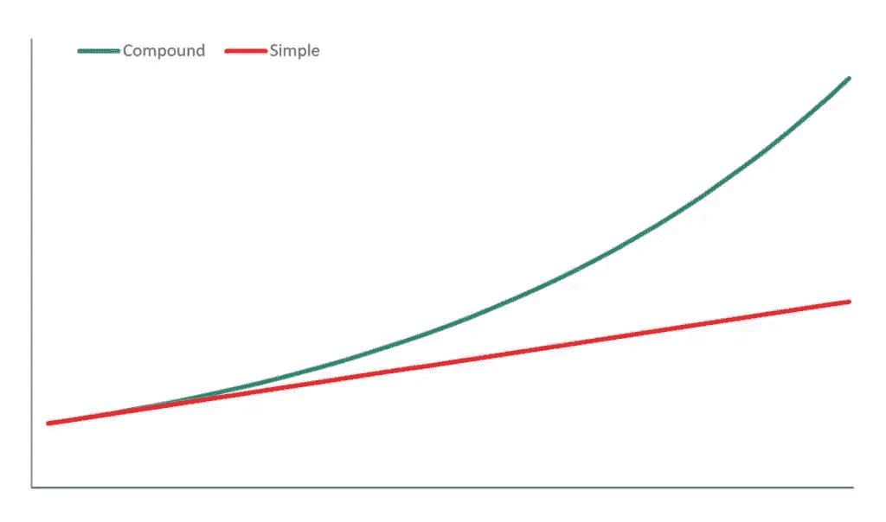
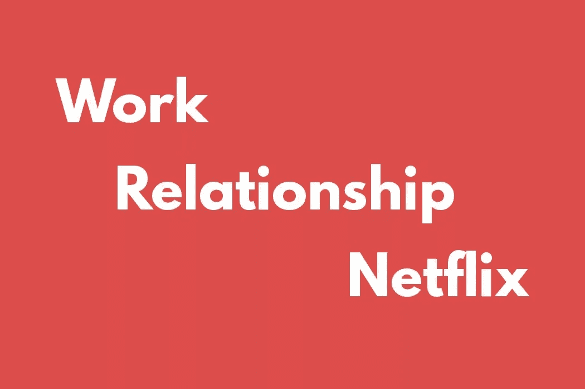
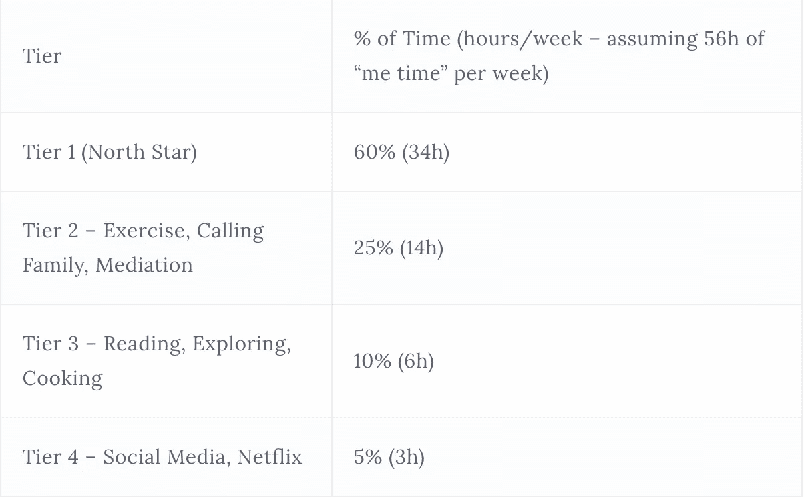

# 你不需要辞职来赚钱

> 原文：<https://medium.com/hackernoon/you-dont-need-to-quit-your-job-to-make-844b7c65f5ea>

> 我想揭穿原创需要极度冒险的神话，并说服你原创实际上比我们意识到的要普通得多—亚当·格兰特，原创

嗨读者们。请允许我自我介绍:我是[斯蒂芬](https://twitter.com/stephsmithio)。我是独立制作人。作为 [Toptal](https://www.toptal.com/#pick-accomplished-software-freelancers-today) 的出版主管，我还领导着一个由几十人组成的远程团队。最重要的是，我是一个自学成才的开发人员，一个女人，并且认同更多的东西。

当我继续一前一后解决所有这些问题时，经常有人问我是如何做到的。虽然这不是在公园散步，但我相信大多数人会限制他们认为可能的范围，最终，限制信念会比实际带宽更大。

此外，我一直觉得奇怪的是，人们喜欢把东西整齐地放进盒子里，或者与一个标签联系在一起。我认为我们可以并且**应该**探索生活中的许多事情，我写这篇文章是为了展示成为一名创造者和拥有一份全职工作不仅是可能的，而且多样化你的可用机会可以让你更加敏捷、现实和可持续地投入。

在跳入之前，我应该澄清一下，这些观点是我自己的，不一定代表 Toptal 的观点。

**TL；博士**

在这篇文章中，我想阐述三个关键概念。第一个是给那些认为他们没有足够时间的人，为什么我觉得这种想法经常是错误的。第二是强调坚持工作的好处，以及为什么成功人士最擅长降低风险，而不是最大化风险。最后，第三个将分离出一些我认为我们都可以在思考方法上做出的改进——超越独立制作和全职工作，这些概念将有望帮助你在更大的范围内优化，或者完全消除这个范围。

# 1.“我没有足够的时间”

美国人的平均工作时间为 8.8 小时，这源于工业革命，并延续到 21 世纪，是出于惯例，而不是主动考虑。罗伯特·欧文精心构思了这句谚语“八小时劳动，八小时娱乐，八小时休息”，努力让人们工作合理的时间，同时仍然有效地运行工厂。

尽管世界和劳动力发生了巨大的变化，这种“工作时间”和“自我时间”的概念今天仍然存在。我不是来争论 40 小时工作制的(已经有太多的资源了——谁没听说过 4 小时工作制？)，而是对“自我时间”的认知产生争议。

对许多人来说，长时间的工作意味着他们有权享受这种“自我时间”,并尽可能地将这种“自我时间”与“工作时间”区分开来。对许多人来说，它看起来很像这样:~网飞和寒意~。

但是，如果我们不再把“自我时间”想象成放松时间，而是正如它的名字一样——专注于自己并与你的目标保持一致的时间，会怎么样呢？如果你需要休息，那就休息吧。但如果你的目标是有一天成为企业家，那么很大一部分“自我时间”应该投入到实现这一目标上，因为它不会自己发生。“自我时间”不应该只是不累的活动，而是帮助个人达到他们希望的未来状态的任何事情。

一天中大约有 16 个小时用于工作和睡眠，每个人大约有 8 个小时用于“自我时间”和[。如果使用得当](http://begreat.me/)，在每年近 3000 个小时中可以取得很多成就。

Sleep, commute, work, repeat.

> *“大多数人高估了自己一天能做的事，却低估了自己一年能做的事。”*

还有一种误解是，为了建立一个可持续发展的企业，你需要花费大量的时间才能实现。虽然确实需要付出很多努力，但最重要的是长期不懈的努力。大多数人低估了复利的概念。

The power of compound interest

看看下面的等式:

*   1.01³⁶⁵ = 37.8
*   1.10³⁰ = 17.5

持续一年每天提高 1%的业务(或生活)是一个月每天提高 10%的两倍。一致性加上复合是强大的。

> *“如果一切都是优先的，那么没有什么是优先的。”*

我认为，大多数人在生活中要么没有清楚地确定优先事项，要么考虑一切。虽然我相信雄心，但成功的一个关键步骤是确定核心优先事项，并消除超出这一范围的噪音。

核心优先事项是动态的，可以随着时间的推移而改变，但我认为，在一个给定的时间内，你不可能真正拥有 3 个以上的核心焦点。

除了设定这些焦点，还需要改变行为来遵循它们。同样，如果大多数人客观地思考他们是如何度过时间的，他们会得到这样的结果:

A typical day.

> *对我来说，这是我的个人优先事项随着时间的推移而发生的变化:*

*   2017:工作，旅行，恋爱
*   2018 年:工作，学习编码，建立边项目
*   2019 年:工作，扩展副业，分享想法(写作，口语)

为了维持一份全职工作和创作项目，我不得不排除干扰。比如我不看电视。我不通勤。我目前没有恋爱关系。这些都是主动选择。

当然，其中一些事情将是暂时的(例如:关系)，但我也注意到我正在重新引入我的生活的东西，以及它是否会有所贡献、带走或成为我的北极星之一。

我认为这个概念也可以被认为是分层的时间投资。无论你做什么，如果它有助于你的北极星，考虑它是一级投资。对于那些对你的成长毫无帮助的事情，也许可以把它标为第四层。这并不意味着你不能跨层花费时间，但是你在每一层花费的时间应该反映出你有多关心它们。

示例(这对任何人来说都是一个独立的练习):

# 2.保住工作的好处

希望上一节有助于说服你，你有足够的时间全职工作，同时创建兼职项目，或者更确切地说，如果你调整你的价值观→优先事项→行为，让更多的事情融入你的生活。在这一部分，我希望传达为什么保留你的全职工作*可以*是一件美好的事情。

# 获得学习报酬

> *“一些工作场所肯定已经破产，但所有员工都还活着。”*

我经常听到人们说“我等不及要出去了”之类的话，指的是辞掉工作，最终自己当老板。这不是他们有全职工作的问题，而是他们正在从事的特定工作或者他们的上司的问题。

所有人都应该努力找到一份授权、激励并能让他们在某个方面成长的工作。更大的组织实际上向 that﹣it's 保证你是房间里最聪明的人，而且你肯定永远不会是房间里在各个方面最有能力的人。

在我的“日常工作”中工作让我不断地向比我聪明的人学习，并因此获得报酬。我也面临着我的副业项目不会遇到的挑战，我经常需要学习如何和其他人一起解决这些挑战。我鼓励人们有意识地设计自己的职业道路，学习从硬技能到软技能的新技能。如果你最终决定在未来独立生活，这两点都很重要。

随着员工队伍变得越来越有活力，许多人都具备了在自己的项目中向他人学习的能力。事实上，我在 Twitter 上对数百人进行了调查，发现相当多的人正在这么做。

# 保持思想新鲜，头脑清晰

除了学习，保留一份 FT 工作还有其他切实的好处，可能会帮助你建立一个更可持续的副业。

从个人经验来看，我发现把我的工作和副业分开让我仍然能在两者中找到独立的快乐。每当我从一个环境切换到另一个环境，尤其是制作，它仍然是“有趣的”。

我认为这尤其是由于这样一个事实，即在目前的状态下，making 是**而不是**我的生命线。我希望有一天它会变得更加充实，但是现在，我可以为我的项目做决定，而不会受到立即赚钱的需要的影响**。**

更重要的是，我可以专注于通过我真正关心的项目来表达自己，而不是专注于可能产生美元的东西，通过这个过程，我接近了我的价值观。换句话说，我可以专注于**创造价值**，而不是专注于**获取价值**，这类似于 [Gumroad 的创始人 Sahil Lavingia 如何转向这样做](/@shl/reflecting-on-my-failure-to-build-a-billion-dollar-company-b0c31d7db0e7)或者 Warby Parker 的创始人如何确保金钱不会胜过他们的价值观:

> “在我们开始之前，我们是四个朋友，我们承诺公平对待彼此比成功更重要。”—原件，亚当·格兰特

与以上联系在一起，当我意识到一个项目不能提供任何价值时，我可以放弃这个项目或进行理性思考，我也不需要接受风险投资或倾向于我不相信的投资者。

> *“在一个领域拥有安全感，让我们在另一个领域拥有原创的自由。通过在财务上覆盖我们的基地，我们摆脱了出版半成品书籍、出售劣质艺术品或开展未经测试的业务的压力。”—原件，亚当·格兰特*

最后，我可以在技能学习上投入适当的时间。我把这比作这样一个概念，即上市公司不太关注通过创新创造长期价值，而是关注下一季度的收入数字。我是一只私人股票，可以专注于我自己和我的技能，目的是为了长期发展它们。

换句话说，我的表达和创造力之间的明显区别与我的生命线是分开的，我认为这有助于做出更有效的决定。

# 尝试很多，然后全部下注

> 由经济学家理查德·坎蒂伦创造的“企业家”一词，字面意思是“风险承担者”。”—原件，亚当·格兰特

有一种普遍的误解，认为企业家都是“冒险家”，你需要“全身心投入”才能成功。这两个在亚当·格兰特的原著中都被证明是错误的。企业家不一定是冒险家，而是更善于评估风险和对冲赌注。

> *“皮埃尔·奥米迪亚建造易贝的时候，只是一个爱好；在接下来的九个月里，他一直以程序员的身份工作，只是在他的在线市场为他赚了比工作更多的钱之后，他才离开。“最优秀的企业家不是风险最大化者，”Endeavor 联合创始人兼首席执行官 Linda Rottenberg 根据几十年来培训世界上许多伟大企业家的经验观察到。他们从冒险中获取风险。”—原创，亚当·格兰特*

格兰特还捕捉到了另一项由 *Joseph Raffiee 和 Jie Feng* 进行的研究，该研究追踪了从 1994 年到 2008 年超过 5000 名美国人的以下问题:“当人们开始创业时，他们是保留还是放弃日常工作会更好？”。

结果呢？他们发现，那些离职的人并不是出于经济需要，而是完全出于信心。然而，那些更不确定——更厌恶风险——的人失败的几率要低 33%。

另一项研究发现，其公司在《快速公司》最具创新力榜单上名列前茅的企业家也倾向于坚持他们的日常工作，包括著名企业家菲尔·奈特(Nike)、史蒂夫沃兹尼亚克(Apple)以及谷歌创始人拉里佩奇和谢尔盖布林。

奈特做了 5 年会计，在行李箱里卖鞋，沃兹尼亚克继续在惠普工作，谷歌人继续在斯坦福攻读博士学位。这只是书中的几个原型——格兰特还引用了类似的故事，从布莱恩·梅在与奎恩一起全力以赴之前学习天体物理学，约翰·传奇在发行第一张专辑后仍担任管理顾问，Spanx 创始人萨拉·布雷克里在她的公司原型化和规模化过程中销售传真机，最终成为世界上最年轻的白手起家的亿万富翁，以及著名作家斯蒂芬·金在他的第一个故事出版后做了 7 年的清洁工、教师和加油站服务员。

我们都有多种激情，我认为生活就是在有意义的时候进行战略转变。没有必要马上从一个场景切换到另一个场景。人们可能认为做一个冒险者很酷，但是获得成功更酷。

# 3.重组你的思维方式

不管你是否选择全职工作，同时探索兼职项目，我认为我们都可以更有效地开放我们的思想，接受不同的思维方式。这一部分将会谈到一些我认为我们可以停止限制自己和他人的方法。

# 不再有二分法

人们喜欢把东西放进盒子里。你会一直听到人们用名词或形容词作为确定的标签:

*   技术或非技术
*   快乐还是悲伤
*   员工还是企业家

明白我的意思了吗？尽管有这些标签，我相信几乎所有的东西都可以用某种曲线来表示；尤其是在获得技能方面。比如你什么时候真正“成为”程序员？

真正有创造力的思考者不再用二进制来思考，而是能够内化这些曲线的概念。他们将事物视为斜坡或楼梯或维恩图，而不是一系列的盒子。当你去除二分法时，你能够更清楚地看到其他选择，比如慢慢增加你在兼职上的时间投入，而不是立即放弃。

# 优化你的生活

我认为对任何人来说，假设他们在全球范围内最大限度地发挥效率是非常天真的。事实是，我们都有改进的空间，不仅是在更快/更精简方面，而且在做出更好的决定以删除那些一开始就不应该在我们盘子里的工作方面。

如果你选择做多件事情，确保你对所有事情都有独立的 KPI。人们倾向于在企业中这样做，但这个概念在我们的个人生活中很少见。你能量化过去一年你在自己身上投入了多少时间吗？大多数人都做不到。

如果你没有两者的关键绩效指标，没有明确关键绩效指标的那一个自然会靠边站，或者得不到应有的重视。

我也认为理解“ **meta** work”的概念很重要。我对元工作的定义是这样的:“如果你连续一年做那个活动，你的生活会有什么不同吗？”

我来详细说明一下。

如果我在接下来的一年里每天都回复邮件，我的生活会有任何重大的改变吗？换句话说，我会从 A 地搬到 B 地吗？答案是否定的。

同样的事情也适用于洗衣服、买杂货或做指甲。哦，是的，网飞也很适合这里。

还有第二种类型的任务，我称之为**绝对**任务。如果坚持这样做，你可能会看到你的技能或生活发生实质性的变化。例如:如果你坚持每天阅读一年，你的知识、创造力和阅读速度都有可能提高。如果你每天锻炼，你的健康无疑会改善。类似地，如果你每天花一个小时学习编码，到年底你会拥有一套全新的技能。

虽然元任务在生活中不可避免，但要确保你生活中的**目标**不是元的——它们必须是绝对的。当你创建一天的待办事项清单时，确保至少有一件事是绝对的(记住:1.0 ⁶⁵ = 37.8)。当然，当你可以的时候:尽可能多地自动化元任务。元任务在很多方面可以等同于分心，除非它们给你的生活带来某种独立的快乐。

# 一夜成功的神话

最后，我想消除最后一个误解:没有一夜成功这回事。这种误解源于媒体的运作方式。

TechCrunch 永远不会写 X person 是如何用 Y 年时间自举出一个遵守其价值观、尊重人们隐私的可持续非独角兽的。离群值华而不实，但还是离群值。

直到几年前，我从未真正理解过持续攀登的概念。我认为每一个说需要大量工作和努力的成功人士都是在为自己的运气辩护。

> “当我们惊叹于激发创造力、推动世界变革的原创者时，我们往往会认为他们是来自不同的领域。”—亚当·格兰特，原创

事实是，构建任何有价值的东西都需要时间。当然，当你全职工作时，可能需要更长的时间来构建，但是没关系。

如果你目前全职工作，不要把自己局限在一个盒子里，相反，只要开始朝着你感兴趣的想法努力。完美的想法永远不会出现，所以我鼓励每个人开始每周花哪怕一个小时研究他们感兴趣的想法，并不断提高，直到你有理由全职研究它们。将你的生命线(你的工作)从你的项目中清晰地分离出来可能是最健康和深思熟虑的方法。

记住，没有哪个时刻你**会成为**企业家，所以没有必要为了定义自己是企业家而辞职。

*在* [*推特*](https://twitter.com/stephsmithio) *上找我。最初发表于*[*makermag.com*](https://makermag.com/2019/02/12/you-dont-need-to-quit-your-job-to-make/)*。*