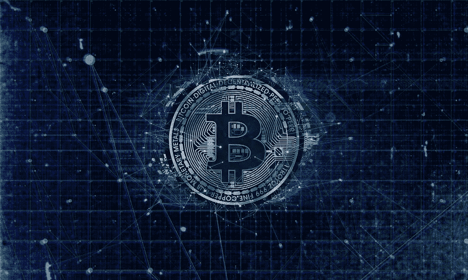

# 你的比特币现在藏在游戏里了

> 原文：<https://medium.com/hackernoon/your-bitcoins-are-hidden-in-games-now-ee8d80d55a6f>

[IMAGE SOURCE](https://www.maxpixel.net/Blockchain-Crypto-Business-Bitcoin-Currency-3396302)

多年来，学习的过程已经发生了变化，尤其是当平装书变成了交互式屏幕，无数的通知不断打扰用户的时候。书本消耗时间，而保留技术知识的能力使它变得更加复杂。然而，近年来，交互式游戏已经成功地在用户中传播大量信息。[根据一项研究](https://elearninginfographics.com/gamification-in-elearning-infographic/), 80%的学习者表示，如果他们的学习或工作更像游戏或有引人入胜的内容，他们的生产力水平将会成倍提高。

**兵败如山倒**

加密货币给世界带来了一个令人大开眼界的并行金融系统，它是替代现有货币基础设施的另一种选择。而传统的金融分析师表示怀疑，称数字资产仅仅是一个“庞氏骗局”，并要求监管机构遏制其自由。比特币和其他加密货币的支持者继续获得丰厚的收益，直到 2017 年 12 月 25 日所有加密货币暴跌至最低点的崩溃。

**光芒**

尽管比特币在 2018 年达到了相对较低的价格，但一个优点已经浮出水面，那就是稳定性。突如其来的飙升可能是对异常利润的描述，但这些都是转瞬即逝的。虽然对 2019 年的预测对资金紧张的投资者来说是令人鼓舞的，但规避风险的性质却是一个障碍。有许多新手投资者渴望从比特币投资中获得回报，但担心缺乏经验和无法进行模拟交易会成为主要障碍。

**游戏化过程**

然而，为了促进承担合理风险和投资多样化商品的文化，游戏开发商已经开始将加密货币灌输到他们的产品中。进入这一领域的一种方法是以比特币的形式发放礼品卡、现金奖励和其他货币回报。另一方面，游戏开发商已经开始设计允许消费者在基于模拟的环境中投资的游戏。这些人工世界让投资者对比特币世界的功能和特性了如指掌。

**赢得比特币**

像大红包、虚拟足球和赌场扑克这样的游戏是在线进行的，这意味着玩家通过互联网服务器实时相互竞争。这些游戏中的获胜奖励以[比特币或其他加密货币](https://hackernoon.com/an-open-letter-to-banks-about-bitcoin-and-cryptocurrencies-b0c7ef9b7c62)的形式出现。游戏的这个方面提供了比特币作为奖励，或者说是手段的终结。

**玩比特币**

第二类游戏为用户提供比特币储备的积累，然后要求他们在真实的市场条件下进行交易。通过玩这样的游戏，新手投资者不仅从赔钱的压力中解脱出来，还极大地了解了市场交易的洞察力。这些游戏经常引起观众的共鸣，给用户一种怀旧的感觉。在智能手机和平板电脑冲击电子产品世界之前，谁没有在个人电脑上玩过经典的扫雷游戏？

比特币游戏对无数电脑用户来说是一次回到过去的旅行，因为比特币被灌输到扫雷概念中，这赋予了它当代的前景。Crypto Skull 是一款利润丰厚且令人上瘾的扫雷型 lite coin，[比特币游戏](https://cryptoskull.com/bitcoin)。使用他们的水龙头开始玩免费的加密货币！尝试游戏的虚拟版本，它允许用户在不下真实赌注的情况下尝试玩游戏。

**鼓励投资者**

游戏化技术在教育领域并不新鲜。华尔街的股票交易通常是从模型游戏开始的，这些模型游戏创造了与专业股票投资者相似的仪表盘。投资之旅的开始是从消除恐惧开始的，只有当一个模拟的环境被创造出来，或者金钱的因素被根除时，恐惧才会出现。