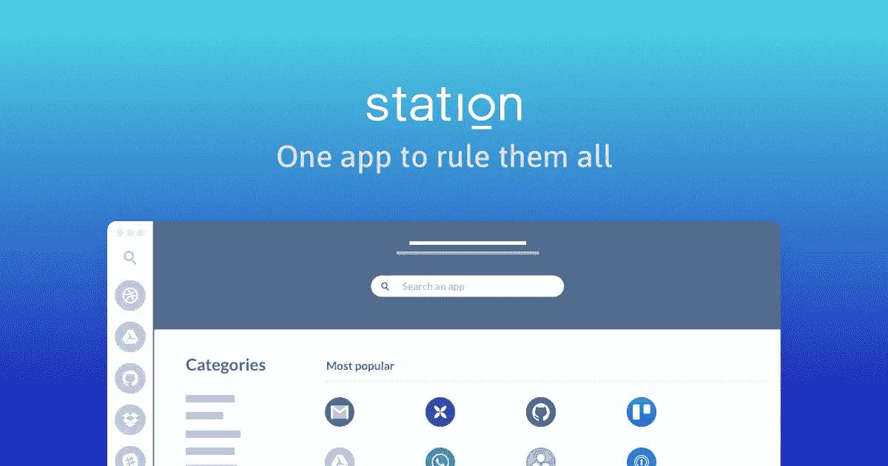

# 你的浏览器让你失望了

> 原文：<https://medium.com/hackernoon/your-browser-has-failed-you-9f69c70368fc>

## …扩展不会减轻痛苦。

浏览器已经发展成为我们做几乎任何事情的核心方式:购物、日程安排、开发票、监控、打电话、发短信、阅读、观看、聆听、写作、分享:[你能想到的](https://www.youtube.com/watch?v=YtdWHFwmd2o)。一路走来，随着数十亿人将浏览器作为他们的主要工作工具，它开始显示出一些弱点。

在[广告质量报告](https://medium.com/u/fd3129ade6f#)是座金矿。

*   **决定疲劳-** [纽约时报](https://medium.com/u/b42354b051f1?source=post_page-----9f69c70368fc--------------------------------)发表了[一篇长文](http://www.nytimes.com/2011/08/21/magazine/do-you-suffer-from-decision-fatigue.html)说明这一点。*   **扩展用法** - [Chrome 网络商店](https://chrome.google.com/webstore/) & [Firefox](https://medium.com/u/7f273c236233?source=post_page-----9f69c70368fc--------------------------------) 附加平台。

# 关于[站](https://medium.com/u/fd3129ade6f?source=post_page-----9f69c70368fc--------------------------------)

> 我们总部设在巴黎，是一个由 9 人组成的团队，唯一的目标就是让你的工作日变得轻松。在“努力工作”方面，我们非常专注于提供最好的用户体验；因为其他人比我们更擅长玩硬的一面。
> 
> 我们唯一的产品是**一款** [**免费桌面应用**](https://getstation.com/) **，它将你所有的网络工具**统一在一个整洁的&生产界面中。人们认为&被设计成一个只工作、不受干扰的平台，帮助你完成工作。
> 
> 🏆我们是 2017 年度最佳产品！(由[产品搜索](https://medium.com/u/b8b4445269d0?source=post_page-----9f69c70368fc--------------------------------)提供)
> 👉[给我们试试吧！](https://getstation.com/)

