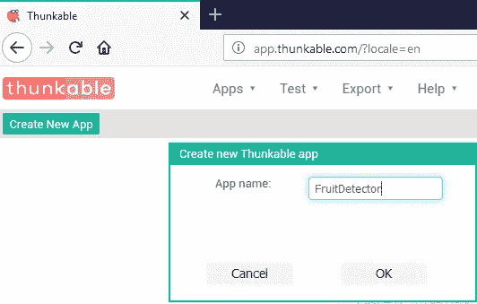
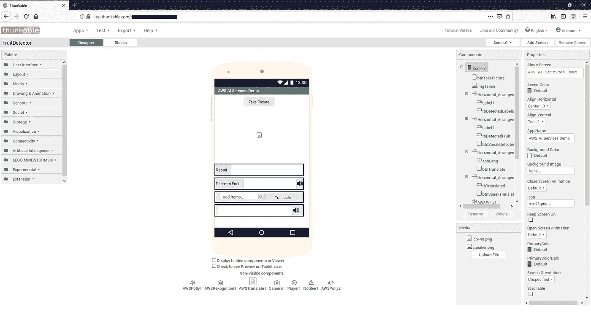
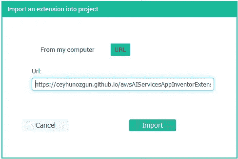
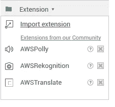
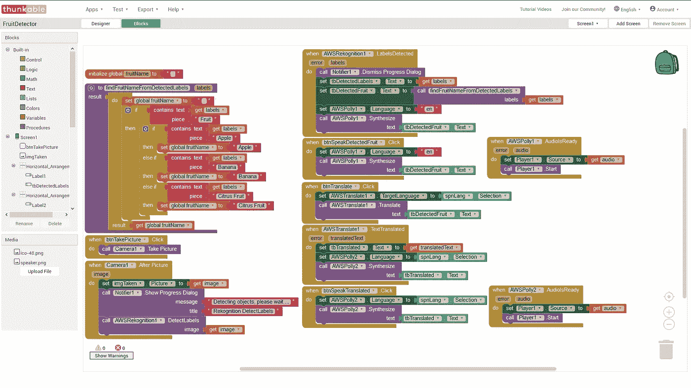

# 你的孩子可以用这个麻省理工学院的应用程序 Inventor AWS 人工智能服务扩展编写一个水果探测器

> 原文：<https://medium.com/hackernoon/your-kid-can-code-a-fruit-detector-with-this-mit-app-inventor-aws-ai-services-extension-231665c8bcdc>

我使用[亚马逊网络服务(AWS)](https://aws.amazon.com/) 已经两年多了。我一直在想办法让任何人都能使用 [AWS](https://hackernoon.com/tagged/aws) [云](https://hackernoon.com/tagged/cloud)服务。特别是，我正试图鼓励孩子们学习 AWS 提供的简单人工智能服务。

这个易于使用的人工智能服务包括一个名为 [Amazon Lex](https://aws.amazon.com/tr/lex/) 的聊天机器人生成服务，一个名为 [Amazon Polly](https://aws.amazon.com/tr/polly/) 的文本到语音服务，一个名为 [Amazon Rekognition](https://aws.amazon.com/tr/rekognition/) 的图像和视频识别服务，以及一个名为 [Amazon Translate](https://aws.amazon.com/tr/translate/) 的语言翻译服务。

基于视觉块的编程工具是向孩子教授编码的重要工具。最流行的基于块的编程环境之一是 [Scratch](https://scratch.mit.edu/) 。Scratch 是谷歌和麻省理工学院媒体实验室的一个联合项目，基于谷歌在 2012 年宣布的一个名为 [Blockly、](https://developers.google.com/blockly/)的项目。

在我的上一篇文章中，我写了一篇关于我的 Scratch 扩展的博客，它可以让孩子们很容易地使用文本到语音和翻译服务 Amazon Polly 和 Amazon Translate。

[MIT App Inventor](http://ai2.appinventor.mit.edu) 是另一个面向初学者的流行的基于块的编程环境，用于使用可视块为 Android 平台创建移动应用程序( [iOS 支持在路线图](http://appinventor.mit.edu/explore/blogs/evan/2018/09/mit.html)中)。它也是由谷歌创建，然后由麻省理工学院开发和维护。许多不同的项目都是基于 App Inventor 构建的，如麻省理工学院的衍生产品、 [AppyBuilder](http://appybuilder.com/) 、 [Kodular](http://kodular.io/) 、 [DroidMaker](http://droidmaker.io/) 、 [Hybro Studio](https://hybrostud.io/) 。

App Inventor 提供了一个[扩展机制](http://ai2.appinventor.mit.edu/reference/other/extensions.html)，允许开发者为用户启用附加功能，如控制机器人套件等。你可以在这里找到丰富的扩展[。](https://puravidaapps.com/extensions.php)

在这篇文章中，我将谈论我的应用程序 Inventor AWS 人工智能服务扩展，它可以轻松使用 Amazon Polly、Amazon Translate 和 Amazon Rekognition。我还将讨论一个示例应用程序，它从拍摄的图片中检测水果，并在翻译成另一种语言后说出水果的名称。

示例应用程序的演示如下所示。

Demo of Fruit Detector Thunkable app

# 步伐

在这篇文章中，我将使用 Thunkable Classic 平台来创建示例应用程序，但该扩展可以在我上面提到的另一个基于 App Inventor 的平台上使用。为了能够使用该平台，请使用您的 Google 帐户在这里注册。

请注意，本教程需要一个 AWS 帐户才能使用亚马逊人工智能服务。你可以在这里注册一个免费等级，包括一些服务 12 个月的免费使用。

这些步骤如下所示。

1.  创建新应用程序
2.  设计用户界面
3.  导入扩展
4.  添加扩展组件
5.  用积木设计行为
6.  准备 AWS 访问密钥
7.  测试应用程序

我们开始吧。

# 1.创建新应用程序

使用您的 Google 帐户登录 Thunkable Classic，然后点击“创建新应用程序”按钮，如下所示。

Click ‘Create New App’ and enter App name

# 2.设计用户界面

通过使用左侧的工具选项板，设计如下所示的用户界面。您可以在此下载示例应用程序，并通过单击应用程序菜单并选择“上传应用程序项目(。aia)从我的电脑上。

# 3.导入扩展

点击工具面板上的扩展，并选择“导入扩展”。点击新窗口上的“URL”按钮，粘贴扩展名的 URL。你可以在这里复制扩展 URL [。然后点击“导入”。](https://ceyhunozgun.github.io/awsAIServicesAppInventorExtension/tr.com.ceyhunozgun.appinventor.aws.aix)

Enter extension URL and click ‘Import’ to import the extension

在扩展被导入后，您应该在工具面板的扩展下看到扩展组件，如下所示。

Imported extension components

# 4.添加扩展组件

在使用扩展组件之前，您应该将它们添加到屏幕上。这些组件不会在屏幕上显示为其他可见组件，但它们应该列在电话屏幕下方和右侧的组件树中。

# 5.用积木设计行为

到目前为止，我们已经设计了用户界面并添加了所需的扩展组件。现在我们将使用块创建代码。点击“应用程序”菜单下的“阻止”按钮。通过使用方法和事件的块，设计如下所示的行为。

Prepare the code with visual blocks

# 6.准备 AWS 访问密钥

这个扩展需要一个 AWS 访问密钥 ID 和 AWS 秘密密钥来访问 AWS 服务。创建一个 IAM 用户，并授予 Polly、Translate 和 Rekognition 权限。然后为该用户创建一个 AWS 访问密钥 ID 和 AWS 秘密密钥。更多信息见[此处](https://aws.amazon.com/premiumsupport/knowledge-center/create-access-key/)。**请注意**要轻松尝试这个扩展，您可以完全访问这些服务，但是您应该考虑使用 [**AWS IAM 最佳实践**](https://docs.aws.amazon.com/IAM/latest/UserGuide/best-practices.html) 尤其是"**授予最小特权**"实践。

该扩展在第一次使用时询问 AWS 凭证，并保存它供以后使用。在使用[Thunkable Classic Live for Android](https://play.google.com/store/apps/details?id=com.thunkable.appinventor.aicompanion3)对应用进行实时测试时，凭证会保存到[Thunkable Classic Live for Android](https://play.google.com/store/apps/details?id=com.thunkable.appinventor.aicompanion3)应用中。您尝试的任何其他 Thunkable 应用程序都可以访问此凭据，所以要小心。

如果您为 Thunkable 应用程序生成 Android 应用程序 apk，凭据将保存到您创建的应用程序中。这比一般的 live app 更安全。

请**保密您的 AWS 凭证**并小心谨慎。

# 7.测试应用程序

App Inventor 平台提供了在生成 Android 应用程序之前快速测试应用程序的选项。这个特性被称为实时测试。您可以将[thunk able Classic Live for Android](https://play.google.com/store/apps/details?id=com.thunkable.appinventor.aicompanion3)应用程序安装到您的设备上，以实时测试您的应用程序。

在您的设备上安装应用程序后，点击 Thunkable 上的“测试”并选择“Thunkable Live”。然后在你的 Thunkable Live 应用上点击“扫描二维码”并扫描生成的代码。应用程序下载后，你应该在 Thunkable Live app 看到应用程序，你可以测试。

如果您想将该应用程序作为 Android 应用程序安装到您的设备上，您可以生成一个 APK 来安装您的设备。点击 Thunkable 上的“导出”并选择您想要的选项。

# 后续步骤

该扩展需要向应用程序输入 AWS 凭证，这对于简单的测试来说是可以的。最好不要将凭证放入应用程序中。通过使用 [Amazon Cognito](https://aws.amazon.com/tr/cognito/) ，可以在不共享凭证的情况下调用服务。如果我有时间，我会把认知加入到整合中。

几个月前，亚马逊宣布[流媒体转录](https://docs.aws.amazon.com/en_us/transcribe/latest/dg/streaming.html)为[亚马逊转录](https://aws.amazon.com/tr/transcribe/)服务。这对于实时转录和翻译用例非常有用。

集成 Amazon Lex 对于在 App Inventor 应用程序中使用聊天机器人非常有用。

# 结论

在这篇文章中，我展示了如何轻松使用我的应用程序 Inventor AWS 人工智能服务扩展。我已经展示了从一个空应用程序开始并添加扩展的步骤。

你可以在这里找到扩展[。您也可以从](https://ceyhunozgun.github.io/awsAIServicesAppInventorExtension/tr.com.ceyhunozgun.appinventor.aws.aix)[这里](https://ceyhunozgun.github.io/awsAIServicesAppInventorExtension/FruitDetector.aia)下载水果检测仪样品应用程序。

你可以在 [AWS 人工智能服务应用 Inventor 扩展 Wiki](https://github.com/ceyhunozgun/awsAIServicesAppInventorExtension/wiki) 上找到更多关于这些模块的信息。

如果你喜欢这篇文章，你可能会发现我的其他文章也很有用。

 [## AI 难？使用这个 AWS 人工智能服务 Scratch 扩展简直是小菜一碟

### 在我之前的帖子中，我提到过我们应该让我们的孩子为未来做好准备。在未来，为了成功我们的…

hackernoon.com](https://hackernoon.com/ai-is-hard-its-child-s-play-with-this-aws-ai-services-scratch-extension-32bed8669d36)  [## 用这个 AWS 人工智能服务 Chrome 扩展来说话、翻译和观看

### 学习 AWS 服务一年多了。一方面，我一直在学习如何使用它们，另一方面…

hackernoon.com](https://hackernoon.com/speak-translate-and-see-with-this-aws-ai-services-chrome-extension-cba7a40edb8a)  [## 有了这些 AWS 人工智能服务，你一定能学会一门新语言:Translate，Rekognition，Polly

### 随着 AI 的提升，机器正在做越来越多以前只有人类才能做的工作。根据一份报告…

hackernoon.com](https://hackernoon.com/you-cant-fail-to-learn-a-new-language-with-these-aws-ai-services-translate-rekognition-polly-caa5807dec36)  [## 无服务器过敏检查与亚马逊 Rekognition，莱克斯，波利，DynamoDB，S3 和λ

### 这篇文章是我之前博客中关于 AWS 服务的一系列文章的一部分。

hackernoon.com](https://hackernoon.com/serverless-allergy-checker-with-amazon-rekognition-lex-polly-dynamodb-s3-and-lambda-35fd215b51b0) 

请鼓掌、分享或关注。

感谢阅读。