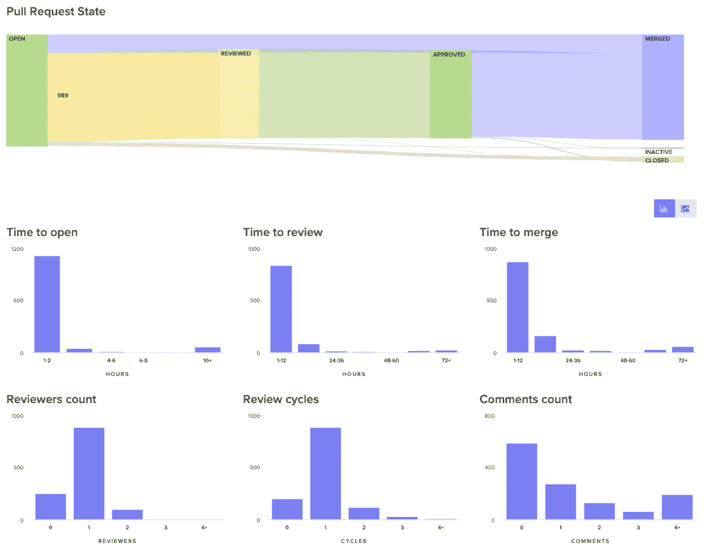
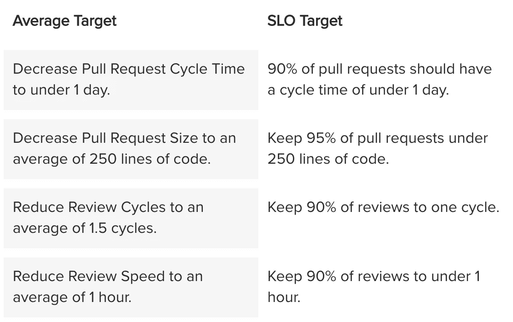
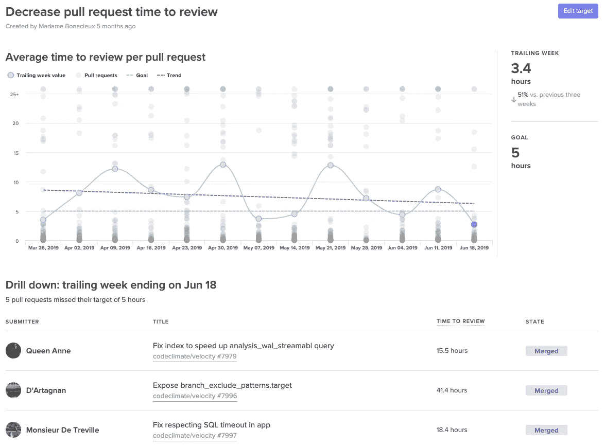

# 您的复古行动项目不起作用。原因如下。

> 原文：<https://medium.com/hackernoon/your-retro-action-items-arent-working-here-s-why-5c4503ce2792>

回顾会是我们团队回顾过去的时候。然而，它的功能是改进我们前进的方式。让我们来消化一下来自 Scrum 的最初定义:

*Sprint 回顾是 Scrum 团队* ***检查自身*** *和* ***的机会，创建一个计划*** *用于* ***改进，在下一个 Sprint 期间制定*** *。*

前两个组件是活动，第三个是结果。虽然大多数团队进行了富有成效的对话，并创建了行动项目来产生结果，但很少有人有适当的系统来确保积极的变化确实产生了。

1.  视察✔
2.  创建计划✔
3.  实施改进🤷‍♀️

问题始于“改善”的概念。它既模糊又主观，所以即使是一个活动计划也感觉像是朝着正确的方向迈出了一步(剧透:不是)。然而，如果你采取措施具体定义改进，你可以让你自己和你的团队对你的行动项目负责。为此，我们可以使用 SMART 目标。

# SMART 目标将改进融入其中

研究表明，既有[具体](https://www.researchgate.net/publication/9270073_Effects_of_fear_and_specificity_of_recommendation_upon_attitudes_and_behavior)又有[时限](https://psycnet.apa.org/record/1976-25334-001)的目标比一般的行动项目更有可能产生结果。

给每个追溯行动项目标上数字和日期可以确保:

1.  该部门了解并认同成功的要素，并
2.  朝着这个目标的进展是黑白分明的——趋向于或远离目标。

虽然有很多系统可以给目标设定一个数字和日期，但是为了这篇文章，我们将坚持一个可靠的:SMART(**S**specific，**M**measurable，**A**chiable， **R** elevant， **T** ime-bound)目标设定。

为了让你的团队更好地完成 SMART 目标，你需要调整复古的所有三个组成部分。你将**用更多的数据检查**，**使用 SMART 目标创建一个计划**，以及**通过让团队中的每个人都知道进度来实施改进**。

# 检查:使用数据来诊断最大的问题

大多数团队仅使用定性反馈来决定目标。一个团队成员提出了他们认为是一个大瓶颈的问题，整个团队立即开始尝试缓解这个问题。这种方法优先考虑个人的记忆和感受，而不一定是最大和最紧迫的问题。

但是，如果您在诊断问题时引入更多的数据点，您就更有可能对每个瓶颈有一个全面的了解。定量数据有助于抵消近期偏差，并使您能够根据问题对团队生产力造成的实际风险来确定优先级。

比方说，一个给定的工程团队正在试图诊断为什么他们在这次冲刺中没有获得预期的那么多特性。一位名叫汉娜的工程师提出了如下假设:

> 我觉得在任何给定的时间，打开的拉取请求都比平时多。我认为这是因为人们太忙而没有时间进行代码审查，所以工作堆积如山。

几位工程师点点头。他们还注意到在 GitHub 中有比平常更多的公开 pr。

Hannah 和她的团队没有立即对行动项目进行头脑风暴，而是进一步调查。他们开始查看自己的时间来回顾过去的冲刺，并意识到它相对较短——只有 6 个小时。这与 Hannah 认为审核过程比平时慢的评价相矛盾。从那里，他们看到他们的平均评审周期数大约是 1.2，其中大多数拉式请求在一次评审后被批准。而且，看起来还不错。

最后，当他们看着他们的时间合并时，他们发现了一个红旗。他们意识到，随着开发人员转移到新的工作轨道，许多拉请求在被审查后会保持很长时间。

团队的直觉意识到了症状——长时间运行的拉请求——但没有意识到原因。没有数据，他们不可能发现并解决更深层次的系统性问题。

您可以考虑查看的其他数据点:

*   **所有最近的活动，**包括拉请求、代码审查和票据，提醒你的团队他们在上一次 sprint 中做了什么，以及他们可能在哪里被卡住了。

[Velocity’s](https://codeclimate.com/velocity/signup/) Activity Log represents every engineering activity with a shape. Hover over to get context on what a team member is working on.

*   **最重要的拉动要求**最后冲刺。看看对代码库有重大影响的拉请求，以及比其他请求更大或更老的拉请求。

[Velocity](https://codeclimate.com/velocity/signup/) shows work in progress with activity level, age, and health. See at-a-glance the pull requests that are most likely to impede your team.

*   **过程度量**包括像周期时间和拉请求吞吐量这样的结果度量，还包括代表软件开发过程中更具体领域的度量，比如开始时间、评审时间和合并时间。

[Velocity](https://codeclimate.com/velocity/signup/) lets you visualize the journey of your pull requests from open to merged. Below, you can see metrics that represent constituents of this journey to better diagnose slowdowns.

# 计划:与 SMART 目标保持一致

一旦你的团队使用定性和定量数据完全诊断出一个问题，他们就必须决定一个具体的指标，作为他们的 SMART 目标。

## 特殊的

达到或未达到你的衡量标准的成功应该是非黑即白的，所以你需要一个具体的目标数字。“改进我们的复习时间”是模糊的，“将我们的复习时间减少到 4 小时以下”是具体的。

此外，确保该指标足够窄，以便团队知道哪些行为推动该指标上升或下降。太宽泛的度量标准会掩盖进展，因为它们会受到许多不同种类的不相关数据的影响。例如，Hannah 的团队想要选择一个像时间这样的度量来回顾，而不是总周期时间，这样当他们注意到度量趋向于负面时，团队可以很容易地自我纠正。

## M **可测**

衡量指标的方式取决于你的目标。例如，如果你在测量产量，一个简单的计数就可以做到。如果您希望遵守特定的标准，例如保持较小的拉动式请求，或者保持最短的停机时间，那么您将需要在跟踪简单平均值和作为一种基于百分位数的服务级别目标(SLO)进行跟踪之间做出选择。

这里有几个例子:

虽然平均值更常用于过程度量，但是 SLO 使您的团队在少数情况下偏离目标，而不会妨碍他们实现目标的能力。

## 可分配的

选择一个人负责并跟踪此目标。研究表明，每隔一段时间就有一个团队成员进行检查会大大增加达成目标的机会。苹果倡导由[个人(DRI)](https://fortune.com/2011/05/09/inside-apple/) 直接负责所有计划的理念，微软等领先科技公司的团队已经将 [DRI 模式应用于所有与 DevOps 相关的职能。](https://www.microsoft.com/en-us/itshowcase/rotating-devops-role-improves-engineering-service-quality)

所有权还将帮助您获得将数据引入追溯的认可。考虑让首先发现问题的人来负责这个目标。

## 现实的

确保你的目标是可以达到的，这样如果你的团队齐心协力达到目标，他们就会感到成功。

# 执行:提高可见性，时刻牢记目标

复古之后才是对你行动项目的真正考验。你的团队多久考虑一次这些指标？整个团队都会知道成功吗？如果你的团队不成功，他们能尝试不同的调整吗？

为了保持目标在脑海中，你需要让团队中的每个人都能看到进展。许多经理使用信息雷达，要么在共享空间，要么在普遍可访问的仪表板。

[Velocity](https://codeclimate.com/velocity/signup/) provides a Target dashboard that lets you visualize progress towards your SMART goals.

使进展透明使团队能够将面向结果的讨论带到回顾之外。有效的目标会在单挑、1:1、甚至是结对练习中提出来。重复将确保专注，并将进一步围绕成功团结团队。

# 📈造就工程师😊

当 Bizzabo 的创始人兼首席技术官 Boaz Katz[开始设定具体目标](https://codeclimate.com/customers/bizzabo/)时，他发现分享成功激励他的团队寻找更多的改进方法。他告诉我们，“我的团队培养了一种必胜的态度，渴望出货更快。”

当整个团队每次都感到成功时，这种势头就产生了飞轮效应。团队成员渴望发现更多的改进机会，创造一种对您的流程进行积极变革的文化。