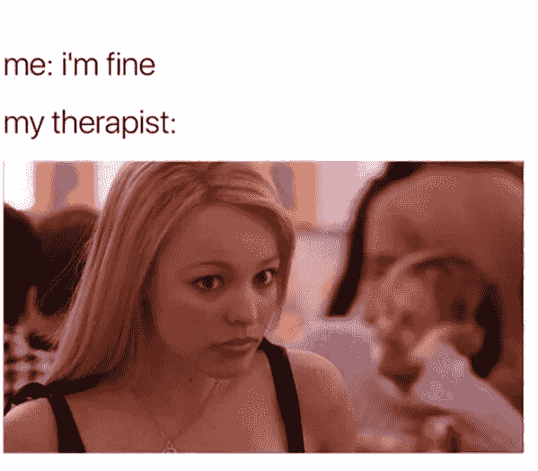
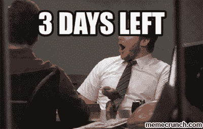

# 技术治疗签到

> 原文：<https://medium.com/hackernoon/your-technology-therapy-3-quick-check-ins-1d43292f4849>

在过去的几个月里，我多次被邀请扮演**技术治疗师**的角色——随着技术与我们的日常生活越来越紧密地交织在一起，这个角色对未来的几代人来说肯定会越来越必要。当与我的“病人”交谈时，我发现自己在问这些核心问题:

*   你什么时候开始使用智能手机的？
*   您目前监控多少应用程序？
*   你每天查看手机几次？
*   你的智能手机多久在你身边一次？
*   社交媒体是如何影响你的人际关系的？
*   当有人没有马上回复你时，你会感到焦虑吗？
*   你是否觉得自己在网上分享的内容受到了评判，或者被迫在社交媒体上分享特定的内容？
*   您目前使用哪些社交媒体平台？
*   你曾经离开过社交媒体吗？哪些平台？

接近 3-0 岁的美妙之处在于，作为一个年长的千禧一代，我可以分享，我是一群成长为懂技术但不依赖他人的年轻人中的一员。直到 15 岁，我才有了第一部手机，即使在那个时候，像现在这样发短信也不容易，所以我主要是在紧急情况下用手机给父母打电话。相反，我学会了如何完全面对面地交流，没有技术的帮助/干扰。

今天，世界是一个完全不同的地方。在我从家到健身房的这段时间里，我可以让 Instacart 运送我的杂货，通过 Buffer 发布预先安排的推文，而不用上 Twitter，还可以播放我最喜欢的 Spotify 播放列表(大声喊给[安德鲁·阿什](https://open.spotify.com/user/12142073595)，而不用使用我手机上的任何数据。挺有才的。

**但它也可能让人上瘾并使人受益。那么平衡在哪里呢？**

作为一名经常旅行的人，我有幸看到了世界上的许多地方(并试图在这些地方使用技术)。去年，当我准备去尼泊尔旅行时，我开始思考我的技术用途。意识到喜马拉雅山的 Wi-Fi 可能是不稳定的，我把这看作是一个重新设置和调整生活的机会，这将帮助我从技术中夺回控制权。

最重要的是要记住，技术是一种工具。所以我们中的许多人把它作为一种消遣，或者更糟，作为我们身份的一部分。即使你是坎耶·韦斯特，我怀疑一年后会有人记得你发的微博，更不用说十年后了。

如果你假设人类的平均寿命是 75 年，那么它就是大约 28000 天。唷！所以我希望你能在接下来的 **72 小时**内办理入住手续。

为了给我们的生活带来一些平衡，并以帮助我们(而不是伤害我们)的方式使用技术，我建议探索以下步骤:

## 第一步:休息三天

有时人们认识到他们与技术的不健康关系，但在相反的方向上走得太远，完全删除了他们的帐户。相反，我建议休息 3 天。也就是说，我对“离开”脸书的常见举动不感兴趣，就好像你要去度假一样。你需要真正的承诺，从你的手机上彻底删除应用程序；改变你的设置，离开脸书。

请你的朋友通过短信向你大喊，或者直接给你打电话。我知道拿起电话看起来很奇怪，但是相信我，你会没事的！

所有这些都完成后，你可能会发现自己**渴望**一个或多个应用程序。这是你需要问自己为什么的时候。是因为你想跟踪某人吗？你想通过看迷因来转移注意力吗？要不要迷失在过去的回忆里，翻翻自己的照片？仔细想想你到底缺少什么，以及如何满足这些需求(最好没有技术)。

> **倒计时签到:**
> 
> 第一小时:我已经完全准备好接受这个挑战了！删除 dis 杂波，我已经觉得轻。
> 
> 第二小时:该死的，我让自己陷入了什么……我只是拿起电话，以为会有什么事情发生。我想我可以在上面玩游戏…那算吗？我会整理我的杂物，删除旧的语音邮件。我甚至可能清理箱子。看那个…

## **第二步:关注你喜欢的活动，跟踪你的行为**

我们都听说过人们在卧室外给手机充电，或者在周末让手机保持静音。甚至有一些更极端的人会在假期删除应用程序…我们应该关注他们为什么要尝试这些事情:他们想有更多的时间与朋友和家人在一起，他们想在工作中更有效率，或者他们想腾出空间做其他事情，如阅读。将你的注意力放在一个地方、一个设备、一件事情上的成本是一个限制，你可能会错过在生活的其他方面实现的机会。

我亲身体会到向未知事物和新习惯敞开心扉有多难。在尼泊尔的时候，我很高兴完全被在另一个国家旅行和每天遇见新的人所分散了注意力。这让我的一天变得很容易，我强烈鼓励你也这样做。你喜欢去农贸市场吗，你喜欢画画吗，或者甚至和朋友吃一顿含羞草的早午餐，不管是什么，**用你的东西填满你新的空闲时间。**

接下来，意识到你的行为。旅行的第一天，手机不在手中，感觉好像少了点什么。当我想到把手机留在宿舍房间里时，我也经历了一些轻微的焦虑。如果有紧急情况或有人试图联系我，我该怎么办？老实说，紧急事件是一个真正的问题，但从统计上来说，我认为我们可以在这里玩聪明，说把你的手机留下来探索并不可怕。

在“完全美丽”徒步旅行时，我开始对没有拍任何照片感到焦虑。但后来我停下来问自己，我想为谁拍照，是否有人真的关心我在那一刻看到了什么。为了全面披露，我承认我确实带着我的 GoPro，但(不幸的是)它的 SD 卡损坏了，所以我没有任何前往珠穆朗玛峰大本营的镜头。然而，事实是，我现在一点也不担心这个。我知道它发生了，我也有一些照片来纪念它，但它永远是关于*的旅程。让这一切都过去吧，乡亲们，活在当下，百无聊赖。*

没有手机，我发现自己在看着日子一天天过去。你上一次坐着看时间流逝是什么时候？一天早上，我离开宿舍，在一楼大厅和陌生人聊天，看着微风吹拂树叶，吃着美味的咖喱，放松了一整天。它引发了不同的想法和情绪，关注我们正在建立的联系以及我们如何相互交流是非常有意义的。没有科技的过滤，你会以不同的方式看待肢体语言和面部表情。

虽然这听起来像是呜呜呜的新时代行话，但我在这里实际描述的是在没有技术帮助的情况下建立人类联系。通过面对面的交流，我们建立的纽带不是模因或快照，而是故事、耸肩和叹息。这在很大程度上是一个人的故事，一个我忘记了自己有多爱参与的故事，直到我发现自己又回到了它的最深处。

> **第 40 小时:好吧，这还不算太糟。我真的完成了一本书，而且很喜欢。那么…现在怎么办？**
> 
> 第 52 小时:“痒”正在消退。我很想发布一些关于我刚刚做的美味菜肴的东西…哦，好吧。

## **第三步:认识到你错过了什么|热爱你的应用程序没关系**

很容易很快陷入羞耻游戏。我在这里告诉你，喜欢你的应用程序是完全没问题的。毕竟，它们如此流行并如此迅速地影响我们的行为是有原因的。所以这种意识来自于你错过了什么——你错过了什么？

对我来说，是 Instagram。我确实有一些遗憾，我没能拍下我旅行中的精彩照片，让我可以回顾并记住那些时刻，就像它们刚刚发生一样，但这些图像并没有消失，它们只是在我的记忆中，让我去发现和珍惜。

当我在旅途中时，我也怀念在清晨和深夜嘲笑迷因并与朋友分享的时光。我经常以这种方式开始和结束我的一天，所以它以笑声开始和结束，如果我不在的时候能保持这个习惯就好了。对我们来说，在世界各地保持联系总是很有趣的，我们互相发送一个傻笑，表示“我仍然在想你，你仍然是我的家人。”作为旁注:大声喊出来[打赌](https://www.instagram.com/betches/?hl=en)是我最喜欢的。

> **第 68 小时:我迫不及待地想重新下载 Insta，看看迷上这个游戏。实际上更重要的是，我终于可以再次记录我的食物了。YAS。**
> 
> **第 72 小时:实际上，那相当健康！我想我在日常生活中不需要 Twitter，我可以把它移除，我也不需要这些其他应用。我将保留一个脸书帐户，以便与朋友保持联系，但我只会在我的桌面上以及我不专注于工作时使用它。酷毙了。还不错。**

完成这三个步骤后，我希望你带着对你的习惯、行为、喜欢、不喜欢和对你重要的事情的新的认识离开。在一天结束的时候，它是关于回到你生活的驾驶座上，而不是被引导到一个不适合你的地方。

**猜猜看？对于我们与技术的关系在未来将如何发展，或者人类将如何在几代人的时间里进化行为，我们没有一本规则手册，因为知识和爱好唾手可得。**

平衡在所有事情中都很重要。我发现这个练习帮助我理解什么是最重要的，并确定我可以成长的领域。最重要的是，它帮助我看到了我已经拥有的优势——比如建立人际关系——而这些都是我认为理所当然的。

你准备好冒险了吗？请在下面告诉我你的评价。