# Zoho 黑手党:由前 Zoho 员工创建的 22 家公司

> 原文：<https://medium.com/hackernoon/zoho-mafia-16-companies-founded-by-former-zoho-employees-eafac85ff2ea>

Zoho Mafia

这可能是你第一次接触到术语 [**Zoho**](https://zoho.com) **【黑手党】**，但它是一个实体，仅在钦奈就创造了 6000 多个就业岗位，收入超过 5 亿美元。

总的来说，新的“**信息时代**”正在蓬勃发展，但创造的就业机会比“**工业革命时代**”要少。因此，当任何人创造新的、高技能、高价值的工作时；这对整体经济繁荣极其重要。

在我看来， [Zoho](https://zoho.com) 对印度来说可能是一家至关重要的公司，它不仅创造了超过 10，000 个工作岗位(直接和间接)，它还倾向于引导和激励人们创建自己的公司。

事实上，Zoho 已经间接创造了 8000 多个工作岗位。

# 为什么我称之为佐贺黑手党？

你可能听说过 [PayPal-mafia](https://en.wikipedia.org/wiki/PayPal_Mafia) ，一群离开 PayPal 和其他大公司如 Youtube、Linkedin、Yelp 等的前 [PayPal](https://en.wikipedia.org/wiki/PayPal) 员工和创始人。

在 Paypal 黑手党蓬勃发展之后，术语(*)-黑手党通常被认为是由(*)公司的前员工(创始人/开发人员/设计师等)创办的公司。

Zoho Mafia 指的是由前 Zoho 员工创办的公司集团。

# 佐贺黑手党互相支持吗？

当你仔细观察下面列出的公司时，你肯定会找到一个肯定的答案。一个例子:

1.  Freshworks 使用 Chargebee 进行订阅管理
2.  Facilio 使用 Freshchat 进行网站对话
3.  Hippo 视频使用 Freshdesk 获得客户支持

# Zoho 黑手党的成员

以下公司名单均由前 Zoho 员工创立。

> 注意:这些数据是从 LinkedIn 收集的

## [1。新鲜出炉](https://freshworks.com)

Freshworks 为支持和销售创造解决方案，吸引并取悦客户和员工。

Freshdesk 是一家基于云的客户支持软件公司，现已更名为 Freshworks，这将是其母公司，整合其商业软件产品套件——Freshdesk、Freshservice、Freshsales、Freshcaller、Freshchat、Freshmarketer 和 Freshteam。

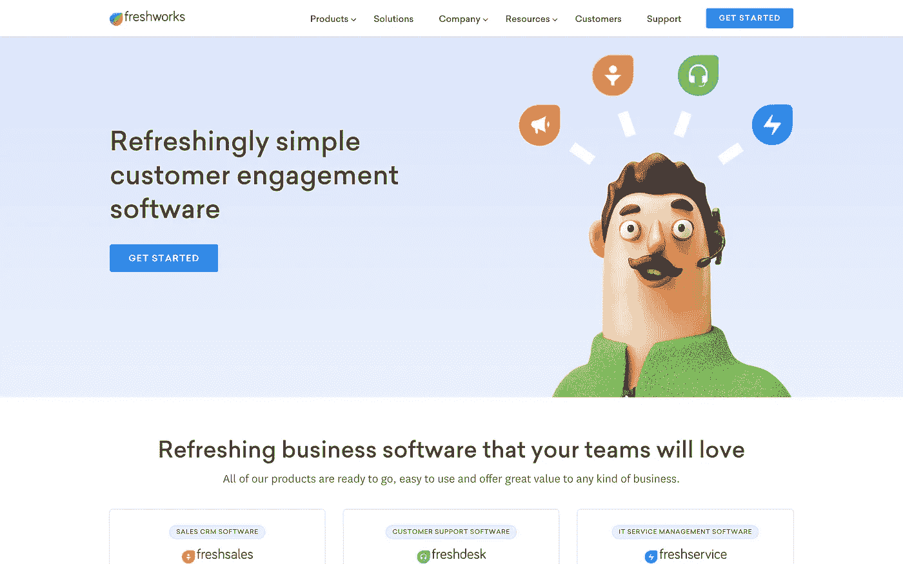

## 2.[收款人](https://www.chargebee.com/)

Chargebee 的订阅管理平台通过其全自动 SaaS 计费解决方案为订阅业务提供端到端的重复计费。

## 3. [Facilio](https://facilio.com/)

“Facilio 使用物联网和 ML 来帮助商业房地产专业人士集中管理整个投资组合的建筑运营、维护和可持续发展绩效。

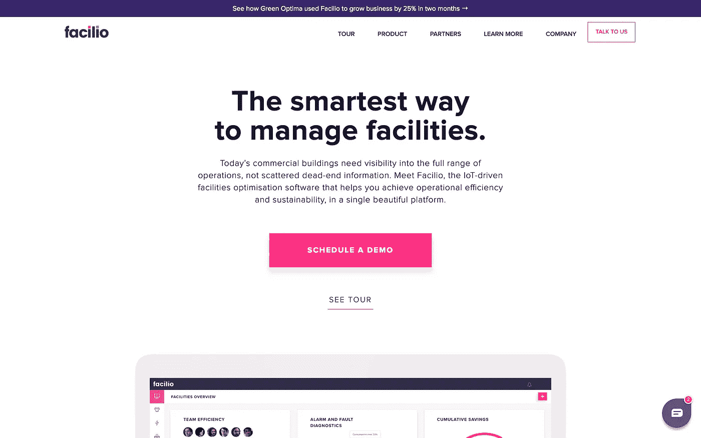

## [4。河马视频](https://www.hippovideo.io/)

河马视频是下一代商业视频营销平台。Hippo Video 将视频和超视频个性化引入销售推广和营销自动化工作流程。Hippo Video 为营销、电子邮件活动、销售和客户支持流程定制了工作流程。Hippo Video 是一切视频的一站式解决方案，提供深入的用户洞察，带来更多合格的线索并达成更多销售交易。

## [5。调查麻雀](https://surveysparrow.com/)

SurveySparrow 让你把调查变成对话。SurveySparrow 采用对话式界面，使用户能够创建和分享极具吸引力的移动优先调查，提供类似聊天的体验。

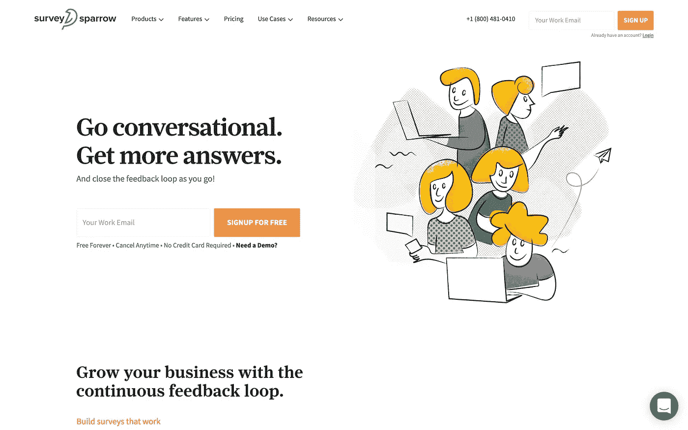

## [6。Yaali Bizapp](https://www.bizappln.com/)

Yaali BizApp Inc .提供商业服务，如 CRM 解决方案、ERP 解决方案、Salesforce 解决方案、帮助台解决方案、Web 和移动应用程序开发、软件开发、云应用程序开发等。

## [7。艾德明乐](https://www.edmingle.com/)

Edmingle 是一个面向教育工作者的平台，使他们能够创新创建、管理和交付课程的方式，同时为学生提供引人入胜的学习体验。

## 8.[安全](https://www.securden.com/)

Securden 帮助您防止身份盗窃、恶意软件传播、网络攻击和内部利用。

## [9。Ulektz](https://www.ulektz.com/)

专为高等教育打造的社交学习平台。它将全世界高等教育的学生、教育工作者和所有其他利益攸关方联系起来，为他们提供精心策划的优质资源和服务，以促进教育、技能和职业发展。它还通过为学院和大学提供自有品牌的移动应用程序(基于云的教育 ERP)进行学习和校园管理，帮助学院和大学实现数字教育。

## [10。石英环](https://quartrinch.com/)

Quartrinch 是一个电子商务网站，出售由顶级工匠用最好的材料手工制作的产品，可以使用一辈子。

## [11。伏尼克](https://www.voonik.com/)

Voonik 是印度发展最快的女性时尚购物应用程序，你可以在这里购买适合你身体、个性、生活方式和预算偏好的时尚。

## [12。Delegate.ai](http://delegate.ai/)

Delegate.ai 是人工智能驱动的高效工作日秘书。

## [13。六角节点](https://www.hexnode.com)

Hexnode MDM 是一家企业移动管理供应商，帮助企业管理 BYOD、应用和内容。

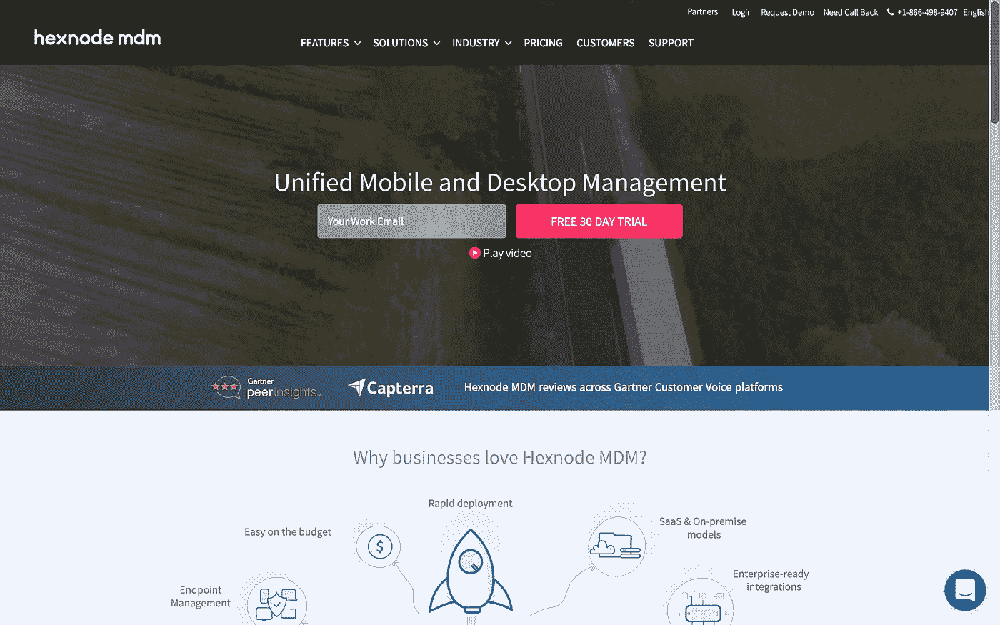

## [14。Startpix](https://startpix.co.in/)

StartPix Technologies 是数字化转型合作伙伴，提供内容和个性化商务解决方案，推动数字化体验的转型。我们帮助您在所有数字接触点、所有受众、以客户为中心以及整个客户参与过程中构建和提供集成的优化用户体验。

## 15。Bevywise

Bevywise Networks 是 IOT 发起的一项倡议，其目标是创建下一代设备、传感器和软件，使不同组件之间能够进行通信，从而实现一个完全互联的世界。

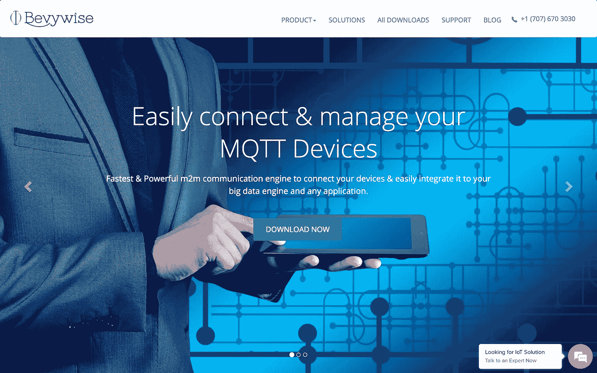

## 16. [Tartlabs](https://tartlabs.com/)

Tart Labs 是位于南印度哥印拜陀的移动应用程序开发、网站开发和设计公司。我们与许多企业合作，为他们提供广泛的增值和创新的企业移动解决方案，专注于增强企业的核心业务

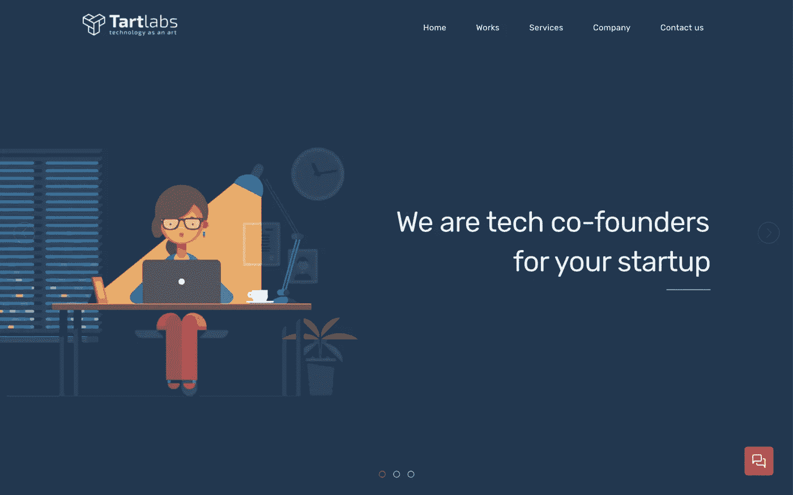

[**17。Testsigma**](https://testsigma.com/)

Testsigma 是一个人工智能驱动的#SmartTestAutomation 软件，用于 Web、移动应用程序、API 服务，通过左移方法实现连续测试。

[18**。品牌千里马**](https://brandmaxima.com/)

BrandMaxima 是一个面向品牌、数字媒体机构、内容创作者、研究人员和记者的社交媒体情报和分析平台。

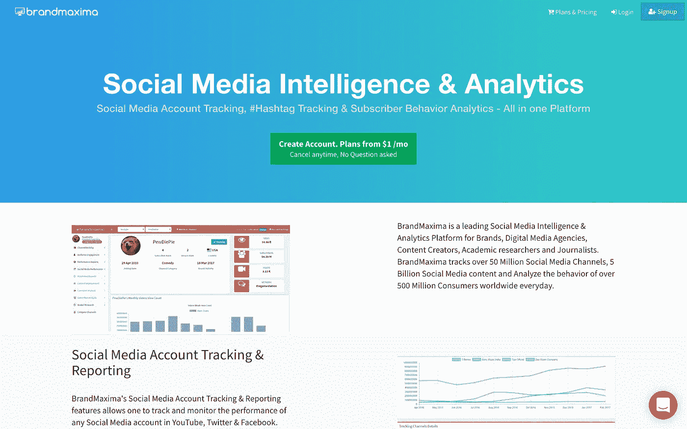

[19**19。**](https://www.smackcoders.com/)

Smackcoders 向公司咨询如何使用区块链技术和大数据管理来增强他们的运营，它还有 CSV Importer、CRM 的 Leads Builder、Vtiger Extensions、MailChimp Integration & WordPress 插件

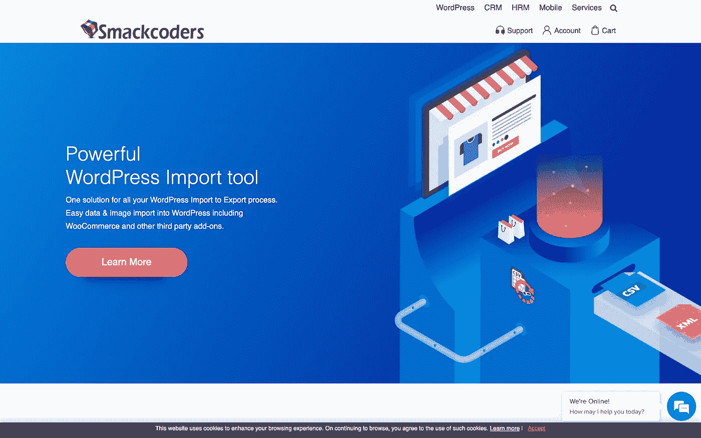

[**20。日志引信**](http://logfuze.com/)

LogFuze 提供 HoraData 物联网分析平台。HoraData 基于预测分析帮助减少设备停机时间。用户可以从远程监控到上报系统访问集成的数据分析平台。它还提供与主要 CRM、ERP、帮助台和 BI 的集成支持。

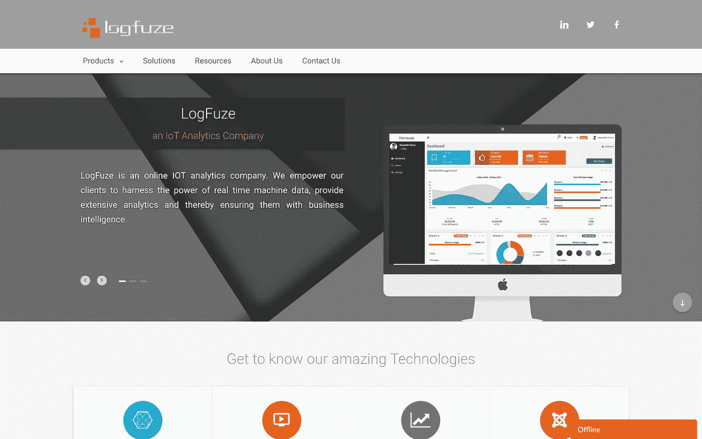

[**21。达科工程**](https://daacoworks.com/)

Daacoworks 提供软件，可随时随地通过任何设备连接、控制和监控工业机器。

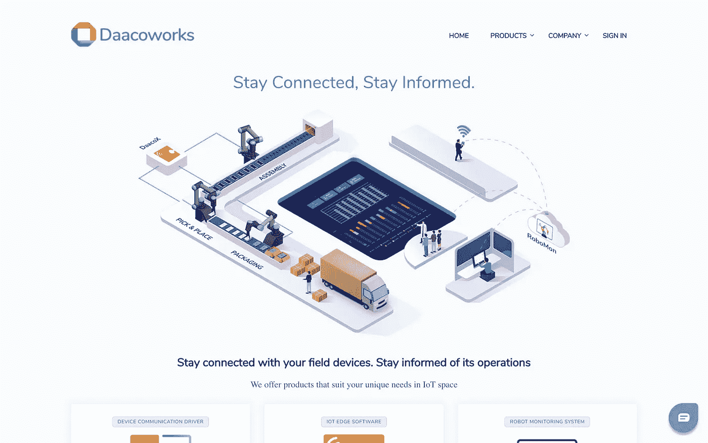

[**22。docu pilot**](https://docupilot.app/)

Docupilot 是一个文档自动化软件，文档生成软件。

Docupilot 可让您根据智能模板和数据创建文档，并将创建的文档作为电子邮件发送到您最喜欢的应用程序，如 DocuSign、Dropbox、Zapier 等

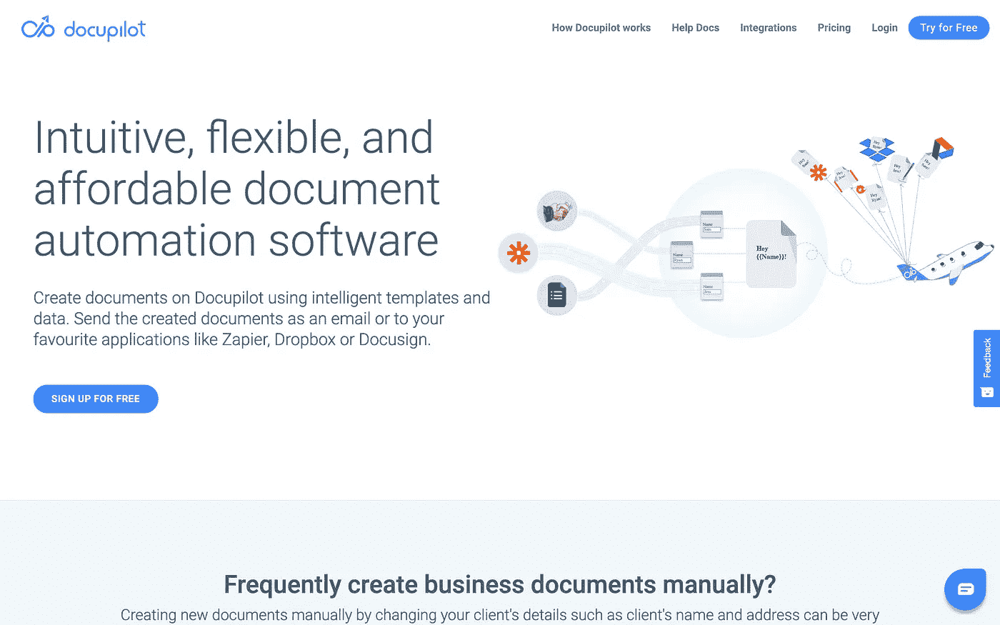

> 感谢您的阅读。
> 
> 别忘了按拍手按钮。